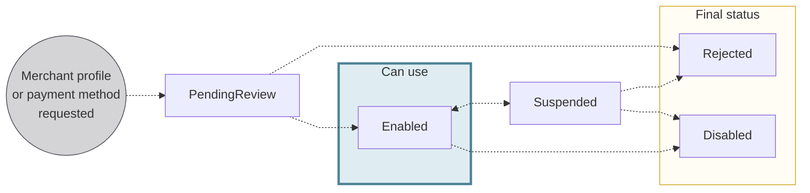

# Merchants

import MerchantsDefinition from '../definitions/_merchants.mdx';

> <MerchantsDefinition />

## Overview {#overview}

Merchants are users who want to accept payments by card, SEPA Direct Debit, Internal Direct Debit, or French checks, either directly from a payment link or an invoice. 
This includes contractors, healthcare professionals, artisans, and business owners, among others.

With a merchant profile and at least one active merchant payment method, you can help your merchants accept payments with Swan.

:::info Pending review
Before accepting payments, you need to complete a risk review.
To get started, contact your dedicated Technical Account Manager, or send an email to integration@swan.io.
:::

### Managing risk {#risk}

Accepting payments from customers comes with risk, and Swan prioritizes a **risk-based approach**.

That's why Swan reviews all requests for merchant profiles, profile updates, and payment methods.
You might be contacted for more information before Swan accepts or rejects the request.

To manage potential risk, if suspicious activity is detected, Swan can **change the status** of both **profiles and payment methods** to `Suspended` or `Rejected`.
Swan can also reinstate a profile or payment method by changing the status to `Enabled`.
Finally, if Swan assigns the status `Rejected` to a profile or payment method, the decision is final and can't be reversed. 
The user must create a new request, which Swan will review as a separate submission.

### Webhooks {#webhooks}

Subscribe to numerous webhooks to facilitate your merchant integrations.
Review the [full list of merchant webhooks](../../developers/using-api/webhooks.mdx#events-merchants), or subscribe to them directly from your **Dashboard** > **Developers** > **Webhooks**.

### Profile & payment method statuses {#statuses}

| Profile status | Explanation |
|---|---|
| `PendingReview` | Profile or payment method request or update was submitted and is pending a review by Swan.  **Next steps**: <ul><li>If the request or update doesn't meet requirements or is deemed risky by Swan, the status moves directly to `Rejected`.</li><li>Otherwise, the status moves to `Enabled`.</li></ul> |
| `Enabled` | Profile or payment method is active.  <ul><li>Use `PendingReview` merchant profiles to request payment methods and accept payments with activated payment methods.</li><li>Use `Enabled` payment methods to accept payments.</li><li>Updates to profiles and payment methods can only occur when they have the status `Enabled`.</li></ul> |
| `Suspended` | Status **assigned by Swan** when the merchant's use of their profile or payment method needs to be reviewed. The status can't return to `Enabled` without a review. |
| `Rejected` | Final status **assigned by Swan** when Swan decides the risk of this profile or the risk of this payment method for the associated merchant is too high, or for some other risk-related reason. |
| `Disabled` | Final status **set by you** using the `requestMerchantPaymentMethods` mutation. |

## Merchant profiles {#profiles}

A **merchant profile** is a collection of business, risk, and support information that fulfills two primary requirements: 

1. **Approve the account holder** as a merchant.
1. **Facilitate accepting payments** with Swan. 

If a Swan account holder wants to accept payments from customers, they must have at least one merchant profile.

Your users can create merchant profiles during onboarding, but only if you've requested the feature for them.
Since merchants are considered high risk, merchant profiles should only be requested for users who qualify and will accept payments.
Requesting merchant profiles for users that don't qualify may create false expectations about available features.

A merchant profile contains the following information:

1. Business details
1. Description of the business activity
1. Link to the merchant's website or social network
1. Projected volumes
1. Payment frequency
1. Logo (optional), in `.png` format and less than 1 MB. It's shown online and on the PDF of the payment mandate.
1. Accent color
1. Customer region

Complete as many information fields as possible to decrease the turnaround time for enabling the merchant profile.

The merchant profile is created with the status `PendingReview`, and is visible right away on your Dashboard.

### Updating merchant profiles {#profiles-update}

You can [request a merchant profile update](./profiles/guide-update.mdx) with the API mutation `requestMerchantProfileUpdate`.
If you use Swan's Web Banking interface, merchants can request an update through their app.
Request an update for the merchant's name, website, product type, expected monthly payment volume, expected average basket, and logo.

Updating a merchant profile produces the following events:

1. The [**merchant profile status**](#statuses) doesn't change, remaining `Enabled`. The merchant continues to use their merchant profile with the existing information.
1. The **update status** is `PendingReview`. Swan reviews the new information to ensure it meets requirements. 
1. After Swan reviews and validates the update request, the update status changes to `Enabled` and the update is published to the merchant profile.
1. If Swan rejects the update request, the merchant profile remains `Enabled` by default, unless Swan decides otherwise. 
The merchant profile status doesn't change.

When a merchant payment method is requested, Swan may ask for additional information even if the merchant profile is already `Enabled`.
Swan will contact you or your user directly, based on your communication preferences.

If you requested an update and your update status is `PendingReview`, but you need to **make another change**, submit a new update request.
Swan reviews both requests, but only the most recent is made public. 

:::caution Subject to review
All update requests are reviewed by Swan according to the same [risk guidelines](#risk) as a new merchant profile.
:::

## Payment methods {#methods}

Your merchants can accept payments from their customers using any of several **merchant payment methods**.

Merchant payment methods are connected to a merchant profile, and a single merchant profile can have multiple payment methods.
To accept payments with Swan, there must be an `Enabled` merchant profile and at least one `Enabled` merchant payment method.

To learn how to request payment methods, refer to the request payment method guides for [card payments](./online/cards/guide-request.mdx), [SEPA Direct Debit](./online/sdd/guide-request.mdx), [Internal Direct Debit](./online/idd/guide-request.mdx), and [French checks](./online/checks/guide-request.mdx).
You can request multiple methods in one API call.

### Available payment methods {#methods-options}

import OnlinePaymentMethods from './partials/_online-list.mdx';

<OnlinePaymentMethods />

### Rolling reserve {#rolling-reserve}

import RollingReserve from './partials/_rolling-reserve.mdx';

<RollingReserve />

| Payment method | Rolling reserve | Default amount |
| --- | --- | --- |
| Cards | ✓ **Yes** | 100% over 5 business days |
| SEPA Direct Debit - Core | ✓ **Yes** | Determined by a merchant profile risk assessment |
| SEPA Direct Debit - B2B | ✓ **Yes** | 100% over 3 business days |
| Internal Direct Debit - Standard | ✓ **Yes** | Determined by a merchant profile risk assessment |
| Internal Direct Debit - B2B | ☒ No | n/a |
| French checks | ✓ **Yes** | 100% over 10 interbank business days |

### Versions {#methods-versions-statuses}

Swan creates a **new version** of your payment method **every time an update is approved**.
Only one version of a payment method can have the status `Enabled`.

Swan manages the statuses for `Enabled` or `PendingReview` payment methods automatically.
Therefore, you don't need to change the status before calling the API.

## Guides {#guides}

- Merchant profiles:
    - [Request a merchant profile](./profiles/guide-request.mdx)
    - [Update a merchant profile](./profiles/guide-update.mdx)
    - [Get information about a merchant profile](./profiles/guide-get-info.mdx)
    - [Sandbox](./sandbox.mdx)
- Request payment methods:
    - [Cards](./online/cards/guide-request.mdx)
    - [SEPA Direct Debit](./online/sdd/guide-request.mdx)
    - [Internal Direct Debit](./online/idd/guide-request.mdx)
    - [French checks](./online/checks/guide-request.mdx)
- Create payment links:
    - [Cards](./online/cards/guide-create-link.mdx)
