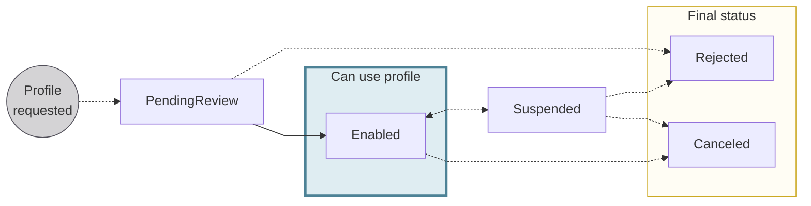
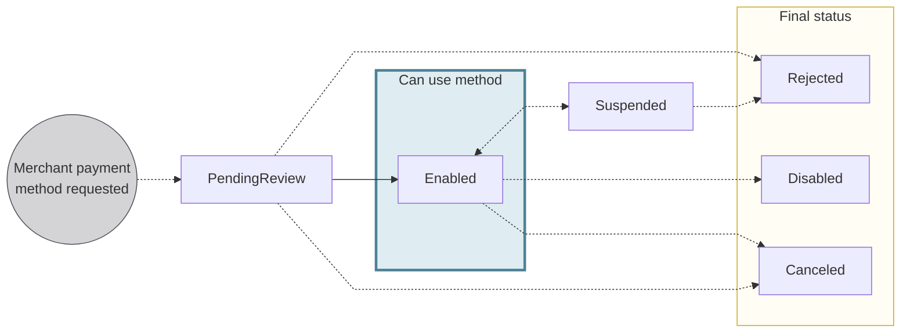

# Merchants

import MerchantsDefinition from '../definitions/_merchants.mdx';

> <MerchantsDefinition />

Use Swan to help your merchants accept payments with supported payment methods.

:::info Pending review
Before accepting payments, you and your merchant need to complete a risk review.
To get started, contact your dedicated Technical Account Manager, or send an email to integration@swan.io.
:::

## Merchant profiles {#profiles}

A **merchant profile** is a collection of business, risk, and support information that fulfills two primary requirements: **approve the account holder** as a merchant, and **facilitate accepting payments** with Swan.

The merchant profile contains the following information:

- Business details
- Description of the business activity
- Link to the merchant's website
- Projected volumes
- Logo (optional), displayed online and on mandate PDFs

You can request a profile update with the API mutation `requestMerchantProfileUpdate`, and merchants can request an update through your web banking interface.
You can request an update to the merchant's name, website, product type, expected monthly payment volume, expected average basket, and logo.

A merchant profile is required of all Swan account holders wanting to accept payments from customers.
If you want to collect payments from customers, you must have at least one merchant profile.

The merchant profile is created with the status `PendingReview`, and the profile is visible right away on your Dashboard.

### Risk and merchant profiles {#profiles-risk}

All merchant profiles are reviewed by Swan.
We might contact you for more information before accepting or rejecting the new merchant profile.

- Swan changes the status for accepted merchant profiles from `PendingReview` to `Enabled`.
- Swan changes the status of unaccepted profiles to `Rejected`. The decision is final and cannot be challenged.
- Swan might **suspend** or **cancel** a merchant profile.
    - There are various situations that can lead to the suspension or cancellation of a merchant profile, the most notable being risk-related, such as fraud.
- Merchant profiles with the status `Suspended` can't be used.
- The status `Canceled`, like the status `Rejected`, is final.

### Profile statuses {#profiles-statuses}

| Profile status | Explanation |
|---|---|
| `PendingReview` | Profile was submitted and is pending a review by Swan. |
| `Enabled` | Profile is active and can be used to request payment methods and accept payments with activated payment methods. |
| `Suspended` | Status assigned by Swan when the merchant's use of the accept payments feature needs to be reviewed. |
| `Rejected` | Final status assigned by Swan when Swan decides the risk of this profile is too high, or for some other risk-related reason. |
| `Canceled` | Automated status assigned by Swan. |

## Payment methods {#methods}

Your merchants can accept payments from their clients using any of several **merchant payment methods**.

Merchant payment methods are connected to a merchant profile, and a single merchant profile can have multiple payment methods.
To accept payments with Swan, there must be an `Enabled` merchant profile and at least one `Enabled` merchant payment method.

To learn about requesting payment methods, refer to the request payment method guides for [SEPA Direct Debit](./sdd/guide-request.mdx), [Internal Direct Debit](./idd/guide-request.mdx), and [French checks](./checks/guide-request.mdx).
You could also request multiple methods in one API call.

### Available payment methods {#methods-options}

Your merchants can use the following payment methods to accept payments with Swan:

- [Internal Direct Debit](./idd/index.mdx) (B2B and Standard)
- [SEPA Direct Debit](./sdd/index.mdx) (B2B and Core)
- [French checks](./checks/index.mdx) (API only; debtor's bank must be located in France)

### Versions and statuses {#methods-versions-statuses}

Swan creates a new version of your payment method **every time a change is requested**.
Only one version of a payment method can have the status `Enabled`.

Similarly, only one version of a payment method can have the status `PendingReview`.
However, the statuses `Disabled`, `Canceled`, and `Rejected` can be assigned to unlimited versions of each payment method.

Swan manages the statuses for `Enabled` or `PendingReview` payment methods automatically.
Therefore, you don't need to change the status before calling the API.

### Risk and payment methods {#methods-risk}

All payment methods are reviewed by Swan.
We might contact you for more information before accepting or rejecting the payment method.

- Swan might change a payment method status to `Suspended` if an API request is made that conflicts with status and versioning rules.
- After completing a review of an existing payment method, Swan can reinstate the payment method by changing the status back to to `Enabled`.
- Swan changes the status from `PendingReview` or `Suspended` to `Rejected` when the payment method is rejected or no longer acceptable.

### Payment method statuses {#methods-statuses}

| Payment method status | Explanation |
|---|---|
| `PendingReview` | Request to activate this payment method was submitted and is pending a review by Swan. |
| `Enabled` | Payment method has been reviewed and is active. It can be used to accept payments. |
| `Suspended` | Status assigned by Swan when the use of the payment method for the associated merchant needs to be reviewed. The status can't return to `Enabled` without a review. |
| `Rejected` | Final status assigned by Swan when Swan decides the risk of this payment method for the associated merchant is too high, or for some other risk-related reason. |
| `Disabled` | Final status, set by the `requestMerchantPaymentMethods` mutation. |
| `Canceled` | Automated status assigned by Swan if the merchant submits an additional request for a payment method for which their original request is `PendingReview`. |

## Rolling reserve {#rolling-reserve}

import RollingReserve from './partials/_rolling-reserve.mdx';

<RollingReserve />

| Payment method | Rolling reserve | Default amount |
| --- | --- | --- |
| Internal Direct Debit - Standard | ✓ **Yes** | Determined by a merchant profile risk assessment |
| Internal Direct Debit - B2B | ☒ No | n/a |
| SEPA Direct Debit - Core | ✓ **Yes** | 15% over 15 business days |
| SEPA Direct Debit - B2B | ✓ **Yes** | 100% over 3 business days |
| French checks | ✓ **Yes** | 100% over 10 interbank business days |

## Guides {#guides}

- [Add a merchant profile](./profiles/guide-add.mdx)
- [Update a merchant profile](./profiles/guide-update.mdx)
- [Get information about a merchant profile](./profiles/guide-get-info.mdx)