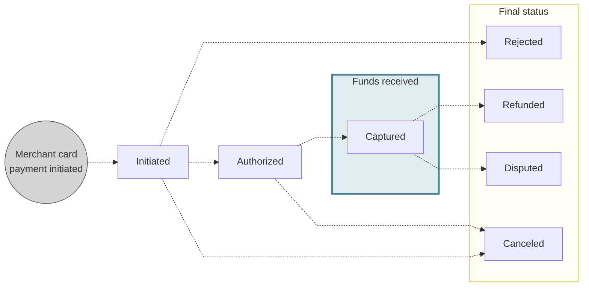

# Cards for merchants

## Overview {#about}

Cards are the most common way for customers worldwide to pay.
Swan supports most major card issuers, including Visa, Mastercard, and *Cartes Bancaires* (CB) in France.
American Express isn't supported.

Merchants can use payment links to accept payments from cardholders anywhere.
Typical implementations of payment links include:
- Adding a payment link to an invoice.
- Sharing a payment link with a QR code.
- Sending a payment link by email or SMS.

Collect rent, share invoices, and accept customer payments through a Swan merchant account.

:::info Merchants only
This section **only applies to merchants** accepting card payments.
Visit the [card payments section](../../../payments/cards/index.mdx) for information about payments made with cards *from* a Swan account.
:::

## Merchant card payments {#payments}

Merchant card payments include **one or more transactions**.
For example, one payment might include a capture transaction and a refund transaction, for a total of two transactions.

These transactions are **grouped together** in the **merchant payment object**.
Swan recommends using the merchant payment object in your integration to help merchants match orders, invoices, and sales to the correct object.
This provides better traceability and can help reconcile issues more efficiently.

### Card transaction types {#payments-transaction-types}

There are **four transaction types** for merchant card payments.

Authorizations aren't included in a transaction type.
Instead, they're represented at the payment level, visible through the payment object status `Authorized` and payment object balance `totalAuthorized`.

| Transaction type | Explanation | Impacted account balance |
|---|---|:---:|
| `CardInCredit` | Captured payment that impacts the merchant's `Booked` balance. | `Upcoming` `Booked` |
| `CardInCreditReversal` | Refunded payment that first impacts the merchant's `Pending` balance, then their `Booked` balance. | `Pending` `Booked` |
| `CardInCreditChargeback` | Disputed payment that immediately impacts the merchant's `Booked` balance. | `Booked` |
| `CardInCreditChargebackReversal` | Disputed payment for which the dispute is overturned, impacting the merchant's `Booked` balance. | `Booked` |

:::info Balances
The impacted balances are Swan's standard [account balances](../../../accounts/index.mdx#balances), which aren't related to the payment object balances explained later on this page.
:::

### Payment object statuses {#payments-statuses}

The merchant payment object has **distinct statuses** to follow a payment's lifecycle.

| Card payment object status | Explanation |
|---|---|
| `Initiated` | Customer submitted their card details through the payment link, but the payment hasn't been authorized yet. |
| `Authorized` | Authorization for the payment was received, but the funds aren't captured yet. The funds are guaranteed for the merchant. |
| `Captured` | Authorized payments for which the funds have moved out of the customer's account. This can be a final status if the customer doesn't dispute the payment or request a refund. |
| `Rejected` | Authorization denied by the issuer or by Swan. |
| `Canceled` | Card payment was canceled, authorization voided, and the funds can't be captured. |
| `Refunded` | Payments reversed by the merchant for some or all of the amount. |
| `Disputed` | Customer disputed the payment with their bank for some or all of the amount. |

### Payment object balances {#payments-balances}

The merchant payment object has **distinct balances** to follow a payment's lifecycle.

| Card payment object balance | Explanation |
|---|---|
| `totalAuthorized` | The total authorized amount for this merchant payment. |
| `availableToCancel` | The authorized amount that can be released. Refer to this balance to verify whether the payment can be canceled. Cancellations must occur before the amount is captured. |
| `totalCanceled` | The total amount canceled for this merchant payment. |
| `availableToCapture` | The amount available for merchants to capture *if* the capture isn't automatic. |
| `totalCaptured` | The amount captured by the merchant. When the capture for card payments is automatic, `totalCaptured` is always equal to `totalAuthorized`. |
| `availableToRefund` | The amount the merchant can refund. Use this balance to know if a payment is eligible for a refund. |
| `totalRefunded` | The total amount refunded for this merchant payment. |
| `totalDisputed` | The total amount of this merchant payment disputed by the customer. |

## Rolling reserve {#rolling-reserve}

import RollingReserve from '../../partials/_rolling-reserve.mdx';

<RollingReserve />

| Payment method | Rolling reserve | Default amount |
| --- | --- | --- |
| Cards | <Yes /> **Yes** | 100% over 5 business days |

You can use the `TransactionRollingReserve.Updated` and `TransactionRollingReserve.Released` [webhooks](/developers/using-api/webhooks/#events-transactions) to be notified when a transaction's rolling reserve is updated and when the funds are released.

## Payment amount limit {#payment-limit}
For security and risk management, Swan may apply a **payment amount limit** to single card payments. 
This limit defines the maximum amount a user can spend in one card transaction. 
If a payment **exceeds this limit**, the API returns a `ForbiddenRejection` error.

To [query this limit](./guide-request.mdx), use the `paymentAmountLimit` field at the `merchantPaymentMethod` level in the API.

## Settlement date and booked time {#settlement}

Merchant card transactions are booked the **business day after the transaction is captured** at **18:00** Coordinated Universal Time (UTC).

For example, transactions captured on Tuesday between 00:00 (midnight) and 23:59 UTC are booked on Wednesday, assuming both Tuesday and Wednesday are business days.

import DayTimeStandard from '../../../partials/_day-time.mdx';

<DayTimeStandard />

## R-transactions {#r-transactions}

### Rejected {#rejected}

When a card payment is rejected, the cardholder's account is not charged.

Card payments can be rejected (declined) for the following reasons:

| Rejection reason | Explanation |
|---|---|
| `AmountInvalid` | The amount entered is invalid for this payment. |
| `CardDetailsInvalid` | The card details provided are incorrect or incomplete. The cardholder should contact their card issuer for more information. |
| `CardExpired` | The card used is no longer valid because it has expired. The cardholder should contact their card issuer for more information. |
| `InvalidPinAttemptsExceeded` | Too many incorrect PIN attempts were made. |
| `RejectedByCardIssuer` | The card issuer rejected the transaction. The cardholder should contact their card issuer for more information. |
| `SoftDecline3dsExpiration` | The 3D Secure authentication session expired before completion. |
| `SoftDecline3dsFailure` | The 3D Secure authentication failed. |
| `SoftDecline3dsNotSupported` | The card does not support 3D Secure authentication. |
| `SoftDecline3dsRequired` | 3D Secure authentication was required but not completed. |
| `SoftDeclineCardAmountLimitsExceeded` | The transaction exceeds the card's allowed spending limit. The cardholder should contact their card issuer for more information. |
| `SoftDeclineCardDetailsInvalid` | The card details provided are incorrect or incomplete. The cardholder should contact their card issuer for more information. |
| `SoftDeclineCardExpired` | The card used is no longer valid because it has expired. |
| `SoftDeclineCardNotActivated` | The card has not been activated yet. The cardholder should contact their card issuer for more information. |
| `SoftDeclineCardNotSupported` | The card is not supported for this type of transaction. The cardholder should contact their card issuer for more information. |
| `SoftDeclineCvcCheckFailed` | The card security code (CVC) verification failed. |
| `SoftDeclineCvcInvalid` | The CVC code provided is invalid. |
| `SoftDeclineInsufficientFunds` | The debtor has insufficient funds to fulfill the payment. |
| `SoftDeclineRefundTimeLimitExceeded` | The refund could not be processed because the allowable time limit has passed. |
| `SoftDeclineRejectedByCardIssuer` | The card issuer declined the transaction. The cardholder should contact their card issuer for more information. |
| `SoftDeclineSwanTechnicalErrorOccurred` | A technical error prevented the processing of this card payment. The cardholder should retry the transaction. |
| `SoftDeclineTransactionAmountIncorrect` | The transaction amount does not match the expected or authorized amount. |
| `SwanRefused` | Swan refused the transaction due to risk management or compliance requirements. |
| `SwanTechnicalErrorOccurred` | A technical error prevented the processing of this card payment. |

### Chargebacks & disputes {#disputes}

Cardholders might create chargebacks, which opens a dispute.
Merchants can view the dispute automatically; the payment object status, the transaction status, and the merchant's balance all change to reflect the dispute.

To respond to disputes, ask your merchant to [submit a request](https://supportform.swan.io/) to the Swan Support team.

## Guides {#guides}

- [Accept payments with cards (step-by-step)](./guide-cards.mdx)
- [Request card payment method](./guide-request.mdx)
- [Create a card payment link](./guide-create-link.mdx)