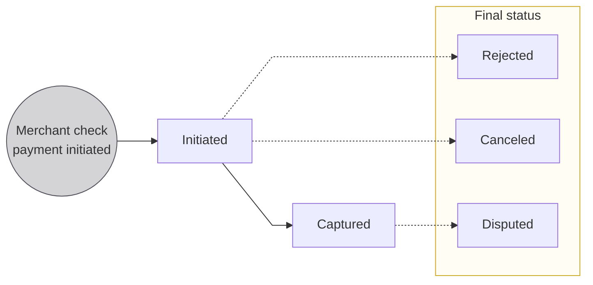

# French checks for merchants

:::caution beta
Accepting payments with French checks is in private beta.
:::

Merchants can accept payments using French checks if the debtor's bank is located in **mainland France** and the following **territories**: Guadeloupe, French Guiana, Martinique, Mayotte, Reunion, Saint Martin, and Saint Barthelemy. 
New Caledonia, French Polynesia, and Wallis and Futuna aren't currently supported.

## About French checks for merchants {#about}

While paper checks aren't the most convenient or secure payment method, they are still a valid way to exchange money.
Some users prefer checks, and merchants can accept French checks if they activate this payment method for accepting payments.

Checks must be **unique**, with a different CMC7 code and RLMC key for each check.
If a check is canceled or rejected, however, the same check can be resubmitted.
Please note that checks aren't sent back to the account holder unless they're rejected.

## Required API fields {#fields}

When declaring checks with the API, there are five mandatory API fields:

1. `amount`: monetary amount of the check (can't exceed 10,000€).
1. `currency`: `EUR` (only euros are supported).
1. `CMC7` (Caractères Magnétiques Codés à 7 bâtonnets): 31-digit code composed of 3 series of numbers.
    - Series 1: check number; 7 digits
    - Series 2: interbank codes; 12 digits
    - Series 3: account number; 12 digits
1. `rlmcKey` (Recomposition de la Ligne Magnétique du Chèque): 2-digit code calculated based on the CMC7.
1. `merchantProfileId`: your developers should enter the merchant's profile ID number.

On the **back of the check**, the merchant must write their Swan account number as well as provide their signature.

## Merchant check payments {#payments}
Merchant check payments include one or more transactions.
For example, one payment might include a check credit transaction and a refund transaction, for a total of two transactions.

These transactions are **grouped together** in the **merchant payment object**. 
Swan recommends using the merchant payment object in your integration to help merchants match orders, invoices, and sales to the correct object. 
This provides better traceability and can help reconcile issues more efficiently. 
It also makes it easier for you to handle the status of payments when there are return transactions after a payment is captured.

### Check transaction types {#payments-transaction-types}

There are **two transaction types** for merchant check payments.

| Transaction type | Explanation | Impacted account balance |
| :--- | :--- | :--- |
| `CheckIn`        | Captured payment that first impacts the merchant's `Upcoming` balance, and then their `Booked` balance. | `Upcoming` `Booked`   |
| `CheckInReturn`  | Disputed payment that immediately impacts the merchant's `Booked` balance.                           | `Booked`                 |

:::info Balances
The impacted balances are Swan's standard [account balances](../../../accounts/index.mdx#balances), which aren't related to the payment object balances explained later on this page.
:::

### Payment object statuses {#payments-statuses}

The merchant payment object has **distinct statuses** to follow a payment's lifecycle.

| Check payment object status | Explanation |
|---|---|
| `Initiated` | Merchant submitted the check information to Swan, but the check hasn't been processed yet. |
| `Captured` | Check was accepted and funds were made available in the merchant's account. This can be a final status if the customer doesn't dispute the payment. |
| `Rejected` | Check was rejected by Swan's check provider. Rejected checks are returned to the merchant by mail, using the account holder's address. |
| `Canceled` | Check was canceled by the merchant before reaching Swan's check provider. If received, the check is returned to the merchant by mail, using the account holder's address. |
| `Disputed` | The customer disputed the payment or the bank returned it after capture, for example due to insufficient funds. Disputed checks aren't returned to the merchant. |

### Payment object balances {#payments-balances}

The merchant payment object has **distinct balances** to follow a payment's lifecycle.

| Check payment object balance | Explanation |
|---|---|
| `totalAuthorized` | Not used for checks; this balance is always zero. |
| `availableToCancel` | Use this balance to verify whether the payment can be canceled. Cancellations must occur before Swan's check provider receives the check. |
| `totalCanceled` | The total amount canceled for this merchant payment. |
| `availableToCapture` | Not used for checks; this balance is always zero. |
| `totalCaptured` | The amount captured by the merchant. This corresponds to the full payment amount after the check is successfully processed. |
| `availableToRefund` | Checks cannot be refunded; this balance is always zero. |
| `totalRefunded` | Checks cannot be refunded; this balance is always zero. |
| `totalDisputed` | The total amount of this merchant payment disputed by the customer or returned by their bank. |

## Rolling reserve {#rolling-reserve}

import RollingReserve from '../../partials/_rolling-reserve.mdx';

<RollingReserve />

| Payment method | Rolling reserve | Default amount |
| --- | --- | --- |
| French checks | <Yes /> **Yes** | 100% over 10 business days |

You can use the `TransactionRollingReserve.Updated` and `TransactionRollingReserve.Released` [webhooks](/developers/using-api/webhooks/#events-transactions) to be notified when a transaction's rolling reserve is updated and when the funds are released.

## Payment amount limit {#payment-limit}
For security and risk management, Swan may apply a **payment amount limit** to single check payments. 
This limit defines the maximum amount a user can spend in one check transaction. 
If a payment **exceeds this limit**, the API returns a `ForbiddenRejection` error.

To [query this limit](./guide-request.mdx), use the `paymentAmountLimit` field at the `merchantPaymentMethod` level in the API.

## Canceling payments {#canceling}

Merchants can cancel check payments using the [`cancelMerchantPayment`](https://api-reference.swan.io/mutations/cancel-merchant-payment/) mutation.
To understand if a payment is cancelable, check its `availableToCancel` balance.
Only the full amount can be canceled.

Checks can be canceled up until the point when they're received by the check processing center.
The exact timing depends on postal services, so cancellation availability varies.
Once the check processing center receives the check, it can't be canceled.

## Settlement date and booked time {#settlement}

Checks are booked 2-3 business days after they arrive at the check processing center.

## FNCI & verifying checks {#fnci}

The FNCI stands for *Le fichier national des chèques irréguliers*, meaning the National Irregular Check Register.
It's a database of stolen and opposed checks made available to remitters by the *Banque de France*, helping you and your users **reduce the risk** of cashing fraudulent checks.

When your merchants accept check payments with Swan, Swan **verifies the check's regularity** with the *Banque de France*.
You **receive the result** of a check's verification **with the API**, and your merchants see the result If you use Swan's Web Banking interface.
If you're not using Web Banking, you must **integrate the FNCI result** into your product to meet compliance requirements.

:::tip 
If you're using the full-API integration or the open-source [Swan Banking Frontend](https://swan-io.github.io/swan-partner-frontend/), consider customizing the FNCI result message to better suit your clients. Keep the detailed information hidden within a dropdown for an improved user experience.
:::

### FNCI results {#fnci-results}

Results are provided through the API and on Swan's Web Banking interface.
With the results, you receive the **name of the bank that issued the check** along with two key pieces of information: the **color code** and the **Check Payment Control (CPT)**.

<table>
  <tr>
    <th colspan="2">FNCI info</th>
    <th>Explanation</th>
  </tr>
  <tr>
    <td rowspan="2">Color code</td>
    <td>**Green**</td>
    <td>Positive, meaning the check isn't fraudulent.</td>
  </tr>
  <tr>
    <td>**Orange** **White** **Red**</td>
    <td>Irregular, meaning there's something wrong with the check. For example, the account might be closed, the account holder might not be allowed to write checks, or the check might have been reported as lost or stolen.  ⛔ Swan **doesn't accept** checks with the color code orange, white, or red.</td>
  </tr>
  <tr>
    <td rowspan="3">Check Payment Control (CPT)</td>
    <td>**CPT1**</td>
    <td>Number of FNCI verifications performed on the current day for checks issued by the account holder.</td>
  </tr>
  <tr>
    <td>**CPT2**</td>
    <td>Number of FNCI verifications conducted in the past few days for checks issued by the same account holder.</td>
  </tr>
  <tr>
    <td>**CPT3**</td>
    <td>Number of FNCI verifications in recent days for checks issued by the same account holder, typically over a different or extended time period as compared to CPT2.</td>
  </tr>
  <tr>
    <td colspan="2">Holder establishment</td>
    <td>The name of the bank that issued the check.</td>
  </tr>
</table>

:::caution Confirm holder establishment
If the bank name is different from the holder establishment provided in the FNCI result, it may indicate fraud, even if the color code is green.
:::

## R-transactions {#r-transactions}

### Rejected {#rejected}

Checks can be rejected by Swan's check provider and **returned to the merchant by mail**, mailed to the account holder's address.
They'll receive helpful information about why the check has been rejected, and then they can **fix and resend the rejected checks**.

**Before resending the rejected check**, the merchant should create a new `checkIn` transaction.
If they send the check without creating the new `checkIn` transaction, the check **remains rejected** and will be returned to the merchant again.

Additionally, all checks not received by Swan's check provider within 30 days of being declared will be automatically `Rejected`.

A check transaction can be rejected for the following reasons:

| Rejection reason | Explanation |
| --- | --- |
| `AmountMismatch` | The amount on the check and the amount declared through the API don't match. |
| `BeneficiaryMismatch` | The beneficiary name on the check and the name declared through the API don't match. |
| `BeneficiaryMissingOrIncorrect` | The merchant's name is missing or incorrect. |
| `CheckNotReceived` | The check wasn't received by Swan's check provider. This reason doesn't appear until 30 days after the check was declared. |
| `CheckReceivedLate` | The check was received by Swan's check provider more than 30 days after the check was declared, or if Swan's check provider received a canceled check. |
| `DateMissing` | There's no date on the check. |
| `DateInvalid` | The date on the check is in the future or isn't valid. |
| `DebtorNameMissing` | The debtor's name (your merchant's customer) must appear on the check. |
| `InvalidOrMissingAmount` | No amount is written on the check, the format shows an invalid amount, or the amount is shared in the wrong format (numbers instead of letters). |
| `SignatureMissing` | The debtor's signature is missing, or there was a problem with the signature. |

### Returned {#returned}

Checks can be returned up to 10 business days after the transaction is `Booked`, and this window can be extended to 90 calendar days based on the reason for return.
Note that checks aren't mailed back to the merchant.

A check transaction might be returned for the following reasons:

| Return reason                     | Explanation                                                                 |
|---|---|
| `AccountClosed` | The account is closed. |
| `CheckBlocked` | The payer has blocked the check payment. |
| `CheckOutdated` | The check is outdated. |
| `DebtorDeceased` | The debtor is deceased. |
| `EndorsementMissingOrInvalid` | The check payment can't be fulfilled because the beneficiary's signature on the check is missing or invalid. |
| `Fraudulent` | The payment can't be fulfilled because it's a fraudulent check. |
| `InsufficientFunds` | The payer has insufficient funds to fulfill the check payment. |
| `LegalOrBankDecision` | The check payment can't be fulfilled because of a legal or banking issue on the payer's end. |
| `MandatoryReferenceMissingOnCheck` | The check payment can't be fulfilled because a mandatory piece of information is missing on the check. |
| `SignatureInvalid` | The check payment can't be fulfilled because the payer's signature is invalid. |
| `SwanTechnicalErrorOccurred` | A technical error prevented the processing of this check. |
| `TransactionDuplicated` | This transaction can't be fulfilled because it's a duplicate of another transaction. |

By the time a check is returned, the merchant's account has already been credited.
Therefore, when Swan is notified that a `Booked` check has gone unpaid, a `checkInReturn` transaction is created automatically.

### Canceled {#canceled}

Creditors can cancel a received check with the `Upcoming` status *unless* the check processing center has already received the check.
In this case of a canceled check, the status switches automatically to `Canceled`.
This transaction won't impact the account's available balance.

## Guides {#guides}

- [Accept payments with French checks (step-by-step)](./guide-checks.mdx)
- [Request French checks payment method](./guide-request.mdx)
- [Initiate a French check transaction](./guide-initiate.mdx)
- [Sandbox](./sandbox.mdx)