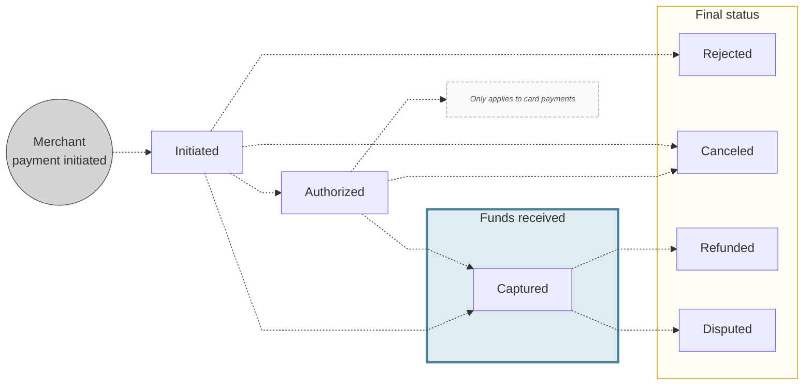

# Accepting online payments

Merchants can accept online payments with Swan.

:::info Merchant profile
Before accepting online payments, each merchant needs a [merchant profile](../index.mdx#profiles).
:::

## Online payment methods {#methods-online}

import OnlinePaymentMethods from '../partials/_online-list.mdx';

<OnlinePaymentMethods />

:::note Credit transfers
You can also accept payments to a Swan account with [credit transfers](../../payments/credit-transfers/index.mdx).
:::

## Payment links {#links}

Payment links redirect customers to a Swan-hosted payment page where a customer can choose from the merchant's eligible enabled payment methods.
These optimized payment pages are customizable with the merchant's name, logo, and accent color.

Your merchants can create links to share with their customers by email or text message.
They could also include a QR code on an invoice, scannable by the customer with their mobile device.

→ Learn how to [create payment links](./cards/guide-create-link.mdx) to accept card payments.

## Merchant payments {#payments}

Merchant card payments include **one or more transactions**.
For example, one payment might include a capture transaction and a refund transaction, for a total of two transactions.

These transactions are **grouped together** in the **merchant payment object**.
Swan recommends using the merchant payment object in your integration to help merchants match orders, invoices, and sales to the correct object.
This provides better traceability and can help reconcile issues more efficiently.

### Payment object statuses {#payments-statuses}

The merchant payment object has **distinct statuses** to follow a payment's lifecycle. 
All payments begin in the `Initiated` status. 
From `Initiated`, a payment may be directly `Captured`, `Canceled` by the merchant, or `Rejected` by Swan or another participant in the payment scheme, such as the customer's payment service provider. 
**For card payments**, the flow may proceed from `Initiated` to `Authorized` before being either `Captured` or `Canceled`. 
**After capture**, a payment may still be `Refunded` by the merchant or `Disputed` by the customer, depending on the payment method.

| Payment Object Status | Explanation |
|---|---|
| `Initiated` | The payment object has been created, but the payment is not yet authorized or guaranteed. |
| `Authorized` | Applies only to *card payments.* The payment has been authorized by the customer's bank. The funds are guaranteed but not yet captured. |
| `Canceled` | The payment was canceled before capture. Funds can no longer be captured. This is a final status. |
| `Rejected` | The payment was rejected by Swan or another participant in the payment scheme before the funds were captured. This is a final status. |
| `Captured` | The payment is successfully authorized (for *card payments*) or processed (for all *other payment methods*), and the funds are debited from the customer's account. This can be the final status of a successful payment flow, unless the customer disputes the payment or requests a refund. |
| `Refunded` | The payment was reversed by the merchant. The refund can be partial, depending on the payment method. This is a final status. |
| `Disputed` | The customer disputed the payment with their bank. Can be partial, depending on the payment method. This is a final status. |

### Payment object balances {#payments-balances}

The merchant payment object has **distinct balances** to follow a payment's lifecycle.

| Payment object balance | Explanation |
|---|---|
| `totalAuthorized` | The total authorized amount for this merchant payment. |
| `availableToCancel` | The authorized amount that can be released. Refer to this balance to verify whether the payment can be canceled. Cancellations must occur before the amount is captured. |
| `totalCanceled` | The total amount canceled for this merchant payment. |
| `availableToCapture` | The amount available for merchants to capture *if* the capture isn't automatic. |
| `totalCaptured` | The amount captured by the merchant. For *card payments* with automatic capture, `totalCaptured` is always equal to `totalAuthorized`. |
| `availableToRefund` | The amount the merchant can refund. Use this balance to know if a payment is eligible for a refund. |
| `totalRefunded` | The total amount refunded for this merchant payment. |
| `totalDisputed` | The total amount of this merchant payment disputed by the customer. |