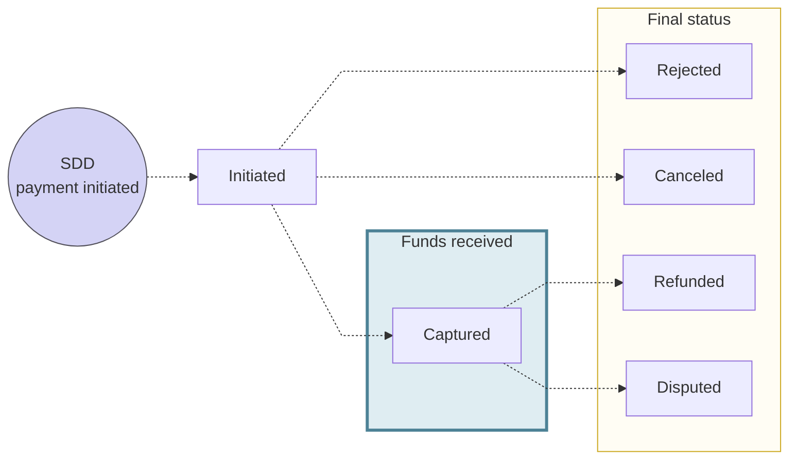

# SEPA Direct Debit for merchants

## Overview {#overview}

Merchants can accept payments with SEPA Direct Debit.

import DirectDebitCrossLinks from '../../partials/_direct-debit-other.mdx';

<DirectDebitCrossLinks />

## Direct debit payments {#payments}

Merchant direct debit payments include **one or more transactions**.
For example, one payment might include a capture transaction and a refund transaction, for a total of two transactions.

These transactions are **grouped together** in the **merchant payment object**.
Swan recommends using the merchant payment object in your integration to help merchants match orders, invoices, and sales to the correct object.
This provides better traceability and can help reconcile issues more efficiently.

### Payment object statuses {#payments-statuses}

The merchant payment object has **distinct statuses** to follow a payment's lifecycle. 

| Payment Object Status | Explanation |
|---|---|
| `Initiated`| The payment object has been created, but the payment is not yet authorized or guaranteed. |
| `Canceled` | The payment was canceled. Funds can no longer be captured. This is a final status. |
| `Rejected` | The payment was rejected by Swan or another participant in the payment scheme before the funds were captured. This is a final status. |
| `Captured` | The payment is successfully processed, and the funds are debited from the customer's account. This can be the final status of a successful payment flow, unless the customer disputes the payment or requests a refund. |
| `Refunded` | The payment was reversed by the merchant for the full amount. This is a final status. |
| `Disputed` | The customer disputed the payment with their bank for the full amount. This is a final status. |

### Payment object balances {#payments-balances}

The merchant payment object has **distinct balances** to follow a payment's lifecycle.

| SDD payment object balance | Explanation |
|---|---|
| `availableToCancel` | Pending amount that can still be canceled. Cancellations must be requested by the day before the scheduled execution and within the specified [cutoff time](/topics/merchants/online/sdd/#canceling). |
| `totalCanceled` | The total amount canceled for this merchant payment. |
| `totalCaptured` | The total amount captured by the merchant. |
| `availableToRefund` | The amount the merchant can refund. Use this balance to know if a payment is eligible for a refund. |
| `totalRefunded` | The total amount refunded for this merchant payment. |
| `totalDisputed` | The total amount of this merchant payment disputed by the customer. |

## Direct debit advantages {#advantages}

import DirectDebitAdvantages from '../../partials/_direct-debit-advantages.mdx';

<DirectDebitAdvantages />

:::note SEPA transaction fees
Refer to [billing](../../../accounts/billing/index.mdx#fees-swan-standard) for information about fees associated with merchant SEPA Direct Debit transactions.
:::

## Schemes: Core & B2B {#schemes}

Swan offers two SEPA Direct Debit schemes: `Core` and `B2B`.
You can choose to use one or both schemes according to your use case.

import DirectDebitTable from '../../../partials/_direct-debit-scheme-table.mdx';

<DirectDebitTable directDebitScheme="Core" creditorType="Creditor" psp="the debtor's payment services provider (PSP)" incomingOutgoing="3 business days after execution date" />

## SEPA Creditor Identifier (SCI) {#sci}

SEPA Creditor Identifiers (SCIs) are unique reference codes that identify each creditor participating in a SEPA Direct Debit scheme.
These identifiers are unique to each merchant and help banks sort transactions by merchant to ensure those transactions are routed correctly.

SCIs are composed of several elements, including:

1. ISO two-letter country code
1. Two-digit checksum
1. Creditor business activity code
1. National identification feature

For example, `FR12ABC0123456789` is an SCI from France (`FR`) with the check number `12`, and the business activity code `ABC`, ending with the national identification feature that changes country to country (`0123456789`).

### SCI options {#sci-options}

Swan provides an SCI, and merchants can also choose to use their own.

Both meet all SCI requirements.
It's important to note, however, that **Swan's provided SCI always mentions Swan**, which appears on a user's transaction history.

Merchants might prefer to **use their own SCI for a more customized user experience**.
Users would see the merchant's name instead of Swan on their transaction history, **reducing friction** and the risk of transactions looking suspicious to users.
The merchant's bank would also see the label Swan in disputes, so having the merchant name appear instead could also **ease bank relations**.

Merchants can **change their SCI** from Swan's to a personal SCI.
[Update their profile](./guide-update.mdx) by calling the `requestMerchantPaymentMethodsUpdate` mutation.

Regardless of the type of SCI, it's good practice to **include your merchant's name** in the `label` field for all SEPA Direct Debit transactions.

:::note Personal SCI
If a merchant in France expresses interest in using their own SCI but they don't have one, Swan can help them get their identifier.
Open a support request with Swan to start the process.
:::

## Rolling reserve {#rolling-reserve}

import RollingReserve from '../../partials/_rolling-reserve.mdx';

<RollingReserve />

| Payment method | Rolling reserve | Default amount |
| --- | --- | --- |
| SEPA Direct Debit - Core | <Yes /> **Yes** | Determined by a merchant profile risk assessment |
| SEPA Direct Debit - B2B | <Yes /> **Yes** | 100% over 3 business days |

You can use the `TransactionRollingReserve.Updated` and `TransactionRollingReserve.Released` [webhooks](/developers/using-api/webhooks/#events-transactions) to be notified when a transaction's rolling reserve is updated and when the funds are released.

## Payment amount limit {#payment-limit}
For security and risk management, Swan may apply a **payment amount limit** to a single SEPA Direct Debit (SDD) payment. 
This limit defines the maximum amount a user can spend in one SDD transaction. 
If a payment **exceeds this limit**, the API returns a `ForbiddenRejection` error.

To [query this limit](./guide-request.mdx), use the `paymentAmountLimit` field at the `merchantPaymentMethod` level in the API.

## Canceling payments {#canceling}

Merchants can cancel SEPA Direct Debit payments using the [`cancelMerchantPayment`](https://api-reference.swan.io/mutations/cancel-merchant-payment/) mutation.
To understand if a payment is cancelable, check its `availableToCancel` balance.
Only the full amount can be canceled.

Payments can only be canceled before transactions are sent to the SEPA payment gateway, respecting the current cutoff times:

- **SDD Core**: Payments can be canceled until approximately **11:00 Central European [Summer] Time (CET/CEST)**
- **SDD B2B**: Payments can be canceled until approximately **10:00 Central European [Summer] Time (CET/CEST)**

After these cutoff times, the payment can't be canceled and will proceed to settlement.

## Payment mandates {#mandates}

A payment mandate is a written authorization from a debtor that allows a creditor to initiate a direct debit transaction from their account.
Without a mandate, the creditor can't legally debit the debtor's account.

Payment mandates are mandatory for all SEPA Direct Debit transactions.
One payment mandate can cover as many debit transactions as needed between the debtor and the merchant, provided the mandate is `Recurrent`.

### Declaring mandates {#mandates-declare}

Partners are responsible for obtaining and declaring payment mandates.
You can either **include them in your Terms and Conditions** or **generate mandates** for debtors to sign with an electronic signature.

You must [declare mandates to Swan](./guide-declare.mdx) using the API.
You can declare them before or after they're signed.
If you declare a mandate before it's signed, make sure the debtor signs it before you issue the first direct debit.

When declaring a mandate, the combination of the Unique Mandate Reference (UMR) and the SEPA Creditor Identifier (SCI) must be unique. 
If the UMR and SCI have already been declared in another mandate, the API returns a `PaymentMandateReferenceAlreadyUsedRejection` and rejects the mandate declaration.

:::note Using Swan's SCI
If a merchant uses Swan's SCI, they must still ensure mandate references are unique to prevent conflicts with other merchants using the same SCI. Duplicate references will cause mandate declarations to be rejected by the API.
:::

After declaring the mandate, you might choose to upload it to your Dashboard as a PDF.
This isn't mandatory but can be helpful if a debtor's bank requests a copy of the signed mandate.

:::info B2B mandates
B2B mandates must be declared to the debtor's bank.
:::

### One-off mandates {#mandates-oneoff}

Some mandates can only be used one time.

When the sequence value is `OneOff` (instead of `Recurrent`), the received SEPA Direct Debit payment mandate is **canceled automatically** after the transaction is executed, regardless of the transaction status.

### Required information {#mandates-info}

In addition to a clear description of payment rights, SEPA Direct Debit payment mandates must include the following information.
Otherwise, the mandate is considered invalid.

| Information | Description |
| --- | --- |
| Mandate title | Choose one of the following options:<ul><li>Core SEPA Direct Debit Mandate</li><li>B2B SEPA Direct Debit Mandate</li></ul> |
| Mandate reference | <ul><li>Unique identifier for the mandate</li><li>Visible on the debtor's bank statement</li></ul> |
| Payment type | Choose one of the following options:<ul><li>Recurrent</li><li>One-off</li></ul> |
| Merchant (beneficiary) information | <ul><li>Merchant name</li><li>Merchant account holder address</li></ul> |
| Debtor information | <ul><li>Debtor's IBAN</li><li>Debtor's address</li></ul> |

## Settlement date and booked time {#settlement}

import SddBookedTime from '../../../partials/_sdd-booked.mdx';

<SddBookedTime />

import DayTimeStandard from '../../../partials/_day-time.mdx';

<DayTimeStandard />

## R-transactions {#r-transactions}

:::caution R-transaction availability
Returns and refunds are only possible with **Core** and can be requested up to 8 calendar weeks after due date and time.
:::

### Rejected {#rejected}

When a SEPA Direct Debit Core transaction is **rejected**, the debtor's account is not debited.

A SEPA Direct Debit Core transaction might be rejected for the following reasons:

| Rejection reason | Explanation |
|---|---|
| `BankRefused` | The payment was refused by the debtor's bank. |
| `DebtorAccountClosed` | The debtor's bank account is closed. |
| `DebtorAccountConsumer` | The debtor is not a business account, and the transaction is a B2B SDD transaction. |
| `DebtorAccountUnknown` | The IBAN provided doesn't match an existing account at the debtor's bank. |
| `DebtorDeceased` | The debtor is deceased. |
| `InsufficientFunds` | The debtor has insufficient funds to fulfill the transaction. |
| `MandateInvalid` | The payment mandate is invalid, possibly because it was canceled, incorrectly completed, or the B2B mandate wasn't declared. |
| `ReasonNotSpecifiedByBank` | The debtor's bank can't disclose the rejection reason due to local data protection laws. |
| `ReasonNotSpecifiedByDebtor` | The payment was rejected at the debtor's request. |
| `RegulatoryReason` | The payment was rejected for regulatory reasons not covered by other specific reason codes. |
| `SwanRefused` | Swan refused the transaction due to risk management or compliance requirements. |
| `TransactionDuplicated` | The transaction can't be fulfilled because it is a duplicate of another transaction. |
| `TransactionOnAccountTypeNotAllowed` | The account can't be debited because direct debits aren't allowed for this account type, for regulatory restrictions. |
| `TransactionTypeNotAllowed` | The direct debit can't be processed because the debtor account is blocked. |

When a SEPA Direct Debit Core transaction is rejected, regardless of the reason, the merchant receives a notification and can attempt a new SEPA Direct Debit at a later date.

### Returned {#returned}

When a SEPA Direct Debit Core transaction is **returned**, the debtor's account is debited the amount, but the payment is reversed and the funds return to the debtor's account.

A SEPA Direct Debit Core transaction might be returned for the following reasons:

| Return reason | Explanation |
|---|---|
| `BankRefused` | The payment was refused by the debtor's bank. |
| `DebtorAccountClosed` | The debtor's bank account is closed. |
| `DebtorAccountConsumer` | The debtor is not a business account, and the transaction is a B2B SDD transaction. |
| `DebtorAccountUnknown` | The IBAN provided doesn't match an existing account at the debtor's bank. |
| `DebtorDeceased` | The debtor is deceased. |
| `InsufficientFunds` | The debtor has insufficient funds to fulfill the transaction. |
| `MandateInvalid` | The payment mandate is invalid, possibly because it was canceled, incorrectly completed, or it wasn't declared to the debtor bank. |
| `ReasonNotSpecifiedByBank` | The debtor's bank can't disclose the return reason due to local data protection laws. |
| `ReasonNotSpecifiedByDebtor` | The payment was returned at the debtor's request. |
| `RegulatoryReason` | The payment was returned for regulatory reasons not covered by other specific reason codes. |
| `SwanRefused` | Swan refused the transaction due to risk management or compliance requirements. |
| `TransactionDuplicated` | The transaction can't be fulfilled because it's a duplicate of another transaction. |
| `TransactionOnAccountTypeNotAllowed` | The account can't be debited because direct debits aren't allowed for this account type, for regulatory restrictions. |
| `TransactionTypeNotAllowed` | The direct debit can't be processed because the debtor account is blocked. |

When a SEPA Direct Debit Core transaction is returned, regardless of the reason, the merchant is notified about the return.
They can investigate the reason for return and take whatever action is necessary, which might be refunding the payment or disputing the return with the debtor's bank.

## Guides {#guides}

- [Accept payments with SEPA Direct Debit (step-by-step)](./guide-sdd.mdx)
- [Request SEPA Direct Debit payment method](./guide-request.mdx)
- [Declare a payment mandate](./guide-declare.mdx)
- [Initiate a SEPA Direct Debit transaction](./guide-initiate.mdx)
- [Update SEPA Direct Debit payment method](./guide-update.mdx)
- [Sandbox](./sandbox.mdx)