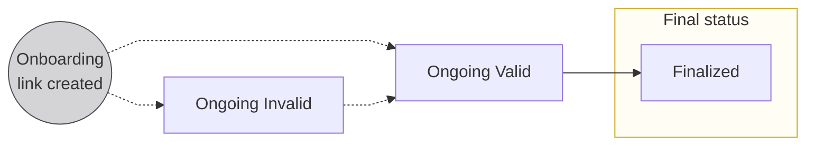
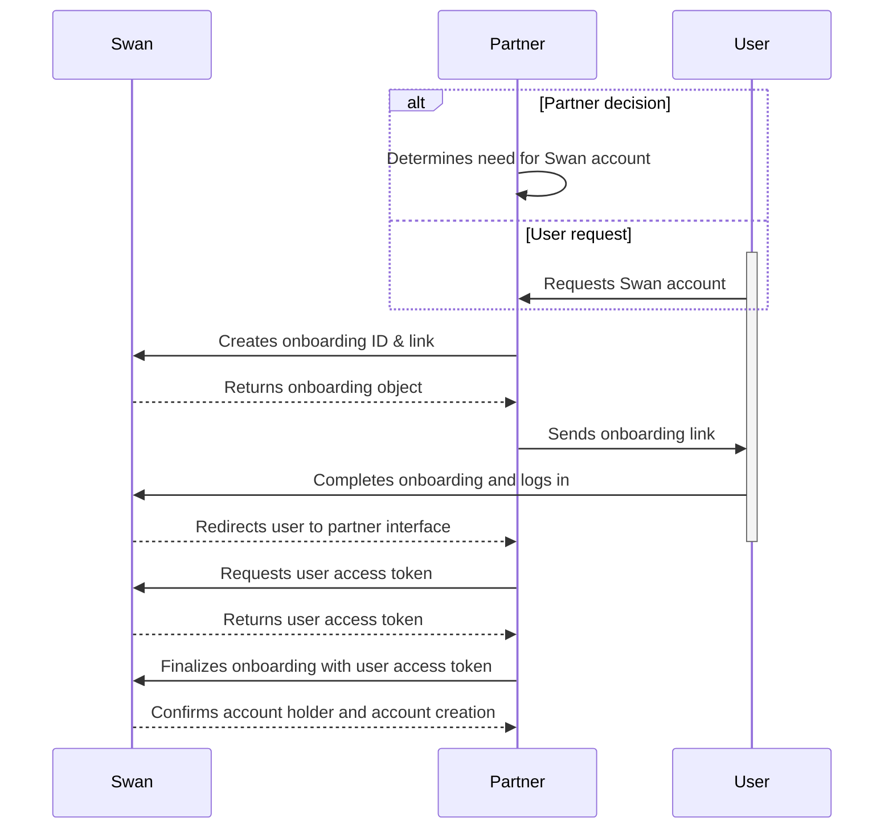

# Account onboarding overview

Account onboarding is, at its core, the **process to create [account holders](./account-holders/about.mdx)**.

One end result of onboarding is **also creating the first account** for the new account holder.
You can create as many accounts for each account holder as required.

:::info Cross reference
During onboarding, users also [complete an identity verification](./account-holders/about.mdx#verification-process) process, [consent to open the account](https://docs.swan.io/api/consent), and [authenticate](https://docs.swan.io/guide/create-a-new-account#first-authentication-and-callback) (log in) for the first time.
:::

## Types of onboarding

There are two types of onboarding, directly linked to the two types of accounts Swan offers.
Each onboarding has a unique `onboardingId`.

* **Individual onboarding** is the process of creating a new individual account holder, and opening a new Swan account for that account holder.
* **Company onboarding** is the process of creating a new company account holder, and opening a new Swan account for that account holder.

The individual and company onboarding processes are similar.
However, they're split in the documentation to prevent mixing up small but important details.

:::tip Swan Banking Frontend
If you'd like to customize the onboarding experience for your users (while respecting local regulations), check out the open source [Swan Banking Frontend](https://swan-io.github.io/swan-partner-frontend/specs/onboarding/).
:::

## Result of successful onboarding

After an onboarding is finalized, several events are also complete.

1. **Account holder** is created with the status `Enabled`.
1. Account holder's **account** is created.
1. Person who performed the onboarding process is the **legal representative** of the account.
They have the first membership to the account with **[full permissions](https://docs.swan.io/concept/account-membership#rights-management)**.
1. Your relationship with the account holder is stored in the `partnershipStatusInfofield` of the `account` object.

## Onboarding statuses

| Status | Explanation |
|---|---|
| `Ongoing (Invalid)` | <ul><li>First status assigned to an onboarding link if **using the frontend**, or, if using the **API**, when **not all required information** is included with your mutation</li><li>Status might change to `Invalid` if required information is removed or if some information is incorrect</li></ul>**Next step**: Submit or update required information to advance to `Ongoing (Valid)` (both you and the end user can submit or update information) |
| `Ongoing (Valid)` | <ul><li>First status assigned to an onboarding link if **using the API** and you **included all required information** with your mutation</li><li>Status changes to `Valid` when missing required information is submitted or if incorrect information is updated</li></ul>**Next step**: User completes form, clicks "Finalize," and provides consent to complete the onboarding process |
| `Finalized` | Onboarding completed |

## Country requirements

Onboarding is a **highly localized experience**.
Everything from **what to include in your API request** to how to ask **users to verify their identity** to whether Swan **requires certain ID numbers or documents** depends on the account country.

Account onboarding country requirements are described in the [**individual**](individual/about.mdx#country-requirements-for-individual-accounts) and [**company**](company/about.mdx#country-requirements-for-company-accounts) onboarding sections.
Please follow the requirements for your target countries closely.

## Sequence diagram: API onboarding flow

## Guides

The following guides are common to the individual and company onboarding processes.

* [Retrieve an onboarding ID](overview/guide-retrieve-onboarding-id.mdx)
* [Monitor onboarding progress](overview/guide-monitor-onboarding.mdx)
* [Finalize an onboarding](overview/guide-finalize-onboarding.mdx)