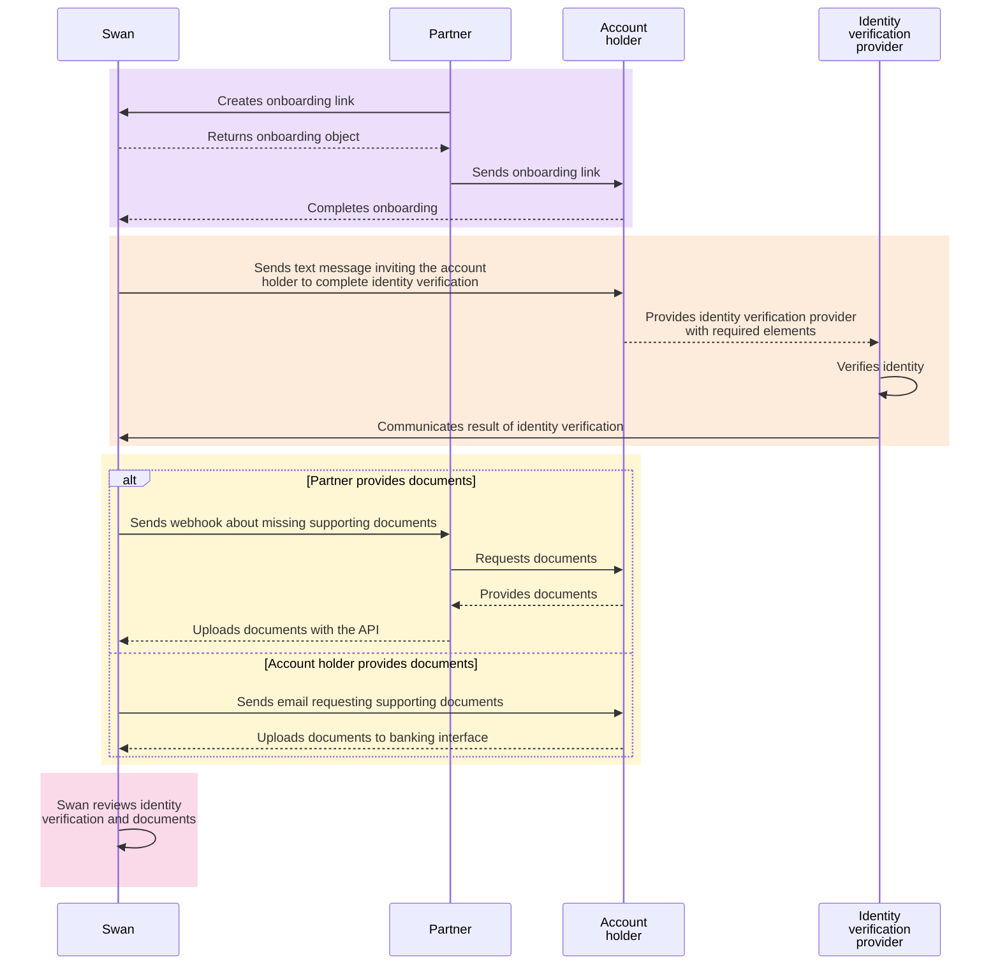

# Account holders

import AccountHolderDefinition from '../../definitions/_account-holder.mdx';

***

**Account holder** *<AccountHolderDefinition />*

***

Account holders can be **individuals** or **companies** (considered *legal entities*), and account holders can have as many Swan accounts as they need.
In order for funds to be stored in a Swan account, they must be associated with an account holder.

As a result of the onboarding process, **users become account holders**.

## Verifying account holders

As a partner and project owner, you choose who can have Swan accounts within your project.

However, regulations require **Swan to verify all of your account holders**, and to keep track of them for the lifetime of the account.
Therefore, Swan verifies each user before the account holder and account objects are created in your Swan project.
This verification is often referred to as **Know Your Customer (KYC)** or **Know Your Business (KYB)**.

:::note Verification responsibility
One benefit of working with Swan is that Swan is responsible for this process.
However, if it is vital that you to perform KYC and KYB processes yourself, please send an email to support@swan.io with a detailed explanation.
:::

### One account holder, multiple accounts

For company accounts, you can open multiple accounts for the same account holder.
In this case, Swan only needs to perform identity verification (Know Your Business [KYB] verification) if a KYB has not been performed within the last three months.

Follow the guide to [add additional accounts](./guide-add-additional-account.mdx) for an existing account holder.

## Verification process

The verification process for a new account holder is thorough, and Swan provides a streamlined process through which each account holder proves they are who they claim to be.

:::info Account access
Account holders can access their account immediately after creation.
However, they account is classified as an `eMoney` account, and the **account is limited until the account holder is verified**.
With `eMoney` accounts, the account holder can only spend up to 150€ over a 30-day period and an IBAN is not attributed to the account.

**After the account holder is verified**, the account becomes a `PaymentServices` account, spending restrictions are removed, and a main IBAN is attributed to the account.
:::

### Components

1. **Onboarding**: Process is finalized for either an [**individual**](../individual/about.mdx) or a [**company**](../company/about.mdx), which creates an *account holder*, an *account*, and a *user*.
1. **Identity verification**: Newly-created [**individual**](../individual/about.mdx#identify-verification-recommendations) or [**company**](../company/about.mdx#identify-verification-recommendations) account holder completes identity verification with an ID document and a picture or video.
1. **Document collection**: Swan collects [**required documents**](../documents/about.mdx).
1. **Review**: Swan reviews onboarding, identity verification, and collected documents.

After Swan **validates the review**, the account holder is verified and the restrictions on their account are lifted, meaning they're no longer limited to 150€ in outgoing payments.
Their account will also receive its primary IBAN.

:::info User flow diagram
To understand more about your user's verification experience, refer to the [user flow diagram for identity verification](../support.mdx).
:::

### Account holder verification statuses

| Verification status | Explanation |
|---|---|
| `NotStarted` | Verification process hasn't started yet |
| `WaitingForInformation` | Swan is waiting for information from the account holder, such as a document or for the account holder to complete identity verification |
| `Pending` | Swan has begun their review |
| `Verified` | Swan verified the account holder and the process is complete |
| `Refused` | Swan won't onboard this account holder |

### Sequence diagram

This diagram **details a common flow** of how Swan, the account holder, and you interact during verification.
Your integration might flow differently.

## Guides

* [Montior onboarding to track the verification process](../overview/guide-monitor-onboarding.mdx)
* [Add an account for an existing account holder](./guide-add-additional-account.mdx)
* [Sandbox](./sandbox.mdx)