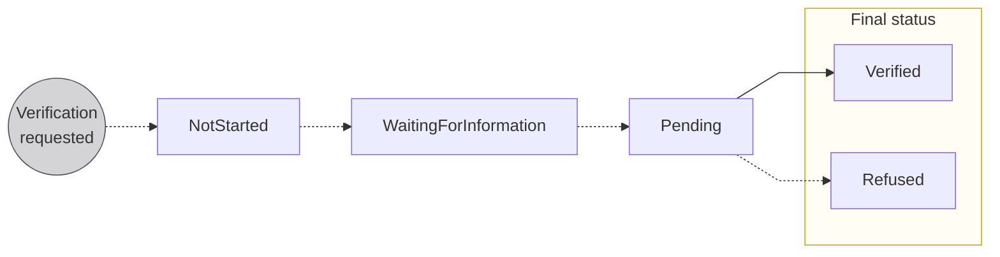
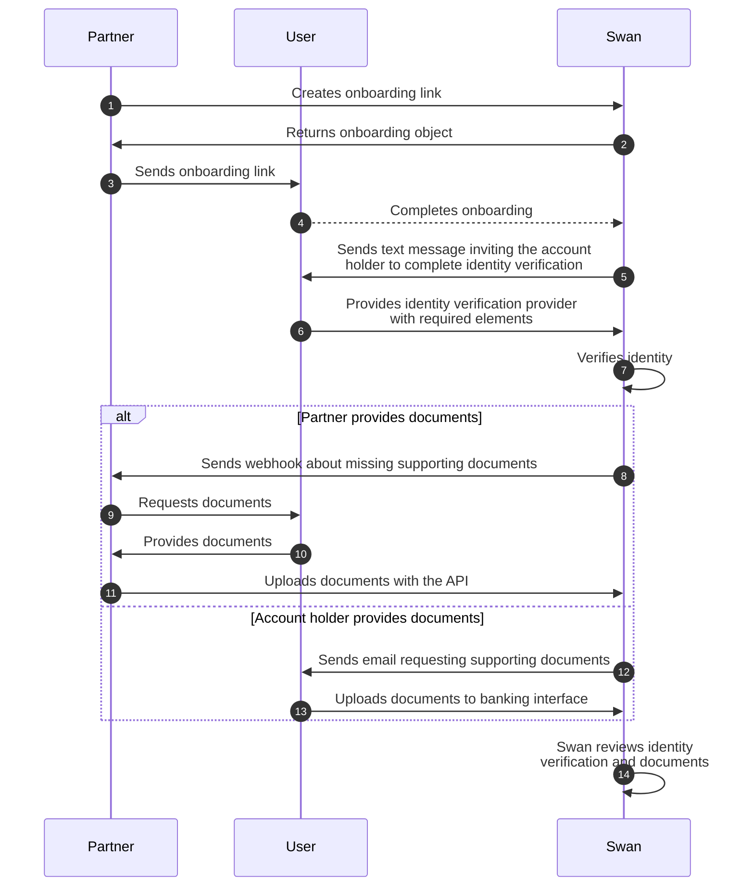

# Account holders

import AccountHolderDefinition from '../../definitions/_account-holder.mdx';

> <AccountHolderDefinition />

Account holders can be **individuals** or **companies** (considered *legal entities*), and account holders can have as many Swan accounts as they need.
In order for funds to be stored in a Swan account, they must be associated with an account holder.

As a result of the onboarding process, **users become account holders**.

## Verifying account holders {#verifying-account-holders}

As a Partner and project owner, you choose who can have Swan accounts within your project.
However, regulations require **Swan to verify all of your account holders**, and to keep track of them for the lifetime of the account.

Therefore, Swan verifies each user before the account holder and account objects are created in your Swan project.
This verification, often referred to as Know Your Customer (**KYC**) or Know Your Business (**KYB**), is **mandatory**.

:::caution Verification responsibility
One benefit of working with Swan is that Swan is responsible for this process.
However, if it is vital that you perform KYC and KYB processes yourself, please send an email to support@swan.io with a detailed explanation.
:::

### One account holder, multiple accounts {#verifying-account-holders-multi-account}

For **individual accounts**, you can open multiple accounts for the same account holder.
They'll complete a shorter onboarding process for each new account because they don't need to complete account holder verification again.
Follow the guide to [add additional individual accounts](./guide-add-additional-account.mdx) for an existing account holder.

For **company accounts**, however, Swan creates a new account holder for each account.
Therefore, a full account holder verification is required if it's been more than three months since the last verification.

## Verification process {#verification-process}

The verification process for a new account holder is thorough, and Swan provides a streamlined process through which each account holder proves they're who they claim to be.

Account holders can access their account immediately after creation.
However, while the verification is in progress, there are limitations on the account.
IBANs might be issued before limitations are removed from the account.
Learn more in [IBAN issuing](https://docs.swan.io/concept/iban/iban-issuing).

### Components {#verification-process-components}

1. **Onboarding**: Process is finalized for either an [**individual**](../individual/index.mdx) or a [**company**](../company/index.mdx), which creates an *account holder*, an *account*, and a *user*.
1. **Identity verification**: User that opened the [**individual**](../individual/index.mdx#identification-recommendations) or [**company**](../company/index.mdx#identification-recommendations) account completes identity verification with an ID document and a picture or video.
1. **Document collection**: Swan collects [**required documents**](../documents/index.mdx).
1. **Review**: Swan reviews onboarding, identity verification, and collected documents.

After Swan **validates the review**, the account holder is verified and their account receives its primary IBAN.

:::info User flow diagram
To understand more about your user's verification experience, refer to the [user flow diagram for identity verification](../support.mdx).
:::

### Account holder verification statuses {#verification-process-statuses}

| Verification status | Explanation |
|---|---|
| `NotStarted` | Verification process hasn't started yet. The account holder's legal representative needs to complete [identification](../../users/identifications/index.mdx) before starting account holder verification. |
| `WaitingForInformation` | Swan is waiting for information from the account holder, such as a [supporting document](../documents/index.mdx) or other information. |
| `Pending` | Swan is reviewing the account holder's information before activating or refusing the account. |
| `Verified` | Swan verified the account holder and the process is complete |
| `Refused` | Swan won't onboard this account holder |

### Sequence diagram {#verification-process-diagram}

This diagram **details a common flow** of how Swan, the account holder, and you interact during verification.
Your integration might flow differently.

## Guides {#guides}

* [Monitior onboarding to track the verification process](../overview/guide-get-info.mdx)
* [Add an account for an existing account holder](./guide-add-additional-account.mdx)
* [Sandbox](./sandbox.mdx)