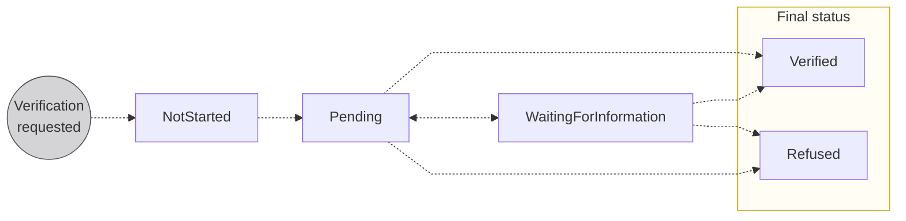
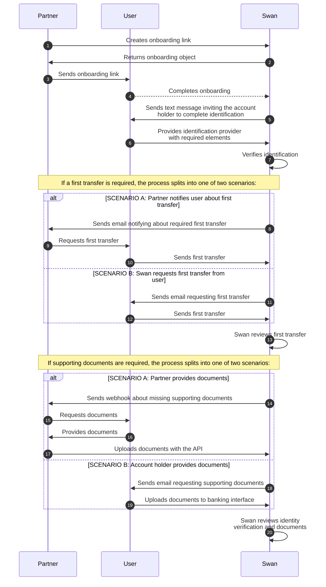

# Account holders

import AccountHolderDefinition from '../../definitions/_account-holder.mdx';

> <AccountHolderDefinition />

Account holders can be **individuals** or **companies** (considered *legal entities*), and account holders can have as many Swan accounts as they need.
In order for funds to be stored in a Swan account, they must be associated with an account holder.

As a result of the onboarding process, **users become account holders**.

## Overview {#overview}

As a Partner and project owner, you choose who can have Swan accounts within your project.
However, regulations require **Swan to verify all of your account holders**, and to keep track of them for the lifetime of the account.

Therefore, Swan verifies each user before the account holder and account objects are created in your Swan project.
This verification, often referred to as Know Your Customer (**KYC**) or Know Your Business (**KYB**), is **mandatory**.

:::caution Verification responsibility
One benefit of working with Swan is that Swan is responsible for this process.
However, if it is vital that you perform KYC and KYB processes yourself, please [send Swan a detailed explanation](https://partner-support.swan.io/hc/en-gb/requests).
:::

### One account holder, multiple accounts {#verifying-account-holders-multi-account}

For **individual accounts**, you can open multiple accounts for the same account holder.
They'll complete a shorter onboarding process for each new account because they don't need to complete account holder verification again.
Follow the guide to [add additional individual accounts](./guide-add-additional-account.mdx) for an existing account holder.

**Companies** can open [multiple accounts](../../accounts/multiple-accounts/index.mdx) linked to a single account holder and registration number. No new verification is needed when creating additional accounts. 
A new onboarding is required if you want to open an account with:
- An IBAN from a different country.
- A different company's registration number.
- A different establishment (a branch of the same company at a new address).

Follow the guide to [add additional company accounts](../../accounts/multiple-accounts/guide-multiple-accounts-integration.mdx) for an existing account holder.

## Account holder verification process {#verification-process}

The verification process for a new account holder is thorough, and Swan provides a streamlined process through which each account holder proves they're who they claim to be.

Account holders can access their account immediately after creation.
However, while account holder verification is in progress, there are [limitations on the account](../../accounts/index.mdx#account-type-level).
IBANs might be issued before limitations are removed from the account.

The account holder verification process can include the following elements:

1. **Onboarding**: Process is finalized for either an [**individual**](../individual/index.mdx) or a [**company**](../company/index.mdx), which creates a user, an account holder, an account, and an account membership linking the user to the account.
1. [**Identification**](../../users/identifications/index.mdx): User that opened the [individual](../individual/index.mdx#identification-recommendations) or [company](../company/index.mdx#identification-recommendations) account completes identification with an ID document and a picture or video.
1. [**First transfer**](#first-transfer): Users may need to send a first transfer to their new Swan account.
1. [**Document collection**](../../accounts/documents/index.mdx): Swan collects required documents.
1. **Clarification**: Swan might contact the user to clarify details from onboarding, identification, or document collection.
1. **Review**: Swan reviews all provided elements.

After Swan **validates the review**, the account holder is verified and their account receives its primary IBAN.

### Statuses {#verification-process-statuses}

| Account holder verification status | Explanation |
|---|---|
| `NotStarted` | Verification process hasn't started yet. The account holder's legal representative needs to complete [identification](../../users/identifications/index.mdx) before starting account holder verification. |
| `Pending` | Swan is reviewing the account holder's information before activating or refusing the account. |
| `WaitingForInformation` | Swan is waiting for information from the account holder, such as a [first transfer](#first-transfer), [supporting documents](../../accounts/documents/index.mdx), or something else. |
| `Verified` | Swan verified the account holder and the process is complete |
| `Refused` | Swan won't onboard this account holder |

### Waiting for information status {#waiting-for-info}

If the account holder verification status is `WaitingForInformation`, the account holder must meet one or more of the following requirements.
[Call the API](./guide-get-status.mdx) to learn which requirement they're missing.

| Requirement | Explanation |
| --- | --- |
| `FirstTransfer`   `Required` | Account holder needs to send a [first transfer](#first-transfer) to their Swan account. |
| `LegalRepresentative`   `DetailsRequired` | More information is required about the account's legal representative, or about the account member acting as the legal representative with Power of Attorney. |
| `Organization`   `DetailsRequired` | More information is required about the organization. |
| `SupportingDocuments`   `Required` | Provide the requested [supporting documents](../../accounts/documents/index.mdx). |
| `TaxId`   `Required` | Provide the Tax ID for both the account holder and the organization. |
| `UboDetails`   `Required` | More information is required about the organization's ultimate beneficial owner or owners (UBO). |
| `Other` | Swan contacts your account holder directly about additional requirements. |

### First transfer {#first-transfer}

:::tip Prerequisites
Before a user can make their first transfer, the following conditions must be met:

- Onboarding status: `Finalized`  
  The user's onboarding is complete, and all required supporting documents have been uploaded.

- Identification status: `Valid`  
  The user's identification was successfully completed.
:::

import FirstTransfer from '../../partials/_first-transfer.mdx';

<FirstTransfer />

Not all users are required to send a first transfer to be `Verified`.
Swan asks some users to send a first transfer as an additional verification measure.
Additionally, if your users complete certain [identification processes](../../users/identifications/index.mdx#processes-recommendations) in certain countries, a first transfer might be required by law.
Review the [guide to request a first transfer](./guide-request-first-transfer.mdx) for communication options.

:::caution 🇩🇪 Germany
A first transfer is always required for self-employed and individual accounts for which the **[account country](../../accounts/index.mdx#account-country)** is **Germany**, regardless of registration or residency.
:::

Users must send first transfers from an account in their name.
Not all third-party payment platforms or online banks are accepted for first transfers.
Share this [Support Center article](https://support.swan.io/hc/en-150/articles/17774309993501-First-transfer-request) with your users. 
It explains why a first transfer may be requested, and the possible outcomes.

Users can send any amount in the first transfer.
While there is technically no deadline for sending the transfer, the user's [account is `Limited`](../../accounts/index.mdx#account-type-level) until the transfer is validated.

#### First transfer and account holder verification status {#first-transfer-waiting}

A first transfer request is made when the account holder verification status is `Pending`.
After Swan makes the request, the account holder verification status changes to `WaitingForInformation`.

After the user sends their transfer, the account holder verification status changes to `Pending` while Swan checks the transfer source.
Note that if the account used to send the first transfer is located outside of the European Economic Area (EEA), it may be subject to additional review.

#### First transfer outcomes {#first-transfer-outcomes}

| **Outcome** | **Description** | **Account holder verification status update** |
|---|---|---|
| Account holder is verified | The first transfer source was accepted, and we approved the account holder. | `Verified` |
| Account holder is refused | The first transfer source wasn't accepted, and we didn't approve the account holder. | `Refused` |
| Additional transfer requested | The first transfer came from an unaccepted source. We asked the user to send another transfer from a different account in their name. | `WaitingForInformation` |
| Additional documents requested | We received the first transfer and asked the user for [supporting documents](../../accounts/documents/index.mdx). | `WaitingForInformation` |

:::info Additional transfer or documents
After the additional transfer or documents are received, the account holder verification status changes from `WaitingForInformation` to `Pending` while Swan reviews them. Depending on the outcome, the status changes to either `Verified` or `Refused`. 
:::

## Sequence diagram {#verification-process-diagram}

This diagram **details a common flow** of how Swan, the account holder, and you interact during verification.
Note that the flow includes alternate scenarios (A or B) where the path is determined by your integration choices. Your final integration might flow differently.

## Notifications {#notifications}

import NotificationBranding from '../../partials/_notification-branding.mdx';

Swan sends email notifications to users during the account holder verification process.

<NotificationBranding />

### First transfer notification {#notification-first-transfer}

When a Swan KYC agent determines that a first transfer is needed for verification, they can manually request it from the user. This notification isn't sent for every user—only when Swan identifies it as a necessary verification step.

**Trigger**: Manual request by a Swan KYC agent after the user completes identification but before the account holder verification status changes to `Verified`.

**Configuration**: Swan can configure this notification on your behalf based on your preferred communication flow. Contact your Account Manager to discuss your preference. The available options include sending notifications directly to the end customer, to you as the partner, copying both parties, or using the API to manage communications yourself.

The email includes the account's IBAN and BIC to help users complete the transfer.

### Supporting documents notifications {#notification-documents}

When Swan's KYC team needs additional supporting documents to complete the verification process, they can request them from the user through email notifications.

#### Request supporting documents {#notification-documents-request}

This notification informs the user that supporting documents are required and provides a link to upload them.

**Trigger**: Manual request by a Swan KYC analyst when additional supporting documents are needed for an onboarding-related document collection.

**Configuration**: Swan can configure this notification on your behalf. Contact your Account Manager to discuss your preferences. The available communication options are the same as for the first transfer notification.

The email includes a call-to-action button that redirects users to an onboarding page where they can upload the requested documents. Even if documents have already been requested for a given collection, triggering this action sends a new email.

#### Request supporting documents reminders {#notification-documents-reminders}

To help ensure users provide the necessary documents, Swan automatically sends reminder emails at regular intervals.

**Trigger**: Automatic reminders are sent when a Swan KYC analyst has requested additional supporting documents and your notification settings allow end customer communication.

Reminders are sent after 2, 4, 7, 14, and 21 days as long as the supporting document collection status remains `WaitingForDocument`.

**Configuration**: Reminders are only sent when your document collection settings are configured to communicate with the end customer (either directly or copied to you as the Partner). No reminders are sent when communications are Partner-only or managed via API.

### Account opened notification {#notification-account-opened}

When the verification process is complete and the account is ready for full use, Swan automatically notifies the user.

**Trigger**: Automatic when the account holder verification status changes to `Verified` and the account payment status changes to `Unlimited`, meaning the user can use all available funds.

**Configuration**: Swan can configure this notification on your behalf. Contact your Account Manager to discuss your preferences. The available communication options include sending to the end customer, to you as the partner, or managing via API.

## Guides {#guides}

* [Monitor onboarding to track the verification process](../overview/guide-get-info.mdx)
* [Add an account for an existing account holder](./guide-add-additional-account.mdx)
* [Get account holder verification status](./guide-get-status.mdx)
* [Request a first transfer](./guide-request-first-transfer.mdx)
* [Export account holder data](./guide-export.mdx)
* [Sandbox](./sandbox.mdx)