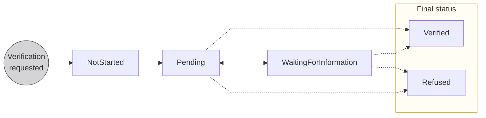
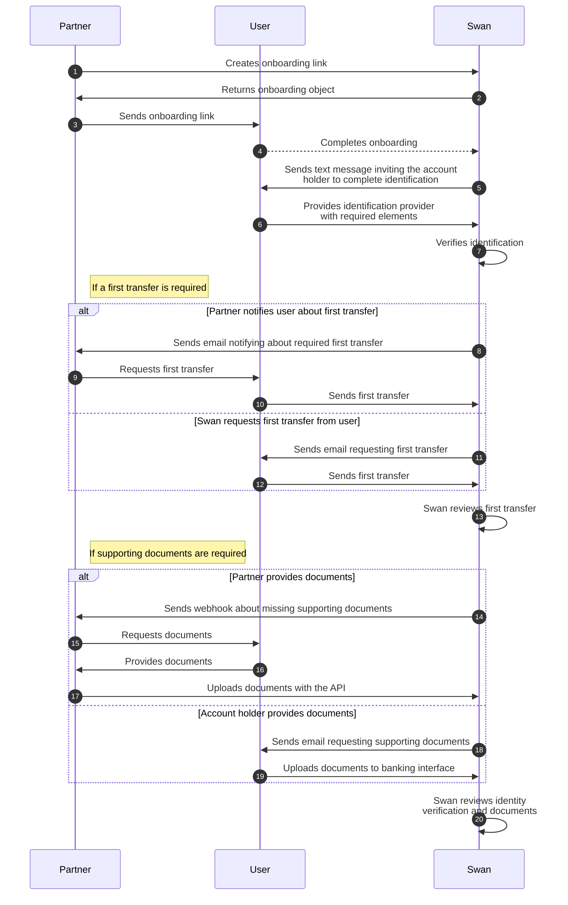

# Account holders

import AccountHolderDefinition from '../../definitions/_account-holder.mdx';

> <AccountHolderDefinition />

Account holders can be **individuals** or **companies** (considered *legal entities*), and account holders can have as many Swan accounts as they need.
In order for funds to be stored in a Swan account, they must be associated with an account holder.

As a result of the onboarding process, **users become account holders**.

## Overview {#overview}

As a Partner and project owner, you choose who can have Swan accounts within your project.
However, regulations require **Swan to verify all of your account holders**, and to keep track of them for the lifetime of the account.

Therefore, Swan verifies each user before the account holder and account objects are created in your Swan project.
This verification, often referred to as Know Your Customer (**KYC**) or Know Your Business (**KYB**), is **mandatory**.

:::caution Verification responsibility
One benefit of working with Swan is that Swan is responsible for this process.
However, if it is vital that you perform KYC and KYB processes yourself, please send an email to support@swan.io with a detailed explanation.
:::

### One account holder, multiple accounts {#verifying-account-holders-multi-account}

For **individual accounts**, you can open multiple accounts for the same account holder.
They'll complete a shorter onboarding process for each new account because they don't need to complete account holder verification again.
Follow the guide to [add additional individual accounts](./guide-add-additional-account.mdx) for an existing account holder.

For **company accounts**, however, Swan creates a new account holder for each account.
Therefore, a full account holder verification is required if it's been more than three months since the last verification.

## Account holder verification process {#verification-process}

The verification process for a new account holder is thorough, and Swan provides a streamlined process through which each account holder proves they're who they claim to be.

Account holders can access their account immediately after creation.
However, while account holder verification is in progress, there are [limitations on the account](../../accounts/index.mdx#account-type-level).
IBANs might be issued before limitations are removed from the account.

The account holder verification process can include the following elements:

1. **Onboarding**: Process is finalized for either an [**individual**](../individual/index.mdx) or a [**company**](../company/index.mdx), which creates a user, an account holder, an account, and an account membership linking the user to the account.
1. [**Identification**](../../users/identifications/index.mdx): User that opened the [individual](../individual/index.mdx#identification-recommendations) or [company](../company/index.mdx#identification-recommendations) account completes identification with an ID document and a picture or video.
1. [**Document collection**](../../accounts/documents/index.mdx): Swan collects required documents.
1. [**First transfer**](#first-transfer): Certain users need to send a first transfer to their new Swan account.
1. **Review**: Swan reviews all provided elements.

After Swan **validates the review**, the account holder is verified and their account receives its primary IBAN.

### Statuses {#verification-process-statuses}

| Account holder verification status | Explanation |
|---|---|
| `NotStarted` | Verification process hasn't started yet. The account holder's legal representative needs to complete [identification](../../users/identifications/index.mdx) before starting account holder verification. |
| `Pending` | Swan is reviewing the account holder's information before activating or refusing the account. |
| `WaitingForInformation` | Swan is waiting for information from the account holder, such as a [first transfer](#first-transfer), [supporting documents](../../accounts/documents/index.mdx), or something else. |
| `Verified` | Swan verified the account holder and the process is complete |
| `Refused` | Swan won't onboard this account holder |

### Waiting for information status {#first-waiting-info}

If the account holder verification status is `WaitingForInformation`, the account holder must meet one or more of the following requirements.
[Call the API](./guide-get-status.mdx) to learn which requirement they're missing.

| Requirement | Explanation |
| --- | --- |
| `FirstTransfer`   `Required` | Account holder needs to send a [first transfer](#first-transfer) to their Swan account. |
| `LegalRepresentative`   `DetailsRequired` | More information is required about the account's legal representative, or about the account member acting as the legal representative with Power of Attorney. |
| `Organization`   `DetailsRequired` | More information is required about the organization. |
| `SupportingDocuments`   `Required` | Provide the requested [supporting documents](../../accounts/documents/index.mdx). |
| `TaxId`   `Required` | Provide the <mark>account holder or organization's</mark> Tax ID. |
| `UboDetails`   `Required` | More information is required about the organization's ultimate beneficial owner or owners (UBO). |
| `Other` | Swan <mark>contacts your account holder</mark> about a different requirement. |

### First transfer {#first-transfer}

import FirstTransfer from '../../partials/_first-transfer.mdx';

<FirstTransfer />

Not all users are required to send a first transfer to be `Verified`.
Swan asks some users to send a first transfer as an additional verification measure.
Additionally, if your users complete certain [identification processes](../../users/identifications/index.mdx#processes-recommendations) in certain countries, a first transfer might be required by law.
Review the [guide to request a first transfer](./guide-request-first-transfer.mdx) for communication options.

:::caution 🇩🇪 Germany
A first transfer is always required for self-employed and individual accounts for which the **[account country](../../accounts/index.mdx#account-country)** is **Germany**, regardless of registration or residency.
:::

Users must send first transfers from a bank account in their name.
Transfers from third-party payment platforms like PayPal or Lydia aren't accepted.

Users can send any amount in the first transfer.
While there is technically no deadline for sending the transfer, the user's [account is `Limited`](../../accounts/index.mdx#account-type-level) until the transfer is validated.

#### First transfer and account holder verification status

When Swan requests the first transfer, the account holder verification status changes to `WaitingForInformation`.

After the user sends their transfer, the account holder verification status changes to `Pending` while Swan checks the transfer source.
If transferred from an acceptable account, the account holder verification status changes to `Verified`.
Note that if the account used to send the first transfer is located outside of the European Economic Area (EEA), it may be subject to additional review.

:::info Supporting documents
If Swan requests [supporting documents](../../accounts/documents/index.mdx) from the user as well, the account holder verification status remains `WaitingForInformation` after receiving the first transfer.
When the documents are received, the account holder verification status changes to `Pending` while Swan reviews them.
:::

## Sequence diagram {#verification-process-diagram}

This diagram **details a common flow** of how Swan, the account holder, and you interact during verification.
Your integration might flow differently.

## Guides {#guides}

* [Monitior onboarding to track the verification process](../overview/guide-get-info.mdx)
* [Add an account for an existing account holder](./guide-add-additional-account.mdx)
* [Get account holder verification status](./guide-get-status.mdx)
* [Request a first transfer](./guide-request-first-transfer.mdx)
* [Sandbox](./sandbox.mdx)