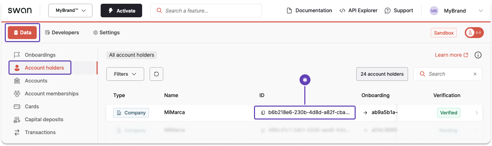
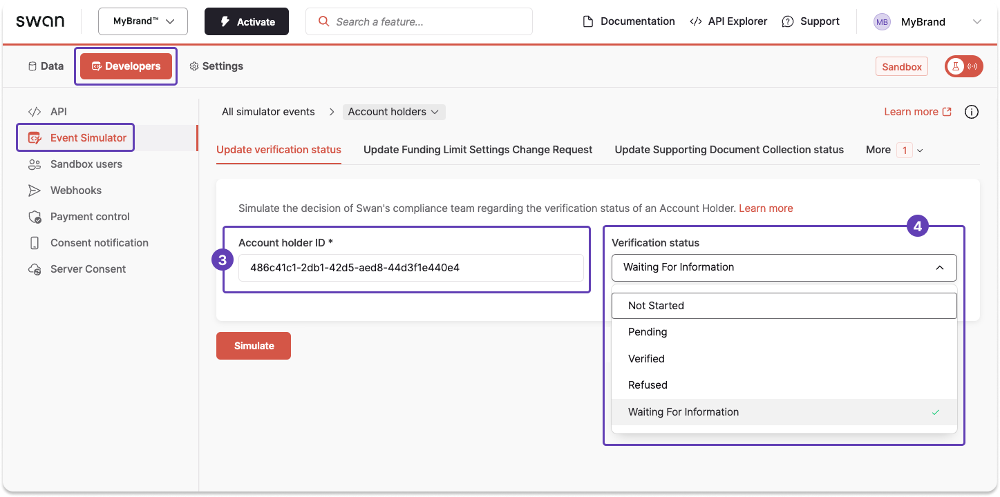

import Tabs from '@theme/Tabs';
import TabItem from '@theme/TabItem';

# Sandbox: Account holders

## Simulate updating an account holder’s verification status

### Step 1: Get the account holder ID

Use the Dashboard to get the account holder ID.

You could also use the `accountHolders` query.
However, since you can only simulate updating one account holder status at a time, and *from your Dashboard*, it's simpler to get the ID from the Dashboard.

1. On your Dashboard, go to **Data** > **Account holders**.
1. Locate the account holder you need.
1. Click to copy their account holder ID.

### Step 2: Update the status

With the account holder ID, use the Event Simulator to change the [account holder verification status](./about.mdx#statuses) to any available status.

1. On your Dashboard, go to **Developers** > **Event Simulator**.
1. Open **Account holders**, then go to the **Update verification status** tab.
1. Enter the account holder ID into the **Account holder ID** field.
1. From the dropdown, choose the status you'd like to simulate.
1. Click **Simulate**.

