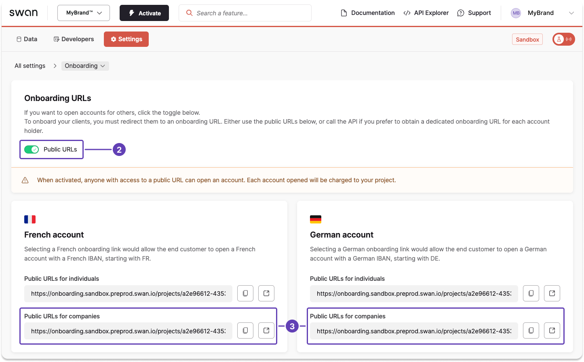

# Create a company onboarding link

import DeprecationTimeline from '../partials/_deprecated-mutation-timeline.mdx';
import CreateOnboardingPrereqs from '../partials/_prereqs-create.mdx';

<CreateOnboardingPrereqs onboardingType="company" />

import PublicOnboardingLinks from '../_public-onboarding-links.mdx';

<PublicOnboardingLinks />

## Unique links using the API {#api}

Create a unique company onboarding link for each user with the API.

1. Call the `createCompanyAccountHolderOnboarding` mutation.
1. Enter information for all required API fields for the account country, as noted in [country requirements for company accounts](./index.mdx#country-reqs).
    1. Start with `accountInfo` (account country and optional name).
    1. Add `accountAdmin` details (email, language, type of representation).
    1. Add the `company` object with business details and `relatedIndividuals`.
1. Include optional fields as needed for your use case (such as `accountInfo.name` or `oAuthRedirectParameters`).
1. Add optional messages to the success payload, either for validation or in case of rejection.

:::note Deprecated mutation
The previous [`onboardCompanyAccountHolder`](https://api-reference.swan.io/mutations/onboard-company-account-holder/) mutation is deprecated.
<DeprecationTimeline />
Use `createCompanyAccountHolderOnboarding` for all new integrations.
:::

:::tip Pre-fill for French companies
For companies in France, use the `companyInfoRegistryData` query with the company's registration number to retrieve data from the National Business Register (RNE). Pass the results to the mutation to pre-fill company fields.
:::

### Mutation {#mutation}

<a href="https://explorer.swan.io?query=bXV0YXRpb24gQ3JlYXRlQ29tcGFueU9uYm9hcmRpbmcgewogIGNyZWF0ZUNvbXBhbnlBY2NvdW50SG9sZGVyT25ib2FyZGluZygKICAgIGlucHV0OiB7CiAgICAgIGFjY291bnRJbmZvOiB7CiAgICAgICAgY291bnRyeTogRVNQCiAgICAgIH0KICAgICAgYWNjb3VudEFkbWluOiB7CiAgICAgICAgZW1haWw6ICJhbGJlcnRvLm1vcmVub0BtaW1hcmNhLmlvIgogICAgICAgIHByZWZlcnJlZExhbmd1YWdlOiBlcwogICAgICAgIHR5cGVPZlJlcHJlc2VudGF0aW9uOiBMZWdhbFJlcHJlc2VudGF0aXZlCiAgICAgIH0KICAgICAgY29tcGFueTogewogICAgICAgIG5hbWU6ICJNaU1hcmNhIgogICAgICAgIGJ1c2luZXNzQWN0aXZpdHk6IENvbnN0cnVjdGlvbgogICAgICAgIGJ1c2luZXNzQWN0aXZpdHlEZXNjcmlwdGlvbjogIkhpc3RvcmljYWwgcmVzdG9yYXRpb24iCiAgICAgICAgcmVnaXN0cmF0aW9uTnVtYmVyOiAiMTIzNDU2Nzg5IgogICAgICAgIG1vbnRobHlQYXltZW50Vm9sdW1lOiBCZXR3ZWVuMTAwMDBBbmQ1MDAwMAogICAgICAgIGFkZHJlc3M6IHsKICAgICAgICAgIGFkZHJlc3NMaW5lMTogIjIxIEJhcnJpbyBkZSBTYW4gUm9xdWUiCiAgICAgICAgICBjaXR5OiAiQmFyY2Vsb25hIgogICAgICAgICAgY291bnRyeTogIkVTUCIKICAgICAgICAgIHBvc3RhbENvZGU6ICIwODAwNSIKICAgICAgICB9CiAgICAgICAgdGF4SWRlbnRpZmljYXRpb25OdW1iZXI6ICJZMTIzNDU2N1oiCiAgICAgICAgcmVsYXRlZEluZGl2aWR1YWxzOiBbCiAgICAgICAgICB7CiAgICAgICAgICAgIHR5cGU6IExlZ2FsUmVwcmVzZW50YXRpdmVBbmRVbHRpbWF0ZUJlbmVmaWNpYWxPd25lcgogICAgICAgICAgICBmaXJzdE5hbWU6ICJTb2ZpYSIKICAgICAgICAgICAgbGFzdE5hbWU6ICJSYW1vcyIKICAgICAgICAgICAgc2V4OiBGZW1hbGUKICAgICAgICAgICAgYmlydGhJbmZvOiB7CiAgICAgICAgICAgICAgYmlydGhEYXRlOiAiMTk5MC0wMy0wMyIKICAgICAgICAgICAgICBjb3VudHJ5OiAiRVNQIgogICAgICAgICAgICAgIGNpdHk6ICJNYWRyaWQiCiAgICAgICAgICAgIH0KICAgICAgICAgICAgYWRkcmVzczogewogICAgICAgICAgICAgIGFkZHJlc3NMaW5lMTogIjEgQ2FtaW5vIGRlbCBPY2Vhbm8iCiAgICAgICAgICAgICAgY2l0eTogIkJhcmNlbG9uYSIKICAgICAgICAgICAgICBjb3VudHJ5OiAiRVNQIgogICAgICAgICAgICAgIHBvc3RhbENvZGU6ICIwODAwNSIKICAgICAgICAgICAgfQogICAgICAgICAgICB1bHRpbWF0ZUJlbmVmaWNpYWxPd25lcjogewogICAgICAgICAgICAgIHF1YWxpZmljYXRpb25UeXBlOiBPd25lcnNoaXAKICAgICAgICAgICAgICBvd25lcnNoaXA6IHsKICAgICAgICAgICAgICAgIHR5cGU6IERpcmVjdAogICAgICAgICAgICAgICAgdG90YWxQZXJjZW50YWdlOiAxLjUKICAgICAgICAgICAgICB9CiAgICAgICAgICAgIH0KICAgICAgICAgIH0KICAgICAgICBdCiAgICAgIH0KICAgIH0KICApIHsKICAgIC4uLiBvbiBDcmVhdGVDb21wYW55QWNjb3VudEhvbGRlck9uYm9hcmRpbmdTdWNjZXNzUGF5bG9hZCB7CiAgICAgIF9fdHlwZW5hbWUKICAgICAgb25ib2FyZGluZyB7CiAgICAgICAgaWQKICAgICAgICBzdGF0dXNJbmZvIHsKICAgICAgICAgIHN0YXR1cwogICAgICAgIH0KICAgICAgfQogICAgfQogIH0KfQo=&tab=api" className="explorer-badge">Open in API Explorer</a>

```graphql showLineNumbers
mutation CreateCompanyOnboarding {
  createCompanyAccountHolderOnboarding(
    input: {
      accountInfo: {
        country: ESP
      }
      accountAdmin: {
        email: "alberto.moreno@mimarca.io"
        preferredLanguage: es
        typeOfRepresentation: LegalRepresentative
      }
      company: {
        name: "MiMarca"
        businessActivity: Construction
        businessActivityDescription: "Historical restoration"
        registrationNumber: "123456789"
        monthlyPaymentVolume: Between10000And50000
        address: {
          addressLine1: "21 Barrio de San Roque"
          city: "Barcelona"
          country: "ESP"
          postalCode: "08005"
        }
        taxIdentificationNumber: "Y1234567Z"
        relatedIndividuals: [
          {
            type: LegalRepresentativeAndUltimateBeneficialOwner
            firstName: "Sofia"
            lastName: "Ramos"
            sex: Female
            birthInfo: {
              birthDate: "1990-03-03"
              country: "ESP"
              city: "Madrid"
            }
            address: {
              addressLine1: "1 Camino del Oceano"
              city: "Barcelona"
              country: "ESP"
              postalCode: "08005"
            }
            ultimateBeneficialOwner: {
              qualificationType: Ownership
              ownership: {
                type: Direct
                totalPercentage: 1.5
              }
            }
          }
        ]
      }
    }
  ) {
    ... on CreateCompanyAccountHolderOnboardingSuccessPayload {
      __typename
      onboarding {
        id
        statusInfo {
          status
        }
      }
    }
  }
}
```

### Payload {#api-payload}

If you added validation or rejection messages, you'll see information such as the `onboardingId` as well as the current status `Valid` in the success payload.

```json {6,7} showLineNumbers
{
  "data": {
    "createCompanyAccountHolderOnboarding": {
      "__typename": "CreateCompanyAccountHolderOnboardingSuccessPayload",
      "onboarding": {
        "id": "eda0ceec-0e20-4d1b-bbee-b3e3a4227c99",
        "statusInfo": {
          "status": "Valid"
        }
      }
    }
  }
}
```

## Public link using the Dashboard {#dashboard}

import PublicOnboardingUrl from '../partials/_create-public-url.mdx';

<PublicOnboardingUrl />

