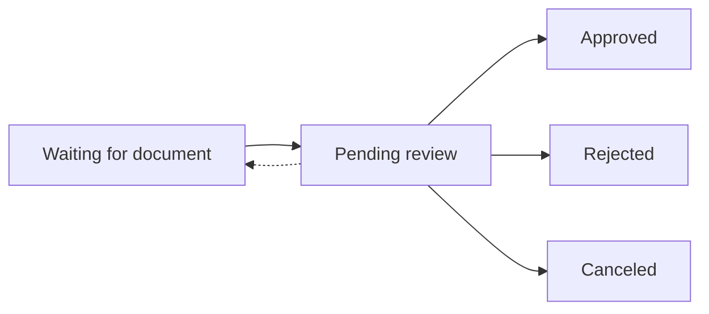
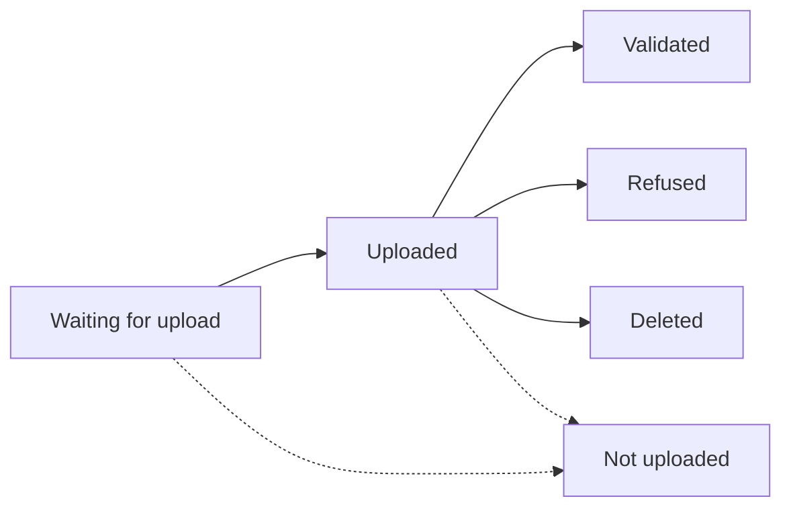

# Supporting document collection

import SupportingDocumentCollectionDefinition from '../../definitions/_onboarding-supporting-documents.mdx';

***

**Supporting document collection** *<SupportingDocumentCollectionDefinition />*

***

Swan is sometimes required to collect documents to **verify onboarding details**.
Each **document** is uploaded individually into a **collection**.
After all required documents are uploaded, Swan **reviews the collection**.

## Options for collecting documents

There are two primary options to collect required supporting documents:

1. Use the API.
    1. No emails are exchanged.
    1. You'll know every time a document is needed with webhook notifications.
    1. You communicate with your end users to gather the required documents.
    1. Choose the API or the Dashboard for most actions, including uploading documents.
1. Swan communicates directly with your end users.
    1. The end user receives an email.
    1. The end user uploads the document through Web Banking.
    1. You'll be able to see the document after the upload.

:::tip Recommendation
Swan recommends **using the API** to manage documents and collections.
:::

## Collection statuses

Each **collection** runs through the following statuses.
This process starts after an onboarding is created.

| Collection status | Explanation |
|---|---|
| `Waiting for document` | Onboarding is created but documents haven't been submitted yet *(occasionally, submitted documents were insufficient)*  **Next step**: moves to `Pending review` after onboarding is finalized |
| `Pending review` | Onboarding is finalized and all documents have been submitted and a review requested  **Next step**: Can move to `Approved`, `Rejected`, or `Canceled` depending on partner actions and Swan decisions (or, if documents are insufficient → `Waiting for document`) |
| `Approved` | Swan approved supporting document collection |
| `Rejected` | Swan rejected supporting document collection |
| `Canceled` | Swan canceled supporting document collection (this could also be at the partner's request) |

## Document statuses

Supporting document collections are empty when created.
You need to add documents to these collections as requested.
For each required document, you'll create a document within the collection.

Each **document** added to a collection runs through the following statuses.

| Document status | Explanation |
|---|---|
| `Waiting for upload` | Document is created with Swan but not uploaded yet  **Next step**: <ul><li>If the document is uploaded → `Uploaded`</li><li>If onboarding is finalized before the document is uploaded → `Not uploaded`</li></ul> |
| `Uploaded` | Created document is uploaded  **Next step**: <ul><li>If a review is completed on the uploaded document → Status moves to `Validated`, `Refused`, or `Deleted` depending on partner actions and Swan decisions</li><li>If onboarding is finalized before the uploaded document is reviewed → `Not uploaded`</li></ul> |
| `Validated` | Swan approved the document |
| `Refused` | Swan refused the document |
| `Deleted` | Swan or the partner deleted the document |
| `Not uploaded` | Onboarding was finalized before the upload |

## Document purposes and types

For all supporting documents, there is a high-level purpose (`supportingDocumentPurpose`).
Each purpose has a group of assigned types (`supportingDocumentType`).
Both purpose and type can be exposed in the onboarding success payload.

**Common purposes**:

* `CompanyRegistration`
* `SignedStatus`
* `ProofOfAddress`
* `ProofOfIdentity`
* `ProofOfIncome`
* `Other`

## Guides

Use the following guides to manage required documents for the onboarding process.

* [Add document webhooks](./guide-add-document-webhooks.mdx)
* [Get a list of required documents](./guide-list-documents.mdx)
* [Upload a document](./guide-upload-document.mdx)
* [Retrieve information about a collection or document](./guide-retrieve-info.mdx)
* [Request a collection review](./guide-request-collection-review.mdx)
* [Delete a document](./guide-delete-document.mdx)
* [Sandbox](./sandbox.mdx)