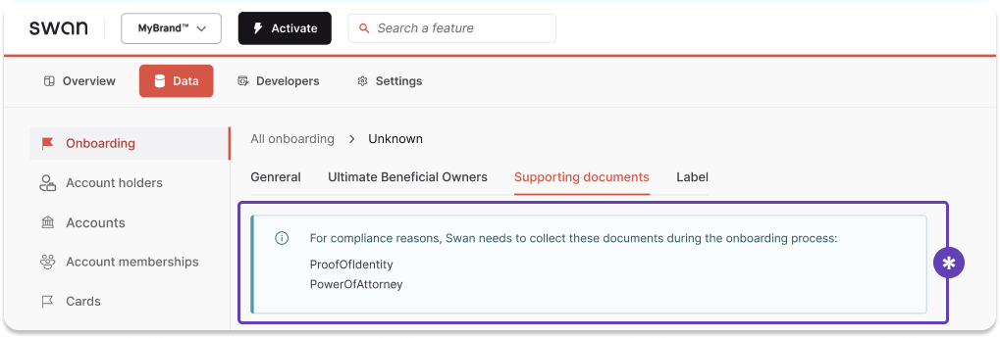
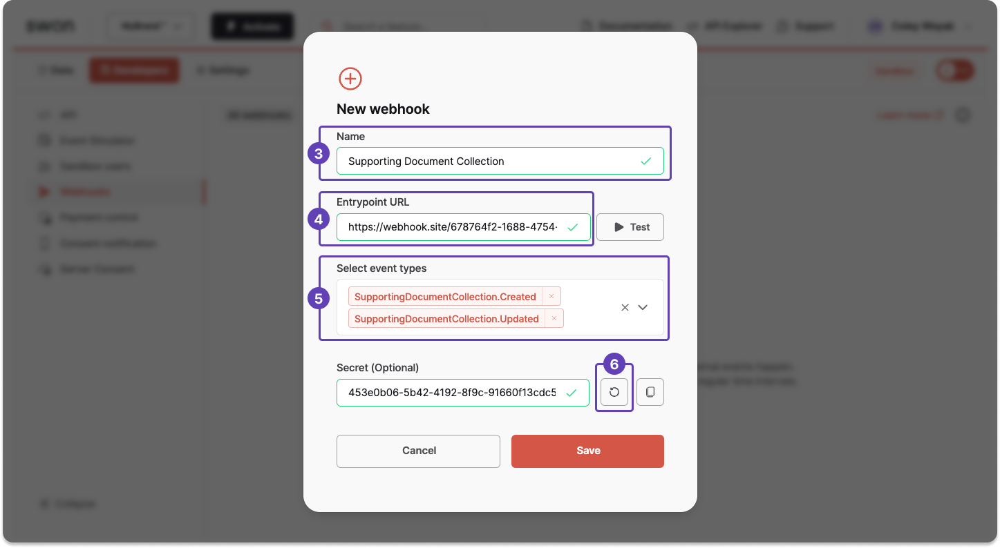

# Add document webhooks

Get **automatic updates** about supporting document collection and missing required documents directly on your Dashboard.
These updates are displayed in an alert box on **Data** > **Onboardings** > **Supporting documents** when documents are needed.

:::info API only
These webhooks will only work if you used the API to submit documents.
:::

## Guide

1. On your Dashboard, go to **Developers** > **Webhooks**.
1. Click **+ New** to add a new webhook.
1. Enter a name for your webhook, such as *Supporting Document Collection*.
This name appears on your list of webhooks.
1. Enter the endpoint URL for your new webhook.
Consider testing the endpoint URL before saving the webhook.
1. Use the dropdown to choose the event types you'd like to follow with this webhook.
For this use case, choose both `SupportingDocumentCollection` events. 
1. Enter an optional secret key.
Alternatively, you can generate one.
1. Click **Save**.

