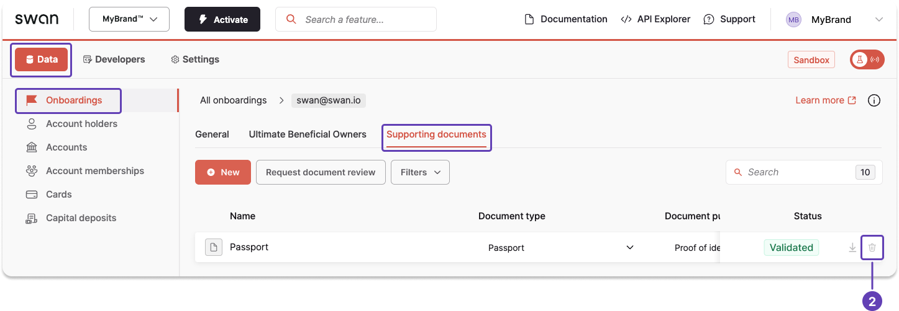

# Delete a document

You might want to delete a document if the incorrect document was uploaded or the wrong file was shared.
Both you and your end users can delete uploaded documents.

There are two methods you can use to delete documents.
Note that your end users can delete documents through their banking interface.

1. **Run an API mutation** to delete the document.
1. Delete it directly from your **Dashboard**.

:::tip Prerequisites
If you're using the API, you'll need either a [project access token](../../../developers/using-api/authentication/index.mdx#tokens-project), or a [user access token](../../../developers/using-api/authentication/index.mdx#tokens-user) for the associated user.
Also, the [document must have the status](./index.mdx#document-statuses) `Uploaded`.
:::

## API guide

1. First, [retrieve the document ID](./guide-get-info.mdx).
1. Call the `deleteSupportingDocument` mutation.
1. Enter the document ID retrieved in step 1.
1. Add optional messages to the success payload, either for validation or in case of rejection.

### Mutation

🔎 [Open the mutation in API Explorer](https://explorer.swan.io/?query=bXV0YXRpb24gRGVsZXRlRG9jdW1lbnQgewogIGRlbGV0ZVN1cHBvcnRpbmdEb2N1bWVudChpbnB1dDogeyBpZDogIiRET0NVTUVOVF9JRCIgfSkgewogICAgLi4uIG9uIERlbGV0ZVN1cHBvcnRpbmdEb2N1bWVudFN1Y2Nlc3NQYXlsb2FkIHsKICAgICAgaWQKICAgIH0KICB9Cn0K&tab=api)

```graphql {2} showLineNumbers
mutation DeleteDocument {
  deleteSupportingDocument(input: { id: "$DOCUMENT_ID" }) {
    ... on DeleteSupportingDocumentSuccessPayload {
      id
    }
  }
}
```

### Payload

If the deletion is successful, the API Explorer returns the document ID.
You can confirm that the document no longer exists by checking your Dashboard.

```json {4} showLineNumbers
{
  "data": {
    "deleteSupportingDocument": {
      "id": "f193d0f6-fe7e-4592-9b5f-bce46a968553"
    }
  }
}
```

## Dashboard

Use the Dashboard to delete a document.

1. Go to **Data** > **Onboardings** > **Supporting documents**.
1. Click the trash icon for any document on your list. 

