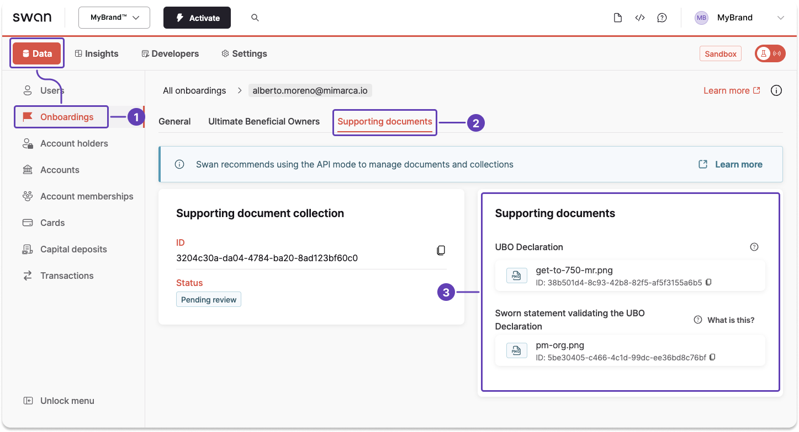

import Tabs from '@theme/Tabs';
import TabItem from '@theme/TabItem';

# Get information about a collection or document

There are two methods you can use to get information about a collection or a document.

1. **Run an API query** to get information about collections and documents.
1. Get information about individual documents from your **Dashboard**.

## API guide

You can use either the user's **onboarding ID** or, if their onboarding is `Finalized`, their **account holder ID**, to get information about a supporting document collection or an individual document.

1. First, [retrieve the required onboarding ID](../overview/guide-get-info.mdx).
1. Call the `onboarding` query.
1. Enter the onboarding ID retrieved in step 1.
1. Add all objects you need to review.
    - In the following example, refer to the highlighted lines to check the account holder ID, review when the document was last updated (`updatedAt`), and collect information about document status.
1. **▶ Run** your query.

:::info Onboarding or account holder ID
This guide uses the onboarding ID.
If the onboarding is `Finalized`, use the `accountHolder` query to get the account holder ID instead.
:::

### Query

🔎 [Open the query in API Explorer](https://explorer.swan.io?query=cXVlcnkgZ2V0Q29sbGVjdGlvbkluZm8gewogIHN1cHBvcnRpbmdEb2N1bWVudENvbGxlY3Rpb24oaWQ6ICIkU1VQUE9SVElOR19ET0NVTUVOVF9DT0xMRUNUSU9OX0lEIikgewogICAgaWQKICAgIHVwZGF0ZWRBdAogICAgYWNjb3VudEhvbGRlciB7CiAgICAgIGlkCiAgICB9CiAgICBvbmJvYXJkaW5nIHsKICAgICAgaWQKICAgIH0KICAgIHN1cHBvcnRpbmdEb2N1bWVudHMgewogICAgICBjcmVhdGVkQXQKICAgICAgaWQKICAgICAgc3VwcG9ydGluZ0RvY3VtZW50UHVycG9zZQogICAgICBzdXBwb3J0aW5nRG9jdW1lbnRUeXBlCiAgICAgIHVwZGF0ZWRBdAogICAgICBzdGF0dXNJbmZvIHsKICAgICAgICBzdGF0dXMKICAgICAgICAuLi4gb24gU3VwcG9ydGluZ0RvY3VtZW50Tm90VXBsb2FkZWRTdGF0dXNJbmZvIHsKICAgICAgICAgIF9fdHlwZW5hbWUKICAgICAgICAgIHN0YXR1cwogICAgICAgIH0KICAgICAgICAuLi4gb24gU3VwcG9ydGluZ0RvY3VtZW50UmVmdXNlZFN0YXR1c0luZm8gewogICAgICAgICAgX190eXBlbmFtZQogICAgICAgICAgZG93bmxvYWRVcmwKICAgICAgICAgIGZpbGVuYW1lCiAgICAgICAgICByZWFzb24KICAgICAgICAgIHJlZnVzZWRBdAogICAgICAgICAgc3RhdHVzCiAgICAgICAgfQogICAgICAgIC4uLiBvbiBTdXBwb3J0aW5nRG9jdW1lbnRVcGxvYWRlZFN0YXR1c0luZm8gewogICAgICAgICAgX190eXBlbmFtZQogICAgICAgICAgZG93bmxvYWRVcmwKICAgICAgICAgIGZpbGVuYW1lCiAgICAgICAgICBzdGF0dXMKICAgICAgICB9CiAgICAgICAgLi4uIG9uIFN1cHBvcnRpbmdEb2N1bWVudFZhbGlkYXRlZFN0YXR1c0luZm8gewogICAgICAgICAgX190eXBlbmFtZQogICAgICAgICAgZG93bmxvYWRVcmwKICAgICAgICAgIGZpbGVuYW1lCiAgICAgICAgICB2YWxpZGF0ZWRBdAogICAgICAgICAgc3RhdHVzCiAgICAgICAgfQogICAgICAgIC4uLiBvbiBTdXBwb3J0aW5nRG9jdW1lbnRXYWl0aW5nRm9yVXBsb2FkU3RhdHVzSW5mbyB7CiAgICAgICAgICBfX3R5cGVuYW1lCiAgICAgICAgICBzdGF0dXMKICAgICAgICAgIHVwbG9hZCB7CiAgICAgICAgICAgIHVybAogICAgICAgICAgICBmaWVsZHMgewogICAgICAgICAgICAgIGtleQogICAgICAgICAgICAgIHZhbHVlCiAgICAgICAgICAgIH0KICAgICAgICAgIH0KICAgICAgICB9CiAgICAgIH0KICAgIH0KICB9Cn0K&tab=api)

```graphql {5-6,16,18} showLineNumbers
query getCollectionInfo {
  supportingDocumentCollection(id: "$SUPPORTING_DOCUMENT_COLLECTION_ID") {
    id
    updatedAt
    accountHolder {
      id
    }
    onboarding {
      id
    }
    supportingDocuments {
      createdAt
      id
      supportingDocumentPurpose
      supportingDocumentType
      updatedAt
      statusInfo {
        status
        ... on SupportingDocumentNotUploadedStatusInfo {
          __typename
          status
        }
        ... on SupportingDocumentRefusedStatusInfo {
          __typename
          downloadUrl
          filename
          reason
          refusedAt
          status
        }
        ... on SupportingDocumentUploadedStatusInfo {
          __typename
          downloadUrl
          filename
          status
        }
        ... on SupportingDocumentValidatedStatusInfo {
          __typename
          downloadUrl
          filename
          validatedAt
          status
        }
        ... on SupportingDocumentWaitingForUploadStatusInfo {
          __typename
          status
          upload {
            url
            fields {
              key
              value
            }
          }
        }
      }
    }
  }
}

```

### Payload

In the payload, you learn that this user isn't an account holder yet (line 7).

Additionally, the document was last updated `2023-06-20` (line 18) with the status `Uploaded` (line 20).

```json {6-7,18,20} showLineNumbers
{
  "data": {
    "supportingDocumentCollection": {
      "id": "$SUPPORTING_DOCUMENT_COLLECTION_ID",
      "updatedAt": "2023-12-18T10:47:58.591Z",
      "accountHolder": {
        "id": null
      },
      "onboarding": {
        "id": "$ONBOARDING_ID"
      },
      "supportingDocuments": [
        {
          "createdAt": "2023-06-20T14:33:40.780Z",
          "id": "$DOCUMENT_ID",
          "supportingDocumentPurpose": "ProofOfIdentity",
          "supportingDocumentType": "Passport",
          "updatedAt": "2023-06-20T14:33:45.255Z",
          "statusInfo": {
            "status": "Uploaded",
            "__typename": "SupportingDocumentUploadedStatusInfo",
            "downloadUrl": "",
            "filename": "Passport"
          }
        }
      ]
    }
  }
}
```

## Dashboard

Use the Dashboard to review information about a document.

1. Go to **Data** > **Onboardings**.
1. Open an onboarding, then go to **Supporting documents**.
1. Review all information available for the document by scrolling horizontally. 

