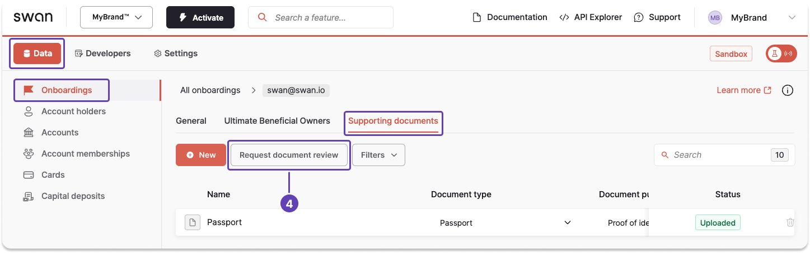

# Request a collection review

After all required supporting documents are uploaded, you can ask Swan to review your collection **using the API** or on your **Dashboard**.

:::tip Prerequisites
The [collection must have the status](./index.mdx#collection-statuses) `Waiting for document`, and there must be at least one document in the collection with the status `Uploaded`.
:::

## API guide

1. First, [retrieve the collection ID](./guide-get-info.mdx) (`supportingDocumentCollectionId`).
1. Call the `requestSupportingDocumentCollectionReview` mutation.
1. Enter the collection ID retrieved in step 1.
1. Add optional messages to the payload, either for validation or in case of rejection.

### Mutation

🔎 [Open the mutation in API Explorer](https://explorer.swan.io?query=bXV0YXRpb24gUmVxdWVzdENvbGxlY3Rpb25SZXZpZXcgewogIHJlcXVlc3RTdXBwb3J0aW5nRG9jdW1lbnRDb2xsZWN0aW9uUmV2aWV3KAogICAgaW5wdXQ6IHsKICAgICAgc3VwcG9ydGluZ0RvY3VtZW50Q29sbGVjdGlvbklkOiAiJENPTExFQ1RJT05fSUQiCiAgICB9CiAgKSB7CiAgICAuLi4gb24gUmVxdWVzdFN1cHBvcnRpbmdEb2N1bWVudENvbGxlY3Rpb25SZXZpZXdTdWNjZXNzUGF5bG9hZCB7CiAgICAgIF9fdHlwZW5hbWUKICAgICAgc3VwcG9ydGluZ0RvY3VtZW50Q29sbGVjdGlvbiB7CiAgICAgICAgaWQKICAgICAgICBzdGF0dXNJbmZvIHsKICAgICAgICAgIHN0YXR1cwogICAgICAgIH0KICAgICAgfQogICAgfQogICAgLi4uIG9uIEZvcmJpZGRlblJlamVjdGlvbiB7CiAgICAgIF9fdHlwZW5hbWUKICAgICAgbWVzc2FnZQogICAgfQogICAgLi4uIG9uIFN1cHBvcnRpbmdEb2N1bWVudENvbGxlY3Rpb25Ob3RGb3VuZFJlamVjdGlvbiB7CiAgICAgIGlkCiAgICAgIG1lc3NhZ2UKICAgIH0KICAgIC4uLiBvbiBTdXBwb3J0aW5nRG9jdW1lbnRDb2xsZWN0aW9uU3RhdHVzTm90QWxsb3dlZFJlamVjdGlvbiB7CiAgICAgIF9fdHlwZW5hbWUKICAgICAgbWVzc2FnZQogICAgICBuZXdTdGF0dXMKICAgICAgb2xkU3RhdHVzCiAgICB9CiAgfQp9Cg%3D%3D&tab=api)

```graphql {3,5-10} showLineNumbers
mutation RequestCollectionReview {
  requestSupportingDocumentCollectionReview(
    input: { supportingDocumentCollectionId: "$COLLECTION_ID" }
  ) {
    ... on RequestSupportingDocumentCollectionReviewSuccessPayload {
      __typename
      supportingDocumentCollection {
        id
        statusInfo {
          status
        }
      }
    }
    ... on ForbiddenRejection {
      __typename
      message
    }
    ... on SupportingDocumentCollectionNotFoundRejection {
      id
      message
    }
    ... on SupportingDocumentCollectionStatusNotAllowedRejection {
      __typename
      message
      newStatus
      oldStatus
    }
  }
}
```

### Payload

Notice the status `PendingReview`.
You can also confirm this on your Dashboard—there should be an infobox in the supporting documents tab for this onboarding.

```json {6,8} showLineNumbers
{
  "data": {
    "requestSupportingDocumentCollectionReview": {
      "__typename": "RequestSupportingDocumentCollectionReviewSuccessPayload",
      "supportingDocumentCollection": {
        "id": "b52c51b4-8a23-45a2-b77a-e6d691f4578c",
        "statusInfo": {
          "status": "PendingReview"
        }
      }
    }
  }
}
```

## Dashboard

Use the Dashboard to request a review of your supporting document collection.

1. On your Dashboard, go to **Data** > **Onboardings**.
1. Open the onboarding for which you'd like to request a collection review.
1. Open the **Supporting documents** tab.
1. Click **Request document review** to begin the review process.
1. A confirmation modal will appear. Click **Confirm** to finalize your request.



:::caution No updates while pending review
As soon as you click **Confirm**, you can no longer upload additional documents or change uploaded documents until the review is complete.
:::