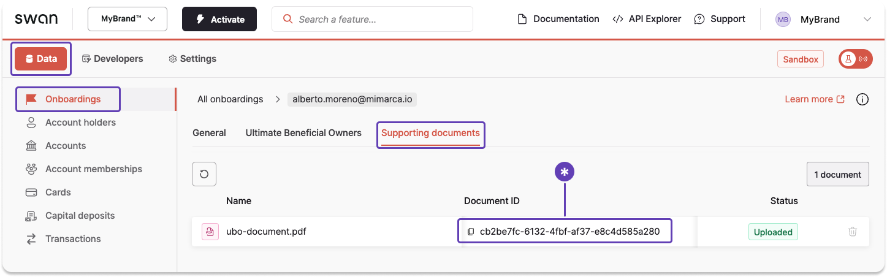

import Tabs from '@theme/Tabs';
import TabItem from '@theme/TabItem';

# Retrieve information about a collection or document

There are two methods you can use to get information about a collection or a document.

1. **Run an API query** to get information about collections and documents.
1. Get information about individual documents from your **Dashboard**.

## API guide

You can use either the user's **onboarding ID** or, if their onboarding is `Finalized`, their **account holder ID**, to get information about a supporting document collection or an individual document.

:::info Onboarding or account holder ID
This guide uses the onboarding ID.
If the onboarding is `Finalized`, use the `accountHolder` query with the account holder ID instead.
:::

1. First, [retrieve the required onboarding ID](../overview/guide-retrieve-onboarding-id.mdx).
1. In the API Explorer, add the `onboarding` query.
1. Enter the onboarding ID retrieved in step 1.
1. Choose to query either collection (line 3) or document (line 5) information, or keep both.
1. Click **▶ Run**.

### Query

🔎 [Open the query in API Explorer](https://explorer.swan.io?query=cXVlcnkgRG9jdW1lbnRDb2xsZWN0aW9uSW5mbyB7CiAgb25ib2FyZGluZyhpZDogIiRVU0VSX09OQk9BUkRJTkdfSUQiKSB7CiAgICBzdXBwb3J0aW5nRG9jdW1lbnRDb2xsZWN0aW9uIHsKICAgICAgaWQKICAgICAgc3VwcG9ydGluZ0RvY3VtZW50cyB7CiAgICAgICAgaWQKICAgICAgICBzdXBwb3J0aW5nRG9jdW1lbnRQdXJwb3NlCiAgICAgICAgc3VwcG9ydGluZ0RvY3VtZW50VHlwZQogICAgICB9CiAgICB9CiAgfQp9Cg%3D%3D&tab=api)

```graphql {2,3,5} showLineNumbers
query DocumentCollectionInfo {
  onboarding(id: "$USER_ONBOARDING_ID") {
    supportingDocumentCollection {
      id
      supportingDocuments {
        id
        supportingDocumentPurpose
        supportingDocumentType
      }
    }
  }
}
```

### Payload

The API Explorer returns the collection or document ID.

```json {5,8} showLineNumbers
{
  "data": {
    "onboarding": {
      "supportingDocumentCollection": {
        "id": "b52c51b4-8a23-45a2-b77a-e6d691f4578c",
        "supportingDocuments": [
          {
            "id": "03a5601d-f9cc-448d-ad26-02aa04e5688a",
            "supportingDocumentPurpose": "ProofOfIndividualAddress",
            "supportingDocumentType": "HomeInsurance"
          }
        ]
      }
    }
  }
}
```

## Dashboard

Use the Dashboard to get a document ID.

1. Go to **Data** > **Onboardings** > **Supporting documents**.
1. Scroll horizontally to locate the document ID, then click to copy. 

