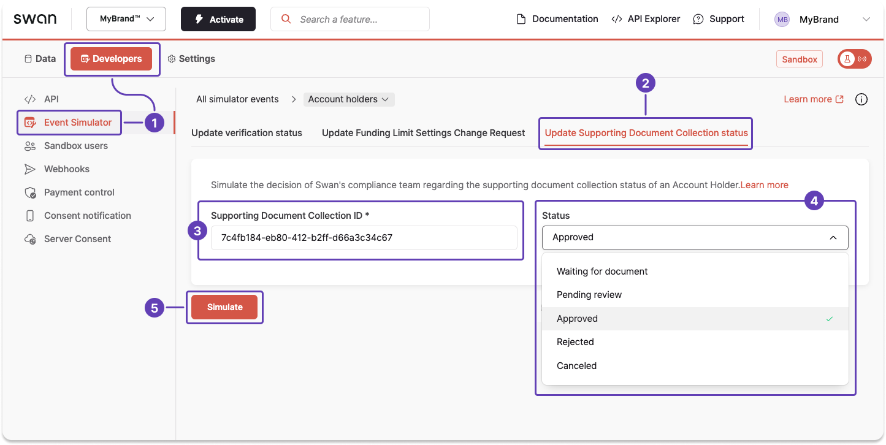
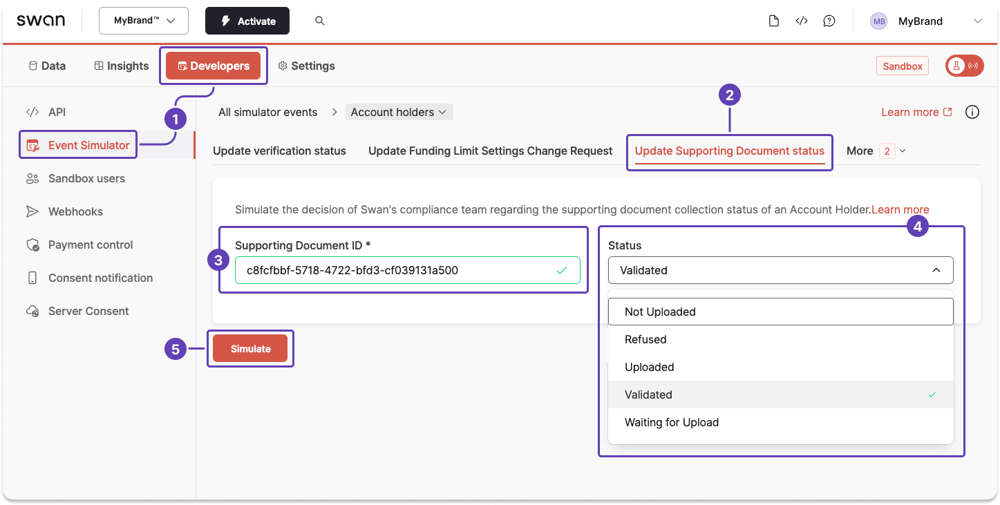

import Tabs from '@theme/Tabs';
import TabItem from '@theme/TabItem';

# Sandbox: Supporting document collection

## Simulate updating a collection status

### Step 1: Get the collection ID

Get the ID for the supporting document collection using either the **user's onboarding ID** or, if their onboarding is `Finalized`, their **account holder ID**.

<Tabs>
<TabItem value="onboardingId" label="Onboarding ID">

🔎 [Open the query in API Explorer](https://explorer.swan.io?query=cXVlcnkgZ2V0Q29sbGVjdGlvbklkIHsKICBvbmJvYXJkaW5nKGlkOiAiJE9OQk9BUkRJTkdfSUQiKSB7CiAgICBzdXBwb3J0aW5nRG9jdW1lbnRDb2xsZWN0aW9uIHsKICAgICAgaWQKICAgICAgcmVxdWlyZWRTdXBwb3J0aW5nRG9jdW1lbnRQdXJwb3NlcyB7CiAgICAgICAgbmFtZQogICAgICB9CiAgICAgIHN0YXR1c0luZm8gewogICAgICAgIHN0YXR1cwogICAgICB9CiAgICB9CiAgfQp9Cg%3D%3D&tab=api)

```graphql {2} showLineNumbers
query getCollectionId {
  onboarding(id: "$USER_ONBOARDING_ID") {
    supportingDocumentCollection {
      id
      requiredSupportingDocumentPurposes {
        name
      }
      statusInfo {
        status
      }
    }
  }
}
```

</TabItem>
<TabItem value="accountHolderId" label="Account holder ID">

🔎 [Open the query in API Explorer](https://explorer.swan.io?query=cXVlcnkgZ2V0Q29sbGVjdGlvbklkIHsKICBhY2NvdW50SG9sZGVyKGlkOiAiJEFDQ09VTlRfSE9MREVSX0lEIikgewogICAgc3VwcG9ydGluZ0RvY3VtZW50Q29sbGVjdGlvbnMgewogICAgICBlZGdlcyB7CiAgICAgICAgbm9kZSB7CiAgICAgICAgICByZXF1aXJlZFN1cHBvcnRpbmdEb2N1bWVudFB1cnBvc2VzIHsKICAgICAgICAgICAgbmFtZQogICAgICAgICAgfQogICAgICAgICAgaWQKICAgICAgICB9CiAgICAgIH0KICAgIH0KICB9Cn0K&tab=api)

```graphql {2,9} showLineNumbers
query getCollectionId {
  accountHolder(id: "$USER_ACCOUNT_HOLDER_ID") {
    supportingDocumentCollections {
      edges {
        node {
          requiredSupportingDocumentPurposes {
            name
          }
          id
        }
      }
    }
  }
}
```

</TabItem>
</Tabs>

### Step 2: Update the collection status

With the supporting document collection ID, use the Event Simulator to change the [supporting document collection status](./index.mdx#collection-statuses) to any available status.

1. On your Dashboard, go to **Developers** > **Event Simulator**.
1. Open **Account holders**, then go to the **Update Supporting Document Collection status** tab.
1. Copy the document collection ID from the success payload you received during step 1, then paste it into the **Supporting Document Collection ID** field in the Event Simulator.
1. From the dropdown, choose the status you'd like to simulate.
1. Click **Simulate**.



## Simulate updating a document status

### Step 1: Get the document ID

Get the ID for the supporting document using either the **user's onboarding ID** or, if their onboarding is `Finalized`, their **account holder ID**.

<Tabs>
<TabItem value="onboardingId" label="Onboarding ID">

🔎 [Open the query in API Explorer](https://explorer.swan.io?query=cXVlcnkgZ2V0RG9jdW1lbnRJZCB7CiAgb25ib2FyZGluZyhpZDogIiRVU0VSX09OQk9BUkRJTkdfSUQiKSB7CiAgICBzdXBwb3J0aW5nRG9jdW1lbnRDb2xsZWN0aW9uIHsKICAgICAgc3VwcG9ydGluZ0RvY3VtZW50cyB7CiAgICAgICAgaWQKICAgICAgICBzdGF0dXNJbmZvIHsKICAgICAgICAgIHN0YXR1cwogICAgICAgIH0KICAgICAgfQogICAgfQogIH0KfQo%3D&tab=api)

```graphql {2} showLineNumbers
query getDocumentId {
  onboarding(id: "$USER_ONBOARDING_ID") {
    supportingDocumentCollection {
      supportingDocuments {
        id
        statusInfo {
          status
        }
      }
    }
  }
}
```

</TabItem>
<TabItem value="accountHolderId" label="Account holder ID">

🔎 [Open the query in API Explorer](https://explorer.swan.io?query=cXVlcnkgZ2V0RG9jdW1lbnRJZCB7CiAgYWNjb3VudEhvbGRlcihpZDogIiRVU0VSX0FDQ09VTlRfSE9MREVSX0lEIikgewogICAgc3VwcG9ydGluZ0RvY3VtZW50Q29sbGVjdGlvbnMgewogICAgICBlZGdlcyB7CiAgICAgICAgbm9kZSB7CiAgICAgICAgICBzdXBwb3J0aW5nRG9jdW1lbnRzIHsKICAgICAgICAgICAgaWQKICAgICAgICAgICAgc3RhdHVzSW5mbyB7CiAgICAgICAgICAgICAgc3RhdHVzCiAgICAgICAgICAgIH0KICAgICAgICAgIH0KICAgICAgICB9CiAgICAgIH0KICAgIH0KICB9Cn0K&tab=api)

```graphql {2} showLineNumbers
query getDocumentId {
  accountHolder(id: "$USER_ACCOUNT_HOLDER_ID") {
    supportingDocumentCollections {
      edges {
        node {
          supportingDocuments {
            id
            statusInfo {
              status
            }
          }
        }
      }
    }
  }
}
```

</TabItem>
</Tabs>

### Step 2: Update the document status

#### Event Simulator

With the supporting document ID, use the Event Simulator to change the [document status](./index.mdx#document-statuses) to any available status.

1. On your Dashboard, go to **Developers** > **Event Simulator**.
1. Open **Account holders**, then go to the **Update Supporting Document status** tab.
1. Copy the document ID from the success payload you received during step 1, then paste it into the **Supporting Document ID** field in the Event Simulator.
1. From the dropdown, choose the status you'd like to simulate.
1. Click **Simulate**.



#### Testing API

You can also simulate a document status update with the Testing API.

🔎 [Open the mutation in API Explorer](https://explorer.swan.io?query=bXV0YXRpb24gU2ltdWxhdGVEb2N1bWVudFN0YXR1c1VwZGF0ZSB7CiAgdXBkYXRlU3VwcG9ydGluZ0RvY3VtZW50U3RhdHVzKAogICAgaW5wdXQ6IHsgc3VwcG9ydGluZ0RvY3VtZW50SWQ6ICIkRE9DVU1FTlRfSUQiLCBzdGF0dXM6IFZhbGlkYXRlZCB9CiAgKSB7CiAgICAuLi4gb24gVXBkYXRlU3VwcG9ydGluZ0RvY3VtZW50U3RhdHVzU3VjY2Vzc1BheWxvYWQgewogICAgICBfX3R5cGVuYW1lCiAgICAgIHN1cHBvcnRpbmdEb2N1bWVudCB7CiAgICAgICAgY3JlYXRlZEF0CiAgICAgICAgaWQKICAgICAgICBzdGF0dXNJbmZvIHsKICAgICAgICAgIHN0YXR1cwogICAgICAgIH0KICAgICAgICBzdXBwb3J0aW5nRG9jdW1lbnRQdXJwb3NlCiAgICAgICAgc3VwcG9ydGluZ0RvY3VtZW50VHlwZQogICAgICAgIHVwZGF0ZWRBdAogICAgICB9CiAgICB9CiAgICAuLi4gb24gRm9yYmlkZGVuUmVqZWN0aW9uIHsKICAgICAgX190eXBlbmFtZQogICAgICBtZXNzYWdlCiAgICB9CiAgICAuLi4gb24gSW50ZXJuYWxFcnJvclJlamVjdGlvbiB7CiAgICAgIF9fdHlwZW5hbWUKICAgICAgbWVzc2FnZQogICAgfQogICAgLi4uIG9uIFN1cHBvcnRpbmdEb2N1bWVudENvbGxlY3Rpb25Ob3RGb3VuZFJlamVjdGlvbiB7CiAgICAgIGlkCiAgICAgIG1lc3NhZ2UKICAgIH0KICAgIC4uLiBvbiBTdXBwb3J0aW5nRG9jdW1lbnRDb2xsZWN0aW9uU3RhdHVzRG9lc05vdEFsbG93VXBkYXRlUmVqZWN0aW9uIHsKICAgICAgX190eXBlbmFtZQogICAgICBtZXNzYWdlCiAgICAgIHN1cHBvcnRpbmdEb2N1bWVudENvbGxlY3Rpb25TdGF0dXMKICAgIH0KICAgIC4uLiBvbiBTdXBwb3J0aW5nRG9jdW1lbnROb3RGb3VuZFJlamVjdGlvbiB7CiAgICAgIGlkCiAgICAgIG1lc3NhZ2UKICAgIH0KICAgIC4uLiBvbiBTdXBwb3J0aW5nRG9jdW1lbnRTdGF0dXNEb2VzTm90QWxsb3dVcGRhdGVSZWplY3Rpb24gewogICAgICBfX3R5cGVuYW1lCiAgICAgIG1lc3NhZ2UKICAgICAgc3RhdHVzCiAgICB9CiAgICAuLi4gb24gVmFsaWRhdGlvblJlamVjdGlvbiB7CiAgICAgIF9fdHlwZW5hbWUKICAgICAgbWVzc2FnZQogICAgfQogIH0KfQo%3D&tab=test-api)

```graphql {3} showLineNumbers
mutation SimulateDocumentStatusUpdate {
  updateSupportingDocumentStatus(
    input: { supportingDocumentId: "$DOCUMENT_ID", status: Validated }
  ) {
    ... on UpdateSupportingDocumentStatusSuccessPayload {
      __typename
      supportingDocument {
        createdAt
        id
        statusInfo {
          status
        }
        supportingDocumentPurpose
        supportingDocumentType
        updatedAt
      }
    }
  }
}
```

```json title="Payload" showLineNumbers
{
  "data": {
    "updateSupportingDocumentStatus": {
      "__typename": "UpdateSupportingDocumentStatusSuccessPayload",
      "supportingDocument": {
        "createdAt": "2024-02-15T10:08:32.792Z",
        "id": "$DOCUMENT_ID",
        "statusInfo": {
          "status": "Validated"
        },
        "supportingDocumentPurpose": "AssociationRegistration",
        "supportingDocumentType": "Other",
        "updatedAt": "2024-03-11T16:24:22.041Z"
      }
    }
  }
}
```