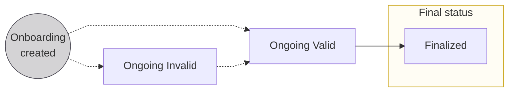
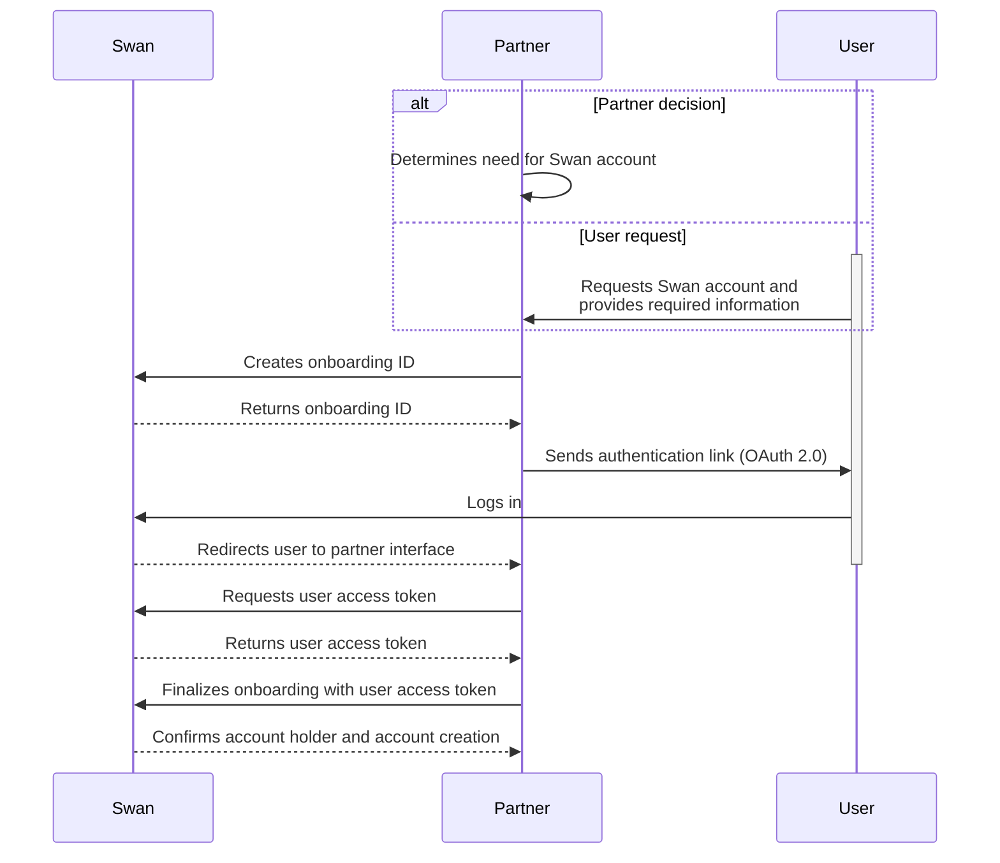

# Account onboarding

## Overview {#overview}

Account onboarding is, at its core, the **process to create [account holders](./account-holders/index.mdx)**.

One end result of onboarding is also creating the first account for the new account holder.
Account holders complete a new onboarding to open another account.

:::info Cross reference
During onboarding, users also [complete an account holder verification](./account-holders/index.mdx#verification-process) process and [authenticate](../../developers/using-api/authentication/index.mdx) (log in) for the first time.
They might also [sign up for Swan](../users/index.mdx#signup) if they haven't already.
:::

### Types of onboarding {#types}

There are two types of onboarding, individual and company, directly linked to the two types of accounts Swan offers.
Each onboarding has a unique `onboardingId`.

The individual and company onboarding processes are similar.
However, they're split in the documentation to prevent mixing up small but important details.

| Type | Explanation |
| --- | --- |
| [Individual onboarding](./individual/index.mdx) | <ul><li>Create a new **individual** account holder.</li><li>Open a new **individual** Swan account for that account holder.</li></ul> |
| [Company onboarding](./company/index.mdx) | <ul><li>Create a new **company** account holder.</li><li>Open a new **company** Swan account for that account holder.</li></ul> |

:::tip Swan Banking Frontend
If you'd like to customize the onboarding experience for your users (while respecting local regulations), check out the open source [Swan Banking Frontend](https://swan-io.github.io/swan-partner-frontend/specs/onboarding/).
:::

### Purpose of onboarding {#purpose}

Completing the onboarding process serves several purposes.

1. A new **account holder** is created.
1. The account holder's **Swan account** is created.
1. The person who performed the onboarding process becomes the legal representative of the account. They're also the account's first member with [full permissions](../accounts/memberships/index.mdx).
1. Your relationship with the account holder is stored in the `partnershipStatusInfofield` of the `account` object.

## Onboarding links {#links}

Consider a few details about Swan onboarding links.

1. You can **generate unique links** using the **API**, or use **public links** from your **Dashboard**. Learn how to generate onboarding links in the guides for [individuals](./individual/guide-create.mdx) and [companies](./company/guide-create.mdx).
1. Unique **onboarding links are single-use**. If you get an HTTP 500 Internal Server Error when submitting the onboarding form, it's because an onboarding was already finalized using that link. You need to generate a new link.
1. The true purpose of the `state` parameter is to prevent Cross-Site Request Forgery (CSRF) and related attacks. Consider using it to your advantage. It includes your user's onboarding ID by default, so you can save this onboarding ID when generating the link. 

import PublicOnboardingLinks from './_public-onboarding-links.mdx';

<PublicOnboardingLinks />

## Requirements {#requirements}

### Country requirements {#country-reqs}

Onboarding is a **highly localized experience**.
Everything from **what to include in your API request** to how to ask **users to verify their identity** to whether Swan **requires certain ID numbers or documents** depends on the [account country](../accounts/index.mdx#account-country).

Account onboarding country requirements are described in the [individual](individual/index.mdx#country-reqs) and [company](company/index.mdx#country-reqs) onboarding sections.
Please follow the requirements for your target countries closely.

### Supporting documents {#documents}

Collecting [supporting documents](../accounts/documents/index.mdx) impacts multiple elements of the onboarding process.
Consider these steps, including the statuses of both [account holder verification](./account-holders/index.mdx#verification-process-statuses) and the [supporting document collection](../accounts/documents/index.mdx#collection-statuses).

<table>
  <tr>
    <th>Step</th>
    <th>Event</th>
    <th>Account holder verification status</th>
    <th>Supporting document collection status</th>
  </tr>
  <tr>
    <td>
1
</td>
    <td>Onboarding created</td>
    <td>
Not yet created
</td>
    <td>
`WaitingForDocument`
</td>
  </tr>
  <tr>
    <td>
2
</td>
    <td>Onboarding finalized</td>
    <td>
`NotStarted`
</td>
    <td>
`PendingReview`
</td>
  </tr>
  <tr>
    <td>
3
</td>
    <td>Legal representative completes [identification](../users/identifications/index.mdx)</td>
    <td>
`Pending`
</td>
    <td>
`PendingReview`
</td>
  </tr>
  <tr>
    <td>
4
</td>
    <td>Swan requests [supporting documents](../accounts/documents/index.mdx)  💡 *[Subscribe to the webhook](../../developers/using-api/webhooks.mdx) `supportingDocumentCollection.updated`. You'll be notified when a request is sent to collect documents.*</td>
    <td>
`WaitingForInformation`
</td>
    <td>
`WaitingForDocuments`
</td>
  </tr>
  <tr>
    <td>
5
</td>
    <td>Partner uploads new documents  💡 *If needed, [get a list of required documents](./overview/guide-get-list.mdx). Then, [upload missing documents](../accounts/documents/guide-upload-onboarding.mdx).*</td>
    <td>
`WaitingForInformation`
</td>
    <td>
`WaitingForDocuments`
</td>
  </tr>
  <tr>
    <td>
6
</td>
    <td>Partner requests a collection review  💡 *Partners (you) need to request a supporting document collection review after all supporting documents are uploaded. [Request a review](../accounts/documents/guide-request-collection-review.mdx) with the API or from your Dashboard.*</td>
    <td>
`Pending`
</td>
    <td>
`PendingReview`
</td>
  </tr>
  <tr>
    <td>
7
</td>
    <td>Swan reviews supporting documents</td>
    <td>
`Pending`
</td>
    <td>
`PendingReview`
</td>
  </tr>
  <tr>
    <td rowspan="2">
8
</td>
    <td>(a) Swan **approves** the account holder</td>
    <td>
`Verified`
</td>
    <td>
`Approved`
</td>
  </tr>
  <tr>
    <td>(b) Swan **needs more documents** to verify the account holder  💡 *[Get the list of required documents](./overview/guide-get-list.mdx) and review the rejection reason. Then, return to step 4.*</td>
    <td>
`WaitingForInformation`
</td>
    <td>
`WaitingForDocuments`
</td>
  </tr>
</table>

## Statuses {#statuses}

| Status | Explanation |
|---|---|
| `Ongoing (Invalid)` | <ul><li>This is the first status assigned to an onboarding when **using the frontend**.</li><li>If using the **API**, this is the first status if **not all required information** is included with your mutation.</li><li>Status might change to `Invalid` if required information is removed or if some information is incorrect.</li></ul>**Next step**: Submit or update required information to advance to `Ongoing (Valid)` (both you and the end user can submit or update information) |
| `Ongoing (Valid)` | <ul><li>This is the first status assigned to an onboarding if **using the API** and you **included all required information** with your mutation.</li><li>Status changes to `Valid` when missing required information is submitted or if incorrect information is updated.</li></ul>**Next step**: User completes form, clicks "Finalize," and provides consent to complete the onboarding process |
| `Finalized` | Onboarding completed |

## API sequence diagram {#diagram}

Review this sequence diagram that depicts the onboarding flow with the API.

## Notifications {#notifications}

import NotificationBranding from '../partials/_notification-branding.mdx';

Swan sends email notifications to users during the onboarding process.

<NotificationBranding />

### Your account terms and conditions {#notification-terms}

When a user finalizes their onboarding, Swan automatically sends an email containing Swan's terms and conditions along with your Partnership Conditions.

**Trigger**: Automatic when the onboarding status switches to `Finalized`.

**Configuration**: This notification is always sent by Swan and can't be configured. The recipient is the email address provided during the onboarding flow by the account's legal representative, and the language used is the one selected during the onboarding flow.

**Template**: This notification always uses your project logo and accent color.

## Guides {#guides}

The following guides are common to the individual and company onboarding processes.

* [Get information about an onboarding](./overview/guide-get-info.mdx)
* [Get a list of required onboarding documents](./overview/guide-get-list.mdx)
* [Export onboarding data](./overview/guide-export.mdx)
* [Finalize an onboarding](./overview/guide-finalize.mdx)