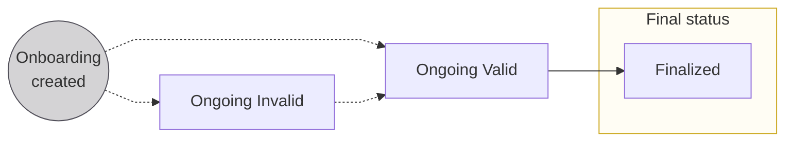
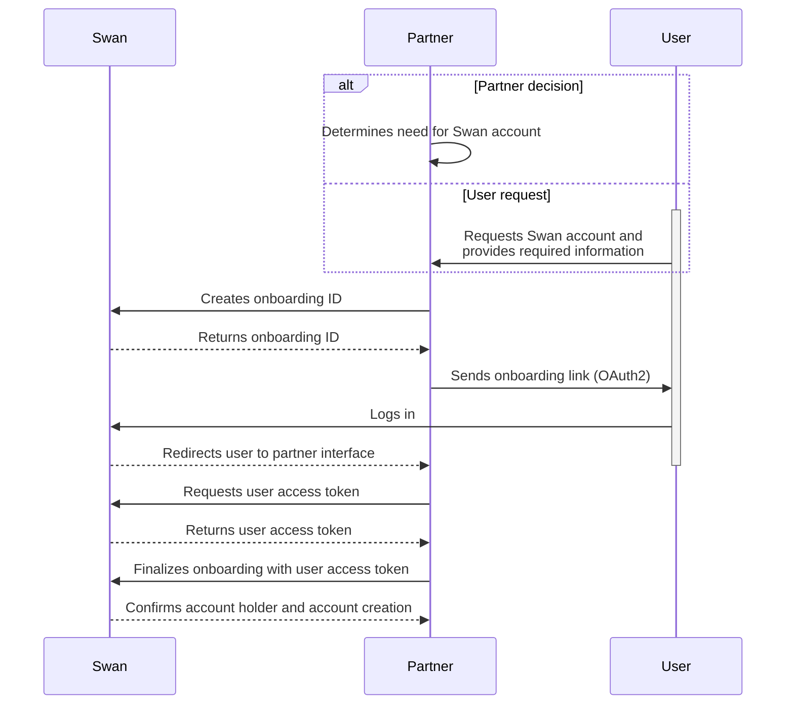

# Account onboarding

Account onboarding is, at its core, the **process to create [account holders](./account-holders/index.mdx)**.

One end result of onboarding is **also creating the first account** for the new account holder.
You can create as many accounts for each account holder as required.

:::info Cross reference
During onboarding, users also [complete an identity verification](./account-holders/index.mdx#verification-process) process, [consent to open the account](../users/consent/index.mdx), and [authenticate](https://docs.swan.io/guide/create-a-new-account#first-authentication-and-callback) (log in) for the first time.
:::

## Types of onboarding {#types}

There are two types of onboarding, directly linked to the two types of accounts Swan offers.
Each onboarding has a unique `onboardingId`.

* **Individual onboarding** is the process of creating a new individual account holder, and opening a new Swan account for that account holder.
* **Company onboarding** is the process of creating a new company account holder, and opening a new Swan account for that account holder.

The individual and company onboarding processes are similar.
However, they're split in the documentation to prevent mixing up small but important details.

:::tip Swan Banking Frontend
If you'd like to customize the onboarding experience for your users (while respecting local regulations), check out the open source [Swan Banking Frontend](https://swan-io.github.io/swan-partner-frontend/specs/onboarding/).
:::

## Purpose of onboarding {#purpose}

Completing the onboarding process serves several purposes.

1. **Account holder** is created with the status `Enabled`.
1. Account holder's **account** is created.
1. The person who performed the onboarding process becomes the legal representative of the account. They're also the account's first member with [full permissions](https://docs.swan.io/concept/account-membership#rights-management).
1. Your relationship with the account holder is stored in the `partnershipStatusInfofield` of the `account` object.

## Onboarding links {#links}

Consider a few details about Swan onboarding links.

1. You can **generate unique links** using the **API**, or use **public links** from your **Dashboard**. Learn how to generate onboarding links in the guides for [individuals](./individual/guide-create.mdx) and [companies](./company/guide-create.mdx).
1. Unique **onboarding links are single-use**. If you get an HTTP 500 Internal Server Error when submitting the onboarding form, it's because the link has already been used. You need to generate a new link.
1. The true purpose of the `state` parameter is to prevent Cross-Site Request Forgery (CSRF) and related attacks. Consider using it to your advantage. It includes your user's onboarding ID by default, so you can save this onboarding ID when generating the link. 

## Onboarding statuses {#statuses}

| Status | Explanation |
|---|---|
| `Ongoing (Invalid)` | <ul><li>This is the first status assigned to an onboarding when **using the frontend**.</li><li>If using the **API**, this is the first status if **not all required information** is included with your mutation.</li><li>Status might change to `Invalid` if required information is removed or if some information is incorrect.</li></ul>**Next step**: Submit or update required information to advance to `Ongoing (Valid)` (both you and the end user can submit or update information) |
| `Ongoing (Valid)` | <ul><li>This is the first status assigned to an onboarding if **using the API** and you **included all required information** with your mutation.</li><li>Status changes to `Valid` when missing required information is submitted or if incorrect information is updated.</li></ul>**Next step**: User completes form, clicks "Finalize," and provides consent to complete the onboarding process |
| `Finalized` | Onboarding completed |

## Country requirements {#country-reqs}

Onboarding is a **highly localized experience**.
Everything from **what to include in your API request** to how to ask **users to verify their identity** to whether Swan **requires certain ID numbers or documents** depends on the account country.

Account onboarding country requirements are described in the [**individual**](individual/index.mdx#country-reqs) and [**company**](company/index.mdx#country-reqs) onboarding sections.
Please follow the requirements for your target countries closely.

## Sequence diagram: API onboarding flow {#diagram}

## Guides {#guides}

The following guides are common to the individual and company onboarding processes.

* [Get information about an onboarding](overview/guide-get-info.mdx)
* [Finalize an onboarding](overview/guide-finalize.mdx)