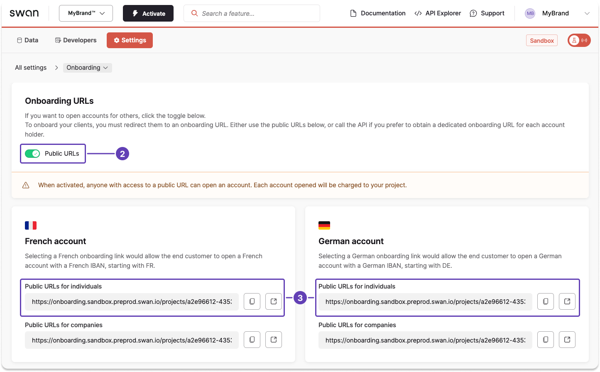

# Create an individual onboarding link

import CreateOnboardingPrereqs from '../partials/_prereqs-create.mdx';

<CreateOnboardingPrereqs onboardingType="individual" />

import PublicOnboardingLinks from '../_public-onboarding-links.mdx';

<PublicOnboardingLinks />

## Unique links using the API {#api}

Create a unique individual onboarding link for each user with the API.

1. Call the `createIndividualAccountHolderOnboarding` mutation.
1. Enter information for all required API fields for the account country, as noted in [country requirements for individual accounts](./index.mdx#country-reqs).
1. Include optional fields as needed for your use case (such as `accountInfo.name` or `oAuthRedirectParameters`).
1. Add optional messages to the success payload, either for validation or in case of rejection.

:::tip Deprecated mutation
The previous `onboardIndividualAccountHolder` mutation is deprecated but still functional.
Use `createIndividualAccountHolderOnboarding` for all new integrations.
:::

### Mutation {#mutation}

<a href="https://explorer.swan.io?query=bXV0YXRpb24gQ3JlYXRlSW5kaXZpZHVhbE9uYm9hcmRpbmcgewogIGNyZWF0ZUluZGl2aWR1YWxBY2NvdW50SG9sZGVyT25ib2FyZGluZygKICAgIGlucHV0OiB7CiAgICAgIGFjY291bnRJbmZvOiB7CiAgICAgICAgY291bnRyeTogRlJBCiAgICAgIH0KICAgICAgYWNjb3VudEFkbWluOiB7CiAgICAgICAgZW1haWw6ICJtYWxpa2EubmdvbWFvQG15YnJhbmQuaW8iCiAgICAgICAgZW1wbG95bWVudFN0YXR1czogRW1wbG95ZWUKICAgICAgICBwcmVmZXJyZWRMYW5ndWFnZTogZnIKICAgICAgICBtb250aGx5SW5jb21lOiBCZXR3ZWVuMzAwMEFuZDQ1MDAKICAgICAgICBhZGRyZXNzOiB7CiAgICAgICAgICBhZGRyZXNzTGluZTE6ICIxMjMgYXZlbnVlIGRlIFBhcmlzIgogICAgICAgICAgY2l0eTogIlBhcmlzIgogICAgICAgICAgY291bnRyeTogIkZSQSIKICAgICAgICAgIHBvc3RhbENvZGU6ICI3NTAwMCIKICAgICAgICB9CiAgICAgIH0KICAgIH0KICApIHsKICAgIC4uLiBvbiBDcmVhdGVJbmRpdmlkdWFsQWNjb3VudEhvbGRlck9uYm9hcmRpbmdTdWNjZXNzUGF5bG9hZCB7CiAgICAgIF9fdHlwZW5hbWUKICAgICAgb25ib2FyZGluZyB7CiAgICAgICAgaWQKICAgICAgICBzdGF0dXNJbmZvIHsKICAgICAgICAgIHN0YXR1cwogICAgICAgIH0KICAgICAgfQogICAgfQogIH0KfQoK&tab=api" className="explorer-badge">Open in API Explorer</a>

```graphql {4-20,24} showLineNumbers
mutation CreateIndividualOnboarding {
  createIndividualAccountHolderOnboarding(
    input: {
      accountInfo: {
        country: FRA
      }
      accountAdmin: {
        email: "malika.ngomao@mybrand.io"
        employmentStatus: Employee
        preferredLanguage: fr
        monthlyIncome: Between3000And4500
        address: {
          addressLine1: "123 avenue de Paris"
          city: "Paris"
          country: "FRA"
          postalCode: "75000"
        }
      }
    }
  ) {
    ... on CreateIndividualAccountHolderOnboardingSuccessPayload {
      __typename
      onboarding {
        id
        statusInfo {
          status
        }
      }
    }
  }
}
```

### Payload {#api-payload}

If you added validation or rejection messages, you'll see information such as the `onboardingId` as well as the current status `Ongoing (Valid)` in the success payload.

```json {6,8} showLineNumbers
{
  "data": {
    "createIndividualAccountHolderOnboarding": {
      "__typename": "CreateIndividualAccountHolderOnboardingSuccessPayload",
      "onboarding": {
        "id": "ae06faf6-13b2-4e9e-891b-e78ecd5ca0e4",
        "statusInfo": {
          "status": "Valid"
        }
      }
    }
  }
}
```

## Public link using the Dashboard {#dashboard}

import PublicOnboardingUrl from '../partials/_create-public-url.mdx';

<PublicOnboardingUrl />

