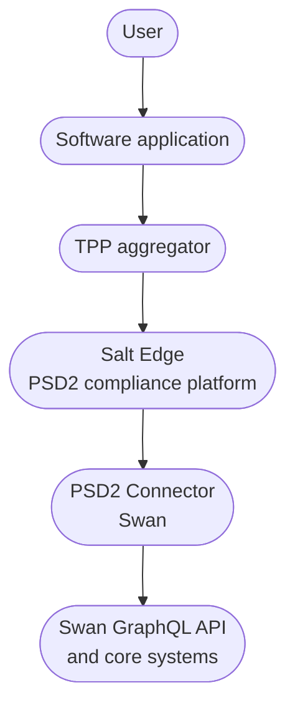

# Open Banking

import OpenBankingDefinition from '../definitions/_open-banking.mdx';
import TppDefinition from '../definitions/_tpp.mdx';
import AispDefinition from '../definitions/_aisp.mdx';
import PispDefinition from '../definitions/_pisp.mdx';
import AisDefinition from '../definitions/_ais.mdx';
import PisDefinition from '../definitions/_pis.mdx';
import BulkPisDefinition from '../definitions/_bulk-pis.mdx';
import Psd2Definition from '../definitions/_psd2.mdx';
import BerlinGroupDefinition from '../definitions/_berlin-group.mdx';
import SaltEdgeDefinition from '../definitions/_salt-edge.mdx';
import ScaDefinition from '../definitions/_sca.mdx';
import ConsentTokenDefinition from '../definitions/_consent-token.mdx';

## Overview {#overview}

> <OpenBankingDefinition />

Swan uses Salt Edge as the PSD2 compliance platform that connects Third-Party Providers (TPPs) to Swan's accounts.

Swan supports two Open Banking services, plus a bulk variant for batched payments.

| Service | Abbreviation | Description |
|---|---|---|
| Account Information Service | AIS | TPPs can access account balances and transaction history. |
| Payment Initiation Service | PIS | TPPs can initiate SEPA Credit Transfers directly from accounts. |
| Bulk Payment Initiation Service | Bulk PIS | TPPs can initiate batched SEPA Credit Transfers directly from accounts. |

:::tip Open Banking vs Swan GraphQL API
Swan's GraphQL API allows partners to embed banking services into their products.
The Open Banking API enables regulated TPPs to offer aggregation and payment services to users who already hold Swan accounts.
These are two distinct access models.
:::

## How it works {#how-it-works}

An Open Banking flow involves three parties: a software application (such as accounting or financial management software), a TPP (a regulated aggregator the software works with), and a [Swan user](/topics/users/).

The connection is established as follows.

1. The user works with a software application and wants to connect their Swan account to it.
1. The software relies on a TPP to establish the bank connection.
1. The TPP sends an authorization request to Salt Edge, Swan's PSD2 compliance platform.
1. Salt Edge redirects the user to Swan's consent application.
1. The user authenticates with [Strong Customer Authentication (SCA)](/topics/users/consent/#sca).
1. The user grants explicit consent to the TPP on behalf of the software.
1. Salt Edge receives an access token and enables data access or payment initiation.
1. The software application can now access account data (AIS) or initiate payments (PIS) on behalf of the user.

:::note TPPs don't connect to Swan directly
All requests go through Salt Edge, which acts as the compliance layer between TPPs and Swan.
:::

## Architecture {#architecture}

| Component | Role |
|---|---|
| Software application | The application the end user interacts with, such as accounting, finance, or ERP tools. |
| TPP | Regulated aggregator the software works with to access bank data or initiate payments. |
| Salt Edge | PSD2 compliance platform that manages TPP registration, authentication flows, and data formatting to the Berlin Group standard. |
| PSD2 Connector | Integration layer between Salt Edge and Swan's core systems. |
| Swan GraphQL API | Source of account data and payment execution. |

## Open Banking ecosystem {#ecosystem}

Open Banking relies on a network of regulated TPPs that connect banking data to software applications.

### Connected TPPs {#ecosystem-tpps}

:::note
This list reflects TPPs registered with Swan's Open Banking infrastructure as of May 2026.
The list is maintained by Salt Edge and may change.
:::

| Legal entity | Commercial name | Type | Country | Description |
|---|---|---|---|---|
| Bridge | **Bridge** | AIS and PIS | 🇫🇷 France | Open Banking API for payment initiation and financial data aggregation. |
| Linxo | **Linxo Connect** | AIS and PIS | 🇫🇷 France | Open Banking solutions by Linxo Group, a Crédit Agricole subsidiary. |
| Fintecture | **Fintecture** | AIS and PIS | 🇫🇷 France | Payment initiation and bank data platform for B2B payments. |
| Powens | **Powens** (formerly Budget Insight) | AIS | 🇫🇷 France | European Open Finance platform for account aggregation and financial data. |
| SI-Expertise | **SI-Expertise** | AIS | 🇫🇷 France | French regulated TPP. |
| Wildmee | **Wildmee** | AIS | 🇫🇷 France | French regulated TPP. |
| finAPI GmbH | **finAPI** | AIS and PIS | 🇩🇪 Germany | German Open Banking platform, used for accounting and ERP integrations. |
| fino run GmbH | **fino.digital** | AIS | 🇩🇪 Germany | AI-based account analysis and Open Banking solutions for businesses. |
| MRH applications GmbH | **MRH applications** | AIS | 🇩🇪 Germany | German regulated TPP. |
| GoCardless | **GoCardless** | AIS | 🇬🇧 UK | Global payment and bank debit platform. |
| Unlimit EU Ltd | **Unlimit** | PIS | 🇨🇾 Cyprus | Global fintech offering payment processing, BaaS, and Open Banking payment initiation services. |
| iban-XS B.V. | **ibanXS** | AIS and PIS | 🇳🇱 Netherlands | PSD2-regulated payment and Open Banking services across Europe. |
| Isabel NV/SA | **Ponto** | AIS | 🇧🇪 Belgium | B2B Open Banking platform for accounting and ERP integrations. |
| Digiteal SA | **Digiteal** | AIS and PIS | 🇧🇪 Belgium | E-invoice presentment, electronic payments, and Open Banking. |
| BudgetBakers s.r.o. | **Wallet by BudgetBakers** | AIS | 🇨🇿 Czech Republic | Personal finance management app with over 10 million users. |
| SPENDEE a.s. | **Spendee** | AIS | 🇨🇿 Czech Republic | Money manager and budget planner app. |

## Authentication and consent {#auth-consent}

### Strong Customer Authentication {#sca}

> <ScaDefinition />

Every Open Banking connection requires SCA.
This works the same way as when a Swan user logs into Web Banking or initiates a payment: two authentication factors are required.

1. **Possession factor**: the user receives an SMS with a unique URL, tied to their phone or SIM card.
1. **Knowledge or inherence factor**: the user enters their 6-digit passcode, or uses Face ID or Touch ID.

### Token architecture {#tokens}

Two separate tokens govern the Open Banking connection.

| Token | Lifecycle | Managed by | Description |
|---|---|---|---|
| User consent token | 180 days | TPP and Salt Edge | Grants the TPP access to account data. Requires user SCA to renew. |
| Technical refresh token | 24 hours | Swan and Salt Edge | Maintains the data refresh connection. Renewed automatically. |

:::note User token renewal
Every 180 days, the user must re-authenticate with SCA to renew the consent token.
PSD2 requires this.
Renewal is initiated by the TPP through Salt Edge.
Swan cannot trigger this renewal directly.
:::

:::note Technical token refresh
TPPs can perform up to 4 refreshes per day, see the [PSD2 EBA Q&A on refresh frequency](https://www.eba.europa.eu/single-rule-book-qa/qna/view/publicId/2018_4210).
:::

### Consent validity {#consent-validity}

- **AIS**: one consent grants data access for up to 180 days, then requires re-authentication.
- **PIS**: each payment requires its own consent.

:::note Transactions since account creation
The 180-day limit applies to how long the consent grants data access, not to the time range of transactions you can view.
By default, Swan returns all transactions since the account was created.
:::

### Consent revocation {#consent-revocation}

The user consent token can be revoked by the TPP, following a request from the end user.

:::tip Under PSD3
With PSD3 (the third Payment Services Directive), allowing end users to revoke their consent directly from their online banking interface will become mandatory.
:::

## Key concepts {#key-concepts}

The following terms appear throughout Swan's Open Banking documentation.

### Open Banking

<OpenBankingDefinition />

### Third-Party Provider (TPP)

<TppDefinition />

### Account Information Service Provider (AISP)

<AispDefinition />

### Payment Initiation Service Provider (PISP)

<PispDefinition />

### Account Information Service (AIS)

<AisDefinition />

### Payment Initiation Service (PIS)

<PisDefinition />

### Bulk Payment Initiation Service (Bulk PIS)

<BulkPisDefinition />

### PSD2

<Psd2Definition />

### Berlin Group

<BerlinGroupDefinition />

### Salt Edge

<SaltEdgeDefinition />

### Strong Customer Authentication (SCA)

<ScaDefinition />

### Consent token

<ConsentTokenDefinition />
