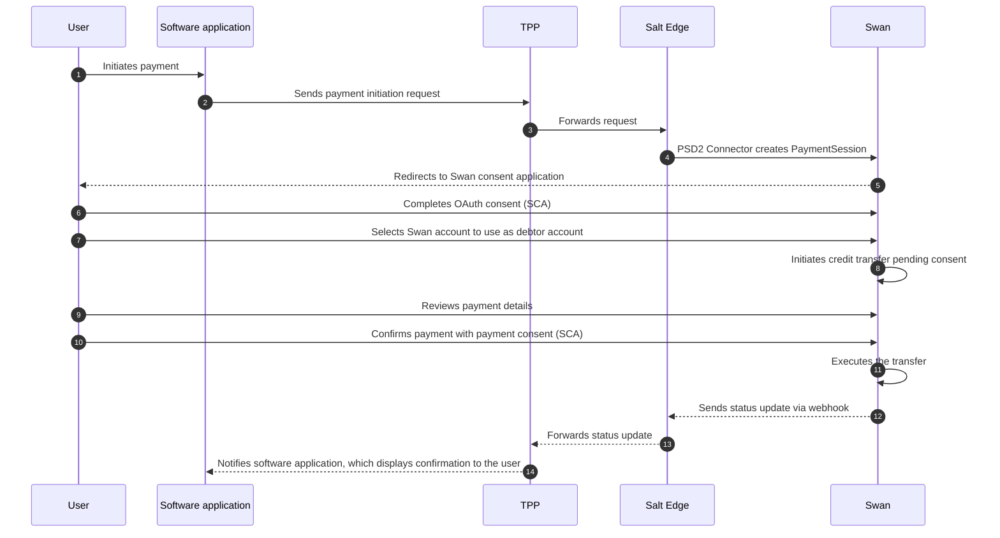

# Payment Initiation Service (PIS)

import PisDefinition from '../definitions/_pis.mdx';

> <PisDefinition />

## Supported payment types {#supported}

- SEPA Credit Transfers (regular and instant).
- Bulk payments.

## Unsupported payment types {#unsupported}

- Standing orders and recurring payments.
- International Credit Transfers.

## PIS flow {#flow}

The diagram below shows the full PIS sequence, from the moment the user initiates a payment in their software application to the final confirmation message.

### References {#references}

- [Salt Edge PIS docs](https://priora.saltedge.com/docs/aspsp/v2/swan/pis).

## Payment session statuses {#statuses}

Single payments have a payment session status only.
Bulk payments have both a payment session status for the whole bulk and a per-transaction status.

The payment session status reflects the overall state of a payment.
Single and bulk payments share the same statuses, except `PART`, which applies to bulk payments only.

| Status | Type | Applies to | Meaning | Swan transaction status | Sent when |
|---|---|---|---|---|---|
| `RCVD` | Ongoing | Single and bulk | Received | — | Payment session created, no transactions linked yet, consent pending. |
| `PDNG` | Ongoing | Single and bulk | Pending | `Pending` | At least one transaction is `Pending`. |
| `ACSC` | Final | Single and bulk | Accepted, settlement completed | `Booked` | All transactions are `Booked`. |
| `RJCT` | Final | Single and bulk | Rejected | `Rejected` | All transactions are `Rejected`, or the authentication or payment consent failed (`CustomerRefused`, `CredentialRefused`, `Expired`, `Failed`, `Canceled`). |
| `PART` | Final | Bulk only | Partially accepted | `Booked` and/or `Rejected` | All transactions are either `Booked` or `Rejected`. |

## Bulk detailed status {#bulk-detailed-status}

For a bulk payment, each individual payment also has its own status, returned by the bulk detailed status endpoint using ISO 20022 codes.

| Status | Type | Meaning | Swan transaction status | Sent when |
|---|---|---|---|---|
| `RCVD` | Ongoing | Received | — | Default. No transaction is linked to the payment yet, consent is pending, and the internal `initiateCreditTransfer` request hasn't been made. |
| `PDNG` | Ongoing | Pending | `Pending` | The transaction is `Pending`. |
| `ACSC` | Final | Accepted, settlement completed | `Booked` | The transaction is `Booked`. |
| `RJCT` | Final | Rejected | `Rejected` | The transaction is `Rejected`, or the payment session consent failed. |

:::note Rejection reasons
When a transaction is `RJCT`, a `rejectedReasonText` explains why.

- **Failed consent**, whether the authentication or the payment consent: one of `ConsentCustomerRefused`, `ConsentCredentialRefused`, `ConsentExpired`, `ConsentFailed`, or `ConsentCanceled`.
- **Failed payment**: a [`RejectedReasonCode`](https://api-reference.swan.io/enums/rejected-reason-code).
:::

## FAQ {#faq}

### I validated my consent but don't see any transaction

The PIS flow has two SCA steps: an OAuth consent and a separate payment consent.
Validating only the first won't create a transaction.
Make sure the payment consent is validated too.
