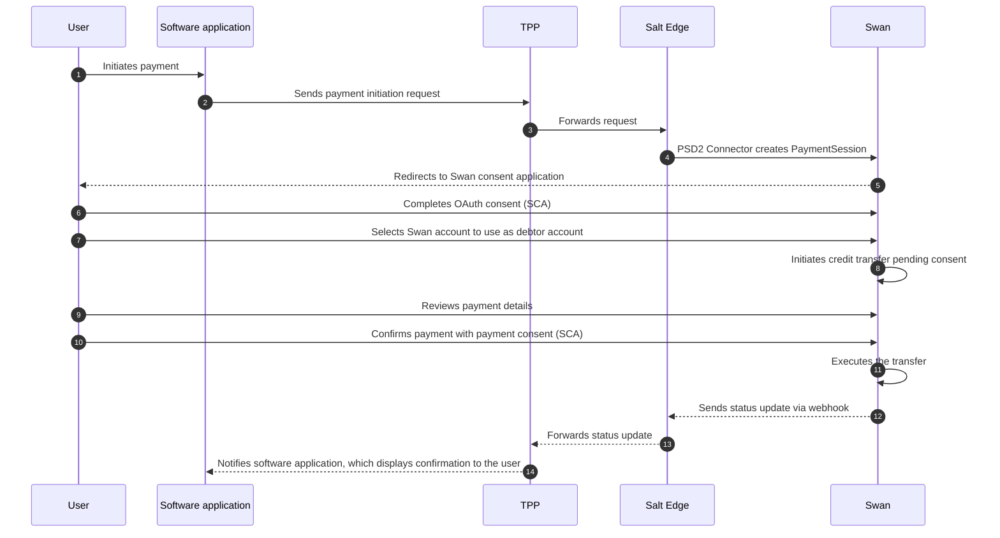

# Payment Initiation Service (PIS)

import PisDefinition from '../definitions/_pis.mdx';

> <PisDefinition />

PIS allows Third-Party Providers (TPPs) to initiate payments directly from Swan accounts on behalf of users.

## What TPPs can initiate {#supported}

- SEPA Credit Transfers (regular and instant).
- Bulk payments.

## What is not yet supported {#unsupported}

- Standing orders and recurring payments.
- International Credit Transfers.

## PIS flow {#flow}

The diagram below shows the full PIS sequence, from the moment the user initiates a payment in their software application to the final confirmation message.

### References {#references}

- [Salt Edge PIS docs](https://priora.saltedge.com/docs/aspsp/v2/swan/pis).
