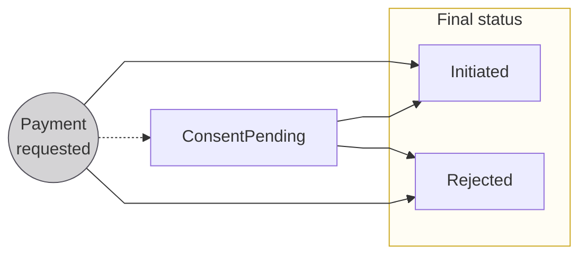

# Payments overview

import PaymentsDefinition from '../definitions/_payments.mdx';
import TransactionsDefinition from '../definitions/_transactions.mdx';

***

**Payments** *<PaymentsDefinition />*

**Transactions** *<TransactionsDefinition />*

***

## Payments

The core of Swan's offer is facilitating the sending and receiving of payments.

### Types of payments

Swan executes several types of payments:

* Credit transfers
* Direct debits
* Card payments
* Check payments *([merchant offer, French checks only](https://docs.swan.io/concept/merchant-payment-collection/french-checks-for-merchants))*

### Payment ID

Each payment has a **unique payment ID**.
You can [retrieve a payment ID](./overview/guide-retrieve-payment-id.mdx) (and other information about the payment) on your Dashboard or by running an API query.

### Payment statuses

| Status | Explanation |
|---|---|
| `ConsentPending` | Status only occurs when consent is required for the payment  **Next step**: Transaction flow blocked while waiting for consent; when consent is received, transaction flow resumes and payment status changes to `Initiated` |
| `Initiated` | Payment successfully requested; enters the [transaction](#transaction-statuses) flow |
| `Rejected` | Payment rejected, either directly after payment initiation or from the `Initiated` status |

### Push and pull payments

The key difference between push and pull payments lies in **who initiates the payment**.

**Push payments**, such as credit transfers, refer to transactions where the **debtor initiates the payment**.
The debtor authorizes the sending of funds from their account to the creditor's account.
In other words, the **debtor pushes the funds to the creditor**.

**Pull payments**, such as direct debits and card payments, refer to transactions where the **creditor initiates collecting funds** from the debtor's account.
The creditor requests a payment, and the debtor provides the necessary authorization for the transaction.
In other words, the **creditor pulls the funds from the debtor**.

### Payments and risk

Push payments pose a **lower risk** for creditors and banks because debtors initiate these payments.
The chance of insufficient funds is reduced, and debtors can only dispute push payments if they're the victim of theft or hacking.

Pull payments pose a **higher risk** for creditors and banks.
Regulations allow varying periods of time after a pull transaction during which the debtor can dispute.
Additionally, since pull payments are initiated by the creditor and not the debtor, there is a higher risk of insufficient funds in the account.

## Transactions

A single payment is composed of **one or several transactions**.
Transactions are created asynchronously after a payment is initiated.
In the API, you'll work **primarily with transactions** when seeking information about payments.

For example, two *transactions* are required if you try to send a SEPA Credit Transfer (SCT) *payment* to an IBAN that does not exist.

* Transaction #1: Funds sent with an outgoing SCT to the SEPA network.
* Transaction #2: Funds returned with a separate transaction from the target bank.

### Transaction ID

Each transaction has a **unique transaction ID**.
You can filter your Dashboard transactions list with a full transaction ID to locate an exact transaction.

[Retrieve a transaction ID](./overview/guide-retrieve-transaction-id.mdx) along with [other transaction information](./overview/guide-get-transaction-info.mdx) by running an API query, or directly on your Dashboard.

### Transaction statuses

There are six possible statuses for Swan transactions: `Upcoming`, `Pending`, `Booked`, `Released`, `Canceled`, and `Rejected`.

Each payment method uses a different combination of these statuses with specific flows.
**Refer to the schemas** for credit transfers, direct debits, and cards for more information about statuses for that payment method.

| Status | Explanation |
|---|---|
| `Upcoming` | Requested transactions that aren't authorized yet, but will be executed soon (example: SEPA Direct Debit, various fees) |
| `Pending` | Authorized transactions that aren't recorded yet  *The `Pending` status helps account holders understand the amount of money actually available because pending funds are technically available but shouldn't be used.* |
| `Booked` | Completed debit or credit transactions that are already recorded; displayed on the account statement |
| `Released` | Card transactions sometimes require a preauthorization; when the preauthorization expires, the remaining amount is released to the account's available balance |
| `Canceled` | Account holder cancels an `Upcoming` transaction |
| `Rejected` | Declined or refused transactions  *Swan accounts aren't designed to carry a credit balance, so the most common reason for a transaction to have the status `Rejected` is insufficient funds.* |

:::info payment & transaction status example
Consider the example from the [transaction introduction](#transactions), where two transactions are required for one failed payment.

* The **entire payment** ends with the payment status `Rejected`.
* **Transaction #1** ends with the transaction status `Booked`.
* **Transaction #2** ends with the transaction status `Booked`.
:::

### Sharing transaction information

The European Union's [revised Payment Services Directive (PSD2)](https://eur-lex.europa.eu/legal-content/EN/LSU/?uri=celex:32015L2366) regulates how banking interfaces can display transactions.
In order to **display or share a user's sensitive information**, there must be a **recent consent** from that user.

At the user level, you might need to act on behalf of a user with a **user access token** to access an account's online payment transactions.
The **user must consent** to this action by performing a [strong customer authentication (SCA)](https://docs.swan.io/api/consent#strong-customer-authentication).
Each SCA is valid for 90 days, so if the user's most recent SCA is older than 90 days, they'll need to consent again.

At the project level, when acting on your own behalf, you can view a list of your project's transactions anytime with a **project access token**.
However, if you need to share information with a user, that **user must consent**.
Again, if they haven't consented within 90 days, they'll need to perform a new SCA.

:::caution Swan frontend
Swan's frontend complies with PSD2 requirements.
If you choose to use a custom API integration or to modify [Swan's open source code](https://swan-io.github.io/swan-partner-frontend/specs/banking/history), you are responsible for respecting PSD2 requirements.
Swan will verify that your offer is compliant.
:::

## About SEPA

The [Single Euro Payments Area (SEPA)](https://www.europeanpaymentscouncil.eu/about-sepa) is a payment network used to **transfer funds in euros in 36 countries**.
One of SEPA's primary goals is to **harmozine payments** across these countries, making it **easy to use cashless payment methods** anywhere you are in and around Europe.
SEPA is regulated by the European Payments Council (EPC).

Swan uses the SEPA Credit Transfer, SEPA Instant Credit Transfer, SEPA Direct Debit schemes for all credit and debit payments that are not executed internally between Swan accounts.

### SEPA countries and territories

SEPA countries and territories include both European Union (EU) and non-EU members.

* **EU members**: Austria, Belgium, Bulgaria, Cyprus, Croatia, Czech Republic, Denmark, Estonia, Finland (including the Aland Islands), France (including French Guiana, Guadeloupe, Martinique, Mayotte, Saint Barthelemy, French Saint Martin, Reunion, and Saint Pierre and Miquelon), Germany, Greece, Hungary, Republic of Ireland, Italy, Latvia, Lithuania, Luxembourg, Malta, Netherlands, Poland, Portugal (including Madeira and Azores), Romania, Slovenia, Slovakia, Spain (including Ceuta, Melilla, and the Canary Islands), and Sweden.
* **Non-EU members**: Andorra, Iceland, Liechtenstein, Monaco, Norway, San Marino, Switzerland, United Kingdom (including Gibraltar), and Vatican City State/Holy See.

:::note SEPA official list
SEPA's scope with all of these countries and territories depends on licensing and local regulations.
Refer to the [EPC's official list](https://www.europeanpaymentscouncil.eu/document-library/other/epc-list-sepa-scheme-countries) for more information.
:::

### SEPA availability

SEPA is **closed on weekends**, as well as the same **six banking holidays** each year.
Transactions sent on closed days are processed the next open day.

  
2023 SEPA closure dates

  

    <ul>
      <li>All weekends</li>
      <li>1 January 2023 (New Year's Day)</li>
      <li>7 April 2023 (Good Friday)</li>
      <li>10 April 2023 (Easter Monday)</li>
      <li>1 May 2023 (Labor Day)</li>
      <li>25 December 2023 (Christmas Day)</li>
      <li>26 December 2023 (Christmas holiday)</li>
    </ul>
  

  
2024 SEPA closure dates

  

  <ul>
      <li>All weekends</li>
      <li>1 January 2024 (New Year's Day)</li>
      <li>29 March 2024 (Good Friday)</li>
      <li>1 April 2024 (Easter Monday)</li>
      <li>1 May 2024 (Labor Day)</li>
      <li>25 December 2024 (Christmas Day)</li>
      <li>26 December 2024 (Christmas holiday)</li>
    </ul>
  

  
2025 SEPA closure dates

  

  <ul>
      <li>All weekends</li>
      <li>1 January 2025 (New Year's Day)</li>
      <li>18 April 2025 (Good Friday)</li>
      <li>21 April 2025 (Easter Monday)</li>
      <li>1 May 2025 (Labor Day)</li>
      <li>25 December 2025 (Christmas Day)</li>
      <li>26 December 2025 (Christmas holiday)</li>
    </ul>
  

## Guides

* [Get payment information](./overview/guide-get-payment-info.mdx)
* [Retrieve a payment ID](./overview/guide-retrieve-payment-id.mdx)
* [Get transaction information](./overview/guide-get-transaction-info.mdx)
* [Retrieve a transaction ID](./overview/guide-retrieve-transaction-id.mdx)