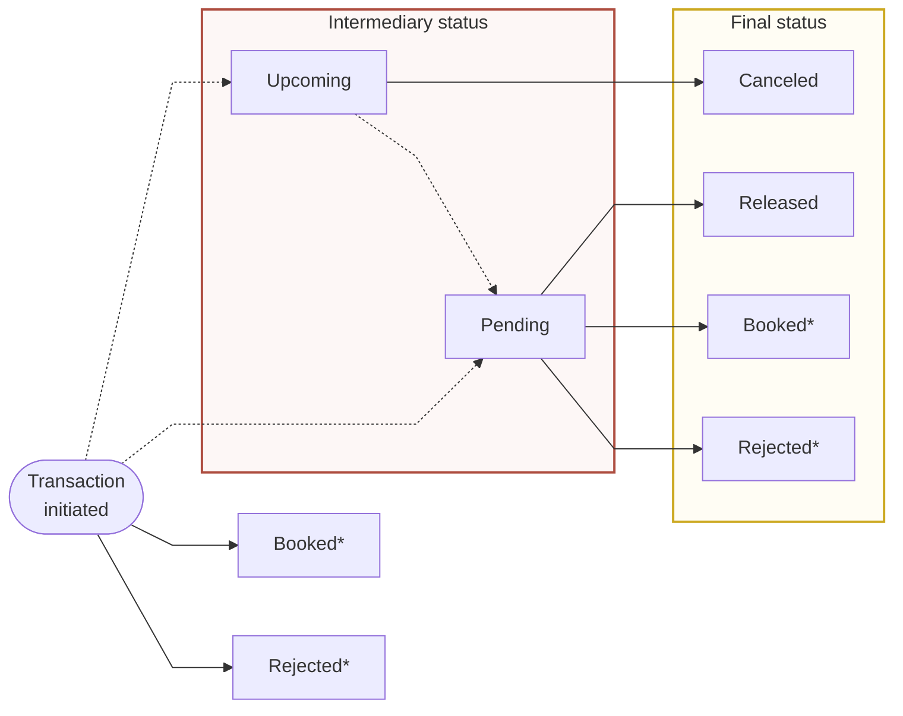

# Card payments

## Transaction statuses for cards

⚠️ MERMAID DIAGRAM IS NOT UPDATED FOR CARDS ONLY ⚠️

```mermaid
%%{ init: { 'flowchart': { 'curve': 'linear' } } }%%
flowchart LR
    T --> B2[Booked*]
    T --> RJ2[Rejected*]
    T([Transaction<br/>initiated]) -.-> U
    T -.-> P
    subgraph I[Intermediary status]
        direction TB
        U[Upcoming] -.-> P[Pending]
    end
    subgraph F[Final status]
        U --> C[Canceled]
        P --> RL[Released]
        P --> B[Booked*]
        P --> RJ[Rejected*]
    end
    style I fill:#FDF7F6,stroke:#AE4E41,stroke-width:2px
    style F fill:#fffdf4,stroke:#cca922,stroke-width:2px
```