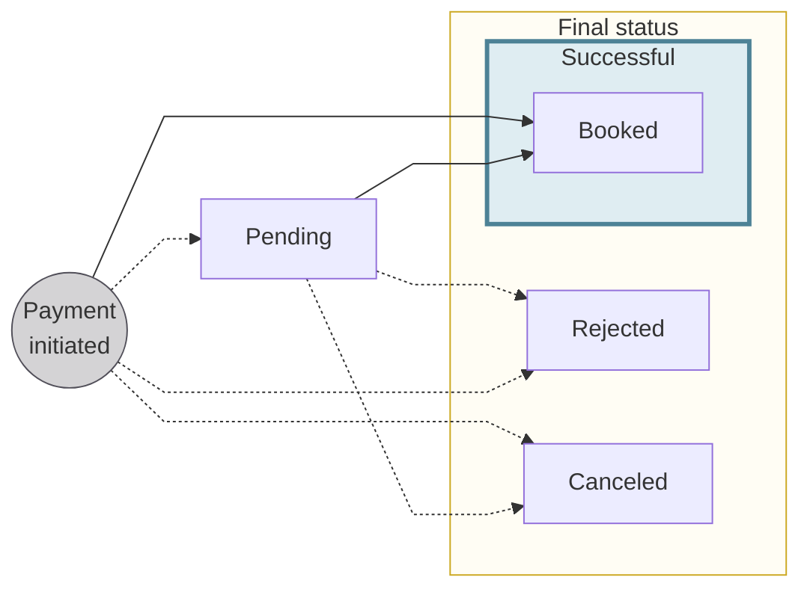
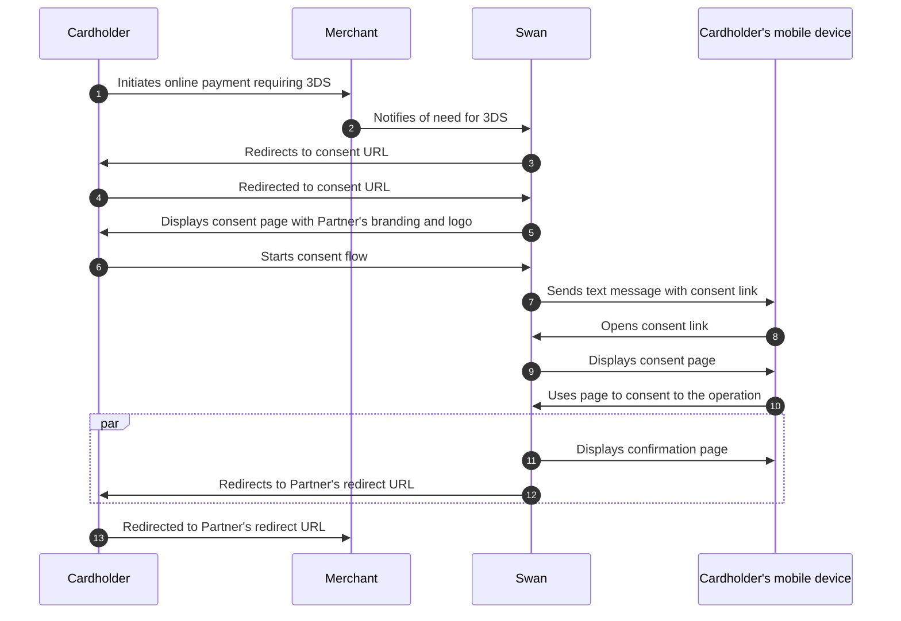

# Card payments

## Overview {#overview}

import CardsOverview from '../../partials/_cards-overview.mdx';

<CardsOverview />

:::tip General cards section
Refer to the [general cards section](../../cards/index.mdx) for information about designing and issuing cards, as well as explanations of how virtual, physical, and digital cards work at Swan.
:::

### Card transactions {#transactions}

Each card `transaction` object contains specific payment data in the [`CardTransaction` interface](https://api-reference.swan.io/objects/card-transaction/), including:

- **Terminal ID**: unique identifier of the merchant's terminal in the Mastercard network
- **Merchant ID**: unique identifier of the merchant in the Mastercard network
- Merchant **name**
- Merchant **city**
- Merchant Category Code (**MCC**)
- Original **amount** and **currency**

### Transaction settings {#transaction-settings}

You can set several parameters for your card transactions.
There are some card details included in these settings, as well.

| Setting | Explanation |
| --- | --- |
| `cardContractExpiryDate` | Date you'd like the card to expire.  Leave it empty if you don't want to set an expiration date, in which case, the card is be renewed automatically in three years. |
| `international`∗ | Allow or disable payments outside of the account holder's country. |
| `withdrawal` | Allow or disable cash withdrawals, such as at ATMs. |
| `nonMainCurrencyTransactions`∗∗ | Allow or disable transactions outside of the card's currency. |
| `eCommerce` | Allow or disable transactions at eCommerce sites. |
| `monthlySpendingLimit` | Fixed by the account holder or qualifying account member, within the limits set by Swan. [Spending limits](#limits) are explained later on this page. |

∗ If `international` is disabled, payments can only be made in the account holder's country. They can still pay using other currencies. For example, a card holder in France can only make payments in France, but in euros as well as other currencies.

∗∗ If `nonMainCurrencyTransactions` is disabled, payments can be made in other countries, but not using other currencies. For example, a card holder in France can make payments in euros in the United Kingdom, but not in the GBP (Pound Sterling).

### Fraud and card transactions {#fraud}

When a card holder is a victim of fraud, they must declare it to Swan.
If, after an internal investigation, the chargeback is admissible, Swan creates a new `InternalCreditTransferIn` credit transaction with the [status `Booked`](#statuses), which impacts the [account's booked balance](../../accounts/index.mdx#balances).

The chargeback transaction is linked to the same payment as the initial card transaction.

import SuspicionOfFraud from '../../partials/_card-fraud-suspicion.mdx';

<SuspicionOfFraud />

### Card transaction statuses {#statuses}

:::tip Account balances
There's a **close link** between **transaction statuses** and **account balances**.
Refer to explanations of types of account balances in the [accounts section](../../accounts/index.mdx#balances).
:::

| Transaction status | Explanation |
|:---:|---|
| `Pending` | Card payments was initiated and [authorization](#authorization) received. The payments aren't debited from the account yet, but they impact the account's `Pending` balance. |
| `Booked` | Completed card payments that are displayed on the official account statement. These card payments have been debited from the account, and they impact the account's `Booked` balance. |
| `Canceled` | An `Upcoming` card payment is canceled by someone with the right to do so, such as the [account holder](../../../glossary.mdx#account-holder), an [account member](../../../glossary.mdx#account-membership), or a [merchant](../../../glossary.mdx#merchants). Only card payments with the status `Upcoming` can be `Canceled`, and `Canceled` card payments don't impact the account balance. |
| `Rejected` | Declined or refused card payments. For example, you, Swan, Mastercard rejected authorization for the payment, or the account's `Available` balance isn't sufficient to complete the card payment without resulting in a negative balance. |

## Authorization and clearing {#authorization-clearing}

Processing card payments involves two key steps:

1. Getting **authorization** for an initiated payment.
1. After some time, **clearing** that payment.

### Authorization {#authorization}

When a Swan card holder initiates a payment, the merchant asks Swan, as well as Mastercard, for a payment **authorization**.
An authorization is permission from the card holder's issuing institution to debit the account.
For example, they might ask Swan to check that the card holder has enough money to cover the purchase.

Authorizations occur predominantly online, requiring the merchant to be connected to the internet and card network.
Offline authorizations can be accepted in certain circumstances.
All transactions are linked to the same payment, including authorizations, debits, credits, and chargebacks.

#### Authorization transactions {#authorization-transactions}

Any time an authorization is requested, a `CardOutAuthorization` transaction is created.
Swan **shares authorization responsibility** with you through [**payment control**](../../../developers/using-api/payment-control.mdx).
Therefore, the Partner (you), Swan, and Mastercard all work together to accept (authorize) or reject all card transactions.

When an authorization is **accepted** by Swan, Mastercard, ***and*** you, the transaction is created with the status `Pending`.
The account's `Available` balance and the card's spending limit are updated accordingly.

If an authorization is **refused** by Swan, Mastercard, ***or*** you, the transaction is created with the status `Rejected`.
The `reasonCode` explains why the authorization was refused.

#### Expiration {#authorization-expiration}

Authorizations are valid for a set amount of time.

At Swan, an authorization's validity period is between 10 and 30 days depending on the type of card transaction.
After the validity period, the balance that hasn't been debited is `Released` and the card's spending limit updated accordingly.

Find an authorization's expiry date with the API: `PendingTransactionStatusInfo` > `pendingEndDate`.

#### Offline authorizations {#authorization-offline}

It's possible that a physical or in-person point of sale can't complete online authorizations.
For example, some situations in which online authorizations might not work include paying at parking kiosks or toll booths, making purchases while on an airplane or other mode of travel, and network failure.
In these situations, a Swan card holder can still initiate many payments.

Swan defines a maximum amount that qualifies for an offline authorization.
Additionally, whether Swan accepts an offline authorization depends on the evaluated risk level for the card or account holder.
In the case of offline authorizations, Swan takes payments into account at clearing, never using the online authorization process.

#### Partial authorizations {#authorization-partial}

Consider the [gas station example](#examples).
When a card holder inserts their card into the gas station's point of sale, the gas station requests a preauthorization of 110€.
However, if the Swan account's `Available` balance is only 55€, Swan can accept a partial authorization for just 55€.

### Clearing {#clearing}

After authorization, or when the merchant gets back online in the case of offline authorizations, the payment goes through **clearing**.
During clearing,the payment is processed and the funds are transferred from the card holder's account to the merchant's account.

Clearing usually occurs one to three days after the authorization, depending on the merchant.
The process is not absolute, however, so make sure to review the examples section for several situational flows.
For example, all of the following can exist: authorizations without debit, debits without authorizations, and multiple debits for the same authorization.

#### Clearing a credit transaction {#clearing-credit}

When a merchant requests credit on a card, Swan receives the information asynchronously and creates a new `CardOutCredit` transaction with the status `Booked`.
This transaction impacts the account's `Booked` balance.

If the credit request is to reverse a previous debit transaction, a new `CardOutDebitReversal` transaction is created linked to the original debit payment.

#### Partial and exceeding debits {#clearing-partial-exceeding}

In situations where **only part of an authorized amount is debited** (for example, when only part of an order can be fulfilled), Swan updates the initial transaction to reflect the reduced `Pending` amount.

If the debit amount **exceeds the amount initially authorized**, Swan links both transactions under the same payment to ensure accurate accounting and tracking.
This also applies if a debit occurs after the authorization expires.

#### Initiating a debit transaction {#clearing-debit}

When a merchant requests debit on a card, Swan receives the information asynchronously and creates a new `CardOutDebit` transaction with the status `Booked`.
This transaction impacts the account's `Booked` balance.

When a debit transaction is linked to an authorization, the corresponding `Pending` `CardOutAuthorization` transaction is updated with the remaining amount to be debited, and the card's spending limit is updated accordingly.
If the updated authorization amount is equal to or less than zero, the status changes to `Released`; otherwise, the status remains `Pending`.

### Examples {#examples}

Some merchants don't follow the classic authorization and debit payment flow.
Discover alternative payment flows that work for different use cases.
These are examples, not rules; merchants control their own flows and can makes changes at any time.

> Consider right-clicking each image and opening it in a new tab.

  
**Taxi** \| Authorization + partial debit clearing

  

Sometimes, a merchant authorizes a default amount, then debits the real amount later.

Consider a card holder using a taxi app:

1. The card holder orders a taxi on the app.
1. The merchant requests an authorization of 50€ to verify that the card holder can cover the cost of the trip.
1. About 1-3 days after the trip:
    - The taxi company debits the account 37,50€, creating a second transaction with the status `Booked`.
    - The remainder of the total authorized amount after the `Booked` transaction is 12,50€.
1. 10 days after the trip, the remaining authorization amount is released.

  

  
**Gas station** \| Preauthorization + authorization + debit clearing

  

Automated fuel dispensers make a preauthorization request to check if the card is valid and has enough money.

Consider a card holder filling up their gas tank:

1. The card holder enters their card in the gas station's point of sale.
1. The merchant requests a preauthorization of 110€.
1. The card holder fills their vehicle.
1. The merchant authorizes the exact amount (56,23€) that was used and releases the preauthorization.
1. A few days later, the merchant debits the account the exact amount (56,23€) and the authorization is released.

:::tip
This flow can also be used for hotel bookings that are made in advance, but not paid for until after the stay is over. 
:::
  

  
**Online shopping** \| Multiple debit authorizations + debit clearing

  

When ordering multiple packages online from a reseller-type website, it's common to authorize multiple debits at once.

Consider a card holder ordering two items fulfilled by different sellers:

1. The card holder orders two packages online.
1. The merchant requests an authorization for the total amount (83,98€).
1. The merchant debits the amount corresponding to the first package (30,99€) when the card holder receives the package, which updates the authorization.
1. The merchant debits the remaining amount (52,99€) when the second package is received. The authorization goes to 0€ and is released.

  

  
**Online return** \| Authorization + debit clearing + refund

  

There are multiple ways to reimburse a payment.
The most straightforward is for the merchant the refund the debit transaction (debit reversal).
The merchant must be able to link the refund to the debit.

Consider a card holder who orders and returns a package, all online:

1. The card holder orders a package online.
1. The merchant requests an authorization for the amount (23,98€).
1. When the card holder receives the package, the merchant debits the account the amount (23,98€) and the authorization is released.
1. The card holder returns the package, and the merchant reverses the debit on the account (23,98€).

  

  
**In-store return** \| Authorization + debit clearing + refund

  

When items are returned in-store, they can be hard to link back to the debit.
When a merchant needs to refund a customer but can't connect the refund transaction to the original debit, the create a new credit transaction.

Consider a card holder buying then returning an item in-store:

1. The card holder buys an item in-store.
1. The merchant requests an authorization for the amount (39,99€).
1. A few days later, the merchant debits the account of the amount (39,99€) and the authorization is released.
1. Within the merchant's return window, the card holder returns the item and the merchant credits the account of the amount (39,99€).

  

  
**Canceled transaction** \| Authorization + release

  

To cancel a transaction, some merchants release the authorization to free up the amount that was requested.

Consider a card holder placing an online order, then canceling it before the order ships:

1. The card holder orders a package online.
1. The merchant requests an authorization for the amount (23,98€).
1. The card holder cancels the order before it ships, and the merchant releases the authorization.

  

  
**Booking a hotel** \| Multiple authorizations + debit clearing

  

When booking a hotel room, the hotel performs a preauthorization request to confirm the card is valid and to reserve all or part of the funds.

Consider a card holder reserving a hotel room online:

1. The card holder enters their card details online to cover the room, but chooses the option without breakfast.
1. The hotel requests a preauthorization of 300€.
1. When the card holder arrives at the hotel, they ask to add breakfast to their booking.
1. The hotel releases the first preauthorization and requests a second of 350€.
1. A few days later, the hotel debits the account the exact amount (350€) and the second preauthorization is released.

  

  
**Purchase on airplane** \| Debit clearing only

  

In some situations, the merchant's point of sale isn't connected to the internet and the concerned card network.
Certain payments are allowed offline, and these debits are done without a previous authorization.
However, the card holder can dispute the debit.

Consider a card holder making a purchase on an airplane (such as food or duty-free items):

1. The card holder uses their card to initiate a 100€ purchase.
1. When the merchant connects to the internet, they don't perform an authorization, but instead debit the amount directly.

  

## Spending limits {#limits}

A **spending limit** is the **maximum amount** a card holder can spend within a certain **rolling period**.
Spending limits are imposed for several reasons.

1. Companies impose spending limits to reduce fraud risk.
1. Individual card holders and companies might impose spending limits over a rolling period to protect their funds when issuing cards to other people.
    - A company might impose a 100€ spending limits over 7 days rolling for travel expenses.
    - A parent might give a card to their child, imposing a 50€ spending limit to protect their own money.
1. Financial institutions (like Swan) impose spending limits to protect themselves from liability.

:::info Rolling spending limit
A rolling period does not depend on a determined date, day of the week, or time.
Instead, rolling spending limits consider the amount spent over period of time.
At Swan, some types of accounts can impose rolling limits of 30 days, 7 days, and 24 hours.
:::

### Limits imposed by Swan {#limits-swan}

All spending limits are for a period of **30 days rolling**.

Note that **Partners** can define spending limits for all card types, while **account holders** can lower spending limits when creating cards.

| Transaction type | Impacts | Amount |
| --- | --- | --- |
| Card | Company **card holder** | 10,000€ per card |
| Card | Individual **card holder** | 5,000€ per card |
| ATM withdrawal | Company **account** holder | 3,000€ total |
| ATM withdrawal | Individual **account** holder | 1,500€ total |

Consider the following examples:

- Company card holder card transaction:
    - One of your **company card holders** has five company cards.
    - They can spend a maximum of 50,000€ between the 5 cards during a 30-day period.
    - Expenses for a single card can't exceed 10,000€.
- Individual account holder ATM withdrawal:
    - An **individual account holder** has two individual cards.
    - They can withdrawal a maximum of 1,500€ total between the 2 cards during a 30-day period.
    - They **can't withdrawal** a total of 3,000€—the maximum is per account.
    - The 1,500€ also counts toward their **card** transaction maximum of 5,000€ per card.

:::caution Changing spending limits
If you feel your use case requires an increased spending limit, create a ticket from your Swan Dashboard.
Swan will evaluate your need and increase the limit if approved.

Note that you can set a lower monthly `spendingLimit` by [updating the card](../../cards/overview/guide-update.mdx), but you can't set any type of additional limit for ATM withdrawals.
:::

### Limits imposed by account holders {#limits-account-holders}

Account holder spending limits **can't exceed** Swan spending limits.
If a spending limit is set that exceeds Swan's spending limits, transactions are rejected.

Companies and individual account holders can impose spending limits over three possible periods:

- 24 hours rolling (`Daily`)
- 7 days rolling (`Weekly`)
- 30 days rolling (`Monthly`)

### Limited forever cards {#limits-forever-cards}

Limited forever cards (`Always`) allow companies and individual account holders to provide a card with a limited lifetime spending amount.
After the amount is spent, the card is no longer valid and can't be recharged.

Limited forever cards still must respect Swan's spending limits, though there is no limit to the amount you can add to these cards.

## 3-D Secure {#3ds}

3-D Secure (3DS) is an extra security layer for online card payments.
All Swan cards, including single-use virtual cards, are subject to 3DS compliance; however, because single-use virtual cards require consent when being creating, 3DS is more seamless.

With 3DS, card holders are required to perform [Strong Customer Authentication](../../users/consent/index.mdx#sca) before finalizing their payment.
As a card issuer, Swan must comply with the European Revised Directive on Payment Services (PSD2).
PSD2 governs all payments in Europe and mandates Strong Customer Authentication for some online payments.

**Most European merchants use 3DS for all transactions**, with a few exceptions.
If a payment *should* require 3DS and doesn't (which probably means the merchant doesn't have the correct configuration), Swan rejects the operation.

### Exceptions {#3ds-exceptions}

Though European merchants use 3DS for most transactions, there are some exceptions.
Merchants aren't required to request 3DS consent in the following cases:

1. The transaction is an online payment for **less than 30€**.
1. In the case of recurring payments, such as subscriptions and automatic top-up, the merchant only uses 3DS during setup and **not for subsequent recurring payments**.
1. Any transaction where the **merchant agrees to accept the risk** in case of fraud.

### Consent flow {#3ds-consent}

Swan designed a PSD2-compliant two-factor authentication (2FA) solution based on [Mastercard's 3DS Smart Interface](https://developer.mastercard.com/product/3ds-smart-interface/).
Swan automatically detects card payments that require additional security and triggers the 3DS consent flow.
Your card holders are instructed validate their online payments and can do so directly from their mobile phone.

There are two notable differences between 3DS and regular consent.

1. With 3DS consent, the Partner (you) doesn't initiate the consent flow. Instead, merchants manage 3DS for their payments. Swan receives the request and immediately redirects the card holder to the 3DS flow.
1. Cardholders always receive a text message, even if they're already on their mobile device and regardless of your [notification preferences](../../users/consent/index.mdx#notifications).

## Guides {#guides}

- [Get a list of card transactions](./guide-get-list.mdx)
- [Update card transaction settings](./guide-update.mdx)
- [Sandbox](./sandbox.mdx)