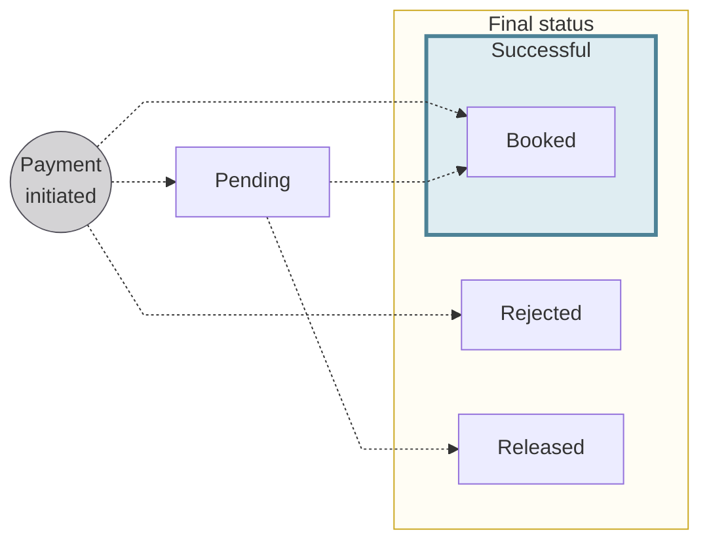
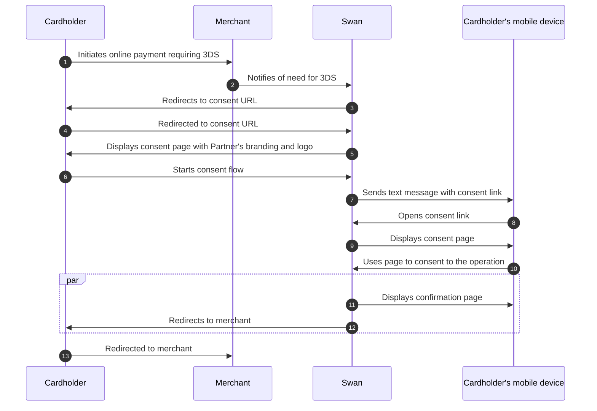
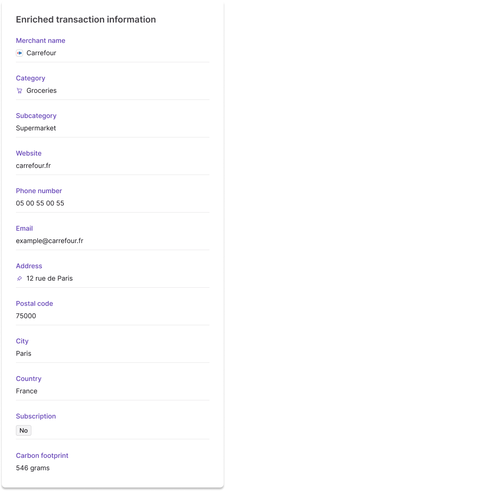

# Card payments

## Overview {#overview}

import CardsOverview from '../../partials/_cards-overview.mdx';

<CardsOverview />

:::tip General cards section
Refer to the [general cards section](../../cards/index.mdx) for information about designing and issuing cards, as well as explanations of how virtual, physical, and digital cards work at Swan.
:::

### Card transactions {#transactions}

Each card `transaction` object contains specific payment data in the [`CardTransaction` interface](https://api-reference.swan.io/objects/card-transaction/), including:

- **Terminal ID**: unique identifier of the merchant's terminal in the Mastercard network
- **Merchant ID**: unique identifier of the merchant in the Mastercard network
- Merchant **name**
- Merchant **city**
- Merchant **postal code**
- Merchant Category Code (**MCC**)
- Original **amount** and **currency**

### Card transaction statuses {#statuses}

:::info Account balances
There's a **close link** between **transaction statuses** and **account balances**.
Refer to explanations of types of account balances in the [accounts section](../../accounts/index.mdx#balances).
:::

| Card transaction status | Explanation |
|:---:|---|
| `Pending` | Card payments initiated with an [authorization](#authorization) granted. The payments aren't debited from the account yet, but they impact the account's `Pending` balance.  **Next steps:**<ul><li>When funds are received, the status for the debit transaction changes to `Booked` and the status for the authorization transaction changes to `Released`.</li><li>`Pending` card transactions can also be `Rejected`.</li></ul> |
| `Booked` | Completed card payments that are displayed on the official account statement. These card payments have been debited from the account, and they impact the account's `Booked` balance. |
| `Released` | Card authorizations are released for specific reasons. Most of the time, the funds are captured when the merchant requests the actual debit. Authorizations might also be released by the merchant, and they can expire.  When an authorization is released without a debit (clearing), the account's available balance increases by the amount of the authorization. |
| `Rejected` | Declined or refused card payments. For example, you, Swan, Mastercard rejected authorization for the payment, or the account's `Available` balance isn't sufficient to complete the card payment without resulting in a negative balance. |

## Fraud and card transactions {#fraud}

When a cardholder is a victim of fraud, they must declare it to Swan.
If, after an internal investigation, the chargeback is admissible, Swan creates a new `InternalCreditTransferIn` credit transaction with the [status `Booked`](#statuses), which impacts the [account's booked balance](../../accounts/index.mdx#balances).

The chargeback transaction is linked to the same payment as the initial card transaction.

import SuspicionOfFraud from '../../partials/_card-fraud-suspicion.mdx';

<SuspicionOfFraud />

## International card transactions {#international}

In order for your cardholders to make international card transactions, configure the [card settings](../../cards/index.mdx#settings) to allow them.
For a smoother user experience, both `international` and `nonMainCurrencyTransactions` should be activated.

Unless your Terms and Conditions state differently, a **2% fee** applies to international card transactions.
Note that [Mastercard's exchange rate](https://www.mastercard.com/content/mastercardcom/global/en/personal/get-support/convert-currency.html) applies to card transactions outside of [SEPA](../index.mdx#sepa).

## Authorization and clearing {#authorization-clearing}

Processing card payments involves two key steps:

1. Getting **authorization** for an initiated payment.
1. After some time, **clearing** that payment.

### Authorization {#authorization}

When a Swan cardholder initiates a payment, the merchant asks Swan, as well as Mastercard, for a payment **authorization**.
An authorization is permission from the cardholder's issuing institution to debit the account.
For example, they might ask Swan to check that the cardholder has enough money to cover the purchase.

Authorizations occur predominantly online, requiring the merchant to be connected to the internet and card network.
Offline authorizations can be accepted in certain circumstances.
All linked card transactions (authorizations, debits, refunds, and chargebacks) have the same Payment ID.

#### Authorization transactions {#authorization-transactions}

Any time an authorization is requested, a `CardOutAuthorization` transaction is created.
Swan **shares the authorization decision** with you through [payment control](../../../developers/using-api/payment-control.mdx).
Therefore, the Partner (you), Swan, and Mastercard all work together to accept (authorize) or reject all card transactions.

When an authorization is **accepted** by Swan, Mastercard, ***and*** you, the transaction is created with the status `Pending`.
The account's `Available` balance and the card's spending limit are updated accordingly.

If an authorization is **refused** by Swan, Mastercard, ***or*** you, the transaction is created with the status `Rejected`.
The `reasonCode` explains why the authorization was refused.

#### Expiration {#authorization-expiration}

Authorizations are valid for a set amount of time.

At Swan, an authorization's validity period is between 10 and 30 days depending on the type of card transaction.
After the validity period, the balance that hasn't been debited is `Released` and the card's spending limit updated accordingly.

Find an authorization's expiry date with the API: `PendingTransactionStatusInfo` > `pendingEndDate`.

#### Offline authorizations {#authorization-offline}

It's possible that a physical or in-person point of sale can't complete online authorizations.
For example, some situations in which online authorizations might not work include paying at parking kiosks or toll booths, making purchases while on an airplane or other mode of travel, and network failure.
In these situations, a Swan cardholder can still initiate many payments.

#### Partial authorizations {#authorization-partial}

Consider the [gas station example](#examples).
When a cardholder inserts their card into the gas station's point of sale, the gas station requests a preauthorization of 110€.
However, if the Swan account's `Available` balance is only 55€, Swan can accept a partial authorization for just 55€.

### Clearing {#clearing}

After authorization, or when the merchant gets back online in the case of offline authorizations, the payment goes through **clearing**.
During clearing,the payment is processed and the funds are transferred from the cardholder's account to the merchant's account.

Clearing usually occurs one to three days after the authorization, depending on the merchant.
The process is not absolute, however, so make sure to review the examples section for several situational flows.
For example, all of the following can exist: authorizations without debit, debits without authorizations, and multiple debits for the same authorization.

#### Partial and exceeding debits {#clearing-partial-exceeding}

In situations where **only part of an authorized amount is debited** (for example, when only part of an order can be fulfilled), Swan updates the initial transaction to reflect the reduced `Pending` amount.
Users can have several partial debits (consider the online shopping example).

If the debit amount **exceeds the amount initially authorized**, Swan links both transactions under the same payment to ensure accurate accounting and tracking.
This also applies if a debit occurs after the authorization expires.

#### Initiating a debit transaction {#clearing-debit}

When a merchant requests debit on a card, Swan receives the information asynchronously and creates a new `CardOutDebit` transaction with the status `Booked`.
This transaction impacts the account's `Booked` balance.

When a debit transaction is linked to an authorization, the corresponding `Pending` `CardOutAuthorization` transaction is updated with the remaining amount to be debited, and the card's spending limit is updated accordingly.
If the updated authorization amount is equal to or less than zero, the status changes to `Released`; otherwise, the status remains `Pending`.

#### Clearing a credit transaction {#clearing-credit}

When a merchant requests credit on a card, Swan receives the information asynchronously and creates a new `CardOutCredit` transaction with the status `Booked`.
This transaction impacts the account's `Booked` balance.

If the credit request is to reverse a previous debit transaction, a new `CardOutDebitReversal` transaction is created linked to the original debit payment.

### Examples {#examples}

Some merchants don't follow the classic authorization and debit payment flow.
Discover alternative payment flows that work for different use cases.
These are examples, not rules; merchants control their own flows and can makes changes at any time.

> Consider right-clicking each image and opening it in a new tab.

  
**Taxi** \| Authorization + partial debit clearing

  

Sometimes, a merchant authorizes a default amount, then debits the real amount later.

Consider a cardholder using a taxi app:

1. The cardholder orders a taxi on the app.
1. The merchant requests an authorization of 50€ to verify that the cardholder can cover the cost of the trip.
1. About 1-3 days after the trip:
    - The taxi company debits the account 37,50€, creating a second transaction with the status `Booked`.
    - The remainder of the total authorized amount after the `Booked` transaction is 12,50€.
1. 10 days after the trip, the remaining authorization amount is released.

  

  
**Gas station** \| Preauthorization + authorization + debit clearing

  

Automated fuel dispensers make a preauthorization request to check if the card is valid and has enough money.

Consider a cardholder filling up their gas tank:

1. The cardholder enters their card in the gas station's point of sale.
1. The merchant requests a preauthorization of 110€.
1. The cardholder fills their vehicle.
1. The merchant authorizes the exact amount (56,23€) that was used and releases the preauthorization.
1. A few days later, the merchant debits the account the exact amount (56,23€) and the authorization is released.

:::tip
This flow can also be used for hotel bookings that are made in advance, but not paid for until after the stay is over. 
:::
  

  
**Online shopping** \| Multiple debit authorizations + debit clearing

  

When ordering multiple packages online from a reseller-type website, it's common to authorize multiple debits at once.

Consider a cardholder ordering two items fulfilled by different sellers:

1. The cardholder orders two packages online.
1. The merchant requests an authorization for the total amount (83,98€).
1. The merchant debits the amount corresponding to the first package (30,99€) when the cardholder receives the package, which updates the authorization.
1. The merchant debits the remaining amount (52,99€) when the second package is received. The authorization goes to 0€ and is released.

  

  
**Online return** \| Authorization + debit clearing + refund

  

There are multiple ways to reimburse a payment.
The most straightforward is for the merchant the refund the debit transaction (debit reversal).
The merchant must be able to link the refund to the debit.

Consider a cardholder who orders and returns a package, all online:

1. The cardholder orders a package online.
1. The merchant requests an authorization for the amount (23,98€).
1. When the cardholder receives the package, the merchant debits the account the amount (23,98€) and the authorization is released.
1. The cardholder returns the package, and the merchant reverses the debit on the account (23,98€).

  

  
**In-store return** \| Authorization + debit clearing + refund

  

When items are returned in-store, they can be hard to link back to the debit.
When a merchant needs to refund a customer but can't connect the refund transaction to the original debit, they create a new credit transaction.

Consider a cardholder buying then returning an item in-store:

1. The cardholder buys an item in-store.
1. The merchant requests an authorization for the amount (39,99€).
1. A few days later, the merchant debits the account of the amount (39,99€) and the authorization is released.
1. Within the merchant's return window, the cardholder returns the item and the merchant credits the account of the amount (39,99€).

  

  
**Canceled transaction** \| Authorization + release

  

To cancel a transaction, some merchants release the authorization to free up the amount that was requested.

Consider a cardholder placing an online order, then canceling it before the order ships:

1. The cardholder orders a package online.
1. The merchant requests an authorization for the amount (23,98€).
1. The cardholder cancels the order before it ships, and the merchant releases the authorization.

  

  
**Booking a hotel** \| Multiple authorizations + debit clearing

  

When booking a hotel room, the hotel performs a preauthorization request to confirm the card is valid and to reserve all or part of the funds.

Consider a cardholder reserving a hotel room online:

1. The cardholder enters their card details online to cover the room, but chooses the option without breakfast.
1. The hotel requests a preauthorization of 300€.
1. When the cardholder arrives at the hotel, they ask to add breakfast to their booking.
1. The hotel releases the first preauthorization and requests a second of 350€.
1. A few days later, the hotel debits the account the exact amount (350€) and the second preauthorization is released.

  

  
**Purchase on airplane** \| Debit clearing only

  

In some situations, the merchant's point of sale isn't connected to the internet and the concerned card network.
Certain payments are allowed offline, and these debits are done without a previous authorization.
However, the cardholder can dispute the debit.

Consider a cardholder making a purchase on an airplane (such as food or duty-free items):

1. The cardholder uses their card to initiate a 100€ purchase.
1. When the merchant connects to the internet, they don't perform an authorization, but instead debit the amount directly.

  

## 3-D Secure {#3ds}

3-D Secure (3DS) is an extra security layer for online card payments.
All Swan cards, including single-use virtual cards, are subject to 3DS compliance; however, because single-use virtual cards require consent when being creating, 3DS is more seamless.

With 3DS, cardholders are required to perform [Strong Customer Authentication](../../users/consent/index.mdx#sca) before finalizing their payment.
As a card issuer, Swan must comply with the European Revised Directive on Payment Services (PSD2).
PSD2 governs all payments in Europe and mandates Strong Customer Authentication for some online payments.

**Most European merchants use 3DS for all transactions**, with a few exceptions.
If a payment *should* require 3DS and doesn't (which probably means the merchant doesn't have the correct configuration), Swan rejects the operation.

:::note 3DS exception
In the case of recurring payments, such as subscriptions and automatic top-up, the merchant is only required to use 3DS during setup and **not for subsequent recurring payments**.
:::

### 3DS consent flow {#3ds-consent}

Swan designed a PSD2-compliant two-factor authentication (2FA) solution based on [Mastercard's 3DS Smart Interface](https://developer.mastercard.com/product/3ds-smart-interface/).
Swan automatically detects card payments that require additional security and triggers the 3DS consent flow.
Your cardholders are instructed to validate their online payments and can do so directly from their mobile phone.

There are two notable differences between 3DS and regular consent.

1. Swan requires 3DS for online transactions—most transactions without it are refused—but it's up to the merchant to request 3DS which initiates the consent flow.
1. Cardholders always receive a text message, even if they're already on their mobile device and regardless of your [notification preferences](../../users/consent/index.mdx#notifications).

## Enriched transaction information {#enriched}

When reviewing their transaction history, **cardholders** can see **enriched information** (more detailed data) about the merchant and the transaction.
Providing enriched transaction information **improves the user experience** for you and your users.
For example, enriched information can reduce chargebacks and decrease the need for customer support.

You can retrieve this information with the API and view it on your Dashboard by going to **Data** > **Transactions** > **Details**.
If you use Swan's Web Banking interface, enriched transaction information is available for your users automatically in their History list.

Enriched transaction information is **only available for card transactions** at this time.
It's available for all card transactions dating back to the beginning of Swan. 

Swan enriches card transactions with the following data (as availability allows):

| API | Description | Example |
| --- | --- | --- |
| `enrichedMerchantName` | Merchant brand name | Carrefour |
| `logoUrl` | Merchant logo | Small image of the merchant's logo, or, if no logo is available, the category icon |
| `category` | Merchant category | Groceries |
| `subcategory` | Merchant subcategory | Supermarket |
| `isSubscription` | Subscription indicator boolean | `Yes` or `No` |
| `contactEmail` `contactPhone` `contactWebsite` | Merchant contact details | example[@]carrefour.fr 05.00.55.00.55 carrefour.fr |
| `city` `country` `postalCode` `latitude` `longitude` | Location details | Paris France (FRA) 75000 48.864716 2.349014 |
| `carbonFootprint` | Carbon footprint in micrograms of CO2 emitted | 546 micrograms |

### Displaying enriched info {#enriched-display}

In the API and on your Dashboard, `enrichedTransactionInfo` doesn't override the existing merchant information received during the classic transaction flow.
If you use Swan's Web Banking interface, however, the enriched information overrides the merchant name.

The following image is sample enriched information as displayed on the Dashboard:

### Webhooks & enriched info {#enriched-webhooks}

Swan obtains enriched transaction information **asynchronously** to avoid processing delays and technical timeouts.
The information is usually received within seconds after a card transaction is created.

Anytime enriched information is received, Swan triggers the `Transaction.Enriched` webhook.
In the `Transaction.Enriched` webhook notification, the resource ID is the transaction ID.

If enriched information is received when a transaction's status changes, the `Transaction.Enriched` webhook is triggered *after* the `Transaction.Pending` webhook.

Subscribe to both [webhooks](../../../developers/using-api/webhooks.mdx) to stay updated on your transactions.

## Guides {#guides}

- [Get a list of card transactions](./guide-get-list.mdx)
- [Get enriched information about card transactions](./guide-get-enriched-info.mdx)
- [Sandbox](./sandbox.mdx)