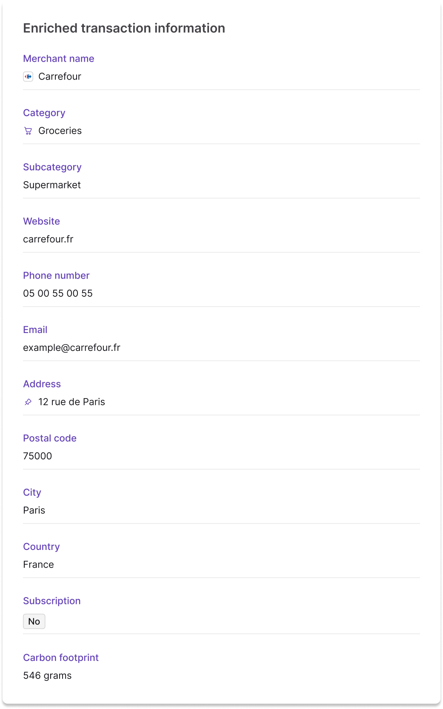

import CardsOverview from '../../partials/_cards-overview.mdx';
import MaestroLink from '../../partials/_maestro.mdx';

# Card payments

## Overview {#overview}

<CardsOverview />

:::tip General cards section
Refer to the [general cards section](../../cards/index.mdx) for information about designing and issuing cards, as well as explanations of how virtual, physical, and digital cards work at Swan.
:::

### Card transactions {#transactions}

Each card `transaction` object contains specific payment data in the [`CardTransaction` interface](https://api-reference.swan.io/objects/card-transaction/), including:

- **Terminal ID**: unique identifier of the merchant's terminal in the Mastercard network
- **Merchant ID**: unique identifier of the merchant in the Mastercard network
- Merchant **name**
- Merchant **city**
- Merchant **postal code**
- Merchant Category Code (**MCC**)
- Original **amount** and **currency**

:::info 🇳🇱 Netherlands Maestro fallback
<MaestroLink />
:::

### Card transaction statuses {#statuses}

:::info Account balances
There's a **close link** between **transaction statuses** and **account balances**.
Refer to explanations of types of account balances in the [accounts section](../../accounts/index.mdx#balances).
:::

| Card transaction status | Explanation |
|:---:|---|
| `Pending` | Card payments initiated with an [authorization](#authorization) granted. The payments aren't debited from the account yet, but they impact the account's `Pending` balance.  **Next steps:**<ul><li>When funds are received, the status for the debit transaction changes to `Booked` and the status for the authorization transaction changes to `Released`.</li><li>`Pending` card transactions can also be `Rejected`.</li></ul> |
| `Booked` | Completed card payments that are displayed on the official account statement. These card payments have been debited from the account, and they impact the account's `Booked` balance. |
| `Released` | Card authorizations are released for specific reasons. Most of the time, the funds are captured when the merchant requests the actual debit. Authorizations might also be released by the merchant, and they can expire.  When an authorization is released without a debit (clearing), the account's available balance increases by the amount of the authorization. |
| `Rejected` | Declined or refused card payments. For example, you, Swan, Mastercard rejected authorization for the payment, or the account's `Available` balance isn't sufficient to complete the card payment without resulting in a negative balance. |

## Contactless payments

### Physical card contactless limits

To minimize fraud risk, physical cards limit the number of contactless payments and the total cumulative amount spent before your user must verify their identity. Contactless card payment limits may differ slightly across countries and financial institutions within the European Economic Area (EEA). The following table details the limits for contactless payments for physical cards issued by Swan:

| Limit type | Value | Description |
|---|---|---|
| Single payment limit   | €50   | Maximum amount for one contactless payment without using a PIN.|
| Cumulative amount limit | €150  | Maximum total amount spent in consecutive contactless transactions before a PIN is required. |

:::info Account balances
[Digital card payments](/topics/cards/digital/) (like Apple Pay or Google Pay) bypass these limits because they use [Strong Customer Authentication (SCA)](/topics/users/consent/#sca) through a password or biometrics. 
These payments **don't count** toward physical card contactless limits.
:::

### Resetting the contactless payment limit

To reset the cumulative spending (€150) limits, your user must perform a chip-and-PIN transaction by inserting their physical card into a payment terminal and entering their PIN.

## Fraud and card transactions {#fraud}

When a cardholder is a victim of fraud, they must declare it to Swan.
If, after an internal investigation, the chargeback is admissible, Swan creates a new `InternalCreditTransferIn` credit transaction with the [status `Booked`](#statuses), which impacts the [account's booked balance](../../accounts/index.mdx#balances).

The chargeback transaction is linked to the same payment as the initial card transaction.

import SuspicionOfFraud from '../../partials/_card-fraud-suspicion.mdx';

<SuspicionOfFraud />

## International card transactions {#international}

In order for your cardholders to make international card transactions, configure the [card settings](../../cards/index.mdx#settings) to allow them.
For a smoother user experience, both `international` and `nonMainCurrencyTransactions` should be activated.

Unless your Terms and Conditions state differently, a **2% fee** applies to international card transactions.
Note that [Mastercard's exchange rate](https://www.mastercard.com/content/mastercardcom/global/en/personal/get-support/convert-currency.html) applies to card transactions outside of [SEPA](../index.mdx#sepa).

### Allowed and blocked countries

Review the following lists to check where card payments are allowed or blocked. Payments are only supported in countries on the allowed list. 

  
🌍 Allowed and blocked countries

<Tabs>
  <TabItem value="allowed" label={<><Yes /> Allowed</>} default>
    #### <Yes /> Allowed countries for **card** payments

    Card payments are available in these countries. Transactions may still be rejected for other reasons (such as insufficient funds or card restrictions).

    **Allowed countries**:

    | First letter | Countries |
    |--------------|-----------|
    | A - B | Åland Islands, Albania, Algeria, American Samoa, Andorra, Angola, Anguilla, Antigua and Barbuda, Argentina, Armenia, Aruba, Australia, Austria, Azerbaijan, Bahrain, Barbados, Belgium, Belize, Benin, Bermuda, Bhutan, Bolivia, Bonaire, Bosnia and Herzegovina, Botswana, Bouvet Island, Brazil, British Indian Ocean Territory, Brunei Darussalam, Bulgaria |
    | C - E | Cabo Verde, Cambodia, Canada, Cayman Islands, Chad, Chile, China, Christmas Island, Cocos (Keeling) Islands, Colombia, Comoros, Congo, Cook Islands, Costa Rica, Croatia, Curaçao, Cyprus, Czechia, Denmark, Djibouti, Dominica, Dominican Republic, Ecuador, Egypt, El Salvador, Estonia, Eswatini |
    | F - G | Falkland Islands (Malvinas), Faroe Islands, Fiji, Finland, France, French Guiana, French Polynesia, French Southern Territories, Gabon, Gambia, Georgia, Germany, Ghana, Gibraltar, Greece, Greenland, Grenada, Guadeloupe, Guam, Guatemala, Equatorial Guinea, Guyana |
    | H - J | Haiti, Heard Island and McDonald Islands, Holy See (Vatican City State), Honduras, Hong Kong, Hungary, Iceland, India, Indonesia, Ireland, Isle of Man, Israel, Italy, Ivory Coast, Jamaica, Japan, Jersey, Jordan |
    | K - L | Kazakhstan, Kenya, Kirghizistan, Kiribati, Kosovo, Kuwait, Kyrgyzstan, Lao People's Democratic Republic, Latvia, Lesotho, Liechtenstein, Lithuania, Luxembourg |
    | M - N | Macao, Madagascar, Malawi, Malaysia, Maldives, Malta, Marshall Islands, Martin, Martinique, Mauritania, Mauritius, Mayotte, Mexico, Micronesia (Federated States of), Moldova (Republic of), Monaco, Mongolia, Montenegro, Montserrat, Morocco, Mozambique, Namibia, Nauru, Nepal, Netherlands, New Caledonia, New Zealand, Nicaragua, Niger, Nigeria, Niue, Norfolk Island, Northern Mariana Islands, Norway |
    | O - Q | Oman, Palau, Palestine, Panama, Papua New Guinea, Paraguay, Peru, Philippines, Pitcairn, Poland, Portugal, Puerto Rico, Qatar |
    | R - S | Réunion, Romania, Rwanda, Saint Barthélemy, Saint Helena, Ascension and Tristan da Cunha, Saint Kitts and Nevis, Saint Lucia, Saint Martin (Dutch part), Saint Pierre and Miquelon, Saint Vincent and the Grenadines, Samoa, San Marino, Saudi Arabia, Senegal, Serbia, Seychelles, Sierra Leone, Singapore, Sint Maarten (Dutch part), Slovakia, Slovenia, Solomon Islands, South Africa, South Georgia and the South Sandwich Islands, South Korea, Spain, Sri Lanka, Suriname, Svalbard and Jan Mayen, Sweden, Switzerland |
    | T - U | Tajikistan, Tanzania, Thailand, Timor-Leste, Togo, Tokelau, Tonga, Tunisia, Turkey, Turkmenistan, Turks and Caicos Islands, Tuvalu, Uganda, United Arab Emirates, United Kingdom, United States of America, United States Minor Outlying Islands, Uruguay, Uzbekistan |
    | V - Z | Vanuatu, Viet Nam, Virgin Islands (British), Virgin Islands (U.S.), Wallis and Futuna, Western Sahara, Zambia |

  </TabItem>

  <TabItem value="blocked" label={<><No /> Blocked</>}>
    #### <No /> Blocked countries for **card** payments

    Card payments are blocked in the following countries. Any attempt to make a transaction in these countries will be rejected.

    **Blocked countries**:

    | First letter | Countries |
    |--------------|-----------|
    | A - G | Afghanistan, Belarus, Burkina Faso, Burundi, Central African Republic, Cameroon, The Democratic Republic of Congo, Cuba, Eritrea, Ethiopia, Guinea, Guinea-Bissau |
    | H - R | Iran, Iraq, Lebanon, Liberia, Libya, Mali, Myanmar, Pakistan, North Korea, Russian Federation |
    | S - Z | Somalia, South Sudan, Sudan, Syrian Arab Republic, Trinidad and Tobago, Ukraine, Venezuela (Bolivarian Republic), Yemen, Zimbabwe |

  </TabItem>
</Tabs>

## Authorization and clearing {#authorization-clearing}

Processing card payments involves two key steps:

1. Getting **authorization** for an initiated payment.
1. After some time, **clearing** that payment.

### Authorization {#authorization}

When a Swan cardholder initiates a payment, the merchant asks Swan, as well as Mastercard, for a payment **authorization**.
An authorization is permission from the cardholder's issuing institution to debit the account.
For example, they might ask Swan to check that the cardholder has enough money to cover the purchase.

Authorizations occur predominantly online, requiring the merchant to be connected to the internet and card network.
Offline authorizations can be accepted in certain circumstances.
All linked card transactions (authorizations, debits, refunds, and chargebacks) have the same Payment ID.

#### Authorization transactions {#authorization-transactions}

Any time an authorization is requested, a `CardOutAuthorization` transaction is created.
Swan **shares the authorization decision** with you through [payment control](../../../developers/using-api/payment-control.mdx).
Therefore, the Partner (you), Swan, and Mastercard all work together to accept (authorize) or reject all card transactions.

When an authorization is **accepted** by Swan, Mastercard, ***and*** you, the transaction is created with the status `Pending`.
The account's `Available` balance and the card's spending limit are updated accordingly.

If an authorization is **refused** by Swan, Mastercard, ***or*** you, the transaction is created with the status `Rejected`.
The `reasonCode` explains why the authorization was refused.

#### Expiration {#authorization-expiration}

Authorizations are valid for a set amount of time.

At Swan, an authorization's validity period is between 10 and 30 days depending on the type of card transaction.
After the validity period, the balance that hasn't been debited is `Released` and the card's spending limit updated accordingly.

Find an authorization's expiry date with the `pendingEndDate` attribute of the [PendingTransactionStatusInfo](https://api-reference.swan.io/objects/pending-transaction-status-info/) object.

#### Offline authorizations {#authorization-offline}

It's possible that a physical or in-person point of sale can't complete online authorizations.
For example, some situations in which online authorizations might not work include paying at parking kiosks or toll booths, making purchases while on an airplane or other mode of travel, and network failure.
In these situations, a Swan cardholder can still initiate many payments.

#### Partial authorizations {#authorization-partial}

Consider the [gas station example](#examples).
When a cardholder inserts their card into the gas station's point of sale, the gas station requests a preauthorization of 110€.
However, if the Swan account's `Available` balance is only 55€, Swan can accept a partial authorization for just 55€.

### Clearing {#clearing}

After authorization, or when the merchant gets back online in the case of offline authorizations, the payment goes through **clearing**.
During clearing, the payment is processed and the funds are transferred from the cardholder's account to the merchant's account.

Clearing usually occurs one to three days after the authorization, depending on the merchant.
The process is not absolute, so make sure to review the [examples](#examples) section for several situational flows.
For example, all of the following can exist: authorizations without debit, debits without authorizations, and multiple debits for the same authorization.

#### Partial and exceeding debits {#clearing-partial-exceeding}

In situations where **only part of an authorized amount is debited** (for example, when only part of an order can be fulfilled), Swan updates the initial transaction to reflect the reduced `Pending` amount.
Users can have several partial debits (consider the online shopping [example](#examples)).

If the debit amount **exceeds the amount initially authorized**, Swan links both transactions under the same payment to ensure accurate accounting and tracking.
This also applies if a debit occurs after the authorization expires.

#### Initiating a debit transaction {#clearing-debit}

When a merchant requests debit on a card, Swan receives the information asynchronously and creates a new `CardOutDebit` transaction with the status `Booked`.
This transaction impacts the account's `Booked` balance.

When a debit transaction is linked to an authorization, the corresponding `Pending` `CardOutAuthorization` transaction is updated with the remaining amount to be debited, and the card's spending limit is updated accordingly.
If the updated authorization amount is equal to or less than zero, the status changes to `Released`; otherwise, the status remains `Pending`.

:::note Request the release of a deposit
Cardholders can ask Swan to release the authorized amount early with proper documentation.
Share the [Swan Support Center article](https://support.swan.io/hc/en-150/articles/21980237261469) to guide them through the process.
:::

#### Clearing a credit transaction {#clearing-credit}

When a merchant requests credit on a card, Swan receives the information asynchronously and creates a new `CardOutCredit` transaction with the status `Booked`.
This transaction impacts the account's `Booked` balance.

If the credit request is to reverse a previous debit transaction, a new `CardOutDebitReversal` transaction is created linked to the original debit payment.

If a merchant correctly references the original debit authorization, both `CardOutCredit` and `CardOutDebitReversal` transactions will share the original `paymentId`. This common ID improves transaction tracking and simplifies reconciliation.

:::note Sandbox testing limitation
The Event Simulator cannot directly link `CardOutCredit` transactions to existing payments. For testing purposes, you'll need to manually match refunds to original transactions using time, merchant, and amount data.
:::

### Capture types {#capture-types}

Capture refers to the process of completing a transaction and moving the funds from the customer's account to the merchant's account after authorization.
At Swan, you might encounter various capture types, including those described in the following table.

| Capture type | Explanation | Example |
| --- | --- | --- |
| **Standard capture** | The merchant captures the authorized amount. | A customer authorizes a 70€ purchase, and the merchant captures 70€. |
| **Over capture** | The merchant attempts to take more funds from the customer than the original authorization amount. | The cardholder makes a transaction for $100 `USD`. Therefore, the authorized amount is 100€ `EUR`. Currency exchange fluctuates, so the merchant captures 110€ instead of 100€. |
| **Forced capture** | The merchant forces a transaction without the authorization code from the card issuer. Merchants might attempt forced capture if they don't receive a response from the card issuer. | The merchant doesn't receive authorization for a 15€ in-flight purchase, but processes the capture anyway. |
| **Late capture** | The merchant captures a transaction after the authorization expires. This is a type of forced capture. | The merchant captures a 35€ transaction 12 days after the transaction was made. The transaction authorization expired, but the merchant captures the  35€ anyway. |
| **Partial capture** | The merchant only captures a portion of the authorized amount. | A customer purchases 400€ worth of goods online, but some items are on back order. The merchant only captures 300€, the amount for the goods they actually shipped to the customer. The 100€ remains in `Pending`. |

### Examples {#examples}

Some merchants don't follow the classic authorization and debit payment flow.
Discover alternative payment flows that work for different use cases.
These are examples, not rules; merchants control their own flows and can make changes at any time.

<Tabs>
<TabItem value="taxi" label={🚗} default>

**Taxi** | Authorization + partial debit clearing

Sometimes, a merchant authorizes a default amount, then debits the real amount later.

Consider a cardholder using a taxi app:

1. The cardholder orders a taxi on the app.
1. The merchant requests an authorization of 50€ to verify that the cardholder can cover the cost of the trip.
1. About 1-3 days after the trip:
    - The taxi company debits the account 37,50€, creating a second transaction with the status `Booked`.
    - The remainder of the total authorized amount after the `Booked` transaction is 12,50€.
1. 10 days after the trip, the remaining authorization amount is released.

</TabItem>

<TabItem value="gas-station" label={⛽}>

**Gas station** | Preauthorization + authorization + debit clearing

Automated fuel dispensers make a preauthorization request to check if the card is valid and has enough money.

Consider a cardholder filling up their gas tank:

1. The cardholder enters their card in the gas station's point of sale.
1. The merchant requests a preauthorization of 110€.
1. The cardholder fills their vehicle.
1. The merchant authorizes the exact amount (56,23€) that was used and releases the preauthorization.
1. A few days later, the merchant debits the account the exact amount (56,23€) and the authorization is released.

:::tip
This flow can also be used for hotel bookings that are made in advance, but not paid for until after the stay is over. 
:::

</TabItem>

<TabItem value="online-shopping" label={📦}>

**Online shopping** | Multiple debit authorizations + debit clearing

When ordering multiple packages online from a reseller-type website, it's common to authorize multiple debits at once.

Consider a cardholder ordering two items fulfilled by different sellers:

1. The cardholder orders two packages online.
1. The merchant requests an authorization for the total amount (83,98€).
1. The merchant debits the amount corresponding to the first package (30,99€) when the cardholder receives the package, which updates the authorization.
1. The merchant debits the remaining amount (52,99€) when the second package is received. The authorization goes to 0€ and is released.

</TabItem>

<TabItem value="online-return" label={📤}>

**Online return** | Authorization + debit clearing + refund

There are multiple ways to reimburse a payment.
The most straightforward is for the merchant to refund the debit transaction (debit reversal).
The merchant must be able to link the refund to the debit.

Consider a cardholder who orders and returns a package, all online:

1. The cardholder orders a package online.
1. The merchant requests an authorization for the amount (23,98€).
1. When the cardholder receives the package, the merchant debits the account the amount (23,98€) and the authorization is released.
1. The cardholder returns the package, and the merchant reverses the debit on the account (23,98€).

</TabItem>

<TabItem value="instore-return" label={🏪}>

**In-store return** | Authorization + debit clearing + refund

When items are returned in-store, they can be hard to link back to the debit.
When a merchant needs to refund a customer but can't connect the refund transaction to the original debit, they create a new credit transaction.

When merchants correctly reference the original debit authorization, Swan links both `CardOutCredit` and `CardOutDebitReversal` transactions to the same `paymentId` as the original authorization.

Consider a cardholder buying then returning an item in-store:

1. The cardholder buys an item in-store.
1. The merchant requests an authorization for the amount (39,99€).
1. A few days later, the merchant debits the account of the amount (39,99€) and the authorization is released.
1. Within the merchant's return window, the cardholder returns the item and the merchant credits the account of the amount (39,99€).

</TabItem>

<TabItem value="canceled" label={❌}>

**Canceled transaction** | Authorization + release

To cancel a transaction, some merchants release the authorization to free up the amount that was requested.

Consider a cardholder placing an online order, then canceling it before the order ships:

1. The cardholder orders a package online.
1. The merchant requests an authorization for the amount (23,98€).
1. The cardholder cancels the order before it ships, and the merchant releases the authorization.

</TabItem>

<TabItem value="hotel" label={🏨}>

**Booking a hotel** | Multiple authorizations + debit clearing

When booking a hotel room, the hotel performs a preauthorization request to confirm the card is valid and to reserve all or part of the funds.

Consider a cardholder reserving a hotel room online:

1. The cardholder enters their card details online to cover the room, but chooses the option without breakfast.
1. The hotel requests a preauthorization of 300€.
1. When the cardholder arrives at the hotel, they ask to add breakfast to their booking.
1. The hotel releases the first preauthorization and requests a second of 350€.
1. A few days later, the hotel debits the account the exact amount (350€) and the second preauthorization is released.

</TabItem>

<TabItem value="airplane" label={✈️}>

**Purchase on airplane** | Debit clearing only

In some situations, the merchant's point of sale isn't connected to the internet and the concerned card network.
Certain payments are allowed offline, and these debits are done without a previous authorization.
However, the cardholder can dispute the debit.

Consider a cardholder making a purchase on an airplane (such as food or duty-free items):

1. The cardholder uses their card to initiate a 100€ purchase.
1. When the merchant connects to the internet, they don't perform an authorization, but instead debit the amount directly.

</TabItem>
</Tabs>

## 3-D Secure (3DS) {#3ds}

3-D Secure (3DS) is an extra security layer for online card payments.
All Swan cards, including single-use virtual cards, are subject to 3DS compliance; however, because single-use virtual cards require consent when being created, 3DS is more seamless.

With 3DS, cardholders are required to perform [Strong Customer Authentication](../../users/consent/index.mdx#sca) before finalizing their payment.
As a card issuer, Swan must comply with the European Revised Directive on Payment Services (PSD2).
PSD2 governs all payments in Europe and mandates Strong Customer Authentication for some online payments.

**Most European merchants use 3DS for all transactions**, with a few exceptions.
If a payment *should* require 3DS and doesn't (which probably means the merchant doesn't have the correct configuration), Swan rejects the operation.

:::note 3DS exception
In the case of recurring payments, such as subscriptions and automatic top-up, the merchant is only required to use 3DS during setup and **not for subsequent recurring payments**.
:::

### 3DS consent flow {#3ds-consent}

Swan designed a PSD2-compliant two-factor authentication (2FA) solution based on [Mastercard's 3DS Smart Interface](https://developer.mastercard.com/product/3ds-smart-interface/).
Swan automatically detects card payments that require additional security and triggers the 3DS consent flow.
Your cardholders are instructed to validate their online payments and can do so directly from their mobile phone.

There are two notable differences between 3DS and regular consent:

1. Swan requires 3DS for online transactions — most transactions without it are refused — but it's up to the merchant to request 3DS, which initiates the consent flow.
2. 3DS consent respects your configured [notification preferences](/topics/users/consent/index.mdx#notifications). If you've integrated consent notifications, you'll receive notifications for 3DS payments that you can forward to your users through your own channels.

## Enriched transaction information {#enriched}

When reviewing their transaction history, **cardholders** can see **enriched information** (more detailed data) about the merchant and the transaction.
Providing enriched transaction information **improves the user experience** for you and your users.
For example, enriched information can reduce chargebacks and decrease the need for customer support.

You can retrieve this information with the API and view it on your Dashboard by going to **Data** > **Transactions** > **Details**.
If you use Swan's Web Banking interface, enriched transaction information is available for your users automatically in their History list.

Enriched transaction information is **only available for card transactions** at this time.
It's available for all card transactions dating back to the beginning of Swan. 

Swan enriches card transactions with the following data (as availability allows):

| API | Description | Example |
| --- | --- | --- |
| `enrichedMerchantName` | Merchant brand name | Carrefour |
| `logoUrl` | Merchant logo | Small image of the merchant's logo, or, if no logo is available, the category icon |
| `category` | Merchant category | Groceries |
| `subcategory` | Merchant subcategory | Supermarket |
| `isSubscription` | Subscription indicator boolean | `Yes`, `No`, `null` |
| `contactEmail` `contactPhone` `contactWebsite` | Merchant contact details | example[@]carrefour.fr +330500550055 https://www.carrefour.fr |
| `city` `country` `postalCode` `latitude` `longitude` | Location details | Paris France (FRA) 75000 48.864716 2.349014 |
| `carbonFootprint` | Carbon footprint in grams of CO2 emitted | 0.00546 grams |

### Displaying enriched info {#enriched-display}

In the API and on your Dashboard, `enrichedTransactionInfo` doesn't override the existing merchant information received during the classic transaction flow. 

If `enrichedMerchantName` is empty in production, the standard `merchantName` from the card scheme should be displayed. Your own web banking interface should implement this same fallback logic.

If you use Swan's Web Banking interface, however, the enriched information overrides the merchant name when available.

The following image is sample enriched information as displayed on the Dashboard:

### Carbon footprint calculation {#carbon-footprint}

The `carbonFootprint` field represents the environmental impact of a transaction in grams of CO2 equivalent emitted.

Swan calculates a transaction's carbon footprint based on the amount spent and the merchant's business category. The calculation maps to official [Statistical Classification of Economic Activities (NACE)](https://ec.europa.eu/eurostat/web/nace) European Union categories, using published carbon footprint data from [Eurostat air emissions intensities by NACE Rev. 2 activity](https://ec.europa.eu/eurostat/databrowser/view/env_ac_aeint_r2/default/table?lang=en).

[Triple](https://www.jointriple.com/) provides this calculation service and incorporates all CO2 equivalents for a comprehensive environmental impact assessment. The calculation uses the latest available ratio data (2023 data as of April 2025) and currently doesn't account for merchant country variations.

For example, a 50€ grocery transaction might be calculated as 0.00546 grams of CO2 equivalent based on the supermarket category's emission intensity factor.

### Webhooks and enriched info {#enriched-webhooks}

Swan obtains enriched transaction information **asynchronously** to avoid processing delays and technical timeouts.
The information is usually received within seconds after a card transaction is created.

Anytime enriched information is received, Swan triggers the `Transaction.Enriched` webhook.
In the `Transaction.Enriched` webhook notification, the resource ID is the transaction ID.

If enriched information is received when a transaction's status changes, the `Transaction.Enriched` webhook is triggered *after* the `Transaction.Pending` webhook.

Subscribe to both [webhooks](../../../developers/using-api/webhooks.mdx) to stay updated on your transactions.

## Guides {#guides}

- [Get a list of card transactions](./guide-get-list.mdx)
- [Get enriched information about card transactions](./guide-get-enriched-info.mdx)
- [Sandbox](./sandbox.mdx)