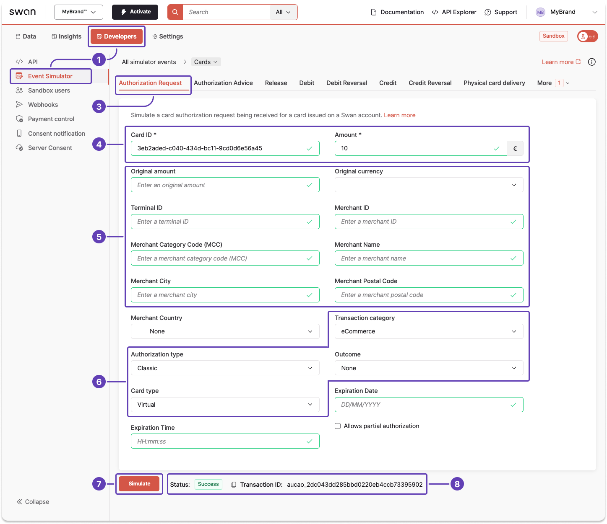
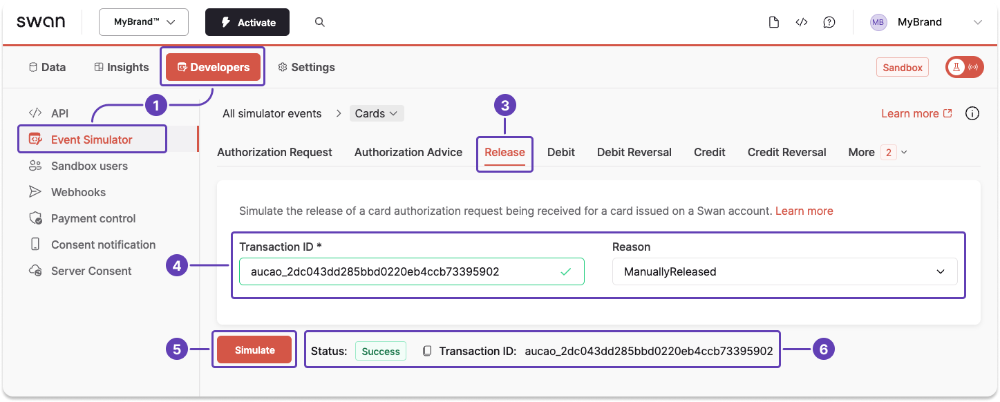

# Sandbox for card payments

When testing your integration, you might need to simulate certain events with the [Event Simulator](../../../developers/tools/event-simulator.mdx).

:::tip 
Use the Event Simulator to **test other events** related to card payments, such as receiving incoming and outgoing card payments, reversing incoming and outgoing card payments, and more.
:::

## Simulate an authorization request {#simulate-authorization}

Simulating receiving authorization for a card payment by entering testing data...

1. Go to **Dashboard** > **Developers** > **Event Simulator**.
1. Go to **Cards** (not shown).
1. Go to the tab for an **authorization request**.
1. Enter required information: your Swan card ID and the amount you'd like to authorize.
1. Enter any testing data you'd like to include in the simulation, such as a merchant or terminal ID, a valid merchant category code, a location, and more.
1. Change the transaction category, authorization type, outcome, and card type to test different situations.
1. Click **Simulate**.
1. After clicking **Simulate**, notice the status change to `Success`, meaning your authorization request was successful.

## Simulate a clearing {#simulate-clearing}

1. Go to **Dashboard** > **Developers** > **Event Simulator**.
1. Go to **Cards** (not shown).
1. Go to the tab for an **release**.
1. Enter the transaction ID and choose the reason the authorization is being released.
1. Click **Simulate**.
1. After clicking **Simulate**, notice the status change to `Success`, meaning your authorization was executed successfully.

