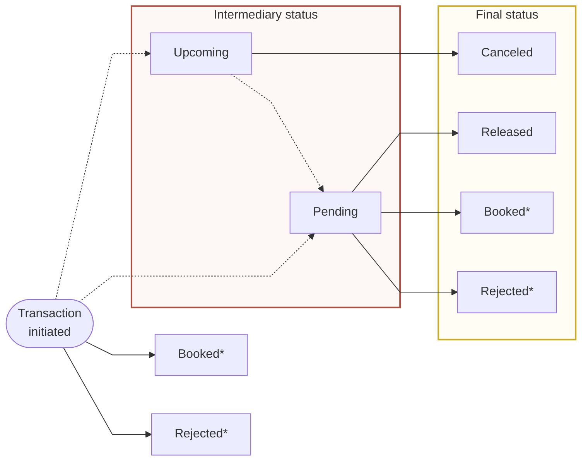

import PartialExample from '../../../_empty.mdx';

# About credit transfers

Swan supports several types of transfers:

1. SEPA credit transfers
1. SEPA instant credit transfers
1. Internal credit transfers
1. International transfers
1. Recurring transfers (standing orders)

## SEPA credit transfers

A SEPA credit transfer (SCT) is a transfer that occurs between two accounts located in the Single Euro Payments Area (SEPA).
SEPA includes all countries in the European Union, as well as the United Kingdom, Iceland, Lichtenstein, Norway, and Switzerland.

There are two types of standard SEPA credit transfers:

* **SCT in**: incoming SEPA credit transfers using the mutation `SepaCreditTransferIntype`
* **SCT out**: outgoing SEPA credit transfers using the mutation `SepaCreditTransferOuttype`

:::info**Beneficiary verification for SEPA credit transfers**
Swan verifies all beneficiaries of outgoing SEPA credit transfers.
To do so, we closely examine the IBAN.
Until this verification is complete, the account sending the outgoing SEPA credit transfer has a limited payment level. 

The only accounts that can receive an outgoing SEPA credit transfer immediately is an account the Account Holder owns with a different financial institution. 
:::

## SEPA instant credit transfers

<PartialExample />

## Internal credit transfers

An internal credit transfer is an instant transfer that occurs between two Swan accounts.

:::caution
If the account owner is still in the verification process, their account has the status `paymentLevel=Limited`.

Accounts with the status `paymentLevel=Limited` have a 150€ spending limit over 30 days rolling, and can only purchase goods and services for consumption.
If you initiate an internal credit transfer with a Swan account that has the status `paymentLevel=Limited`, it will be rejected.
:::

## International transfers

<PartialExample />

## Standing orders

<PartialExample />

## Transaction statuses for credit transfers

⚠️ MERMAID DIAGRAM IS NOT UPDATED FOR CREDIT TRANSFERS ONLY ⚠️

