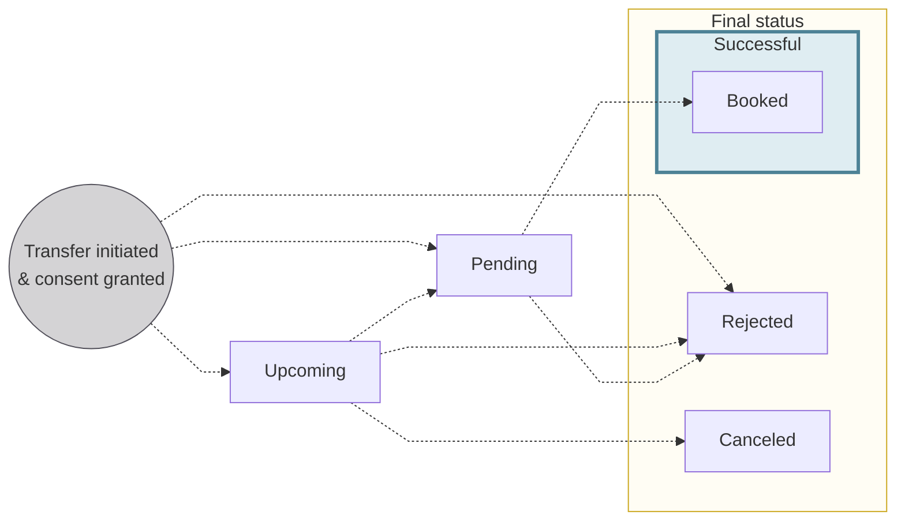
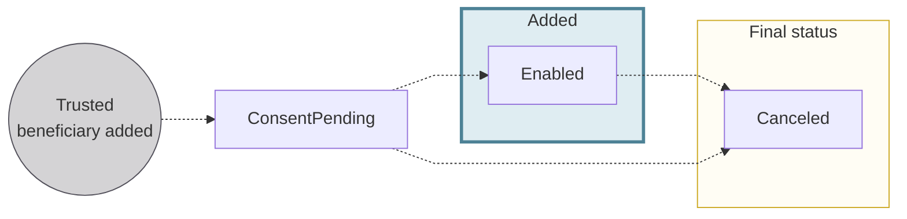
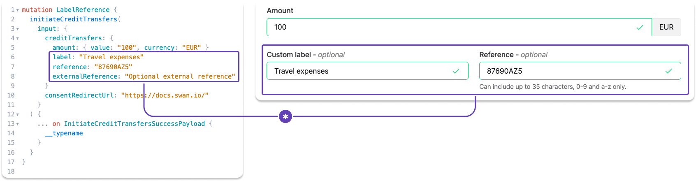

# Credit transfers

Transfer money between accounts around the world, whether in euros or multiple currencies.

## Types of credit transfers {#types}

Swan offers **two main types** of credit transfers.
Each type has its own rules, capabilities, and APIs.

Refer to the dedicated sections to understand each type and how they work at Swan:

| Transfer type | Description |
| --- | --- |
| [**SEPA Credit Transfers**](./sepa/index.mdx) | Send and receive money using **euro**-based accounts and the [**SEPA network**](../index.mdx#sepa)  Includes: <ul><li>**Instant** SEPA Credit Transfers</li><li>**Standing Orders** on the SEPA network</li><li>Swan **Internal** Credit Transfers</li></ul> |
| [**International Credit Transfers**](./international/index.mdx) | Send and receive money from around the world in over **40 currencies** using **local payment rails** and **SWIFT** |

## Credit transfer statuses {#statuses}

:::info Account balances
There's a **close link** between **transaction statuses** and **account balances**.
Refer to explanations of types of account balances in the [accounts section](../../accounts/index.mdx#balances).
:::

| Transfer transaction status | Explanation |
|---|---|
| `Upcoming` | Transfers are initiated and consent was granted, but the transfers aren't executed yet. Often, this is because the transfer was planned for a future date using the `requestedExecutionAt` input. `Upcoming` transfers don't impact the account balance.  *International Credit Transfers can't be `Upcoming`* |
| `Pending` | Transfers are initiated, consent was granted, and the transfer is set to happen within a few days. The transfers aren't debited from the account yet, but they impact the account's `Pending` balance.  Sometimes, transfers might stay `Pending` for longer than expected. This could be for a few reasons, including the possibility that the transaction required a manual review from Swan, or a SEPA Credit Transfer was initiated on a [TARGET closing day](../index.mdx#sepa-availability). |
| `Booked` | Completed credit transfers that are displayed on the official account statement. These transfers have been debited from the account, and they impact the account's `Booked` balance. |
| `Canceled` | An `Upcoming` transaction is canceled by someone with the right to do so, such as the [account holder](../../onboarding/account-holders/index.mdx) or an [account member](../../accounts/memberships/index.mdx). Only transfers with the status `Upcoming` can be `Canceled`, and `Canceled` transfers don't impact the account balance. |
| `Rejected` | Declined or refused transfers. For example, the beneficiary account might be closed, or the account's `Available` balance isn't sufficient to complete the transfer without resulting in a negative balance. |

:::caution Standing Orders
[Statuses for Standing Orders](./sepa/index.mdx#statuses-standing-orders) differ from other credit transfers.
:::

## Beneficiaries {#beneficiaries}

Add **trusted beneficiaries** to accounts to facilitate credit transfers.
Adding trusted beneficiaries also reduces the risk of sending a transfer to an unintended beneficiary.

You can **add trusted beneficiaries with the API**, either with a dedicated mutation or when initiating a credit transfer.
If you're using Swan's Web Banking interface, eligible account members can add trusted beneficiaries from the app.
Beneficiaries who **aren't added** as trusted are referred to as **unsaved** beneficiaries.

### Beneficiaries & membership permissions {#beneficiaries-permissions}

How account members can interact with beneficiaries depends on their [account membership permissions](../../accounts/memberships/index.mdx#permissions).

| Permission | Beneficiary interaction |
| --- | --- |
| `canViewAccount` | View the list of trusted beneficiaries. |
| `canManageBeneficiaries` | Add trusted beneficiaries. |
| `canInitiatePayments` *with* `canManageBeneficiaries` | Initiate credit transfers to trusted **and** unsaved beneficiaries. |
| `canInitiatePayments` *without* `canManageBeneficiaries` | Initiate credit transfers to trusted beneficiaries **only**. |

### Trusted beneficiary statuses {#beneficiaries-statuses}

| Trusted beneficiary status | Explanation |
|---|---|
| `ConsentPending` | An eligible account member added a trusted beneficiary, either directly (with the dedicated mutation or through Web Banking) or when initiating a transfer.  To finish adding the trusted beneficiary, an account member with the `canManageBeneficiaries` permission must consent with [Strong Customer Authentication (SCA)](../../users/consent/index.mdx#sca). |
| `Enabled` | Consent was received to add the trusted beneficiary. Eligible account members can now initiate transfers to this trusted beneficiary.  |
| `Canceled` | Consent wasn't received to add the trusted beneficiary, or the trusted beneficiary was removed from the list by an eligible account member. |

## Label and reference {#label-reference}

Add custom labels and references numbers to your SEPA and International Credit Transfers with the API, or, if you're using it, Swan's Web Banking interface.

Whether your label and reference entries are visible on other financial institutions' platforms and statements depends on their design.

### Custom label {#label-custom}

- Optional field where you can name your transaction.
- According to SEPA, this label is for remittance information (`RemittanceInfo`), or payment details.
- If left empty, the default value for Web Banking is `Transfer to {beneficiary}`. However, nothing is sent to the beneficiary's bank.
- This value is displayed in your Swan transaction history.
- Your **beneficiary probably sees** this reference, though it's impossible to know because every app is different.
- Called `label` in the API `transaction` object.

### Reference {#reference}

- Optional field intended to provide a way for you to include a reference number or code.
- According to SEPA, this reference should be used for the end-to-end identification reference (`EndToEndId`) used to uniquely identify a transaction from start to finish.
- Only characters 0-9 and a-z are allowed in this field. The total number of characters allowed can change, so refer to your transfer form for the character maximum.
- If left empty, there is no default value. Note that the reference field is mandatory for SEPA inter-bank exchanges, so Swan populates an empty field with something similar to your transaction ID.
- This value will be included in the details of a transaction in your transaction history, but not displayed in the main list.
- Your **beneficiary probably sees** this reference, though it's impossible to know because every app is different.
- Called `reference` in the API `transaction` object.

### External reference {#reference-external}

- With the API, you can also add an external reference.
- Share additional information about a transaction only visible to you.
- Called `externalReference` in the API `transaction` object.

## Guides {#guides}

- [Add a trusted SEPA beneficiary](./sepa/guide-add-beneficiary.mdx)
- [Add a trusted international beneficiary](./international/guide-add-beneficiary.mdx)