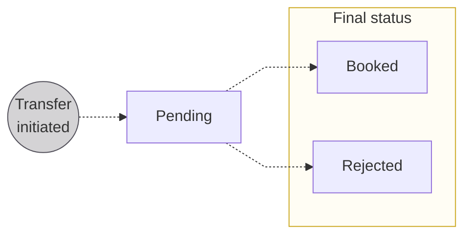
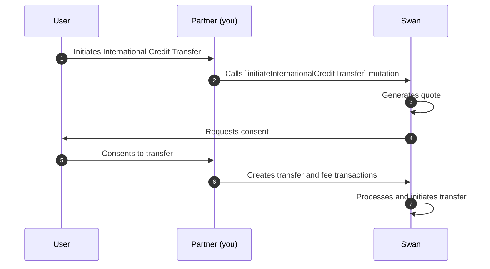
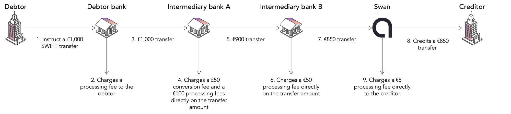

import Tabs from '@theme/Tabs';
import TabItem from '@theme/TabItem';

# International Credit Transfers

## Overview {#overview}

Send and receive money almost anywhere in the world using a Swan International Credit Transfer.

With Swan International Credit Transfers, you can:

Exchange euros for a different currency, then transfer that money on either local rails or the SWIFT network.
1. Transfer euros outside of the eurozone using the SWIFT network.
1. Receive credit transfers initiated outside of the eurozone. You'll receive these transfers in euros as Swan doesn't store money in currency other than euros.

:::tip statuses
International Credit Transfers follow the standard [credit transfer status flow](../index.mdx#statuses) with one exception: they can't have the status `Upcoming`.
:::

## Risk with international transfers {#risk}

International transfers *can* introduce more significant risk than transfers that don't cross borders or change currencies.
Additionally, since more legal jurisdictions are involved, Swan International Credit Transfers must follow regulations for multiple regions.

Potential areas for increased risk and friction include: instability in the target region, diverging requirements for consent or identity documents, different reactions in the case of disputed transactions, fluctuation in currency value and exchange rate, and more.

Therefore, **Swan prioritizes a risk-based approach**, which applies to you and your end users.
In addition to increased scrutiny in the transaction-review process, both automated and manual, Swan uses dynamic forms in the International Credit Transfer API.

### Outgoing allowed countries {#risk-outgoing}

Your users can send International Credit Transfers on **local rails** in **local currencies**.

They can also send International Credit Transfers on the **SWIFT network** `swift_code` using United States Dollars `USD`, Euros `EUR`, or Great British Pounds `GBP`.
Any attempt to send a SWIFT transfer in other currencies is rejected.

<details>
<summary>Allowed countries and rails</summary>

<Tabs>
  <TabItem value="local-currencies" label="🌍 Local currencies & rails" default>
    #### Transfers in local currencies using local rails

    Users can send International Credit Transfers in specific currencies using their corresponding local rails. Each currency has designated available rails and fee groups.

    **Available currencies and rails**:

    | Currency | Available rails | Fee group |
    |----------|----------------|-----------|
    | 🇦🇺 `AUD` Australian Dollar | `australian`, `australian_bpay` | 1 |
    | 🇧🇷 `BRL` Brazilian Real∗ | `brazil` | 3 |
    | 🇨🇦 `CAD` Canadian Dollar | `iban` | 1 |
    | 🇨🇭 `CHF` Swiss Franc | `iban` | 1 |
    | 🇨🇱 `CLP` Chilean Peso | `chile` | 4 |
    | 🇪🇺 `EUR` Euro | `swift_code` | 1 |
    | 🇬🇧 `GBP` Great British Pound Sterling | `iban`, `sort_code`, `swift_code` | 1 |
    | 🇭🇰 `HKD` Hong Kong Dollar | `hongkong`, `hong_kong_fps` | 2 |
    | 🇮🇩 `IDR` Indonesian Rupiah | `indonesian` | 2 |
    | 🇮🇱 `ILS` Israeli New Shekel | `israeli_local` | 4 |
    | 🇮🇳 `INR` Indian Rupee | `indian`, `indian_upi` | 2 |
    | 🇯🇵 `JPY` Japanese Yen | `japanese` | 2 |
    | 🇰🇷 `KRW` South Korean Won | `south_korean_paygate`, `south_korean_paygate_business` | 3 |
    | 🇲🇽 `MXN` Mexican Peso | `mexican` | 2 |
    | 🇲🇾 `MYR` Malaysian Ringgit∗ | `malaysian`, `malaysian_duitnow` | 2 |
    | 🇳🇿 `NZD` New Zealand Dollar | `newzealand` | 1 |
    | 🇸🇬 `SGD` Singapore Dollar | `singapore`, `singapore_paynow` | 2 |
    | 🇹🇭 `THB` Thai Baht | `thailand` | 2 |
    | 🇺🇸 `USD` United States Dollar | `fedwire_local`, `aba`, `swift_code` | 1 |
    | 🇺🇾 `UYU` Uruguayan Peso | `uruguay` | 4 |
    | 🇻🇳 `VND` Vietnamese Dong | `vietnam_earthport` | 2 |

    ∗ *Currencies marked with a single asterisk can't be sent from a Swan company account.*

    **Important**: Attempts to send currencies using rails not listed in this table are rejected. For example, Indonesian Rupiah `IDR` can only be sent on the `indonesian` rail.
  </TabItem>

  <TabItem value="swift-usd" label="🇺🇸 Swift + USD">
    #### <code>swift_code</code> + 🇺🇸 United States Dollars <code>USD</code>

    Users can send International Credit Transfers in United States Dollars `USD` using the `swift_code` rail to specific countries listed below. Fee group: 1.

    **Allowed countries for Swift + USD transfers**:

    | First letter | Allowed countries |
    |-------------|-------------------|
    | A - B | Albania, Algeria, Andorra, Angola, Antigua and Barbuda, Argentina, Armenia, Australia, Austria, Azerbaijan, Bahrain, Barbados, Belgium, Bhutan, Bolivia, Bosnia & Herzegovina, Brunei Darussalam, Bulgaria, Burkina Faso |
    | C - E | Canada, Cambodia, Chile, China, Christmas Island, Cocos (Keeling) Islands, Cook Islands, Costa Rica, Côte d'Ivoire, Croatia, Cyprus, Czech Republic, Denmark, Dominica, Dominican Republic, Ecuador, El Salvador, Estonia, Ethiopia |
    | F - G | Falkland Islands (Malvinas), Faroe Islands, Fiji, Finland, France, French Guiana, French Polynesia, Gabon, Gambia, Georgia, Germany, Ghana, Gibraltar, Greece, Greenland, Grenada, Guadeloupe, Guatemala, Guernsey, Guinea, Guyana |
    | H - L | Haiti, Holy See (Vatican City State), Honduras, Hong Kong (locally with the CHATS system), Hungary, Iceland, India, Indonesia, Ireland, Isle of Man, Israel, Italy, Jamaica, Japan, Jersey, Kazakhstan, Kenya, Kiribati, Kuwait, Laos, Latvia, Liberia, Liechtenstein, Lithuania, Luxembourg |
    | M - O | Macedonia (Republic of North), Malawi, Malaysia, Malta, Marshall Islands, Martinique, Mauritania, Mauritius, Mayotte, Mexico, Micronesia (Federated States of), Monaco, Montenegro, Montserrat, Morocco, Namibia, Nepal, Netherlands, New Caledonia, New Zealand, Niger, Niue, Norfolk Island, Northern Mariana Islands, Norway |
    | P - S | Palau, Papua New Guinea, Paraguay, Peru, Poland, Portugal, Reunion, Romania, Rwanda, Saint Helena, Saint Lucia, Saint Vincent and Grenadines, Samoa, San Marino, Sao Tome and Principe, Senegal, Serbia, Seychelles, Sierra Leone, Singapore, Slovakia, Slovenia, Solomon Islands, South Africa, South Korea, Spain, Sri Lanka, Suriname, Sweden, Switzerland |
    | T - Z | Taiwan (Republic of China), Tajikistan, Tanzania, Thailand, Timor-Leste, Tonga, Tunisia, Turks and Caicos Islands, Tuvalu, Ukraine (both PrivatBank and non-PrivatBank recipients), United Arab Emirates, United Kingdom, Uruguay, Uzbekistan, Vietnam, Wallis and Futuna Islands, Zambia |

    **Important**: Attempts to send United States Dollars `USD` using `swift_code` to countries not listed are rejected.
  </TabItem>

  <TabItem value="swift-eur" label="🇪🇺 Swift + EUR">
    #### <code>swift_code</code> + 🇪🇺 Euros <code>EUR</code>

    Users can send International Credit Transfers in Euros `EUR` using the `swift_code` rail to specific countries listed below. Fee group: 1.

    **Allowed countries for Swift + EUR transfers**:

    | First letter | Allowed countries |
    |-------------|-------------------|
    | A - B | Albania, Algeria, American Samoa, Andorra, Angola, Antigua and Barbuda, Argentina, Armenia, Aruba, Australia, Azerbaijan, Bahrain, Bangladesh, Barbados, Benin, Bermuda, Bhutan, Bolivia, Bosnia and Herzegovina, Brunei Darussalam, Burkina Faso |
    | C - E | Cambodia, Cape Verde, Chile, China, Christmas Island, Cocos (Keeling) Islands, Cook Islands, Costa Rica, Côte d'Ivoire, Dominica, Dominican Republic, Ecuador, Egypt, El Salvador, Ethiopia |
    | F - G | Falkland Islands (Malvinas), Faroe Islands, Fiji, French Polynesia, Gabon, Gambia, Georgia, Ghana, Greenland, Grenada, Guatemala, Guernsey, Guyana |
    | H - L | Haiti, Holy See (Vatican City State), Honduras, Hong Kong, SAR China (locally with the CHATS system), India, Indonesia, Israel, Jamaica, Japan, Jersey, Kazakhstan, Kenya, Kiribati, South Korea, Kosovo, Kuwait, Lao PDR, Lesotho, Liberia |
    | M - O | Macedonia (Republic of North), Malawi, Malaysia, Maldives, Marshall Islands, Mauritania, Mauritius, Mexico, Micronesia (Federated States of), Moldova, Montenegro, Montserrat, Morocco, Mozambique, Namibia, Nepal, New Caledonia, New Zealand, Niger, Niue, Norfolk Island, Oman |
    | P - S | Palau, Papua New Guinea, Paraguay, Peru, Qatar, Rwanda, Saint Helena, Saint Lucia, Saint Vincent and Grenadines, Samoa, San Marino, Sao Tome and Principe, Saudi Arabia, Senegal, Serbia, Seychelles, Sierra Leone, Singapore, Solomon Islands, South Africa, Sri Lanka, Suriname |
    | T - Z | Taiwan (Republic of China), Tajikistan, Tanzania (United Republic of), Thailand, Timor-Leste, Tonga, Tunisia, Tuvalu, Ukraine, United Arab Emirates, United Kingdom, United States of America, Uruguay, Uzbekistan, Vietnam, Wallis and Futuna Islands, Zambia |

    **Important**: Attempts to send Euros `EUR` using `swift_code` to countries not listed are rejected.
  </TabItem>

  <TabItem value="swift-gbp" label="🇬🇧 Swift + GBP">
    #### <code>swift_code</code> + 🇬🇧 Great British Pounds <code>GBP</code>

    Users can send International Credit Transfers in Great British Pounds `GBP` using the `swift_code` rail to specific countries listed below. Fee group: 1.

    **Allowed countries for Swift + GBP transfers**:

    | First letter | Allowed countries |
    |-------------|-------------------|
    | A - L | Albania, Aruba, Azerbaijan, Bahrain, Bangladesh, Bermuda, Bosnia and Herzegovina, Cape Verde, Costa Rica, Dominican Republic, Egypt, Faroe Islands, Georgia, Greenland, Guatemala, Guernsey, Jersey, Kazakhstan, Kosovo, Kuwait, Israel, Lesotho |
    | M - Z | Maldives, Moldova, Montenegro, Mozambique, Mauritania, Mauritius, North Macedonia, Oman, Qatar, Saint Lucia, Serbia, Saudi Arabia, Seychelles, Sao Tome and Principe, Tunisia, Timor-Leste, Ukraine, United Arab Emirates (UAE) |

    **Important**: Attempts to send Great British Pounds `GBP` using `swift_code` to countries not listed are rejected.
  </TabItem>

  <TabItem value="incoming" label="📥 Incoming transfers">
    #### Allowed countries for incoming International Credit Transfers

    Incoming International Credit Transfers are **only allowed** from accounts located in the following countries.
    If a country **isn't on the following list**, incoming transfers are rejected.

    | First letter | Allowed countries |
    |--------------|------------------|
    | A - G | Algeria, Andorra, Armenia, Aruba, Australia, Austria, Bahrain, Belgium, Brazil, Canada, Chile, Colombia, Cyprus, Czechia, Denmark, Dominican Republic, Estonia, Finland, France, Georgia, Germany, Greece, Guatemala, Guyana |
    | H - O | Honduras, Hong Kong, Iceland, India, Indonesia, Ireland, Israel, Italy, Japan, Liechtenstein, Lithuania, Luxembourg, Malaysia, Malta, Martinique, Mayotte, Mexico, Moldova, Netherlands, New Zealand, Norway |
    | P - Z | Paraguay, Peru, Poland, Portugal, Romania, San Marino, Singapore, Slovakia, Slovenia, South Korea, Spain, Sweden, Switzerland, Thailand, United Kingdom of Great Britain and Northern Ireland, United States of America, Uruguay, Uzbekistan |

    **Important**: Incoming transfers from countries not on this list are rejected.
  </TabItem>
</Tabs>
</details>

## Fees {#fees}

There are fees for executing international transfers according to the non-euro currency selected.

Each eligible currency is **assigned to a fee group**, numbered 1 through 4.
Swan determined the groups based on how much it costs to execute a transfer with that currency.
For example, it costs less to execute a transfer between euros and a currency in fee group 1 than with a currency in fee group 3.
The [lists of allowed countries for outgoing transfers](#risk-outgoing) include each currency's fee group.

The fees listed on this page are always paid by the **Swan user**.

| Fee group | Outgoing transfer fee ∗ | Incoming transfer fee ∗∗ |
| --- | --- | --- |
| Group 1 | 5€ + 0.6% | 5€ (+ 0.6%) |
| Group 2 | 5€ + 1% | 5€ (+ 1%) |
| Group 3 | 5€ + 2% | 5€ (+ 2%) |
| Group 4 | 5€ + 5% | 5€ (+ 5%) |

∗ For outgoing transfers, an **additional** 5€ fee is charged when sending **USD**, **GBP**, and **EUR** through SWIFT. For these currencies, the total fee is 10€ + the percentage % indicated in the table.<br />
∗∗ For incoming transfers, the additional fee percentage (in parentheses) only applies to transfers not already converted into euros.

**Fees are charged in their own transaction**.
Therefore, each International Credit Transfer **creates two transactions** on your transaction history: one for the transfer and one for fees.
Fees and transfer transactions are created, booked, and rejected simultaneously.
Both transactions have the same status.

:::note Fees can vary
This section shares Swan's **standard pricing**, which might vary based on your contract.
:::

## Outgoing transfers {#outgoing}

### Payment rails {#outgoing-rails}

Initiate transfers using one of two payment rails: **local** or **SWIFT**.
Choose your rail when declaring your beneficiary.

| Payment rail | Description | Benefit |
| --- | --- | --- |
| **Local bank transfers** | <ul><li>Pay beneficiaries out of a local bank account</li><li>Example: a transfer to the UK would be paid out of an account based in GBP already in the UK</li></ul> | Faster, less expensive |
| **SWIFT network** | <ul><li>SWIFT: Society for Worldwide Interbank Financial Telecommunication</li><li>Messaging network used by banks worldwide to send and receive financial information</li><li>Takes a bit longer and might involve intermediary banks</li></ul> | Wider availability |

### Currency exchange {#outgoing-currency-exchange}

Transferring money internationally requires **currency exchange**.
Think of currency exchange as the cost of selling one currency to purchase another.

Currency exchange is **always charged for outgoing transfers**.
Swan uses a **mid-market rate**, or the midpoint between the buy and sell prices for the two currencies involved in a transfer, with **no added spread**.
For outgoing International Credit Transfers, the `exchangeRate` is determined when a transfer is initiated.

After initiating the transfer, the **exchange rate is locked for one business day**, even if the market rate changes.
During this time, users must provide consent to execute the transfer.
If the day passes without consent, Swan no longer guarantees the exchange rate.
Therefore, the transfer will be rejected and the user would need to initiate a new transfer.

Find the exchange rate, as well as fees, in the success payload of the `initiateInternationalCreditTransfer` mutation, as well as when consenting to the transfer.

### Outgoing transaction statuses {#outgoing-statuses}

Outgoing International Credit Transfers cycle through three possible transaction statuses.



| Status | Explanation |
| --- | --- |
| `Pending` | Status assigned when the transfer is initiated; the transfer retains the status `Pending` while the transactions associated with the transfer follow the standard transaction status flow |
| `Booked` | Funds arrived in the beneficiary's account |
| `Rejected` | Transfer isn't executed for any of several reasons, including insufficient funds, lack of consent, and more |

### Rejected transactions {#outgoing-r-transactions}

There are several reasons an International Credit Transfer might be **rejected**.
For example, some of the account or bank details might be incorrect, the account might be closed, or a required mandate was never provided.

However, a common reason for all rejections is **insufficient funds**.

For all outgoing International Credit Transfers, Swan checks the account balance to make sure there is enough money to cover both the transfer amount and the fees.
If there isn't enough money in the account to **cover both the transfer amount and the fees**, the transfer will be **rejected** for insufficient funds.

If a transfer is **rejected**, fees aren't charged.
If a transfer is **returned**, fees are also refunded.

### Outgoing sequence diagram {#outgoing-diagram}



## API dynamic forms {#dynamic-forms}

Swan's outgoing International Credit Transfer API uses dynamic forms.

Dynamic forms mean that the **information requested changes** based on the information you submit in each query.
For example, the required information will be different for a beneficiary in India than for a beneficiary in the UK.

### Integrating dynamic forms {#dynamic-forms-integrate}

Dynamic forms make this feature **more challenging to integrate** for your custom integrations.

In your integration, you should only request the most basic information per query, as shown in the API Explorer.
Specific logic is then required to retrieve the correct key/value pairs according to the information submitted in the dynamic fields.

The concept of **refreshable dynamic fields** is illustrated in the [guide to get beneficiary information](./guide-beneficiary.mdx). 

:::caution If they're more complex, why use dynamic forms?

Dynamic forms allow Swan to **collect only required information** from your end users, collected in the format of key/value pairs.
Some locations require a few key/value pairs while others might require 10 or more.

Since the required information changes frequently and is outside of Swan's control, **dynamic forms provide the best way** to only collect the correct information, which also minimizes risk and ensures secure transactions.
:::

### Query and mutation order {#dynamic-forms-order}

Due to these dynamic forms, it's critical to **run the queries in order** *before* running the mutation.

1. Optionally, [**get a quote**](./guide-quote.mdx).
    - This query provides a quote for the exchange rate and fees.
    - The quote isn't guaranteed.
1. Next, get the list of required key/value pairs for your [**beneficiary**](./guide-beneficiary.mdx).
    - They're based on the target currency and the beneficiary's country of residence.
1. Then, get the list of required key/value pairs for your [**transaction**](./guide-transaction-details.mdx).
    - They're based on the transfer's destination.
1. Finally, [**initiate your transfer**](./guide-initiate.mdx).

## Incoming transfers {#incoming}

Debtors can send credit transfers to Swan accounts, regardless of the debtor's account currency.
Swan's existing [Bank Identifier Codes (BICs)](../../../accounts/ibans/index.mdx#local) are connected to SWIFT, so Swan users don't need an additional IBAN to receive SWIFT transfers.

<details>
  <summary>Swan and intermediary bank details for incoming transfers</summary>
  <div>
<ul><li>Swan address<ul><li>Name: Swan SAS</li><li>Address: 95 Avenue du Président Wilson</li><li>Postal code: 93100</li><li>City: Montreuil</li><li>Country: France</li></ul></li><li>Swan BIC and SWIFT code: `SWNBFR22`</li><li>Intermediary information:<ul><li>SWIFT: `TRWIBEB3`</li><li>Name: Wise Europe SA</li><li>Country: Belgium</li></ul></li></ul>
  </div>
</details>

### Standard flow {#incoming-flow}

Consider the following image:



1. Debtor initiates a transfer of £1,000 (GBP) to a Swan account.
1. Debtor's bank charges them a processing fee.
1. Debtor's bank then passes the £1,000 to a first intermediary bank.
1. Swan only has euro-based accounts, so intermediary bank A converts the transfer from GBP to EUR.
    - They charge a £50 fee to convert the currency.
    - They charge an additional €100 (EUR) processing fee.
    - Since the transfer was initiated with shared fees, intermediary bank A deducts their fees directly from the transfer amount.
1. Intermediary bank A then passes the transfer on to a second intermediary bank.
    - After the conversion and the fee deduction, €900 remains.
1. Intermediary bank B charges a €50 processing fee and deducts it from the transfer amount.
1. Intermediary bank B passes the transfer on to Swan.
    - After the conversion and the fee deduction, €850 remains.
1. Swan books the incoming SWIFT transfer's remaining amount (€850) immediately to the Swan user's account.
1. Swan charges a €5 processing fee separately from the transfer.

### SWIFT details {#incoming-swift}

Incoming International Credit Transfers sent on SWIFT can be sent with one of the following specifications:

1. **`SHA`**: Splits fees between the debtor and their beneficiary. For instance, the payer might pay the fees charged by their bank and the beneficiary might pay the intermediary banks fees. The standard flow example uses `SHA`.
1. **`BEN`**: All fees paid by the beneficiary by deducting them from the transaction amount.
1. **`OUR`**: All fees paid by the debtor. Some banks might not respect this, though, so it’s possible to receive an intermediary bank fee as a beneficiary anyway.

### Booked transfers {#incoming-booked}

When Swan receives an incoming International Credit Transfer, Swan books it immediately and creates a `InternationalCreditTransferTransaction` type (step 8 in the standard flow described).

Use the `transactions` query with the ID for your International Credit Transfer to [get information](./guide-get-info.mdx).

### Notifications {#incoming-notifications}

You can use the `Transaction.Booked` [webhook](../../../../developers/using-api/webhooks.mdx) to be notified any time a transaction is created.

```json {3,5,7} ShowLineNumbers
{
  "eventDate": "2023-11-22T14:25:32.133Z",
  "eventId": $WEBHOOK_EVENT_ID,
  "eventType": "Transaction.Booked",
  "projectId": $YOUR_PROJECT_ID,
  "secret": null,
  "resourceId": $INCOMING_TRANSACTION_ID,
  "retryCount": 0
}
```

### Currency exchange {#incoming-currency-exchange}

Transferring money internationally requires **currency exchange**.
Think of currency exchange as the cost of selling one currency to purchase another.

For incoming transfers, you can view the `exchangeRate` in the `InternationalCreditTransferTransaction` type, created when the [transaction is booked](#incoming-booked).

Other currency exchange information isn't available for incoming transfers.

Typically, incoming transfers arrive in euros.
If Swan performs the currency exchange, the additional fees in parentheses listed in the [fees table for incoming transfers](#fees) are charged.
For example, if Swan receives a transfer in United States Dollars, 0.6% of the received amount is charged along with the standard €5 fee.

## Guides {#guides}

- Outgoing transfers
    - [Get a quote](./guide-quote.mdx)
    - [Get beneficiary information](./guide-beneficiary.mdx)
    - [Get transaction details](./guide-transaction-details.mdx)
    - [Initiate an outgoing International Credit Transfer](./guide-initiate.mdx)
- [Get information about a transfer](./guide-get-info.mdx)
- [Add a trusted international beneficiary](./guide-add-beneficiary.mdx)
- [Sandbox](./sandbox.mdx), including how to simulate receiving an incoming International Credit Transfer
