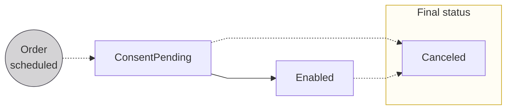

# SEPA Credit Transfers

## Overview {#overview}

Transfer euros between accounts located in the [Single Euro Payments Area (SEPA)](../../index.mdx#sepa).

This page covers several transfer types.
Note the acronyms; while the documentation doesn't use them, the acronyms are sometimes present in the API and used in written and verbal communication.

| Transfer type | Description | Acronym |
| --- | --- | --- |
| SEPA Credit Transfers | Transfers up to 1 cent less than a billion euros within SEPA that take up to 48 business hours to complete  | SCT |
| Instant SEPA Credit Transfers | Transfers up to 100,000 euros within SEPA that are executed in 10 seconds | SCT Inst |
| Swan Internal Credit Transfers | Transfers between two Swan accounts in the same project that are almost as quick as instant transfers | *None* ∗ |
| Standing Orders | Scheduled, recurring transfers within SEPA that can be instant or regular | *None* |

∗ *If you see the acronym **ICT**, it's probably referring to [International Credit Transfers](../international/index.mdx), not Swan Internal.*

### Consent {#consent}

Initiating credit transfers is a [sensitive operation](../../../consent/index.mdx#sensitive) and requires consent from an authorized representative of the debtor account, such as the [account holder](../../../../glossary.mdx#account-holder), the account's [legal representative](../../../../glossary.mdx#legal-representative), or an account member with the `canInitiatePayments` [membership permission](../../../accounts/memberships/index.mdx#permissions).

### Transactions {#transactions}

The Swan API has four transaction options for instant and regular SEPA Credit Transfers:

- Incoming transfers: `SepaCreditTransferIn` + `SepaInstantCreditTransferIn`
- Outgoing transfers: `SepaCreditTransferOut`+ `SepaInstantCreditTransferOut`

Note that Swan Internal Credit Transfers use the same transactions as regular SEPA Credit Transfers.

### Risk and credit transfers {#risk}

All credit transfers pass through an automated risk assessment.
If the automated assessment flags the transfer, it triggers a manual review by Swan.

If one of your transactions is flagged, Swan might contact you for more information.
Due to the manual review, flagged SEPA Credit Transfers take longer to execute.

### Transfer limitations {#limitations}

1. Credit transfers can't be sent if [**account holder verification**](../../../onboarding/account-holders/index.mdx#verification-process) is still **in progress**.
While finalizing verification, the account's `paymentLevel` is `Limited` and the `initiateCreditTransfers` mutation returns an error.
1. Swan accounts aren't designed to have a **negative balance**. Therefore, Swan checks an account's `Available` balance before executing credit transfers every time. If there isn't enough in the account, the transfer is rejected for insufficient funds.
1. For all outgoing transfers, Swan **validates the beneficiary's IBAN**.
You can [check the format of your IBANs](../../../accounts/ibans/guide-validate.mdx) with the API before using them to send a transfer.
1. If you'd like to plan credit transfers in advance, you can do so **up to one year in the future** using the `requestedExecutionAt` input when initiating your transfer.

## Instant SEPA Credit Transfers {#instant}

The speedy version of SEPA Credit Transfers, Instant SEPA Credit Transfers have three key characteristics:

1. A maximum execution time of 10 seconds.
1. A maximum transaction amount of 100,000.00€ (one hundred thousand) euros.
1. Availability 24 hours a day, 7 days a week, 365 days a year, including when [SEPA is unavailable](../../index.mdx#sepa-availability) for other transaction types.

### Fallback mode {#instant-fallback}

Instant transfers aren't accepted everywhere, and sometimes, the networks time out or fail.

Therefore, Swan implemented a `mode` for instant transfers allowing you to choose how to react if the instant transfer doesn't work as expected.
There are three possible modes.

| Mode | Description |
| --- | --- |
| `InstantWithoutFallback` | When an Instant SEPA Credit Transfer is rejected, the transaction is rejected and your user must initiate a new transaction themselves.  In choosing `WithoutFallback`, you'll **abandon the transfer** if it can't be instant. |
| `InstantWithFallback` | When an Instant SEPA Credit Transfer is rejected, the transfer is **reinitiated automatically** as a **regular** SEPA Credit Transfer instead, with few exceptions. ∗  When a transfer falls back, two transactions appear on the transaction history. ∗∗  |
| `Regular` | Use a regular, non-instant SEPA Credit Transfer from the beginning, which can take up to two business days to arrive (it's usually quicker, though). |

∗ If the recipient's account can't be found, the account is closed, or the account holder is deceased, a regular transfer won't be initiated.

∗∗ When an instant transfer falls back to a regular transfer, you'll see two transactions on your transaction history by default: a rejected `SepaInstantCreditTransferOut` and a new `SepaCreditTransferOut`.
When calling the `transactions` query, use the filter `includeRejectedWithFallback=false` so your users won't see the rejected instant transfer on their transaction history.

### Transfer verification {#instant-verification}

Every time a Swan user initiates an Instant SEPA Credit Transfer, Swan verifies the transfer in real-time.

#### Reachability {#instant-verification-reachability}

Swan **confirms reachability**, meaning Swan makes sure the beneficiary's bank can accept the transfer.

Swan uses the EBA-RT1 and TIPS Clearing & Settlement Mechanisms (CSM), which are two of the major CSMs for Instant SEPA Credit Transfers accounting for 90% of the total reachability.
Instant SEPA Credit Transfers sent from Swan accounts can be sent to banks connected to either EBA-RT1 or TIPS, but they can't be sent if banks don't use at least one of these CSMs.

Attempts to send Instant SEPA Credit Transfers to banks not connected to EBA-RT1 or TIPS are rejected with the reason `BeneficiaryBankNotReachable`.
If you chose `InstantWithFallback` when setting up your transfer, we'll send it as a regular transfer.
Otherwise, you'll need to initiate a new transfer.

#### Risk {#instant-verification-risk}

All credit transfers pass through an automated risk assessment, explained in the [section about risk](#risk).
Unlike regular transfers, however, if an instant transfer is flagged, it's `Rejected` immediately with the reason code `RegulatoryReason`.

Swan can't guarantee an instant review, therefore removing the key element of an Instant SEPA Credit Transfer: instantaneity.
If the `mode` `InstantWithFallback` was chosen when initiating the transfer, a new regular transfer is created automatically.

## Swan Internal Credit Transfers {#internal}

Swan Internal Credit Transfers are executed between two accounts in the **same Swan project**.

Internal transfers are usually quicker than SEPA Credit Transfers.
Otherwise, SEPA Credit Transfers and Internal Credit Transfers function almost identically within Swan, and both use the payment product SEPA Credit Transfer, displayed on your **Dashboard** > **Data** > **Accounts** > **Transactions** list.

## Standing Orders {#standing-orders}

Standing orders are scheduled, recurring credit transfers, that, at Swan, are sent on the SEPA network.
Schedule them on a daily, weekly, or monthly basis.
Standing Orders can be sent as SEPA Credit Transfers or Instant SEPA Credit Transfers, and [fallback](#instant-fallback) applies for Standing Orders sent instantly.

As with all credit transfers, setting up a Standing Order is a [sensitive operation](../../../consent/index.mdx#sensitive).
After the initial consent, however, subsequent Standing Orders are sent as scheduled without further consent.

Swan offers two types of Standing Orders:

| Type | Description | Example |
| --- | --- | --- |
| **Fixed amount** | Choose a specific amount to send to your beneficiary on a recurring basis. | Transfer 500€ each month to cover a car payment. |
| **Target balance** | Choose how much money you'd like to remain in your account after the Standing Order is sent. Send the remaining balance to your beneficiary. | Transfer everything above 1,000€ to another account at the end of each day. |

### Standing Order statuses {#statuses-standing-orders}

Unlike other [credit transfer status flows](../index.mdx#statuses), Standing Orders only cycle through three statuses.

| Status | Explanation |
| --- | --- |
| `ConsentPending` | Standing Order was scheduled but consent hasn't been received. |
| `Enabled` | Consent for the Standing Order was received, the order is executed as scheduled indefinitely according to its configuration. |
| `Canceled` | Either the Standing Order was canceled or consent was refused. |

## R-transactions {#r-transactions}

After credit transfers are initiated, other transactions, such as R-transactions, can be linked to the credit transfer transaction.

### Returned {#returned}

Outgoing credit transfers might be **returned to Swan** for several reasons.
For example, the beneficiary account might be closed or not exist at all.
When a transfer is returned, a `SepaCreditTransferOutReturn` transaction is created to credit the money back to the Swan account.

Additionally, incoming credit transfers might need to be **returned to the debtor**.
For example, the account owner might have refused to consent to the transfer after the money was credited to the Swan account.
When Swan needs to return a transfer, a `SepaCreditTransferInReturn` transaction is created to debit the money from the Swan account.

### Recalled {#recalled}

Recalls typically occur when the debtor sends a transfer by mistake, but doesn't notice until it's too late to cancel the transfer or perform a return.

Recalls **work the same way** for SEPA Credit Transfers and Instant SEPA Credit Transfers, except the word `Instant` is added to the transaction type for instant transfers (shown in \{curly brackets}).

#### Swan receives a recall request {#recalled-received}

A debtor might ask their bank to recall their transfer to a Swan account.

In this case, the debtor's bank sends Swan a recall request, after which Swan asks the Swan account holder if they accept the recall request.
The Swan account holder has the choice to accept the recall request or not.
If the Swan account holder accepts the recall request and their `Available` balance is sufficient to cover the amount, Swan debits the funds from the Swan account and sends them to the debtor.

To do so, a `Sepa{Instant}CreditTransferInRecall` transaction is created with the status `Pending` to debit the money from the Swan account.
After the funds are debited, the status changes to `Booked`.
The `Sepa{Instant}CreditTransferInRecall` transaction is connected to the same payment ID as the original `Sepa{Instant}CreditTransferIn` transaction.

#### Swan requests a recall {#recalled-requested}

A Swan user might ask Swan to recall a credit transfer.

In this case, Swan sends the beneficiary's bank a recall request, asking that the original transaction amount be returned.
The beneficiary's bank notifies the beneficiary of Swan's request, and the beneficiary has the choice to accept the recall request or not.
If the beneficiary accepts the recall request, the funds are credited back to the original Swan account.

To do so, a `Sepa{Instant}CreditTransferOutRecall` transaction is created with the status `Booked` to credit money to the Swan account. 
The `Sepa{Instant}CreditTransferOutRecall` transaction is connected to the same payment ID as the original `Sepa{Instant}CreditTransferOut` transaction.

## Guides {#guides}

- SEPA Credit Transfers and Instant SEPA Credit Transfers
    - [Initiate a credit transfer](./guide-initiate-ct.mdx)
    - [Cancel a credit transfer](./guide-cancel-ct.mdx)
    - [Refund a credit transfer](./guide-refund-ct.mdx)
- Standing Orders
    - [Schedule a Standing Order](./guide-schedule-so.mdx)
    - [Cancel a Standing Order](./guide-cancel-so.mdx)
- [Sandbox](./sandbox.mdx)