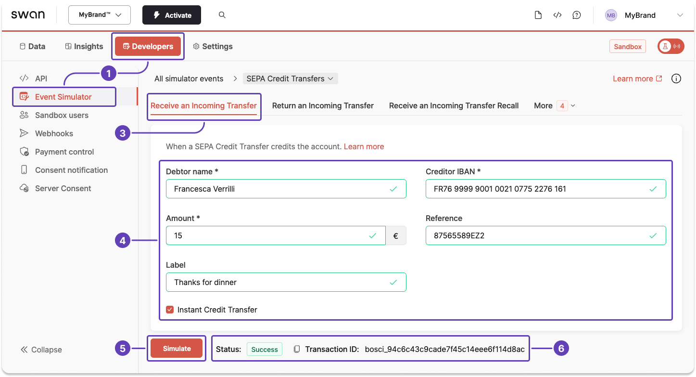

# Sandbox for SEPA Credit Transfers

When testing your integration, you might need to simulate certain events with the [Testing API](../../../../developers/tools/testing-api.mdx) and the [Event Simulator](../../../../developers/tools/event-simulator.mdx).

## Simulate receiving a SEPA Credit Transfer {#simulate-sct-in}

Simulating receiving a SEPA Credit Transfer creates a new payment as well as a `SepaCreditTransferIn` transaction, which are both instantly visible on Swan's interfaces.

1. Go to **Dashboard** > **Developers** > **Event Simulator**.
1. Go to **SEPA Credit Transfer** (not shown).
1. Go to the tab to **receive an incoming transfer**.
1. Enter your testing data, including a debtor name, creditor IBAN, and amount. Optionally, add a reference and label to see how these elements are displayed within Swan.
1. Click **Simulate**.
1. After clicking **Simulate**, notice the status change to `Success`, meaning you sent your simulated transfer successfully.

:::tip
Use the Event Simulator to **test other events** related to SEPA Credit Transfers, such as receiving an incoming transfer recall request, rejecting an outgoing transfer, and more.
:::
