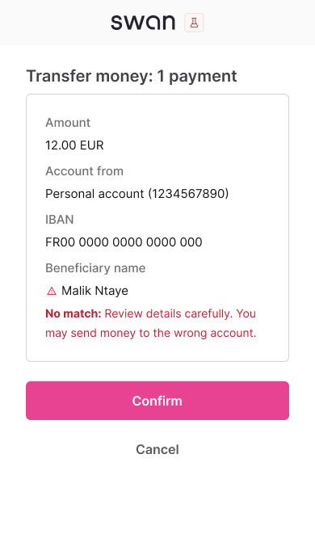

import Tabs from '@theme/Tabs';
import TabItem from '@theme/TabItem';

# Verification of Payee

Validate beneficiary details before sending SEPA Credit Transfers to reduce fraud and payment errors.

:::info Mandatory compliance
Required for all SEPA Credit Transfers under the [European Instant Payments Regulation (IPR)](https://www.ecb.europa.eu/paym/integration/retail/instant_payments/html/instant_payments_regulation.en.html) published in March 2024, with a mandatory implementation deadline of **October 9, 2025** for all Payment Service Providers (PSPs) in the Eurozone offering SEPA Credit Transfers.
:::

## Overview {#overview}

**Verification of Payee (VoP)** is a new European service that validates beneficiary details against account holder information before initiating SEPA Credit Transfers. This service aims to reduce payment fraud and errors by confirming that the beneficiary details match the account holder registered with the beneficiary's bank.

VoP will be particularly helpful to prevent Authorised Push Payment (APP) scams, where fraudsters impersonate legitimate beneficiaries to misdirect funds.

### Key benefits {#benefits}

For your integration:
- **Reduced disputes**: Prevent misdirected payments and customer support tickets
- **Better user experience**: Build trust through transparent payment verification
- **Operational efficiency**: Fewer payment failures and reversals to handle

For the end-users:
- **Fraud protection**: Ensure the funds go to the intended recipient
- **Error prevention**: Catch typos and formatting issues early
- **Payment confidence**: Know transfers will reach the intended recipient

### Coverage {#coverage}

VoP applies to all countries in the SEPA zone. Payment Service Providers (PSPs) have varying implementation timelines based on their location:

| Payment Services Provider location | VoP mandatory date |
| --- | --- |
| 🇪🇺 Eurozone | October 9, 2025 |
| 🌏 Non-Eurozone | January 9, 2027 |

The service is **free of charge** for Swan account holders as mandated by the regulation.

## How VoP works {#how-vop-works}

### High-level flow {#high-level-flow}

VoP validation happens before payment authorization through this standardized process:

1. **VoP required**: All SEPA Credit Transfers must be verified before authorization
2. **Verification request**: Swan sends VoP request to the beneficiary's bank (Responding PSP)
3. **Verification response**: The beneficiary's bank responds with verification result
4. **Result displayed**: VoP result and associated warnings are shown to the end-customer


### Possible VoP results {#vop-results}

The beneficiary's bank can return one of four verification results. **All results must be systematically displayed to the end-customer**. Swan will systematically display the VoP result and warning on the SCA consent screen.

<Tabs>
  <TabItem value="match" label="✅ Match" default>
    **Result**: Exact match found between provided details and account holder information
    
    **Customer action**: Safe to proceed with transfer
    
    **Mobile consent screen**:
    <div style={{width: 'fit-content', margin: 'auto', border: '1px solid #e5e7eb', borderRadius: '8px', overflow: 'hidden'}}>
      
    </div>
  </TabItem>
  
  <TabItem value="close" label="⚠️ Close match">
    **Result**: Close match with suggested correction from beneficiary's bank
    
    **Customer action**: Review suggested name correction before proceeding
    
    **Mobile consent screen**:
    <div style={{width: 'fit-content', margin: 'auto', border: '1px solid #e5e7eb', borderRadius: '8px', overflow: 'hidden'}}>
      
    </div>
  </TabItem>
  
  <TabItem value="no-match" label="❌ No match">
    **Result**: No match found between provided details and account holder information
    
    **Customer action**: Verify beneficiary details carefully before proceeding
    
    **Mobile consent screen**:
    <div style={{width: 'fit-content', margin: 'auto', border: '1px solid #e5e7eb', borderRadius: '8px', overflow: 'hidden'}}>
      
    </div>
  </TabItem>
  
  <TabItem value="not-possible" label="❌ Verification not possible">
    **Result**: Beneficiary's bank cannot perform verification (service unavailable or not supported)
    
    **Customer action**: Proceed without verification
    
    **Mobile consent screen**:
    <div style={{width: 'fit-content', margin: 'auto', border: '1px solid #e5e7eb', borderRadius: '8px', overflow: 'hidden'}}>
      
    </div>
  </TabItem>
</Tabs>

:::tip VoP enables informed decisions
Verification of Payee doesn't block payments. It provides verification results so customers can make informed decisions about proceeding or aborting. All verification results allow payment to continue.
:::

### Specific cases {#specific-cases}

#### Standing Orders {#standing-orders}

VoP applies to Standing Orders with two key differences:

- **Initial verification only**: VoP happens only at the initiation stage when creating the Standing Order
- **Existing Standing Orders**: Previously authorized Standing Orders do not need to be verified - only new Standing Orders created on or after October 9, 2025 will require VoP

#### Bulk payments for company accounts {#bulk-payments}

Company accounts can opt-out of receiving VoP on their bulk SEPA credit transfers through a dedicated mutation.

## Integration flows for VoP {#integration-flows}

Swan offers two integration approaches depending on your UX requirements and development constraints to ensure partners can offer a compliant integration from Day 1:

<div className="row margin-bottom--lg">
  <div className="col col--6">
    <div className="card" style={{height: '100%', backgroundColor: '#fffbf0', border: '1px solid #ffeaa7'}}>
      <div className="card__header">
        <h3>Option 1:</h3>
        <h3>➡️ Synchronous verification</h3>
      </div>
      <div className="card__body">
        <p><strong>Swan handles verification during payment initiation</strong></p>
        <ul>
          <li>Zero development effort for single credit transfers</li>
          <li>Swan displays VoP results in consent screen</li>
          <li>Best for: Quick compliance, existing integrations</li>
        </ul>
      </div>
    </div>
  </div>
  <div className="col col--6">
    <div className="card" style={{height: '100%', backgroundColor: '#f0f9f0', border: '1px solid #d4edda'}}>
      <div className="card__header">
        <h3>Option 2:</h3>
        <h3>☑️ Pre-validation of details</h3>
      </div>
      <div className="card__body">
        <p><strong>Verify beneficiaries before payment initiation</strong></p>
        <ul>
          <li>Full control over verification UX</li>
          <li>Custom error handling and user guidance</li>
          <li>Best for: Enhanced user experience, complex payment flows</li>
        </ul>
      </div>
    </div>
  </div>
</div>

### Payment type support {#payment-support}

| Payment Type | Option 1: Synchronous | Option 2: Pre-validation | Notes |
| --- | --- | --- | --- |
| **Single Credit Transfers** | ✅ Supported | ✅ Supported | Systematic VoP is required |
| **Bulk Credit Transfers** | ❌ Not Supported | ✅ Supported | Opt-out available for corporate use |
| **Standing Orders** | ✅ Supported | ✅ Supported | Verification required for initial setup only |

<!--
| **Internal Accounts** | 🚧 Coming soon | 🚧 Coming soon | Legal requirements being finalized |
-->

### Detailed options flows {#detailed-flows}

<div style={{textAlign: 'center'}}>

</div>

### Option 1: Synchronous verification {#option-1}

For single credit transfers, partners don't have to do anything - Swan will run the VoP check at the initiation of the credit transfer and display the VoP result in the consent screen.

⚠️ **Option 1 is not available for Bulk Credit Transfers**. For bulk credit transfers, use Option 2 or if you have company customers, opt-out of VoP via the dedicated mutation.

### Option 2: Pre-validation of details {#option-2}

Call the `verifyBeneficiary` mutation before initiating transfers to get full control over the verification user experience.

#### Verification workflow {#verification-workflow}

1. **Verify beneficiary**: Call `verifyBeneficiary` with IBAN and name
2. **Get result**: Receive Match, Close match, No match or Verification not possible
3. **Inform end-user**: Display appropriate messaging based on verification result
4. **User proceeds**: End-user can choose to proceed with payment regardless of result
5. **Use token**: Add beneficiary token to credit transfer
6. **User gives consent**: Complete payment authorization

<div className="invisible-subgraph">


</div>

#### Custom UX examples {#custom-ux-examples}

Examples of how to present VoP verification results in your web banking interface during the "Custom UX handling" step:

<Tabs>
  <TabItem value="match" label="✅ Match" default>
    
  </TabItem>
  
  <TabItem value="close" label="⚠️ Close match">
    
  </TabItem>
  
  <TabItem value="no-match" label="❌ No match">
    
  </TabItem>
  
  <TabItem value="not-possible" label="❌ Verification not possible">
    
  </TabItem>
</Tabs>

---

## Coming soon {#coming-soon}

:::warning In development - subject to changes
The following features are for illustrative purposes. Final design may differ.
:::

<details>
<summary>View feature roadmap</summary>

### Verification results {#verification-results}

Example format for the four verification result types returned by the `verifyBeneficiary` mutation:

<Tabs>
  <TabItem value="match" label="✅ ‎ Match" default>
    **Example response**:
    ```json
    {
      "__typename": "SepaBeneficiaryMatch",
      "beneficiaryToken": "vf_01234567890abcdef",
      "expiresAt": "2025-07-10T14:30:00Z"
    }
    ```
  </TabItem>
  
  <TabItem value="close" label="⚠️ ‎ Close match">
    **Example response**:
    ```json
    {
      "__typename": "SepaBeneficiaryCloseMatch",
      "beneficiaryToken": "vf_01234567890abcdef",
      "expiresAt": "2025-07-10T14:30:00Z",
      "nameSuggestion": "John Smith"
    }
    ```
  </TabItem>
  
  <TabItem value="no-match" label="❌ ‎ No match">
    **Example response**:
    ```json
    {
      "__typename": "SepaBeneficiaryNoMatch",
      "beneficiaryToken": "vf_01234567890abcdef",
      "expiresAt": "2025-07-10T14:30:00Z"
    }
    ```
  </TabItem>
  
  <TabItem value="not-possible" label="❌ ‎ Verification not possible">
    **Example response**:
    ```json
    {
      "__typename": "SepaBeneficiaryVerificationNotPossible",
      "beneficiaryToken": "vf_01234567890abcdef",
      "expiresAt": "2025-07-10T14:30:00Z"
    }
    ```
  </TabItem>
</Tabs>

### Use verification token {#use-verification-token}

Add the `beneficiaryToken` to your credit transfer to demonstrate VoP compliance:

**Key token properties:**
- **Regulatory compliance**: Demonstrates VoP was performed
- **Time-limited**: Check `expiresAt` timestamp to ensure validity
- **Single-use security**: Each token works only once, preventing replay attacks

### API specifications {#api-specifications}

Complete API documentation for the new VoP mutations and updated endpoints.

#### verifyBeneficiary mutation {#verify-beneficiary-mutation}

New mutation for pre-validating beneficiary details before payment initiation.

#### initiateCreditTransfers mutation updates {#initiate-credit-transfers-updates}

Updated mutation to support beneficiary tokens for VoP compliance.

### Server-to-Server consent with VoP {#s2s-consent-vop}

Implementation guide for handling VoP verification results in Server-to-Server consent flows.

### Bulk credit transfers VoP management {#bulk-vop-management}

#### Opt-out of VoP {#bulk-opt-out}

For company accounts that need to disable VoP on bulk SEPA credit transfers.

#### Opt-in of VoP {#bulk-opt-in}

For company accounts that want to enable VoP verification on bulk transfers.

### Trusted beneficiaries & internal accounts {#trusted-beneficiaries-internal}

VoP integration with Swan's trusted beneficiary system and internal account transfers.

</details>