# Verification of Payee

Verify beneficiary information before sending SEPA Credit Transfers to reduce fraud and payment errors.

## Overview {#overview}

**Verification of Payee (VOP)** is a mandatory European payment security service that validates beneficiary names against account holder information before initiating SEPA Credit Transfers. This service reduces payment fraud and errors by confirming that the payee's name matches the account holder registered with the beneficiary's bank.

VOP is required under the [European Commission's Instant Payments Regulation (IPR)](https://www.ecb.europa.eu/paym/integration/retail/instant_payments/html/instant_payments_regulation.en.html) published in March 2024, with a mandatory implementation deadline of **October 9, 2025** for all Payment Service Providers offering SEPA Credit Transfers.

### Key benefits {#benefits}

- **Fraud reduction**: Verify beneficiary details before sending payments
- **Error prevention**: Catch typos and formatting issues early
- **Compliance**: Meet mandatory EU regulatory requirements
- **Customer confidence**: Build trust through enhanced payment security

### Coverage {#coverage}

VOP verification is available for all SEPA zone countries, providing **24/7 availability** with response times under 5 seconds. The service is **free of charge** for payers as mandated by the regulation.

## How it works {#how-it-works}

The VOP workflow involves three steps:

1. **Verify beneficiary**: Call `verifySepaBeneficiary` with beneficiary details
2. **Review results**: Handle one of four possible verification outcomes
3. **Initiate transfer**: Use the verification token when sending the payment

```mermaid
%%{ init: { 'flowchart': { 'curve': 'linear' } } }%%
flowchart TD
    A[Enter beneficiary details] --> B[Call verifySepaBeneficiary]
    B --> C{Verification result}
    C -->|Match| D[✓ Exact match]
    C -->|Close Match| E[⚠ Partial match with suggestion]
    C -->|No Match| F[✗ No match found]
    C -->|Not Possible| G[❌ Verification unavailable]
    D --> H[Initiate transfer with token]
    E --> I[Review suggestion, then initiate]
    F --> J[Confirm details, then initiate]
    G --> K[Proceed without verification]
```



### Verification results {#verification-results}

VOP returns one of four standardized results:

| Result | Description | Next steps |
| --- | --- | --- |
| **Match** | Exact match of beneficiary details | Proceed with confidence |
| **Close Match** | Partial match with name suggestion | Review suggestion, update if needed |
| **No Match** | No match found for beneficiary details | Verify details before proceeding |
| **Not Possible** | Verification service unavailable | Proceed without verification |

### Verification tokens {#tokens}

Successful verification returns a **single-use token** with an expiration timestamp. This token demonstrates VOP compliance when initiating credit transfers and can only be used once.

## Verify a beneficiary {#guide-verify}

Verify beneficiary information before sending a SEPA Credit Transfer.

### Prerequisites {#prerequisites}

- You're authenticating with a [user access token](../../../developers/using-api/authentication/index.mdx#tokens-user)
- You have beneficiary IBAN and name details to verify

### Steps {#verify-steps}

1. Call the `verifySepaBeneficiary` mutation.
2. Add the beneficiary's `iban` and `name` (lines 3-4).
3. Add all verification result types to handle different outcomes.
4. Add rejections for error handling.

### Mutation {#verify-mutation}

🔎 [Open the mutation in API Explorer](https://explorer.swan.io?query=bXV0YXRpb24gVmVyaWZ5U2VwYUJlbmVmaWNpYXJ5IHsKICB2ZXJpZnlTZXBhQmVuZWZpY2lhcnkoCiAgICBpbnB1dDogewogICAgICBpYmFuOiAiRlIwMDAwMDAwMDAwMzAwMDAwMDAwMDU2SDgwIgogICAgICBuYW1lOiAiTk9fTUFUQ0giCiAgICB9CiAgKSB7CiAgICAuLi4gb24gU2VwYUJlbmVmaWNpYXJ5TWF0Y2ggewogICAgICBfX3R5cGVuYW1lCiAgICAgIGV4cGlyZXNBdAogICAgICB2ZXJpZmljYXRpb25Ub2tlbgogICAgfQogICAgLi4uIG9uIFNlcGFCZW5lZmljaWFyeUNsb3NlTWF0Y2ggewogICAgICBfX3R5cGVuYW1lCiAgICAgIGV4cGlyZXNBdAogICAgICB2ZXJpZmljYXRpb25Ub2tlbgogICAgICBuYW1lU3VnZ2VzdGlvbgogICAgfQogICAgLi4uIG9uIFNlcGFCZW5lZmljaWFyeU5vTWF0Y2ggewogICAgICBfX3R5cGVuYW1lCiAgICAgIGV4cGlyZXNBdAogICAgICB2ZXJpZmljYXRpb25Ub2tlbgogICAgfQogICAgLi4uIG9uIFNlcGFCZW5lZmljaWFyeVZlcmlmaWNhdGlvbk5vdFBvc3NpYmxlIHsKICAgICAgX190eXBlbmFtZQogICAgICBleHBpcmVzQXQKICAgICAgdmVyaWZpY2F0aW9uVG9rZW4KICAgIH0KICAgIC4uLiBvbiBWYWxpZGF0aW9uUmVqZWN0aW9uIHsKICAgICAgX190eXBlbmFtZQogICAgICBtZXNzYWdlCiAgICAgIGZpZWxkcyB7CiAgICAgICAgY29kZQogICAgICAgIG1lc3NhZ2UKICAgICAgICBwYXRoCiAgICAgIH0KICAgIH0KICAgIC4uLiBvbiBGb3JiaWRkZW5SZWplY3Rpb24gewogICAgICBfX3R5cGVuYW1lCiAgICAgIG1lc3NhZ2UKICAgIH0KICAgIC4uLiBvbiBJbnRlcm5hbEVycm9yUmVqZWN0aW9uIHsKICAgICAgX190eXBlbmFtZQogICAgICBtZXNzYWdlCiAgICB9CiAgfQp9Cg%3D%3D&tab=api)

```graphql {3-4,8,13,19,25} showLineNumbers
mutation VerifySepaBeneficiary {
  verifySepaBeneficiary(
    input: {
      iban: "FR0000000000300000000056H80"
      name: "NO_MATCH"
    }
  ) {
    ... on SepaBeneficiaryMatch {
      __typename
      expiresAt
      verificationToken
    }
    ... on SepaBeneficiaryCloseMatch {
      __typename
      expiresAt
      verificationToken
      nameSuggestion
    }
    ... on SepaBeneficiaryNoMatch {
      __typename
      expiresAt
      verificationToken
    }
    ... on SepaBeneficiaryVerificationNotPossible {
      __typename
      expiresAt
      verificationToken
    }
    ... on ValidationRejection {
      __typename
      message
      fields {
        code
        message
        path
      }
    }
    ... on ForbiddenRejection {
      __typename
      message
    }
    ... on InternalErrorRejection {
      __typename
      message
    }
  }
}
```

### Example payloads {#verify-payloads}

The payload varies based on the verification result:

**Exact match** (line 2):
```json {2,5} showLineNumbers
{
  "data": {
    "verifySepaBeneficiary": {
      "__typename": "SepaBeneficiaryMatch",
      "expiresAt": "2024-07-10T11:52:00.000Z",
      "verificationToken": "vf_01234567890abcdef"
    }
  }
}
```

**Close match with suggestion** (line 2,6):
```json {2,6} showLineNumbers
{
  "data": {
    "verifySepaBeneficiary": {
      "__typename": "SepaBeneficiaryCloseMatch",
      "expiresAt": "2024-07-10T11:52:00.000Z",
      "nameSuggestion": "John Smith",
      "verificationToken": "vf_01234567890abcdef"
    }
  }
}
```

**No match** (line 2):
```json {2} showLineNumbers
{
  "data": {
    "verifySepaBeneficiary": {
      "__typename": "SepaBeneficiaryNoMatch",
      "expiresAt": "2024-07-10T11:52:00.000Z",
      "verificationToken": "vf_01234567890abcdef"
    }
  }
}
```

## Use verification tokens {#guide-tokens}

After successful verification, use the verification token when initiating credit transfers to demonstrate VOP compliance.

### Token properties {#token-properties}

- **Single-use**: Each token can only be used once
- **Time-limited**: Tokens expire after a set timeframe
- **Compliance**: Demonstrates VOP verification was performed

### Add token to credit transfer {#add-token}

When calling `initiateCreditTransfers`, add the verification token to your beneficiary object:

```graphql {10} showLineNumbers
mutation InitiateWithVOP {
  initiateCreditTransfers(
    input: {
      accountId: "$YOUR_ACCOUNT_ID"
      consentRedirectUrl: "$YOUR_REDIRECT_URL"
      creditTransfers: {
        amount: { value: "100", currency: "EUR" }
        sepaBeneficiary: {
          iban: "FR0000000000300000000056H80"
          name: "John Smith"
          verificationToken: "vf_01234567890abcdef"
          isMyOwnIban: false
          save: false
        }
      }
    }
  ) {
    ... on InitiateCreditTransfersSuccessPayload {
      payment {
        id
        statusInfo {
          ... on PaymentConsentPending {
            consent {
              consentUrl
            }
          }
        }
      }
    }
  }
}
```

:::tip Optional verification
While VOP is mandatory for regulatory compliance, the verification token is **optional** when initiating transfers. However, using the token demonstrates compliance and may be required for certain payment scenarios.
:::

## Saved beneficiaries {#saved-beneficiaries}

VOP integrates with Swan's [trusted beneficiary system](./guide-add-beneficiary.mdx) to streamline repeat payments.

### Verify saved beneficiaries {#verify-saved}

When using a saved beneficiary for the first time after VOP implementation, perform verification to ensure compliance:

1. Retrieve the saved beneficiary details
2. Call `verifySepaBeneficiary` with the saved IBAN and name
3. Use the verification token when initiating the transfer

### Save during verification {#save-during-verification}

You can save beneficiaries while performing verification by setting `save: true` in the credit transfer mutation along with the verification token.

## Sandbox testing {#sandbox}

Test VOP integration in Swan's Sandbox environment with these mock responses:

| Beneficiary name | Result type | Description |
| --- | --- | --- |
| `NO_MATCH` | `SepaBeneficiaryNoMatch` | Simulates no match found |
| `BIC_NOT_FOUND` | `SepaBeneficiaryVerificationNotPossible` | Simulates verification unavailable |
| Any other input | `SepaBeneficiaryMatch` | Simulates exact match |

### Test different scenarios {#test-scenarios}

Use the [Event Simulator](../../../developers/tools/event-simulator.mdx) to test various VOP scenarios:

1. **Exact matches**: Use any beneficiary name except the mock keywords
2. **No matches**: Use `NO_MATCH` as the beneficiary name
3. **Unavailable verification**: Use `BIC_NOT_FOUND` as the beneficiary name
4. **Token expiration**: Wait for token expiration to test handling

## Migration guide {#migration}

Swan currently offers limited beneficiary verification for Dutch IBANs via the `beneficiaryVerification` query. This will be deprecated in favor of the new VOP system.

### Current implementation {#current-implementation}

If you're using the existing `beneficiaryVerification` query for Dutch IBANs:

```graphql
query CurrentVerification {
  beneficiaryVerification(
    input: {
      iban: "NL91ABNA0417164300"
      name: "J. Smith"
      debtorAccountId: "$YOUR_ACCOUNT_ID"
    }
  ) {
    ... on BeneficiaryMatch {
      accountHolderType
      accountStatus
    }
  }
}
```

### New VOP implementation {#new-implementation}

Migrate to the new `verifySepaBeneficiary` mutation:

```graphql
mutation NewVOPImplementation {
  verifySepaBeneficiary(
    input: {
      iban: "NL91ABNA0417164300"
      name: "J. Smith"
    }
  ) {
    ... on SepaBeneficiaryMatch {
      verificationToken
      expiresAt
    }
  }
}
```

### Migration steps {#migration-steps}

1. **Update API calls**: Replace `beneficiaryVerification` with `verifySepaBeneficiary`
2. **Handle new result types**: Implement all four VOP result types
3. **Token management**: Integrate verification tokens into payment flows
4. **UI updates**: Update user interfaces to display VOP results appropriately
5. **Testing**: Thoroughly test all verification scenarios in Sandbox

:::caution Deprecation timeline
The `beneficiaryVerification` query will be deprecated. Plan your migration before the October 9, 2025 compliance deadline to ensure uninterrupted service.
:::

## Regulatory requirements {#regulatory-requirements}

VOP is mandated by the **European Commission's Instant Payments Regulation (IPR)** published in March 2024. Key requirements include:

### Compliance obligations {#compliance-obligations}

- **Mandatory implementation**: Required for all PSPs offering SEPA Credit Transfers
- **Deadline**: October 9, 2025
- **Coverage**: All SEPA zone countries
- **Availability**: 24/7 service availability required

### EPC scheme adherence {#epc-scheme}

Swan adheres to the **EPC Verification of Payee Scheme Rulebook**, which establishes:

- Standardized verification procedures
- Technical requirements for all participating institutions
- Operational obligations for PSPs
- Directory service participation requirements

### Data protection {#data-protection}

VOP implementation complies with:

- **GDPR**: Appropriate handling of beneficiary information
- **Audit requirements**: Comprehensive logging for regulatory reporting
- **Privacy standards**: Limited data retention and secure processing

## Troubleshooting {#troubleshooting}

### Common issues {#common-issues}

**Verification consistently fails**
- Verify the beneficiary IBAN belongs to a SEPA zone bank
- Check that the beneficiary name format matches expected standards
- Confirm the beneficiary's bank participates in the VOP scheme

**Token expired errors**
- Verification tokens have limited lifespans
- Generate a new token if the original has expired
- Implement appropriate caching while respecting expiration times

**Network connectivity issues**
- VOP relies on external verification services
- Implement retry mechanisms for transient failures
- Provide fallback options when verification is unavailable

### Support resources {#support-resources}

1. **API documentation**: Review mutation specifications and examples
2. **Sandbox testing**: Use mock responses to test integration
3. **Status monitoring**: Check [Swan's status page](https://status.swan.io) for service availability
4. **Technical support**: Contact Swan support for implementation assistance

## Best practices {#best-practices}

### Implementation recommendations {#implementation-recommendations}

**Optimize user experience**
- Perform verification immediately after beneficiary details are entered
- Display verification results clearly with appropriate visual indicators
- Provide helpful guidance for each verification outcome

**Handle verification results appropriately**
- Show name suggestions prominently for close matches
- Provide clear warnings for no matches while allowing users to proceed
- Implement confirmation workflows for payments with negative results

**Monitor and maintain**
- Track verification success rates and response times
- Implement comprehensive error handling and logging
- Plan for network issues and service unavailability scenarios

### Security considerations {#security-considerations}

- Store verification tokens securely and respect expiration times
- Implement appropriate audit logging for compliance requirements
- Use verification results to enhance fraud detection capabilities
- Maintain comprehensive documentation for regulatory review

## API reference {#api-reference}

### Mutation: verifySepaBeneficiary {#mutation-reference}

Verify SEPA beneficiary information before initiating credit transfers.

**Input parameters**:
- `iban` (required): Beneficiary IBAN
- `name` (required): Beneficiary name
- `address` (optional): Beneficiary address information

**Response types**:
- `SepaBeneficiaryMatch`: Exact match found
- `SepaBeneficiaryCloseMatch`: Partial match with suggestion
- `SepaBeneficiaryNoMatch`: No match found
- `SepaBeneficiaryVerificationNotPossible`: Verification unavailable

**Common fields**:
- `verificationToken`: Single-use token for payment initiation
- `expiresAt`: Token expiration timestamp
- `nameSuggestion`: Suggested name for close/no matches (when available)

### Query: beneficiaryVerification (deprecated) {#query-reference}

:::caution Deprecated
The `beneficiaryVerification` query is deprecated and will be removed. Use `verifySepaBeneficiary` instead.
:::

Legacy Dutch IBAN verification via SurePay integration.

**Input parameters**:
- `iban` (required): Dutch IBAN
- `name` (required): Beneficiary name  
- `debtorAccountId` (required): Swan account ID

## Related guides {#related-guides}

- [Initiate a credit transfer](./guide-initiate-ct.mdx)
- [Add a trusted SEPA beneficiary](./guide-add-beneficiary.mdx)
- [SEPA Credit Transfers overview](./index.mdx)
- [Authentication](../../../developers/using-api/authentication/index.mdx)
- [Event Simulator](../../../developers/tools/event-simulator.mdx)