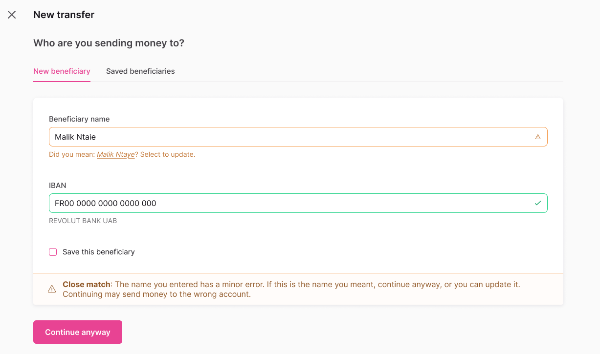
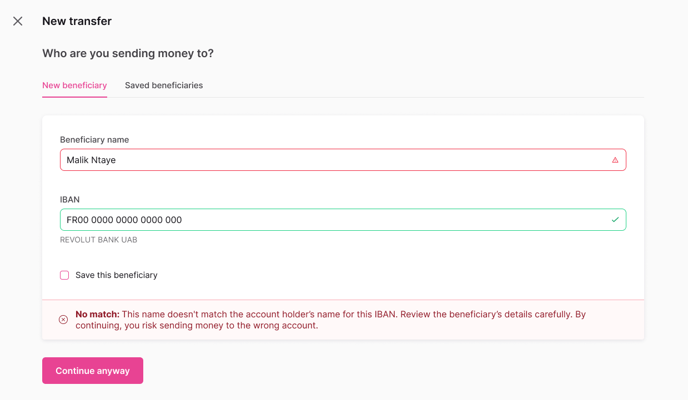

import Tabs from '@theme/Tabs';
import TabItem from '@theme/TabItem';

# Verification of Payee

Verify beneficiary information before sending SEPA Credit Transfers to reduce fraud and payment errors.

:::info Mandatory compliance
Required for all SEPA Credit Transfers by **October 9, 2025** under EU regulation.
:::

## Overview {#overview}

**Verification of Payee (VOP)** is a mandatory European payment security service that validates beneficiary names against account holder information before initiating SEPA Credit Transfers. This service reduces payment fraud and errors by confirming that the payee's name matches the account holder registered with the beneficiary's bank.

VOP is required under the [European Commission's Instant Payments Regulation (IPR)](https://www.ecb.europa.eu/paym/integration/retail/instant_payments/html/instant_payments_regulation.en.html) published in March 2024, with a mandatory implementation deadline of **October 9, 2025** for all Payment Service Providers offering SEPA Credit Transfers.

### Key benefits {#benefits}

- **Fraud reduction**: Verify beneficiary details before sending payments
- **Error prevention**: Catch typos and formatting issues early
- **Compliance**: Meet mandatory EU regulatory requirements
- **Customer confidence**: Build trust through enhanced payment security

### Coverage {#coverage}

VOP verification is available for all SEPA zone countries. The service is **free of charge** for payers as mandated by the regulation.

## How it works {#how-it-works}

1. **Verify beneficiary**: Call `verifySepaBeneficiary` with IBAN and name
2. **Get result**: Receive Match, Close Match, No Match, or Verification Unavailable
3. **Use token**: Add verification token to credit transfer


### Integration milestones {#quick-actions}

<div className="row margin-bottom--lg">
  <div className="col col--4">
    <div className="card">
      <div className="card__header">
        <h3>🔍 Verification</h3>
      </div>
      <div className="card__body">
        <p>Check the beneficiary</p>
        <a href="#guide-verify" className="button button--primary button--block">Verify before transfer</a>
      </div>
    </div>
  </div>
  <div className="col col--4">
    <div className="card">
      <div className="card__header">
        <h3>💳 Credit Transfer</h3>
      </div>
      <div className="card__body">
        <p>Initiate transfer with token</p>
        <a href="#use-token" className="button button--primary button--block">Use verification token</a>
      </div>
    </div>
  </div>
  <div className="col col--4">
    <div className="card">
      <div className="card__header">
        <h3>🧪 Sandbox Testing</h3>
      </div>
      <div className="card__body">
        <p>Emulate your use cases</p>
        <a href="#sandbox" className="button button--primary button--block">Test in sandbox</a>
      </div>
    </div>
  </div>
</div>

---

## Verify a beneficiary {#guide-verify}

Call `verifySepaBeneficiary` before initiating transfers.

### Steps {#verify-steps}

1. Call the `verifySepaBeneficiary` mutation.
2. Add the beneficiary's `iban` and `name` (lines 4-5).
3. Add all verification result types to handle different outcomes.
4. Add [rejections](/developers/using-api/errors-rejections.mdx) for error handling.

### Mutation {#verify-mutation}

<a href="https://explorer.swan.io?query=bXV0YXRpb24gVmVyaWZ5QmVuZWZpY2lhcnkgewogIHZlcmlmeVNlcGFCZW5lZmljaWFyeSgKICAgIGlucHV0OiB7IGliYW46ICJGUjAwMDAwMDAwMDAzMDAwMDAwMDAwNTZIODAiLCBuYW1lOiAiSm9obiBTbWl0aCIgfQogICkgewogICAgLi4uIG9uIFNlcGFCZW5lZmljaWFyeU1hdGNoIHsKICAgICAgX190eXBlbmFtZQogICAgICB2ZXJpZmljYXRpb25Ub2tlbgogICAgICBleHBpcmVzQXQKICAgIH0KICAgIC4uLiBvbiBTZXBhQmVuZWZpY2lhcnlDbG9zZU1hdGNoIHsKICAgICAgX190eXBlbmFtZQogICAgICB2ZXJpZmljYXRpb25Ub2tlbgogICAgICBleHBpcmVzQXQKICAgICAgbmFtZVN1Z2dlc3Rpb24KICAgIH0KICAgIC4uLiBvbiBTZXBhQmVuZWZpY2lhcnlOb01hdGNoIHsKICAgICAgX190eXBlbmFtZQogICAgICB2ZXJpZmljYXRpb25Ub2tlbgogICAgICBleHBpcmVzQXQKICAgIH0KICAgIC4uLiBvbiBTZXBhQmVuZWZpY2lhcnlWZXJpZmljYXRpb25Ob3RQb3NzaWJsZSB7CiAgICAgIF9fdHlwZW5hbWUKICAgICAgdmVyaWZpY2F0aW9uVG9rZW4KICAgICAgZXhwaXJlc0F0CiAgICB9CiAgICAuLi4gb24gVmFsaWRhdGlvblJlamVjdGlvbiB7CiAgICAgIF9fdHlwZW5hbWUKICAgICAgbWVzc2FnZQogICAgfQogIH0KfQo%3D&tab=api" className="explorer-badge">Open in API Explorer</a>

```graphql {4-5,8,13,19,24,29} showLineNumbers
mutation VerifyBeneficiary {
  verifySepaBeneficiary(
    input: {
      iban: "FR0000000000300000000056H80"
      name: "John Smith"
    }
  ) {
    ... on SepaBeneficiaryMatch {
      __typename
      verificationToken
      expiresAt
    }
    ... on SepaBeneficiaryCloseMatch {
      __typename
      verificationToken
      expiresAt
      nameSuggestion
    }
    ... on SepaBeneficiaryNoMatch {
      __typename
      verificationToken
      expiresAt
    }
    ... on SepaBeneficiaryVerificationNotPossible {
      __typename
      verificationToken
      expiresAt
    }
    ... on ValidationRejection {
      __typename
      message
    }
  }
}
```

## Verification results {#results}

<Tabs>
  <TabItem value="match" label="✅ ‎ Match" default>
    **Result**: Exact match found
    
    **Action**: Proceed with transfer
    
    **Example response**:
    ```json
    {
      "__typename": "SepaBeneficiaryMatch",
      "verificationToken": "vf_01234567890abcdef",
      "expiresAt": "2025-07-10T14:30:00Z"
    }
    ```
    
    <details>
    <summary>UI view example</summary>
    
    
    
    </details>
  </TabItem>
  
  <TabItem value="close" label="⚠️ ‎ Close match">
    **Result**: Partial match with suggestion
    
    **Action**: Review `nameSuggestion` field
    
    **Example response**:
    ```json
    {
      "__typename": "SepaBeneficiaryCloseMatch",
      "verificationToken": "vf_01234567890abcdef",
      "expiresAt": "2025-07-10T14:30:00Z",
      "nameSuggestion": "John Smith"
    }
    ```
    
    <details>
    <summary>UI view example</summary>
    
    
    
    </details>
  </TabItem>
  
  <TabItem value="no-match" label="❌ ‎ No match">
    **Result**: No match found
    
    **Action**: Confirm details before proceeding
    
    **Example response**:
    ```json
    {
      "__typename": "SepaBeneficiaryNoMatch",
      "verificationToken": "vf_01234567890abcdef",
      "expiresAt": "2025-07-10T14:30:00Z"
    }
    ```
    
    <details>
    <summary>UI view example</summary>
    
    
    
    </details>
  </TabItem>
  
  <TabItem value="not-possible" label="❌ ‎ Verification not possible">
    **Result**: Verification unavailable
    
    **Action**: Proceed without verification
    
    **Example response**:
    ```json
    {
      "__typename": "SepaBeneficiaryVerificationNotPossible",
      "verificationToken": "vf_01234567890abcdef",
      "expiresAt": "2025-07-10T14:30:00Z"
    }
    ```
    
    <details>
    <summary>UI view example</summary>
    
    
    
    </details>
  </TabItem>
</Tabs>

## Use verification token {#use-token}

Add the `verificationToken` to your credit transfer:

```graphql {11} showLineNumbers
mutation InitiateWithVerification {
  initiateCreditTransfers(
    input: {
      accountId: "$YOUR_ACCOUNT_ID"
      consentRedirectUrl: "$YOUR_REDIRECT_URL"
      creditTransfers: {
        amount: { value: "100", currency: "EUR" }
        sepaBeneficiary: {
          iban: "FR0000000000300000000056H80"
          name: "John Smith"
          verificationToken: "vf_01234567890abcdef"
          save: false
        }
      }
    }
  ) {
    ... on InitiateCreditTransfersSuccessPayload {
      payment {
        id
        statusInfo {
          ... on PaymentConsentPending {
            consent {
              consentUrl
            }
          }
        }
      }
    }
  }
}
```

:::tip Why verification tokens matter
- **Regulatory compliance**: Demonstrates VOP verification was performed
- **Time-limited**: Check `expiresAt` timestamp to ensure validity
- **Single-use security**: Each token works only once, preventing replay attacks
:::

## Saved beneficiaries {#saved-beneficiaries}

VOP integrates seamlessly with Swan's [trusted beneficiary system](./guide-add-beneficiary.mdx) to streamline repeat payments while maintaining compliance.

### First-time verification for saved beneficiaries {#verify-saved}

:::warning Important for existing integrations
Even saved beneficiaries require VOP verification for compliance after **October 9, 2025**.
:::

**Workflow for existing saved beneficiaries:**
1. Retrieve saved beneficiary details from your system
2. Call [`verifySepaBeneficiary`](#verify-mutation) with the saved IBAN and name
3. [Use the verification token](#use-token) when initiating the transfer
4. Future payments to the same beneficiary will still require verification

**Benefits of this approach:**
- **Fraud prevention**: Validates beneficiary details haven't changed
- **Compliance**: Meets mandatory VOP requirements
- **User experience**: Familiar beneficiary selection with added security

### Save during verification {#save-during-verification}

You can save new beneficiaries while performing verification by setting `save: true` in the [credit transfer mutation](guide-initiate-ct#guide-sepa):

```graphql {12} showLineNumbers
mutation InitiateWithVerificationAndSave {
  initiateCreditTransfers(
    input: {
      accountId: "$YOUR_ACCOUNT_ID"
      consentRedirectUrl: "$YOUR_REDIRECT_URL"
      creditTransfers: {
        amount: { value: "100", currency: "EUR" }
        sepaBeneficiary: {
          iban: "FR0000000000300000000056H80"
          name: "John Smith"
          verificationToken: "vf_01234567890abcdef"
          save: true
        }
      }
    }
  ) {
    ... on InitiateCreditTransfersSuccessPayload {
      payment {
        id
        statusInfo {
          ... on PaymentConsentPending {
            consent {
              consentUrl
            }
          }
        }
      }
    }
  }
}
```

This creates a trusted beneficiary record while demonstrating VOP compliance.

## Sandbox testing {#sandbox}

Test VOP verification with these mock beneficiary names in Swan's sandbox environment:

| Input Name | Result Type | Use Case |
| --- | --- | --- |
| `NO_MATCH` | `SepaBeneficiaryNoMatch` | Test no match handling |
| `BIC_NOT_FOUND` | `SepaBeneficiaryVerificationNotPossible` | Test verification unavailable |
| `Close Match Test` | `SepaBeneficiaryCloseMatch` | Test partial match with suggestions |
| Any other name | `SepaBeneficiaryMatch` | Test successful verification |

### Example test scenarios

```graphql showLineNumbers
mutation TestNoMatch {
  verifySepaBeneficiary(
    input: {
      iban: "FR0000000000300000000056H80"
      name: "NO_MATCH"
    }
  ) {
    ... on SepaBeneficiaryNoMatch {
      __typename
      verificationToken
      expiresAt
    }
    ... on ValidationRejection {
      __typename
      message
    }
  }
}
```

```graphql showLineNumbers
mutation TestVerificationUnavailable {
  verifySepaBeneficiary(
    input: {
      iban: "FR0000000000300000000056H80"
      name: "BIC_NOT_FOUND"
    }
  ) {
    ... on SepaBeneficiaryVerificationNotPossible {
      __typename
      verificationToken
      expiresAt
    }
  }
}
```

## Migration from legacy verification {#migration}

:::danger Breaking change
The `beneficiaryVerification` query will be deprecated. Plan your migration before the October 9 compliance deadline to ensure uninterrupted service.
:::

If you're using `beneficiaryVerification` for Dutch IBANs, migrate to `verifySepaBeneficiary`:

**Before (deprecated)**:
```graphql title="Legacy verification (deprecated)" showLineNumbers
query LegacyVerification {
  beneficiaryVerification(
    input: {
      iban: "NL91ABNA0417164300"
      name: "J. Smith"
      debtorAccountId: "$YOUR_ACCOUNT_ID"
    }
  ) {
    ... on BeneficiaryMatch {
      accountHolderType
    }
  }
}
```

**After (new VOP)**:
```graphql title="New VOP verification" showLineNumbers
mutation NewVOPVerification {
  verifySepaBeneficiary(
    input: {
      iban: "NL91ABNA0417164300"
      name: "J. Smith"
    }
  ) {
    ... on SepaBeneficiaryMatch {
      verificationToken
      expiresAt
    }
  }
}
```

**Migration checklist**:
1. Replace `beneficiaryVerification` with [`verifySepaBeneficiary`](#verify-mutation)
2. Handle all four [result types](#results)
3. Integrate [verification tokens](#use-token) into payment flows
4. Update UI to show verification results
5. Test thoroughly in Sandbox

## Troubleshooting {#troubleshooting}

**Verification returns "Not Possible"**
- Beneficiary's bank may not support VOP yet
- Service temporarily unavailable
- Proceed with transfer if needed

**Token expired**
- Check `expiresAt` timestamp before using token
- Generate new verification if expired
- Each token works only once

**Legacy migration**
- Migrate from `beneficiaryVerification` query (Dutch IBANs only)
- Update to `verifySepaBeneficiary` before deprecation

:::tip Best practice
Perform verification immediately after beneficiary details are entered for an optimal user experience.
:::

## Related guides {#related-guides}

- [Initiate a credit transfer](./guide-initiate-ct.mdx)
- [Add a trusted SEPA beneficiary](./guide-add-beneficiary.mdx)
- [SEPA Credit Transfers overview](./index.mdx)