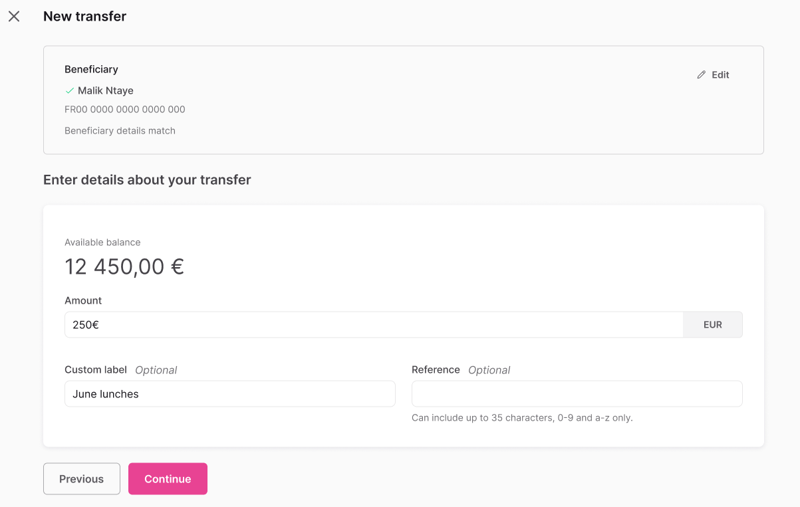
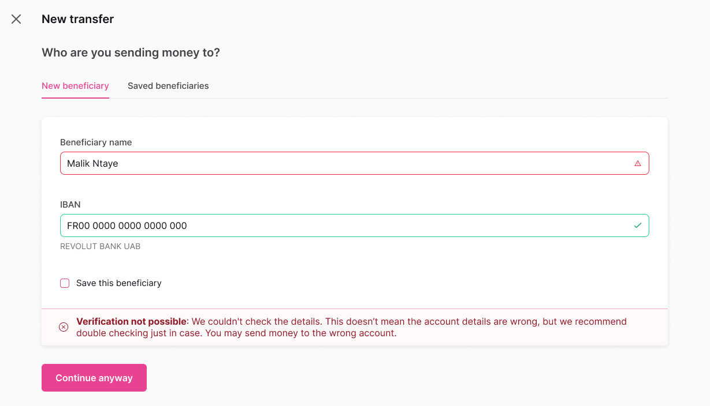

import Tabs from '@theme/Tabs';
import TabItem from '@theme/TabItem';

# Verification of Payee

Validate beneficiary details before sending SEPA Credit Transfers to reduce fraud and payment errors.

:::info Mandatory compliance
Required for all SEPA Credit Transfers by **October 9, 2025** under the [European Commission's Instant Payments Regulation (IPR)](https://www.ecb.europa.eu/paym/integration/retail/instant_payments/html/instant_payments_regulation.en.html) published in March 2024, with a mandatory implementation deadline of **October 9, 2025** for all Payment Service Providers (PSPs) in the Eurozone offering SEPA Credit Transfers.
:::

## Overview {#overview}

**Verification of Payee (VoP)** is a mandatory European service that validates beneficiary details against account holder information before initiating SEPA Credit Transfers. This service aims to reduce payment fraud and errors by confirming that the beneficiary details match the account holder registered with the beneficiary's bank.

### Key benefits {#benefits}

For your integration:
- **Reduced disputes**: Prevent misdirected payments and customer support tickets.
- **Regulatory compliance**: Meet mandatory EU requirements for SEPA transfers.
- **Enhanced UX** (User Experience): Build trust through transparent payment verification.

For the end-users:
- **Fraud protection**: Verify beneficiary details before sending payments.
- **Error prevention**: Catch typos and formatting issues early.
- **Payment confidence**: Know transfers will reach the intended recipient.

### Coverage {#coverage}

VoP applies to all countries in the SEPA zone. Payment Service Providers (PSPs) have varying implementation timelines based on their location:

| Payment Services Provider location | VoP mandatory date |
| --- | --- |
| 🇪🇺 Eurozone | October 9, 2025 |
| 🌏 Non-Eurozone | January 9, 2027 |

The service is **free of charge** as mandated by the regulation.

## How it works {#how-it-works}

VoP offers two integration approaches depending on your UX requirements and development constraints:

### Integration {#integration}

Select one of the following verification flows for your implementation:

<div className="row margin-bottom--lg">
  <div className="col col--6">
    <div className="card" style={{height: '100%', backgroundColor: '#fffbf0', border: '1px solid #ffeaa7'}}>
      <div className="card__header">
        <h3>Option 1:</h3>
        <h3>➡️ Consent flow verification</h3>
      </div>
      <div className="card__body">
        <p><strong>Verification happens during credit transfer initiation</strong></p>
        <ul>
          <li>Minimal to no development effort required</li>
          <li>Limited UX customization</li>
          <li>Best for: Quick implementation, basic verification needs</li>
        </ul>
      </div>
    </div>
  </div>
  <div className="col col--6">
    <div className="card" style={{height: '100%', backgroundColor: '#f0f9f0', border: '1px solid #d4edda'}}>
      <div className="card__header">
        <h3>Option 2:</h3>
        <h3>☑️ Pre-validation of details</h3>
      </div>
      <div className="card__body">
        <p><strong>Verify beneficiaries before payment initiation</strong></p>
        <ul>
          <li>Full control over verification UX</li>
          <li>Custom error handling and user guidance</li>
          <li>Best for: Enhanced user experience, complex payment flows</li>
        </ul>
      </div>
    </div>
  </div>
</div>

#### Detailed flows {#integration-flows}

```mermaid
flowchart TD
    subgraph Option2 ["🟢 Option 2"]
        direction TB
        A2["📝 User enters beneficiary details"] --> B2["VoP Verification"]
        B2 --> C2["🎨 Custom UX handling"]
        C2 --> D2["User submits payment"]
        D2 --> E2["initiateCreditTransfers with token"]
        E2 --> F2["Consent screen"]
        F2 --> G2["✅ Payment authorized"]
        G2 --> H2["💸 Transfer completed"]
    end

    subgraph Option1 ["🟡 Option 1"]
        direction TB
        A1["📝 User enters payment details"] --> B1["User submits payment"]
        B1 --> C1["initiateCreditTransfers"]
        C1 --> D1["VoP Verification"]
        D1 --> E1["Consent screen"]
        E1 --> F1["✅ Payment authorized"]
        F1 --> G1["💸 Transfer completed"]
    end
    
    classDef default fill:#ffffff,stroke:#6240b5,stroke-width:1px,color:#271a48,rx:8,ry:8
    classDef input fill:#6240b5,stroke:#4e3391,stroke-width:2px,color:#ffffff,rx:12,ry:12
    classDef process fill:#f8f7fc,stroke:#c0b3e1,stroke-width:1px,color:#4e3391,rx:8,ry:8
    classDef success fill:#22c55e,stroke:#16a34a,stroke-width:2px,color:#ffffff,rx:12,ry:12
    classDef transfer fill:#22c55e,stroke:#16a34a,stroke-width:2px,color:#ffffff,rx:12,ry:12
    classDef custom fill:#6240b5,stroke:#4e3391,stroke-width:2px,color:#ffffff,rx:8,ry:8
    classDef invisible fill:transparent,stroke:transparent,color:transparent
    classDef subgraph1 fill:#fffbf0,stroke:#ffeaa7,stroke-width:2px,rx:16,ry:16
    classDef subgraph2 fill:#f0f9f0,stroke:#d4edda,stroke-width:2px,rx:16,ry:16
    
    %% Option 1 styling
    class A1 input
    class B1,C1,D1,E1 process
    class F1 success
    class G1 transfer
    class H1,I1 invisible
    
    %% Option 2 styling
    class A2 input
    class B2,D2,E2,F2 process
    class C2 custom
    class G2 success
    class H2 transfer
    
    class Option1 subgraph1
    class Option2 subgraph2
```

<div style={{textAlign: 'center'}}>

</div>

### Verification workflow {#verification-workflow}

1. **Verify beneficiary**: Call `verifySepaBeneficiary` with IBAN and name
2. **Get result**: Receive Match, Close match, No match or Verification not possible
3. **Inform end-user**: Display appropriate messaging based on verification result
4. **User proceeds**: End-user can choose to proceed with payment regardless of result
5. **Use token**: Add verification token to credit transfer

```mermaid
%%{ init: { 'flowchart': { 'curve': 'linear' } } }%%
flowchart TD
    A["📝 Enter Beneficiary Details"] --> B[Call verifySepaBeneficiary]
    B --> C{Verification Result}
    
    D["Ready to proceed"]
    E["Check suggested name"]  
    F["Verify details before proceeding"]
    G["Verification service unavailable"]
    
    C -->|"✅ Match"| D
    C -->|"⚠️ Close Match"| E
    C -->|"❌ No Match"| F
    C -->|"❌ Not Possible"| G
    
    D --> H[" "]
    E --> I["Customer Reviews Suggestion"]
    F --> J["Customer Verifies Details"]
    G --> K["Customer Proceeds<br>Despite No Verification"]
    
    H --> L["Customer Proceeds with Payment"]
    I --> L
    J --> L
    K --> L
    
    L --> M["Initiate Transfer with Token"]
    
    classDef default fill:#ffffff,stroke:#6240b5,stroke-width:1px,color:#271a48,rx:12,ry:12
    classDef input fill:#6240b5,stroke:#4e3391,stroke-width:2px,color:#ffffff,rx:12,ry:12
    classDef decision fill:#6240b5,stroke:#4e3391,stroke-width:2px,color:#ffffff,rx:20,ry:20
    classDef success fill:#22c55e,stroke:#16a34a,stroke-width:2px,color:#ffffff,rx:12,ry:12
    classDef warning fill:#f59e0b,stroke:#d97706,stroke-width:2px,color:#ffffff,rx:12,ry:12
    classDef error fill:#ef4444,stroke:#dc2626,stroke-width:2px,color:#ffffff,rx:12,ry:12
    classDef process fill:#f8f7fc,stroke:#c0b3e1,stroke-width:1px,color:#4e3391,rx:8,ry:8
    classDef final fill:#22c55e,stroke:#16a34a,stroke-width:2px,color:#ffffff,rx:12,ry:12
    classDef invisible fill:transparent,stroke:transparent,stroke-width:0px,color:transparent
    
    class A input
    class C decision
    class D success
    class E warning
    class F,G error
    class B,I,J,K process
    class L,M final
    class H invisible
```

<div className="invisible-subgraph">



</div>

:::tip VoP enables informed decisions
Verification of Payee doesn't block payments. It provides verification results so customers can make informed decisions about proceeding or aborting. All verification results allow payment to continue.
:::

### Payment type support {#payment-support}

| Payment Type | Synchronous Verification | Pre-validation | Notes |
| --- | --- | --- | --- |
| **Single Credit Transfers** | ✅ Supported | ✅ Supported | Full VoP integration |
| **Bulk Credit Transfers** | ✅ Supported | ✅ Supported | Opt-out available for corporate use |
| **Standing Orders** | ✅ Supported | ✅ Supported | Verification required for initial setup |

<!--
| **Internal Accounts** | 🚧 Coming soon | 🚧 Coming soon | Legal requirements being finalized |
-->

---

# Coming soon...

<details>
<summary>View feature roadmap</summary>

## Verify a beneficiary {#guide-verify}

Call `verifySepaBeneficiary` before initiating transfers.

### Steps {#verify-steps}

1. Call the `verifySepaBeneficiary` mutation.
2. Add the beneficiary's `iban` and `name` <!--(lines 4-5)-->.
3. Add all verification result types to handle different outcomes.
4. Add [rejections](/developers/using-api/errors-rejections.mdx) for error handling.

<!--
### Mutation {#verify-mutation}

<a href="https://explorer.swan.io?query=bXV0YXRpb24gVmVyaWZ5QmVuZWZpY2lhcnkgewogIHZlcmlmeVNlcGFCZW5lZmljaWFyeSgKICAgIGlucHV0OiB7IGliYW46ICJGUjAwMDAwMDAwMDAzMDAwMDAwMDAwNTZIODAiLCBuYW1lOiAiSm9obiBTbWl0aCIgfQogICkgewogICAgLi4uIG9uIFNlcGFCZW5lZmljaWFyeU1hdGNoIHsKICAgICAgX190eXBlbmFtZQogICAgICB2ZXJpZmljYXRpb25Ub2tlbgogICAgICBleHBpcmVzQXQKICAgIH0KICAgIC4uLiBvbiBTZXBhQmVuZWZpY2lhcnlDbG9zZU1hdGNoIHsKICAgICAgX190eXBlbmFtZQogICAgICB2ZXJpZmljYXRpb25Ub2tlbgogICAgICBleHBpcmVzQXQKICAgICAgbmFtZVN1Z2dlc3Rpb24KICAgIH0KICAgIC4uLiBvbiBTZXBhQmVuZWZpY2lhcnlOb01hdGNoIHsKICAgICAgX190eXBlbmFtZQogICAgICB2ZXJpZmljYXRpb25Ub2tlbgogICAgICBleHBpcmVzQXQKICAgIH0KICAgIC4uLiBvbiBTZXBhQmVuZWZpY2lhcnlWZXJpZmljYXRpb25Ob3RQb3NzaWJsZSB7CiAgICAgIF9fdHlwZW5hbWUKICAgICAgdmVyaWZpY2F0aW9uVG9rZW4KICAgICAgZXhwaXJlc0F0CiAgICB9CiAgICAuLi4gb24gVmFsaWRhdGlvblJlamVjdGlvbiB7CiAgICAgIF9fdHlwZW5hbWUKICAgICAgbWVzc2FnZQogICAgfQogIH0KfQo%3D&tab=api" className="explorer-badge">Open in API Explorer</a>

```graphql {4-5,8,13,19,24,29} showLineNumbers
mutation VerifyBeneficiary {
  verifySepaBeneficiary(
    input: {
      iban: "FR0000000000300000000056H80"
      name: "John Smith"
    }
  ) {
    ... on SepaBeneficiaryMatch {
      __typename
      verificationToken
      expiresAt
    }
    ... on SepaBeneficiaryCloseMatch {
      __typename
      verificationToken
      expiresAt
      nameSuggestion
    }
    ... on SepaBeneficiaryNoMatch {
      __typename
      verificationToken
      expiresAt
    }
    ... on SepaBeneficiaryVerificationNotPossible {
      __typename
      verificationToken
      expiresAt
    }
    ... on ValidationRejection {
      __typename
      message
    }
  }
}
```
-->

## Verification results {#results}

<Tabs>
  <TabItem value="match" label="✅ ‎ Match" default>
    **Result**: Exact match found
    
    **Action**: Proceed with transfer
    
    **Example response**:
    ```json
    {
      "__typename": "SepaBeneficiaryMatch",
      "verificationToken": "vf_01234567890abcdef",
      "expiresAt": "2025-07-10T14:30:00Z"
    }
    ```
    
    <details>
    <summary>UI view example</summary>
    
    
    
    </details>
  </TabItem>
  
  <TabItem value="close" label="⚠️ ‎ Close match">
    **Result**: Close match with name suggestion
    
    **Action**: Review `nameSuggestion` field
    
    **Example response**:
    ```json
    {
      "__typename": "SepaBeneficiaryCloseMatch",
      "verificationToken": "vf_01234567890abcdef",
      "expiresAt": "2025-07-10T14:30:00Z",
      "nameSuggestion": "John Smith"
    }
    ```
    
    <details>
    <summary>UI view example</summary>
    
    
    
    </details>
  </TabItem>
  
  <TabItem value="no-match" label="❌ ‎ No match">
    **Result**: No match found
    
    **Action**: Confirm details before proceeding
    
    **Example response**:
    ```json
    {
      "__typename": "SepaBeneficiaryNoMatch",
      "verificationToken": "vf_01234567890abcdef",
      "expiresAt": "2025-07-10T14:30:00Z"
    }
    ```
    
    <details>
    <summary>UI view example</summary>
    
    
    
    </details>
  </TabItem>
  
  <TabItem value="not-possible" label="❌ ‎ Verification not possible">
    **Result**: Verification not possible
    
    **Action**: Proceed without verification
    
    **Example response**:
    ```json
    {
      "__typename": "SepaBeneficiaryVerificationNotPossible",
      "verificationToken": "vf_01234567890abcdef",
      "expiresAt": "2025-07-10T14:30:00Z"
    }
    ```
    
    <details>
    <summary>UI view example</summary>
    
    
    
    </details>
  </TabItem>
</Tabs>

## Use verification token {#use-token}

Add the `verificationToken` to your credit transfer.

<!--
:

```graphql {11} showLineNumbers
mutation InitiateWithVerification {
  initiateCreditTransfers(
    input: {
      accountId: "$YOUR_ACCOUNT_ID"
      consentRedirectUrl: "$YOUR_REDIRECT_URL"
      creditTransfers: {
        amount: { value: "100", currency: "EUR" }
        sepaBeneficiary: {
          iban: "FR0000000000300000000056H80"
          name: "John Smith"
          verificationToken: "vf_01234567890abcdef"
          save: false
        }
      }
    }
  ) {
    ... on InitiateCreditTransfersSuccessPayload {
      payment {
        id
        statusInfo {
          ... on PaymentConsentPending {
            consent {
              consentUrl
            }
          }
        }
      }
    }
  }
}
```
-->

:::tip Why verification tokens matter
- **Regulatory compliance**: Demonstrates VoP verification was performed
- **Time-limited**: Check `expiresAt` timestamp to ensure validity
- **Single-use security**: Each token works only once, preventing replay attacks
:::

## Saved beneficiaries {#saved-beneficiaries}

VoP integrates seamlessly with Swan's [trusted beneficiary system](./guide-add-beneficiary.mdx) to streamline repeat payments while maintaining compliance.

### First-time verification for saved beneficiaries {#verify-saved}

:::warning Important for existing integrations
Even saved beneficiaries require VoP verification for compliance after **October 9, 2025**.
:::

**Workflow for existing saved beneficiaries:**
1. Retrieve saved beneficiary details from your system
2. Call the [`verifySepaBeneficiary`](#verify-mutation) mutation with the saved IBAN and name
3. [Use the verification token](#use-token) when initiating the transfer
4. Future payments to the same beneficiary will still require verification

**Benefits of this approach:**
- **Fraud prevention**: Validates that the beneficiary's details haven't changed
- **Compliance**: Meets mandatory VoP requirements
- **User experience**: Familiar beneficiary selection with added security

### Save during verification {#save-during-verification}

You can save new beneficiaries while performing verification by setting `save: true` in the [credit transfer mutation](guide-initiate-ct#guide-sepa).

<!--
:

```graphql {12} showLineNumbers
mutation InitiateWithVerificationAndSave {
  initiateCreditTransfers(
    input: {
      accountId: "$YOUR_ACCOUNT_ID"
      consentRedirectUrl: "$YOUR_REDIRECT_URL"
      creditTransfers: {
        amount: { value: "100", currency: "EUR" }
        sepaBeneficiary: {
          iban: "FR0000000000300000000056H80"
          name: "John Smith"
          verificationToken: "vf_01234567890abcdef"
          save: true
        }
      }
    }
  ) {
    ... on InitiateCreditTransfersSuccessPayload {
      payment {
        id
        statusInfo {
          ... on PaymentConsentPending {
            consent {
              consentUrl
            }
          }
        }
      }
    }
  }
}
```
-->

This creates a trusted beneficiary record while demonstrating VoP compliance.

## Sandbox testing {#sandbox}

Test VoP verification with these mock beneficiary names in Swan's sandbox environment:

| Input Name | Result Type | Use Case |
| --- | --- | --- |
| `NO_MATCH` | `SepaBeneficiaryNoMatch` | Test no match handling |
| `BIC_NOT_FOUND` | `SepaBeneficiaryVerificationNotPossible` | Test verification unavailable |
| `Close Match Test` | `SepaBeneficiaryCloseMatch` | Test close match with suggestions |
| Any other name | `SepaBeneficiaryMatch` | Test successful verification |

<!--
### Example test scenarios

```graphql showLineNumbers
mutation TestNoMatch {
  verifySepaBeneficiary(
    input: {
      iban: "FR0000000000300000000056H80"
      name: "NO_MATCH"
    }
  ) {
    ... on SepaBeneficiaryNoMatch {
      __typename
      verificationToken
      expiresAt
    }
    ... on ValidationRejection {
      __typename
      message
    }
  }
}
```

```graphql showLineNumbers
mutation TestVerificationNotPossible {
  verifySepaBeneficiary(
    input: {
      iban: "FR0000000000300000000056H80"
      name: "BIC_NOT_FOUND"
    }
  ) {
    ... on SepaBeneficiaryVerificationNotPossible {
      __typename
      verificationToken
      expiresAt
    }
  }
}
```
-->

## Migration from legacy verification {#migration}

:::danger Breaking change
The `beneficiaryVerification` query will be deprecated. Plan your migration before the October 9th compliance deadline to ensure uninterrupted service.
:::

If you're using `beneficiaryVerification` for Dutch IBANs, migrate to `verifySepaBeneficiary`.

<!--
:

**Before (deprecated)**:
```graphql title="Legacy verification (deprecated)" showLineNumbers
query LegacyVerification {
  beneficiaryVerification(
    input: {
      iban: "NL91ABNA0417164300"
      name: "J. Smith"
      debtorAccountId: "$YOUR_ACCOUNT_ID"
    }
  ) {
    ... on BeneficiaryMatch {
      accountHolderType
    }
  }
}
```

**After (new VoP)**:
```graphql title="New VoP verification" showLineNumbers
mutation NewVoPVerification {
  verifySepaBeneficiary(
    input: {
      iban: "NL91ABNA0417164300"
      name: "J. Smith"
    }
  ) {
    ... on SepaBeneficiaryMatch {
      verificationToken
      expiresAt
    }
  }
}
```

**Migration checklist**:
1. Replace `beneficiaryVerification` with [`verifySepaBeneficiary`](#verify-mutation)
2. Handle all four [result types](#results)
3. Integrate [verification tokens](#use-token) into payment flows
4. Update UI to show verification results
5. Test thoroughly in Sandbox

## Troubleshooting {#troubleshooting}

**Verification returns "Not Possible"**
- Beneficiary's bank may not support VoP yet
- Service temporarily unavailable
- Proceed with transfer if needed

**Token expired**
- Check `expiresAt` timestamp before using token
- Generate new verification if expired
- Each token works only once

**Legacy migration**
- Migrate from `beneficiaryVerification` query (Dutch IBANs only)
- Update to `verifySepaBeneficiary` before deprecation

:::tip Best practice
Perform verification immediately after beneficiary details are entered for an optimal user experience.
:::

## Related guides {#related-guides}

- [Initiate a credit transfer](./guide-initiate-ct.mdx)
- [Add a trusted SEPA beneficiary](./guide-add-beneficiary.mdx)
- [SEPA Credit Transfers overview](./index.mdx)
-->
</details>