# Verification of Payee

Verify beneficiary information before sending SEPA Credit Transfers to reduce fraud and payment errors.

:::info Mandatory compliance
Required for all SEPA Credit Transfers by **October 9, 2025** under EU regulation.
:::

## Overview {#overview}

**Verification of Payee (VOP)** is a mandatory European payment security service that validates beneficiary names against account holder information before initiating SEPA Credit Transfers. This service reduces payment fraud and errors by confirming that the payee's name matches the account holder registered with the beneficiary's bank.

VOP is required under the [European Commission's Instant Payments Regulation (IPR)](https://www.ecb.europa.eu/paym/integration/retail/instant_payments/html/instant_payments_regulation.en.html) published in March 2024, with a mandatory implementation deadline of **October 9, 2025** for all Payment Service Providers offering SEPA Credit Transfers.

### Key benefits {#benefits}

- **Fraud reduction**: Verify beneficiary details before sending payments
- **Error prevention**: Catch typos and formatting issues early
- **Compliance**: Meet mandatory EU regulatory requirements
- **Customer confidence**: Build trust through enhanced payment security

### Coverage {#coverage}

VOP verification is available for all SEPA zone countries, providing **24/7 availability** with response times under 5 seconds. The service is **free of charge** for payers as mandated by the regulation.

## How it works {#how-it-works}

```mermaid
%%{ init: { 'flowchart': { 'curve': 'linear' } } }%%
flowchart TD
    A["📝 Enter Beneficiary Details"] --> B[Call verifySepaBeneficiary]
    B --> C{Verification Result}
    C -->|"✅ Match"| D["✅ Exact Match"]
    C -->|"⚠️ Close Match"| E["⚠️ Partial Match with Suggestion"]
    C -->|"❌ No Match"| F["❌ No Match Found"]
    C -->|"❌ Not Possible"| G["❌ Verification Unavailable"]
    D --> H[Initiate Transfer with Token]
    E --> I[Review Suggestion]
    F --> J[Confirm Details]
    G --> K[Proceed Without Verification]
    I --> L[Initiate Transfer]
    J --> M[Initiate Transfer]
    K --> N[Initiate Transfer]
    
    classDef default fill:#ffffff,stroke:#6240b5,stroke-width:1px,color:#271a48,rx:12,ry:12
    classDef input fill:#6240b5,stroke:#4e3391,stroke-width:2px,color:#ffffff,rx:12,ry:12
    classDef decision fill:#6240b5,stroke:#4e3391,stroke-width:2px,color:#ffffff,rx:20,ry:20
    classDef success fill:#22c55e,stroke:#16a34a,stroke-width:2px,color:#ffffff,rx:12,ry:12
    classDef warning fill:#f59e0b,stroke:#d97706,stroke-width:2px,color:#ffffff,rx:12,ry:12
    classDef error fill:#ef4444,stroke:#dc2626,stroke-width:2px,color:#ffffff,rx:12,ry:12
    classDef process fill:#f8f7fc,stroke:#c0b3e1,stroke-width:1px,color:#4e3391,rx:8,ry:8
    
    class A input
    class D success
    class E warning
    class F,G error
    class B,H,I,J,K,L,M,N process
```



1. **Verify beneficiary**: Call `verifySepaBeneficiary` with IBAN and name
2. **Get result**: Receive Match, Close Match, No Match, or Not Possible
3. **Use token**: Add verification token to credit transfer

## Verify a beneficiary {#guide-verify}

Call `verifySepaBeneficiary` before initiating transfers.

### Steps {#verify-steps}

1. Call the `verifySepaBeneficiary` mutation.
2. Add the beneficiary's `iban` and `name` (lines 3-4).
3. Add all verification result types to handle different outcomes.
4. Add rejections for error handling.

### Mutation {#verify-mutation}

🔎 [Open the mutation in API Explorer](https://explorer.swan.io?query=bXV0YXRpb24gVmVyaWZ5U2VwYUJlbmVmaWNpYXJ5IHsKICB2ZXJpZnlTZXBhQmVuZWZpY2lhcnkoCiAgICBpbnB1dDogewogICAgICBpYmFuOiAiRlIwMDAwMDAwMDAwMzAwMDAwMDAwMDU2SDgwIgogICAgICBuYW1lOiAiSm9obiBTbWl0aCIKICAgIH0KICApIHsKICAgIC4uLiBvbiBTZXBhQmVuZWZpY2lhcnlNYXRjaCB7CiAgICAgIF9fdHlwZW5hbWUKICAgICAgdmVyaWZpY2F0aW9uVG9rZW4KICAgICAgZXhwaXJlc0F0CiAgICB9CiAgICAuLi4gb24gU2VwYUJlbmVmaWNpYXJ5Q2xvc2VNYXRjaCB7CiAgICAgIF9fdHlwZW5hbWUKICAgICAgdmVyaWZpY2F0aW9uVG9rZW4KICAgICAgZXhwaXJlc0F0CiAgICAgIG5hbWVTdWdnZXN0aW9uCiAgICB9CiAgICAuLi4gb24gU2VwYUJlbmVmaWNpYXJ5Tm9NYXRjaCB7CiAgICAgIF9fdHlwZW5hbWUKICAgICAgdmVyaWZpY2F0aW9uVG9rZW4KICAgICAgZXhwaXJlc0F0CiAgICB9CiAgICAuLi4gb24gU2VwYUJlbmVmaWNpYXJ5VmVyaWZpY2F0aW9uTm90UG9zc2libGUgewogICAgICBfX3R5cGVuYW1lCiAgICAgIHZlcmlmaWNhdGlvblRva2VuCiAgICAgIGV4cGlyZXNBdAogICAgfQogICAgLi4uIG9uIFZhbGlkYXRpb25SZWplY3Rpb24gewogICAgICBfX3R5cGVuYW1lCiAgICAgIG1lc3NhZ2UKICAgIH0KICB9Cn0K&tab=api)

```graphql {3-4,8,13,19,25} showLineNumbers
mutation VerifySepaBeneficiary {
  verifySepaBeneficiary(
    input: {
      iban: "FR0000000000300000000056H80"
      name: "John Smith"
    }
  ) {
    ... on SepaBeneficiaryMatch {
      __typename
      verificationToken
      expiresAt
    }
    ... on SepaBeneficiaryCloseMatch {
      __typename
      verificationToken
      expiresAt
      nameSuggestion
    }
    ... on SepaBeneficiaryNoMatch {
      __typename
      verificationToken
      expiresAt
    }
    ... on SepaBeneficiaryVerificationNotPossible {
      __typename
      verificationToken
      expiresAt
    }
    ... on ValidationRejection {
      __typename
      message
    }
  }
}
```

## Verification results {#results}

| Result | Description | Action |
| --- | --- | --- |
| **Match** | Exact match found | Proceed with transfer |
| **Close Match** | Partial match, suggestion provided | Review `nameSuggestion` |
| **No Match** | No match found | Confirm details before proceeding |
| **Not Possible** | Verification unavailable | Proceed without verification |

## Use verification token {#use-token}

Add the `verificationToken` to your credit transfer:

```graphql {10} showLineNumbers
mutation InitiateWithVerification {
  initiateCreditTransfers(
    input: {
      accountId: "$YOUR_ACCOUNT_ID"
      consentRedirectUrl: "$YOUR_REDIRECT_URL"
      creditTransfers: {
        amount: { value: "100", currency: "EUR" }
        sepaBeneficiary: {
          iban: "FR0000000000300000000056H80"
          name: "John Smith"
          verificationToken: "vf_01234567890abcdef"
          save: false
        }
      }
    }
  ) {
    ... on InitiateCreditTransfersSuccessPayload {
      payment {
        id
        statusInfo {
          ... on PaymentConsentPending {
            consent {
              consentUrl
            }
          }
        }
      }
    }
  }
}
```

:::tip Why verification tokens matter
- **Regulatory compliance**: Demonstrates VOP verification was performed
- **Single-use security**: Each token works only once, preventing replay attacks
- **Time-limited**: Check `expiresAt` timestamp to ensure validity
- **Future-proofing**: Optional now, but may be required for certain upcoming payment scenarios
:::

## Saved beneficiaries {#saved-beneficiaries}

VOP integrates seamlessly with Swan's [trusted beneficiary system](./guide-add-beneficiary.mdx) to streamline repeat payments while maintaining compliance.

### First-time verification for saved beneficiaries {#verify-saved}

**Important**: Even saved beneficiaries require VOP verification for compliance after October 9, 2025.

**Workflow for existing saved beneficiaries:**
1. Retrieve saved beneficiary details from your system
2. Call [`verifySepaBeneficiary`](#verify-mutation) with the saved IBAN and name
3. [Use the verification token](#use-token) when initiating the transfer
4. Future payments to the same beneficiary will still require verification

**Benefits of this approach:**
- **Compliance**: Meets mandatory VOP requirements
- **User experience**: Familiar beneficiary selection with added security
- **Fraud prevention**: Validates beneficiary details haven't changed

### Save during verification {#save-during-verification}

You can save new beneficiaries while performing verification by setting `save: true` in the credit transfer mutation:

```graphql {11}
mutation InitiateWithVerificationAndSave {
  initiateCreditTransfers(
    input: {
      accountId: "$YOUR_ACCOUNT_ID"
      consentRedirectUrl: "$YOUR_REDIRECT_URL"
      creditTransfers: {
        amount: { value: "100", currency: "EUR" }
        sepaBeneficiary: {
          iban: "FR0000000000300000000056H80"
          name: "John Smith"
          verificationToken: "vf_01234567890abcdef"
          save: true
        }
      }
    }
  ) {
    ... on InitiateCreditTransfersSuccessPayload {
      payment {
        id
        statusInfo {
          ... on PaymentConsentPending {
            consent {
              consentUrl
            }
          }
        }
      }
    }
  }
}
```

This creates a trusted beneficiary record while demonstrating VOP compliance.

## Sandbox testing {#sandbox}

Test VOP verification with these mock beneficiary names in Swan's sandbox environment:

| Input Name | Result Type | Use Case |
| --- | --- | --- |
| `NO_MATCH` | `SepaBeneficiaryNoMatch` | Test no match handling |
| `BIC_NOT_FOUND` | `SepaBeneficiaryVerificationNotPossible` | Test verification unavailable |
| `Close Match Test` | `SepaBeneficiaryCloseMatch` | Test partial match with suggestions |
| Any other name | `SepaBeneficiaryMatch` | Test successful verification |

**Example test workflow:**
```graphql
# Test no match scenario
mutation TestNoMatch {
  verifySepaBeneficiary(
    input: {
      iban: "FR0000000000300000000056H80"
      name: "NO_MATCH"
    }
  ) {
    ... on SepaBeneficiaryNoMatch {
      __typename
      verificationToken
      expiresAt
    }
    ... on ValidationRejection {
      __typename
      message
    }
  }
}
```

## Migration from legacy verification {#migration}

If you're using `beneficiaryVerification` for Dutch IBANs, migrate to `verifySepaBeneficiary`:

**Before (deprecated)**:
```graphql
query LegacyVerification {
  beneficiaryVerification(
    input: {
      iban: "NL91ABNA0417164300"
      name: "J. Smith"
      debtorAccountId: "$YOUR_ACCOUNT_ID"
    }
  ) {
    ... on BeneficiaryMatch {
      accountHolderType
    }
  }
}
```

**After (new VOP)**:
```graphql
mutation NewVOPVerification {
  verifySepaBeneficiary(
    input: {
      iban: "NL91ABNA0417164300"
      name: "J. Smith"
    }
  ) {
    ... on SepaBeneficiaryMatch {
      verificationToken
      expiresAt
    }
  }
}
```

**Migration checklist**:
1. Replace `beneficiaryVerification` with `verifySepaBeneficiary`
2. Handle all four result types
3. Integrate verification tokens into payment flows
4. Update UI to show verification results
5. Test thoroughly in Sandbox

:::caution Deprecation timeline
The `beneficiaryVerification` query will be deprecated. Plan your migration before the October 9 compliance deadline to ensure uninterrupted service.
:::

## Troubleshooting {#troubleshooting}

**Verification fails consistently**
- Check IBAN belongs to SEPA zone bank
- Verify beneficiary name format (no special characters)
- Confirm beneficiary's bank supports VOP

**Token expired**
- Tokens have limited lifespan
- Generate new token if expired
- Don't cache tokens beyond expiration

**Network issues**
- Implement retry logic for transient failures
- Handle cases where verification is unavailable
- Provide fallback user experience

## Related guides {#related-guides}

- [Initiate a credit transfer](./guide-initiate-ct.mdx)
- [Add a trusted SEPA beneficiary](./guide-add-beneficiary.mdx)
- [SEPA Credit Transfers overview](./index.mdx)