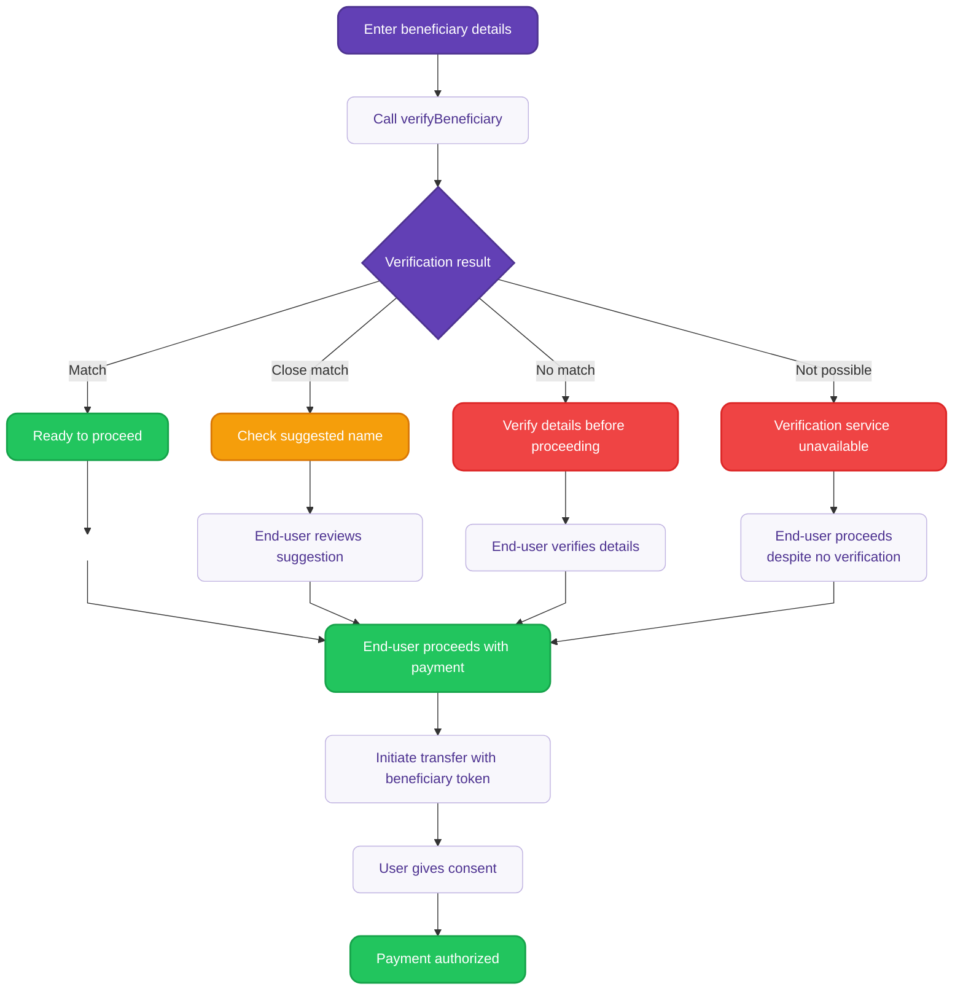

# Verify beneficiary details {#guide}

Use the `verifyBeneficiary` mutation to verify beneficiary details before initiating SEPA Credit Transfers.

This mutation gives you full control to customize how verification results are presented to end-users. This is required for bulk credit transfers when verification tokens are mandatory for the account.

:::tip Prerequisites
- You're planning to initiate an Instant SEPA Credit Transfer, SEPA Credit Transfer or Internal Credit Transfer.
- Authentication required with a **user access token** or **project access token**.
:::

<details>

<summary>Detailed verification flow diagram</summary>

<div className="invisible-subgraph">



</div>

</details>

## Step 1: Call verifyBeneficiary {#step-1}

Call the mutation with the beneficiary details ([`beneficiaryInput`](https://api-reference.swan.io/inputs/beneficiary-input/)) you want to verify. The mutation returns a verification result and a 24-hour token for use in payment initiation.

The `verifyBeneficiary` mutation accepts different types of beneficiary inputs:

- **SEPA beneficiary** (`sepa`): For external SEPA Credit Transfers using IBAN and name. The maximum length for the beneficiary name must be ≤ 70 characters.
- **Swan account** (`swanAccount`): For internal transfers between Swan accounts. The maximum length for the beneficiary name must be ≤ 70 characters.
- **Trusted beneficiary** (`trustedBeneficiaryId`): For pre-verified beneficiaries saved in your account.

<a href="https://explorer.swan.io?query=bXV0YXRpb24gQmVuZWZpY2lhcnlWZXJpZmljYXRpb25NdXRhdGlvbiB7CiAgdmVyaWZ5QmVuZWZpY2lhcnkoCiAgICBpbnB1dDogewogICAgICBiZW5lZmljaWFyeTogewogICAgICAgIHNlcGE6IHsgaWJhbjogIklUMjNQMDMwMDIwMzI4MDYzMjEyMzU1Mzc0OCIsIG5hbWU6ICJDbG9zZU1hdGNoIiB9CiAgICAgIH0KICAgIH0KICApIHsKICAgIC4uLiBvbiBWZXJpZnlCZW5lZmljaWFyeVN1Y2Nlc3NQYXlsb2FkIHsKICAgICAgX190eXBlbmFtZQogICAgICBiZW5lZmljaWFyeVZlcmlmaWNhdGlvblRva2VuCiAgICAgIGV4cGlyZXNBdAogICAgICB2ZXJpZnlCZW5lZmljaWFyeVJlc3VsdCB7CiAgICAgICAgLi4uIG9uIFZlcmlmeUJlbmVmaWNpYXJ5Tm90UG9zc2libGUgewogICAgICAgICAgX190eXBlbmFtZQogICAgICAgICAgc3RhdHVzCiAgICAgICAgfQogICAgICAgIC4uLiBvbiBWZXJpZnlCZW5lZmljaWFyeU5vTWF0Y2ggewogICAgICAgICAgX190eXBlbmFtZQogICAgICAgICAgc3RhdHVzCiAgICAgICAgfQogICAgICAgIC4uLiBvbiBWZXJpZnlCZW5lZmljaWFyeU1hdGNoIHsKICAgICAgICAgIF9fdHlwZW5hbWUKICAgICAgICAgIHN0YXR1cwogICAgICAgIH0KICAgICAgICAuLi4gb24gVmVyaWZ5QmVuZWZpY2lhcnlDbG9zZU1hdGNoIHsKICAgICAgICAgIF9fdHlwZW5hbWUKICAgICAgICAgIG5hbWVTdWdnZXN0aW9uCiAgICAgICAgICBzdGF0dXMKICAgICAgICB9CiAgICAgICAgc3RhdHVzCiAgICAgIH0KICAgIH0KICB9Cn0K&tab=api" className="explorer-badge">Open in API Explorer</a>

```graphql {6-7}
mutation BeneficiaryVerificationMutation {
  verifyBeneficiary(
    input: { 
      beneficiary: { 
        sepa: { 
          iban: "IT23P0300203280632123553748", 
          name: "CloseMatch" 
        } 
      } 
    }
  ) {
    ... on VerifyBeneficiarySuccessPayload {
      __typename
      beneficiaryVerificationToken
      expiresAt
      verifyBeneficiaryResult {
        ... on VerifyBeneficiaryNotPossible {
          __typename
          status
        }
        ... on VerifyBeneficiaryNoMatch {
          __typename
          status
        }
        ... on VerifyBeneficiaryMatch {
          __typename
          status
        }
        ... on VerifyBeneficiaryCloseMatch {
          __typename
          nameSuggestion
          status
        }
        status
      }
    }
  }
}
```

## Step 2: Handle verification results {#step-2}

The mutation returns one of four possible verification results. **For an optimal user experience**, display the results and the recommended end-user action.

| Result | Description | Recommended<br/>end-user action |
| --- | --- | --- |
| `Match` | Exact match found between the provided details and account holder information. | Safe to proceed with the transfer. |
| `CloseMatch` | Close match with suggested correction from the beneficiary's bank. | Consider the suggested name correction before proceeding. |
| `NoMatch` | No match found between the provided details and account holder information. | Verify beneficiary details carefully before proceeding. |
| `VerificationNotPossible` | Beneficiary verification failed. Check the IBAN format or try again. | Verify beneficiary details carefully before proceeding. |

#### Returned parameters
- **`status`**: Verification result (see previous table).
- **`beneficiaryVerificationToken`**: A unique token identifying the VoP result, valid for use in subsequent credit transfer initiations.
- **`expiresAt`**: Token expiration timestamp (24 hours from generation).
- **`nameSuggestion`**: Available for `CloseMatch` results only.

**Example response for a close match:**

```json title="Payload" {5-6,9-10}
{
  "data": {
    "verifyBeneficiary": {
      "__typename": "VerifyBeneficiarySuccessPayload",
      "beneficiaryVerificationToken": "$YOUR_BENEFICIARY_VERIFICATION_TOKEN",
      "expiresAt": "2025-09-09T14:37:00.033Z",
      "verifyBeneficiaryResult": {
        "__typename": "VerifyBeneficiaryCloseMatch",
        "nameSuggestion": "Henri Dupont",
        "status": "CloseMatch"
      }
    }
  }
}
```

## Step 3: Use the verification token {#step-3}

Include the `beneficiaryVerificationToken` when initiating the credit transfer instead of providing full beneficiary details.

<a href="https://explorer.swan.io/?query=bXV0YXRpb24gSW5pdGlhdGVDcmVkaXRUcmFuc2ZlcldpdGhWZXJpZmljYXRpb25Ub2tlbiB7CiAgaW5pdGlhdGVDcmVkaXRUcmFuc2ZlcnMoCiAgICBpbnB1dDogewogICAgICBjcmVkaXRUcmFuc2ZlcnM6IHsKICAgICAgICBhbW91bnQ6IHsgdmFsdWU6ICIxMCIsIGN1cnJlbmN5OiAiRVVSIiB9CiAgICAgICAgYmVuZWZpY2lhcnlWZXJpZmljYXRpb25Ub2tlbjogIiRZT1VSX0JFTkVGSUNJQVJZX1ZFUklGSUNBVElPTl9UT0tFTiIKICAgICAgfQogICAgICBjb25zZW50UmVkaXJlY3RVcmw6ICJodHRwczovL3d3dy5zd2FuLmlvLyIKICAgICAgYWNjb3VudElkOiAiJFlPVVJfQUNDT1VOVF9JRCIKICAgIH0KICApIHsKICAgIC4uLiBvbiBJbml0aWF0ZUNyZWRpdFRyYW5zZmVyc1N1Y2Nlc3NQYXlsb2FkIHsKICAgICAgX190eXBlbmFtZQogICAgICBiZW5lZmljaWFyeVZlcmlmaWNhdGlvblJlc3VsdHMgewogICAgICAgIHN0YXR1cwogICAgICAgIC4uLiBvbiBWZXJpZnlCZW5lZmljaWFyeU1hdGNoIHsKICAgICAgICAgIF9fdHlwZW5hbWUKICAgICAgICAgIHN0YXR1cwogICAgICAgIH0KICAgICAgfQogICAgICBwYXltZW50IHsKICAgICAgICBzdGF0dXNJbmZvIHsKICAgICAgICAgIC4uLiBvbiBQYXltZW50Q29uc2VudFBlbmRpbmcgewogICAgICAgICAgICBfX3R5cGVuYW1lCiAgICAgICAgICAgIGNvbnNlbnQgewogICAgICAgICAgICAgIGNvbnNlbnRVcmwKICAgICAgICAgICAgfQogICAgICAgICAgfQogICAgICAgIH0KICAgICAgfQogICAgfQogIH0KfQo%3D&tab=api" className="explorer-badge">Open in API Explorer</a>

```graphql {8}
mutation InitiateCreditTransferWithVerificationToken {
  initiateCreditTransfers(
    input: {
      creditTransfers: {
        amount: { value: "10", currency: "EUR" }
        beneficiaryVerificationToken: "$YOUR_BENEFICIARY_VERIFICATION_TOKEN"
      }
      consentRedirectUrl: "https://www.swan.io/"
      accountId: "$YOUR_ACCOUNT_ID"
    }
  ) {
    ... on InitiateCreditTransfersSuccessPayload {
      __typename
      beneficiaryVerificationResults {
        status
        ... on VerifyBeneficiaryMatch {
          __typename
          status
        }
      }
      payment {
        statusInfo {
          ... on PaymentConsentPending {
            __typename
            consent {
              consentUrl
            }
          }
        }
      }
    }
  }
}
```

The `InitiateCreditTransfersSuccessPayload` includes the `beneficiaryVerificationResults`, an array of `VerifyBeneficiaryResult` objects. Results are ordered in the same sequence as the credit transfers in your request.

:::note Result ordering
On the consent screen, results are reordered by risk status for a clearer display: `NoMatch` → `NotPossible` → `CloseMatch` → `Match`.
:::

```json title="Payload" {7,9,16}
{
  "data": {
    "initiateCreditTransfers": {
      "__typename": "InitiateCreditTransfersSuccessPayload",
      "beneficiaryVerificationResults": [
        {
          "status": "CloseMatch",
          "__typename": "VerifyBeneficiaryCloseMatch",
          "nameSuggestion": "Henri Dupont"
        }
      ],
      "payment": {
        "statusInfo": {
          "__typename": "PaymentConsentPending",
          "consent": {
            "consentUrl": "https://identity.swan.io/consent?consentId=$YOUR_CONSENT_ID&env=Sandbox"
          }
        }
      }
    }
  }
}
```

### Token usage permissions {#token-permissions}

When you initiate a credit transfer using a token, the same membership rights apply as described in [Beneficiaries permissions](/topics/payments/credit-transfers/#beneficiaries-permissions).

| Permission type | Add trusted beneficiaries using `save` parameter | Initiation using token from `swanAccount` or SEPA verification | Initiation using token from `trustedBeneficiaryId` verification |
|---|:---:|:---:|:---:|
| `canManageBeneficiaries` only | <Yes />  | <No /> | <No /> |
| `canInitiatePayments` only | <No /> | <No />  | <Yes />  |
| `canInitiatePayments` + <br/>`canManageBeneficiaries` | <Yes />  | <Yes />  | <Yes />  |

## Token validation {#token-validation}

### Requirements
- Tokens are validated for authenticity, status, and expiration.
- Invalid, expired, or undecryptable tokens result in a `ValidationRejection`.
- A token is consumed after it has been used in one initiation. Already consumed tokens result in a `BeneficiaryVerificationTokenAlreadyConsumedRejection`.
- Tokens expire 24 hours after generation.

:::tip
The same token can be used multiple times in the same initiation. This means you can initiate multiple credit transfers to the same beneficiary, within the same API call.
:::

## Saving beneficiaries during verification

When you verify a SEPA Beneficiary or a swanAccount, you can set the boolean `save` to `true`. This will indicate that if the returned token is successfully used to initiate a credit transfer, a trusted beneficiary will be created.

No trusted beneficiary is added when calling `verifyBeneficiary`, but your request to save it is contained within the token. The beneficiary is only saved after successful payment authorization, similar to the functionality described in [Add a beneficiary](/topics/payments/credit-transfers/sepa/guide-add-beneficiary).

## Get a beneficiary verification result {#get-result}

You can retrieve the beneficiary verification result from a transaction by using the `beneficiaryVerificationResult` field available in [`transaction`](https://explorer.swan.io?query=cXVlcnkgTXlRdWVyeSB7CiAgdHJhbnNhY3Rpb24oaWQ6ICIiKSB7CiAgICAuLi4gb24gU0VQQUNyZWRpdFRyYW5zZmVyVHJhbnNhY3Rpb24gewogICAgICBpZAogICAgICBiZW5lZmljaWFyeVZlcmlmaWNhdGlvblJlc3VsdCB7CiAgICAgICAgc3RhdHVzCiAgICAgICAgLi4uIG9uIFZlcmlmeUJlbmVmaWNpYXJ5Q2xvc2VNYXRjaCB7CiAgICAgICAgICBfX3R5cGVuYW1lCiAgICAgICAgICBuYW1lU3VnZ2VzdGlvbgogICAgICAgICAgc3RhdHVzCiAgICAgICAgfQogICAgICB9CiAgICB9CiAgfQp9Cg%3D%3D&tab=api), [`transactions`](https://explorer.swan.io/?query=cXVlcnkgTXlRdWVyeSB7CiAgdHJhbnNhY3Rpb25zIHsKICAgIGVkZ2VzIHsKICAgICAgbm9kZSB7CiAgICAgICAgLi4uIG9uIFNFUEFDcmVkaXRUcmFuc2ZlclRyYW5zYWN0aW9uIHsKICAgICAgICAgIGlkCiAgICAgICAgICBiZW5lZmljaWFyeVZlcmlmaWNhdGlvblJlc3VsdCB7CiAgICAgICAgICAgIHN0YXR1cwogICAgICAgICAgICAuLi4gb24gVmVyaWZ5QmVuZWZpY2lhcnlDbG9zZU1hdGNoIHsKICAgICAgICAgICAgICBfX3R5cGVuYW1lCiAgICAgICAgICAgICAgbmFtZVN1Z2dlc3Rpb24KICAgICAgICAgICAgICBzdGF0dXMKICAgICAgICAgICAgfQogICAgICAgICAgfQogICAgICAgIH0KICAgICAgfQogICAgfQogIH0KfQo%3D&tab=api), [`standingOrder`](https://explorer.swan.io?query=cXVlcnkgTXlRdWVyeSB7CiAgc3RhbmRpbmdPcmRlcihzdGFuZGluZ09yZGVySWQ6ICIiKSB7CiAgICB0cmFuc2FjdGlvbnMgewogICAgICBlZGdlcyB7CiAgICAgICAgbm9kZSB7CiAgICAgICAgICAuLi4gb24gU0VQQUNyZWRpdFRyYW5zZmVyVHJhbnNhY3Rpb24gewogICAgICAgICAgICBpZAogICAgICAgICAgICBiZW5lZmljaWFyeVZlcmlmaWNhdGlvblJlc3VsdCB7CiAgICAgICAgICAgICAgLi4uIG9uIFZlcmlmeUJlbmVmaWNpYXJ5Q2xvc2VNYXRjaCB7CiAgICAgICAgICAgICAgICBfX3R5cGVuYW1lCiAgICAgICAgICAgICAgICBuYW1lU3VnZ2VzdGlvbgogICAgICAgICAgICAgICAgc3RhdHVzCiAgICAgICAgICAgICAgfQogICAgICAgICAgICB9CiAgICAgICAgICB9CiAgICAgICAgfQogICAgICB9CiAgICB9CiAgfQp9Cg%3D%3D&tab=api), [`TrustedBeneficiary`](https://explorer.swan.io?query=cXVlcnkgTXlRdWVyeSB7CiAgdHJ1c3RlZEJlbmVmaWNpYXJ5KGlkOiAiIikgewogICAgdHJhbnNhY3Rpb25zIHsKICAgICAgZWRnZXMgewogICAgICAgIG5vZGUgewogICAgICAgICAgLi4uIG9uIFNFUEFDcmVkaXRUcmFuc2ZlclRyYW5zYWN0aW9uIHsKICAgICAgICAgICAgaWQKICAgICAgICAgICAgYmVuZWZpY2lhcnlWZXJpZmljYXRpb25SZXN1bHQgewogICAgICAgICAgICAgIHN0YXR1cwogICAgICAgICAgICAgIC4uLiBvbiBWZXJpZnlCZW5lZmljaWFyeUNsb3NlTWF0Y2ggewogICAgICAgICAgICAgICAgX190eXBlbmFtZQogICAgICAgICAgICAgICAgbmFtZVN1Z2dlc3Rpb24KICAgICAgICAgICAgICAgIHN0YXR1cwogICAgICAgICAgICAgIH0KICAgICAgICAgICAgfQogICAgICAgICAgfQogICAgICAgIH0KICAgICAgfQogICAgfQogIH0KfQo%3D&tab=api), [`account`](https://explorer.swan.io?query=cXVlcnkgTXlRdWVyeSB7CiAgYWNjb3VudChhY2NvdW50SWQ6ICIiKSB7CiAgICB0cmFuc2FjdGlvbnMgewogICAgICBlZGdlcyB7CiAgICAgICAgbm9kZSB7CiAgICAgICAgICAuLi4gb24gU0VQQUNyZWRpdFRyYW5zZmVyVHJhbnNhY3Rpb24gewogICAgICAgICAgICBpZAogICAgICAgICAgICBiZW5lZmljaWFyeVZlcmlmaWNhdGlvblJlc3VsdCB7CiAgICAgICAgICAgICAgc3RhdHVzCiAgICAgICAgICAgICAgLi4uIG9uIFZlcmlmeUJlbmVmaWNpYXJ5Q2xvc2VNYXRjaCB7CiAgICAgICAgICAgICAgICBfX3R5cGVuYW1lCiAgICAgICAgICAgICAgICBuYW1lU3VnZ2VzdGlvbgogICAgICAgICAgICAgICAgc3RhdHVzCiAgICAgICAgICAgICAgfQogICAgICAgICAgICB9CiAgICAgICAgICB9CiAgICAgICAgfQogICAgICB9CiAgICB9CiAgfQp9Cg%3D%3D&tab=api), and [`accounts`](https://explorer.swan.io?query=cXVlcnkgTXlRdWVyeSB7CiAgYWNjb3VudHMgewogICAgZWRnZXMgewogICAgICBub2RlIHsKICAgICAgICB0cmFuc2FjdGlvbnMgewogICAgICAgICAgZWRnZXMgewogICAgICAgICAgICBub2RlIHsKICAgICAgICAgICAgICAuLi4gb24gU0VQQUNyZWRpdFRyYW5zZmVyVHJhbnNhY3Rpb24gewogICAgICAgICAgICAgICAgaWQKICAgICAgICAgICAgICAgIGJlbmVmaWNpYXJ5VmVyaWZpY2F0aW9uUmVzdWx0IHsKICAgICAgICAgICAgICAgICAgc3RhdHVzCiAgICAgICAgICAgICAgICAgIC4uLiBvbiBWZXJpZnlCZW5lZmljaWFyeUNsb3NlTWF0Y2ggewogICAgICAgICAgICAgICAgICAgIF9fdHlwZW5hbWUKICAgICAgICAgICAgICAgICAgICBuYW1lU3VnZ2VzdGlvbgogICAgICAgICAgICAgICAgICAgIHN0YXR1cwogICAgICAgICAgICAgICAgICB9CiAgICAgICAgICAgICAgICAgIC4uLiBvbiBWZXJpZnlCZW5lZmljaWFyeU1hdGNoIHsKICAgICAgICAgICAgICAgICAgICBfX3R5cGVuYW1lCiAgICAgICAgICAgICAgICAgICAgc3RhdHVzCiAgICAgICAgICAgICAgICAgIH0KICAgICAgICAgICAgICAgICAgLi4uIG9uIFZlcmlmeUJlbmVmaWNpYXJ5Tm9NYXRjaCB7CiAgICAgICAgICAgICAgICAgICAgX190eXBlbmFtZQogICAgICAgICAgICAgICAgICAgIHN0YXR1cwogICAgICAgICAgICAgICAgICB9CiAgICAgICAgICAgICAgICAgIC4uLiBvbiBWZXJpZnlCZW5lZmljaWFyeU5vdFBvc3NpYmxlIHsKICAgICAgICAgICAgICAgICAgICBfX3R5cGVuYW1lCiAgICAgICAgICAgICAgICAgICAgc3RhdHVzCiAgICAgICAgICAgICAgICAgIH0KICAgICAgICAgICAgICAgIH0KICAgICAgICAgICAgICB9CiAgICAgICAgICAgIH0KICAgICAgICAgIH0KICAgICAgICB9CiAgICAgICAgfQogICAgICB9CiAgICB9CiAgfQp9Cg%3D%3D&tab=api) queries.

<details>
<summary>**Example**</summary>

```graphql title="Query" showLineNumbers
query GetBeneficiaryVerificationResult {
  transaction(id: "$YOUR_TRANSACTION_ID") {
    ... on SEPACreditTransferTransaction {
      id
      beneficiaryVerificationResult {
        status
        ... on VerifyBeneficiaryCloseMatch {
          nameSuggestion
          status
        }
      }
    }
  }
}
```

Call the `transaction` query with the `beneficiaryVerificationResult` field on the `SEPACreditTransferTransaction` inline fragment. 

For close matches, use the `VerifyBeneficiaryCloseMatch` inline fragment to retrieve the `nameSuggestion` field containing the correct name returned by the receiving bank.
</details>

## Bulk credit transfers {#bulk-credit-transfers}

For bulk credit transfers, verification tokens are required based on account type and account-level settings:

- **Individual accounts**: Verification tokens are always required.
- **Company accounts**: Verification tokens are optional by default, but can be made required through account settings.

:::warning Breaking change for individual accounts
If your integration supports individual account holders performing bulk credit transfers, you must implement the `verifyBeneficiary` mutation and provide verification tokens. Bulk transfers without tokens will be rejected for individual accounts.
:::

[Learn more about bulk credit transfers with VoP →](/topics/payments/credit-transfers/sepa/vop/bulk-credit-transfers)

## Verification of Payee with Server-to-server (S2S) consent {#s2s-consent}

You can initiate credit transfers using the server-to-server consent feature with Verification of Payee.

:::note Integration options
Server-to-Server consent works with [both VoP integration options](/topics/payments/credit-transfers/sepa/vop/verification-of-payee#integration-options).
:::

## Sandbox testing {#sandbox-testing}

In the Sandbox environment, the `verifyBeneficiary` mutation returns simulated verification results based on the beneficiary name pattern.

| Name is exactly | Returns result |
|------------------|----------------|
| "Match" | `Match` |
| "CloseMatch" | `CloseMatch` |
| "NoMatch" | `NoMatch` |
| "NotPossible" | `VerificationNotPossible` |

Any other beneficiary name returns a `Match` result.

**Examples:**
- Beneficiary name "Henri Dupont" returns a Match result.
- Beneficiary name "CloseMatch" returns a CloseMatch result.

:::tip
If a trusted beneficiary ID is used as input, the verification will be based on the Trusted Beneficiary name.
:::