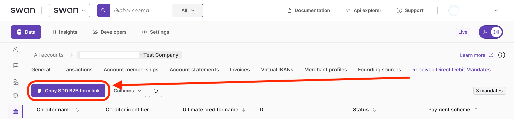
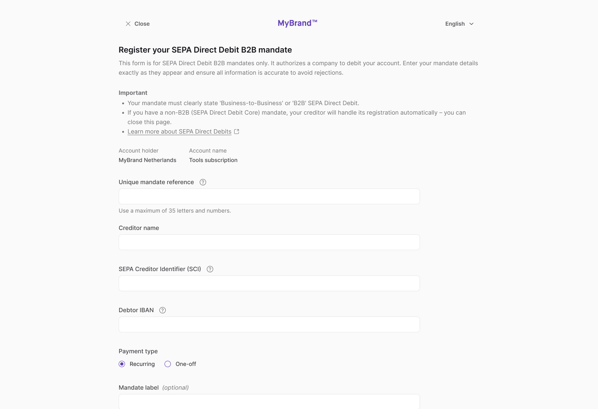

# Add a payment mandate

Add SEPA Direct Debit B2B (Business-to-Business) received payment mandates with the API or by sending a link to an account member.

:::caution B2B mandates only
This guide is for SEPA Direct Debit B2B mandates only. These mandates are required to authorize a company to debit an account. If an account member completes a non-B2B Direct Debit mandate, their creditor will handle its registration automatically.
:::

When **Swan receives** [new SEPA Direct Debit instructions](./index.mdx#received-instructions-new), the corresponding mandate is added **automatically**.

## Add with API {#api}

Add mandates programmatically using the `addReceivedSepaDirectDebitB2bMandate` mutation.

:::tip Prerequisites
1. You're an account member with the `canInitiatePayments` [membership permission](../../accounts/memberships/index.mdx#permissions).
1. You're authenticating with a [user access token](../../../developers/using-api/authentication/index.mdx#tokens-user).
:::

### Guide {#guide}

1. Call the `addReceivedSepaDirectDebitB2bMandate` mutation.
1. Add the Unique Mandate Reference (`mandateReference`) and SEPA Creditor Identifier (`creditorIdentifier`).
1. Add the creditor's name, plus your Swan IBAN and consent redirect URL.
1. Choose whether the mandate can be used once (`OneOff`) or multiple times (`Recurrent`).
1. Add the `AddReceivedSepaDirectDebitB2bMandateSuccessPayload`, including the `consentUrl`.
1. Add rejections (not shown).

### Mutation {#mutation}

<a href="https://explorer.swan.io?query=bXV0YXRpb24gQWRkUmVjZWl2ZWRNYW5kYXRlIHsKICBhZGRSZWNlaXZlZFNlcGFEaXJlY3REZWJpdEIyYk1hbmRhdGUoCiAgICBpbnB1dDogewogICAgICBtYW5kYXRlUmVmZXJlbmNlOiAiJFlPVVJfVVJNIgogICAgICBjcmVkaXRvcklkZW50aWZpZXI6ICIkWU9VUl9TQ0kiCiAgICAgIGNyZWRpdG9yTmFtZTogIkthdGhlcmluZSBKb2huc29uIgogICAgICBpYmFuOiAiJFNXQU5fSUJBTiIKICAgICAgc2VxdWVuY2U6IE9uZU9mZgogICAgICBjb25zZW50UmVkaXJlY3RVcmw6ICIkWU9VUl9SRURJUkVDVF9VUkwiCiAgICB9CiAgKSB7CiAgICAuLi4gb24gQWRkUmVjZWl2ZWRTZXBhRGlyZWN0RGViaXRCMmJNYW5kYXRlU3VjY2Vzc1BheWxvYWQgewogICAgICBfX3R5cGVuYW1lCiAgICAgIHJlY2VpdmVkRGlyZWN0RGViaXRNYW5kYXRlIHsKICAgICAgICBzdGF0dXNJbmZvIHsKICAgICAgICAgIHN0YXR1cwogICAgICAgICAgLi4uIG9uIFJlY2VpdmVkRGlyZWN0RGViaXRNYW5kYXRlU3RhdHVzSW5mb0NvbnNlbnRQZW5kaW5nIHsKICAgICAgICAgICAgX190eXBlbmFtZQogICAgICAgICAgICBjb25zZW50IHsKICAgICAgICAgICAgICBjb25zZW50VXJsCiAgICAgICAgICAgIH0KICAgICAgICAgICAgc3RhdHVzCiAgICAgICAgICB9CiAgICAgICAgICAuLi4gb24gUmVjZWl2ZWREaXJlY3REZWJpdE1hbmRhdGVTdGF0dXNJbmZvRW5hYmxlZCB7CiAgICAgICAgICAgIF9fdHlwZW5hbWUKICAgICAgICAgICAgZW5hYmxlZEF0CiAgICAgICAgICAgIHN0YXR1cwogICAgICAgICAgfQogICAgICAgIH0KICAgICAgfQogICAgfQogIH0KfQo%3D&tab=api" className="explorer-badge">Open in API Explorer</a>

```graphql {4-9,12,17,20} showLineNumbers
mutation AddReceivedMandate {
  addReceivedSepaDirectDebitB2bMandate(
    input: {
      mandateReference: "$YOUR_URM"
      creditorIdentifier: "$YOUR_SCI"
      creditorName: "Katherine Johnson"
      iban: "$SWAN_IBAN"
      sequence: OneOff
      consentRedirectUrl: "$YOUR_REDIRECT_URL"
    }
  ) {
    ... on AddReceivedSepaDirectDebitB2bMandateSuccessPayload {
      __typename
      receivedDirectDebitMandate {
        statusInfo {
          status
          ... on ReceivedDirectDebitMandateStatusInfoConsentPending {
            __typename
            consent {
              consentUrl
            }
            status
          }
          ... on ReceivedDirectDebitMandateStatusInfoEnabled {
            __typename
            enabledAt
            status
          }
        }
      }
    }
  }
}

```

### Payload {#payload}

The payload shows the mandate was added successfully with the status `ConsentPending`, and provides the `consentUrl` (line 10).

Make sure to send the `consentUrl` to your user so they can provide consent for the mandate.

```json {7,10} showLineNumbers
{
  "data": {
    "addReceivedSepaDirectDebitB2bMandate": {
      "__typename": "AddReceivedSepaDirectDebitB2bMandateSuccessPayload",
      "receivedDirectDebitMandate": {
        "statusInfo": {
          "status": "ConsentPending",
          "__typename": "ReceivedDirectDebitMandateStatusInfoConsentPending",
          "consent": {
            "consentUrl": "https://identity.swan.io/consent?consentId=$YOUR_CONSENT_ID&env=Sandbox"
          }
        }
      }
    }
  }
}
```

## Sending a mandate link to an account member {#dashboard-link}

Send a link to an account member with the `canInitiatePayments` [membership permission](../../accounts/memberships/index.mdx#permissions) so they can complete the mandate registration.

### Step 1: Send link to account member {#send-link}

1. Go to **Dashboard** > **Data** > **Accounts**.
1. Click the account you need.
1. Go to the **Received Direct Debit Mandates** tab.
1. Click the **Copy SDD B2B mandate form link** button.
1. Share the link with an account member with the `canInitiatePayments` membership permission.



:::tip Save the link
Account members can save the link to register future mandates.
:::

### Step 2: Account member completes process {#complete-process}

1. The account member opens the link you provided.
1. They log into Swan's banking interface.
1. They enter their B2B mandate details exactly as shown on the original mandate.
1. They consent to adding the payment mandate with [Strong Customer Authentication](/topics/users/consent/#sca).

