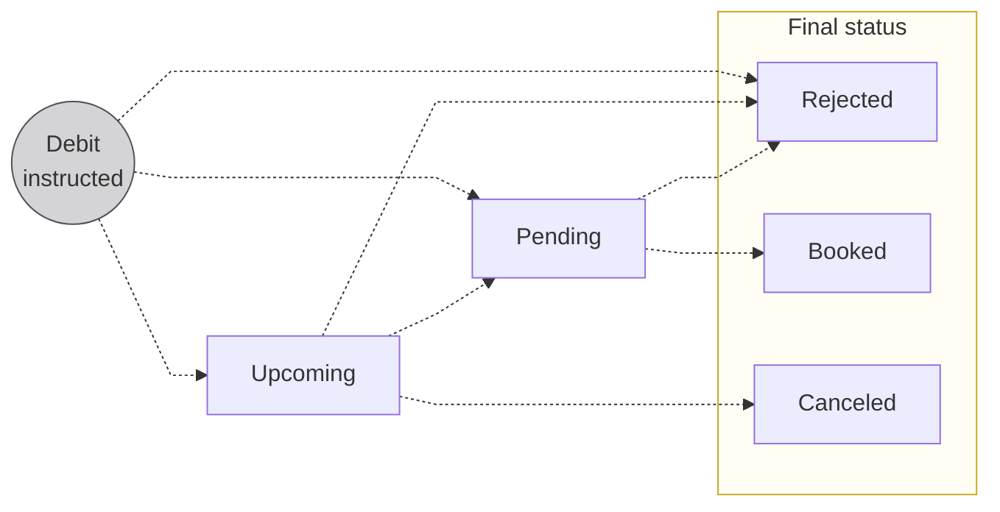
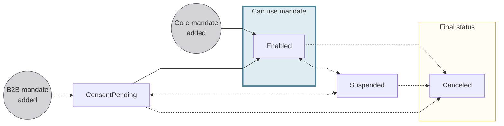

# Direct debit

Direct debit is initiated by a creditor to debit the account of a debtor.
Common creditors who use direct debit include untility companies and real estate rental agencies.

Swan supports several types of direct debit:

- SEPA Direct Debit: Core and B2B (Business-to-Business)
- Swan Internal Direct Debit: Standard and B2B (Business-to-Business)

:::tip Accepting payments
Swan also supports **accepting online payments** with direct debit.
Refer to the [merchants section about supported payment methods](../../merchants/index.mdx#methods) for more information.
:::

## Swan Internal Direct Debit {#idd}

Some use cases require that direct debit transactions occur between two Swan accounts in the same project.
For example, perhaps you want to receive fees directly from your user's Swan account.

Swan Internal Direct Debit is available for both individual and company accounts.

- Use **Standard** to debit **individual** and **company** accounts (natural or legal persons).
- Use **B2B** to debit only **company** accounts (legal persons).

For Internal Direct Debit, Swan is the creditor bank, the Clearing and Settlement Mechanism (CSM), *and* the debtor bank.
Internal Direct Debit doesn't pass through the SEPA network.
Instead, these transactions must follow the rules defined by France's *Code Monétaire et Financier*.

## SEPA Direct Debit {#sdd}

Companies can issue SEPA Direct Debits in euros between accounts in the [Single Euro Payments Area (SEPA)](../../index.mdx#sepa).
There are two types of SEPA Direct Debit: Core and B2B (Business-to-Business).

import SddCoreB2bSchemeTable from '../../partials/_sdd-scheme-table.mdx';

<SddCoreB2bSchemeTable creditorType="Creditor" />

## Direct debit statuses {#statuses}

:::info Account balances
There's a **close link** between **transaction statuses** and **account balances**.
Refer to explanations of types of account balances in the [accounts section](../../accounts/index.mdx#balances).
:::

| Transaction status | Explanation |
|---|---|
| `Upcoming` | Transfers are initiated and consent was granted, but the transfers aren't executed yet. Often, this is because the transfer was planned for a future date using the `requestedExecutionAt` input. `Upcoming` transfers don't impact the account balance.  *International Credit Transfers can't be `Upcoming`* |
| `Pending` | Transfers are initiated, consent was granted, and the transfer is set to happen within a few days. The transfers aren't debited from the account yet, but they impact the account's `Pending` balance.  Sometimes, transfers might stay `Pending` for longer than expected. This could be for a few reasons, including the possibility that the transaction required a manual review from Swan, or a SEPA Credit Transfer was initiated on a [TARGET closing day](../index.mdx#sepa-availability). |
| `Booked` | Completed credit transfers that are displayed on the official account statement. These transfers have been debited from the account, and they impact the account's `Booked` balance. |
| `Canceled` | An `Upcoming` transaction is canceled by someone with the right to do so, such as the [account holder](../../../glossary.mdx#account-holder), an [account member](../../../glossary.mdx#account-membership), or a [merchant](../../../glossary.mdx#merchants). Only transfers with the status `Upcoming` can be `Canceled`, and `Canceled` transfers don't impact the account balance. |
| `Rejected` | Declined or refused transfers. For example, the beneficiary account might be closed, or the account's `Available` balance isn't sufficient to complete the transfer without resulting in a negative balance. |

## Payment mandates {#mandates}

Prior to issuing SEPA direct debit instructions, the creditor must obtain a formal authorization from the debtor to take money from the debtor's account.
This formal authorization is a **direct debit payment mandate**.

Payment mandates are created by creditors and signed or approved by debtors.
Creating and signing mandates happens off of the SEPA network, and the mandates must be declared to the SEPA network with two unique identifiers.

1. Unique Mandate Reference (UMR): Each SEPA Direct Debit payment mandate has a unique reference number.
1. SEPA Creditor Identifier (SCI): Each creditor is identified on the SEPA network with their unique identifier.

The SEPA Creditor Identifier and Unique Mandate Reference *combination* must be unique across the SEPA network, meaning one payment mandate per pair of creditors and debtors.

Mandate information is embedded in every SEPA direct debit instruction sent by the creditor bank to the debtor bank.

### Payment mandate statuses {#mandates-statuses}

| Payment mandate status | Explanation |
| :---: |---|
| `ConsentPending` | B2B payment mandate was added while [setting up a direct debit] with the `mutation` mutation  **Next steps**: <ul><li>If the debtor consents to the mandate, the status moves to `Enabled`</li><li>If the <mark>something</mark>, the status moves to `Suspended`</li><li>If the debtor doesn't consent to the mandate, the status moves to `Canceled`</li></ul> |
| `Enabled` | Payment mandate is valid and direct debit instructions can be issued |
| `Suspended` | Payment mandate was suspended  |
| `Canceled` | Payment mandate is canceled and no longer available for use |

## R-transactions {#r-transactions}

### Rejected {#rejected}

- Any account member with CanInitiatePayments rights on the account for which a SEPA direct debit instruction has been received can contact Swan to ask for a rejection of the concerned transaction while it still has Upcoming status (i.e. before it is actually debited).
- The transaction is then switched to Rejected status.
- This does not impact the account's available balance.

### Refunded {#refunded}

- Any account member with CanInitiatePayments rights on the account for which a SEPA direct debit Core instruction has been debited (therefore in the Booked status) can contact Swan to ask for a refund (within 8 weeks following debit date) of the concerned transaction.
- A SepaDirectDebitOutReturn transaction is then created with Booked status.

### Reversed {#reversed}

- A received SEPA direct debit transaction with Booked status can be reversed by the creditor up to 5 days following the debit date.
- A SepaDirectDebitOutReversal transaction is then created with Booked status.

### Canceled {#canceled}

- A received SEPA direct debit instruction with Upcoming status can be canceled by the creditor and is then automatically switched to Canceled status.
- This transaction will not impact the account's available balance.

## Guides {#guides}