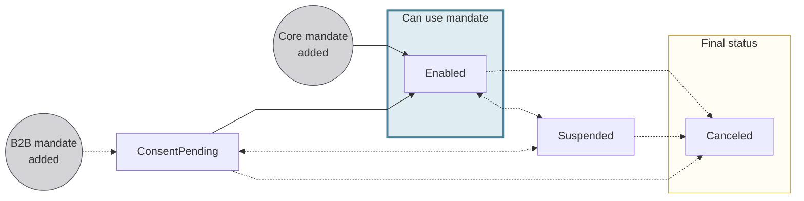
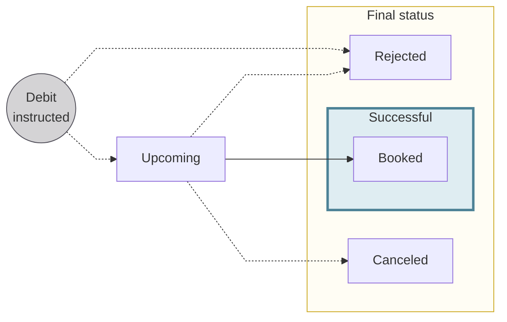

# Direct debit

## Overview {#overview}

Direct debit is initiated by a creditor to take funds from a debtor's account.
Common creditors who use direct debit include utility companies and real estate rental agencies.

At Swan, direct debit works in two directions:
- Swan can [receive instructions for an outgoing direct debit](#received-instructions), which is the focus of this page.
- Additionally, Swan can initiate incoming direct debit, either for [merchants to accept payments](../../merchants/online/sdd/index.mdx) or to [fund your own account](../../accounts/funding/index.mdx).

Swan supports several types of outgoing direct debit.
Note the acronyms; while the documentation doesn't use them, the acronyms are sometimes present in the API and used in written and verbal communication.

| Direct debit type | Description | Acronym |
| --- | --- | --- |
| SEPA Direct Debit **Core** | Issued by companies to individual or company accounts in euros between accounts in the [Single Euro Payments Area (SEPA)](../index.mdx#sepa). | SDD Core |
| SEPA Direct Debit **B2B** | Issued by companies to company accounts in euros between accounts in [SEPA](../index.mdx#sepa). | SDD B2B |
| Swan Internal Direct Debit **Standard** | Issued by a Swan company account to individual or company accounts within the same Swan project. | IDD Standard |
| Swan Internal Direct Debit **B2B** | Issued by a Swan company account to company accounts within the same Swan project. | IDD B2B |

:::info Swan Internal Direct Debit
Some use cases require that direct debit transactions occur between two Swan accounts in the same project.
For example, perhaps you want to receive fees directly from your user's Swan account.

For Internal Direct Debit, Swan is the creditor bank, the Clearing and Settlement Mechanism (CSM), *and* the debtor bank.
Internal Direct Debit doesn't pass through the SEPA network.
Instead, these transactions must follow the rules defined by France's *Code Monétaire et Financier*.
:::

### Specifications {#specifications}

import DirectDebitTable from '../../partials/_direct-debit-scheme-table.mdx';

<DirectDebitTable directDebitScheme="SEPA Core & Internal Standard" creditorType="Creditor" psp="the debtor's payment services provider (PSP)" incomingOutgoing="3 business days after execution date" returnExtra="If Swan can't accept the outgoing direct debit, a rejected SDD-Out transation is created (example: invalid mandate, account closed)." />

## Received payment mandates {#mandates}

Prior to issuing SEPA Direct Debit instructions, the creditor must obtain a formal authorization from the debtor to take money from the debtor's account.
This formal authorization is a **received payment mandate**.
Received payment mandates can be `one-off`, valid for a single transaction, or `recurrent`, for multiple transactions.

Received payment mandates are created by creditors and authorized by debtors.
Creating and authorizing mandates happens off of the SEPA network, and the [mandates must be declared](../../merchants/online/sdd/index.mdx#mandates-declare) to the SEPA network with two unique identifiers:

1. **Unique Mandate Reference (UMR)**: Each received payment mandate has a unique reference number.
1. **SEPA Creditor Identifier (SCI)**: Each creditor is identified on the SEPA network with their unique identifier.

The combination of the SEPA Creditor Identifier and Unique Mandate Reference must be **unique across the SEPA network**, meaning one received payment mandate per creditor-debtor pair.
Information about the received payment mandate is embedded in each SEPA Direct Debit instruction sent by the creditor bank to the debtor bank. 

Received payment mandates are stored in the API's `receivedDirectDebitMandate` object.

### Received mandate specifications {#mandates-specifications}

The specifications of the received payment mandate depend on whether the mandate authorizes Core or B2B SEPA Direct Debit instructions.
**All are signed by the debtor**; otherwise, requirements are different.

| Direct debit type | Specifications |
| --- | --- |
| SEPA Direct Debit **Core** | <ol><li>Core received payment mandates don't need to be provided to Swan (or the creditor's bank).</li><li>Swan isn't required to verify a mandate's validity with the debtor.</li><li>The debtor is entitled to a refund of an authorized debit, no questions asked, according to the timeline listed in the [specifications table](#specifications).</li></ol> |
| SEPA Direct Debit **B2B** | <ol><li>B2B received payment mandates must be provided by the debtor to Swan.</li><li>Swan **must** verify the validity of the instruction against the mandate or mandate information received from the debtor.</li><li>The debtor isn't entitled to a refund of an authorized debit.</li></ol> |
| Swan Internal Direct Debit **Standard** | <ol><li>Internal received payment mandates are handled within Swan.</li><li>Swan isn't required to verify a mandate's validity with the debtor.</li><li>The debtor is entitled to a refund of an authorized debit, no questions asked, according to the timeline listed in the [specifications table](#specifications).</li></ol> |
| Swan Internal Direct Debit **B2B** | <ol><li>Internal received payment mandates are handled within Swan.</li><li>Swan **must** check the validity of the instruction against the mandate or mandate information received from the debtor.</li><li>The debtor isn't entitled to a refund of an authorized debit.</li></ol> |

### Received mandate statuses {#mandates-statuses}

| Payment mandate status | Explanation |
| --- |---|
| `ConsentPending` | B2B received payment mandate was added while setting up a direct debit.  **Next steps**: <ul><li>If the debtor consents to the mandate, the status moves to `Enabled`</li><li>If requested by the debtor, the status moves to `Suspended`</li><li>If the debtor doesn't consent to the mandate, the status moves to `Canceled`.</li></ul>*Core received mandates never have the status `ConsentPending`.* |
| `Enabled` | Received payment mandate is valid and direct debit instructions can be fulfilled. |
| `Suspended` | Debtor requested the received payment mandate be suspended.  For example, you want to stop a creditor from taking money from the account temporarily, and you'll inform Swan when to change the status back to `Enabled`.  |
| `Canceled` | Received payment mandate is canceled and no longer available for use. Note that Swan cancels `OneOff` mandates **automatically** after they're used. |

## Received direct debit instructions {#received-instructions}

To start a SEPA Direct Debit transaction, the creditor's bank must send instructions to the debtor's payment services provider—in this case, Swan—before the scheduled transaction date.
The date should be indicated in the instruction sent to Swan.

After receiving instructions to debit an account, Swan checks the embedded mandate information to see if it's a new instruction, or if Swan already knows about the instruction.

### New instruction {#received-instructions-new}

If the **instruction is new to Swan**, the following events occur:

1. Swan adds the SEPA Direct Debit received payment mandate:
    - **Core**: Adds the mandate with the status `Enabled`.
    - **B2B**: Adds the mandate with the status `ConsentInitiationPending`. After the debtor consents to the mandate, the status changes to `Enabled`.
1. Swan creates a `SepaDirectDebitOut` transaction with the status `Upcoming`.
1. Swan executes the transaction on the requested date, indicated in the instruction, if all checks pass (refer to execution date and time).

### Known instruction {#received-instructions-known}

If the **instruction is known to Swan**, Swan checks the received payment mandate's status.

1. If the mandate's status is `Enabled`, Swan creates a `SepaDirectDebitOut` transaction with the status `Upcoming`.
1. If the mandate's status is `Canceled` or `Suspended`, Swan creates a `SepaDirectDebitOut` transaction with the status `Rejected`.

### Execution date and time {#received-instructions-execution}

At 6 AM Central European [Summer] Time (CET/CEST) on the date indicated in the SEPA Direct Debit instruction, Swan verifies a few details before executing the debit.

If **either of the following is true**, the instructions are rejected. 
The `SepaDirectDebitOut` transaction status changes to `Rejected`, and the reason is available in the `rejectedReasonCode` field with the API.

- The status for the received payment mandate, the account, or the debtor's IBAN is anything other than `Enabled`.
- The debtor account's `Available` balance won't cover the instructed amount.

If the received payment mandate's status is `Enabled` and the `Available` balance is sufficient to cover the instructed amount, the **transaction continues** and the following events occur:

1. The amount is debited from the account.
1. The account's `Available` balance is updated accordingly.
1. The `SepaDirectDebitOut` transaction status changes to `Booked`.

### Direct debit statuses {#statuses}

:::info Account balances
There's a **close link** between **transaction statuses** and **account balances**.
Refer to explanations of types of account balances in the [accounts section](../../accounts/index.mdx#balances).
:::

| Direct debit transaction status | Explanation |
|---|---|
| `Upcoming` | Transaction is created after passing Swan's preliminary checks (for example, if the mandate already exists, it's valid; the account isn't closed). `Upcoming` debits don't impact the account balance. |
| `Booked` | Completed debits that are displayed on the official account statement. These debits have been debited from the account, and they impact the account's `Booked` balance. |
| `Canceled` | An `Upcoming` transaction is canceled by someone with the right to do so, such as the [account holder](../../onboarding/account-holders/index.mdx) or an [account member](../../accounts/memberships/index.mdx). Only debits with the status `Upcoming` can be `Canceled`, and `Canceled` debits don't impact the account balance. |
| `Rejected` | Declined or refused debits. For example, the beneficiary account might be closed, or the account's `Available` balance isn't sufficient to complete the debit without resulting in a negative balance.  A transaction can also be `Rejected` without being assigned any other status if the transaction didn't pass the initial checks (examples in `Upcoming`). |

## R-transactions {#r-transactions}

After direct debits are instructed, other transactions, such as R-transactions, can be linked to the direct debit transaction.
Note that these only concern **outgoing** SEPA Direct Debits.

### Rejected {#rejected}

If you need to request that an `Upcoming` SEPA Direct Debit (Core or B2B) instruction be `Rejected`, a qualified account member can contact Swan directly.
Qualified account members are those with the `CanInitiatePayments` membership permission.

If your request to reject the transaction is accepted, the status changes from `Upcoming` to `Rejected`.
`Rejected` transactions don't impact the account balance.

### Refunded (Returned) {#refunded}

**Core** SEPA Direct Debit transactions are refundable under two specific scenarios:

1. Transactions are eligible for refunds for up to **8 calendar weeks** after execution, no questions asked.
[Request these refunds](./guide-return.mdx) with the API `returnTransaction` mutation.
1. Transactions are eligible for refunds up to **13 months** after execution if there wasn't a valid mandate or if the payment wasn't authorized.
Request a refund by [contacting Swan Support](https://support.swan.io/hc/en-150/requests/new) with all of the transaction details.

:::note execution
Execution means the [transaction status](#statuses) changed to `Booked`.
:::

If the refund is approved, a new `SepaDirectDebitOutReturn` transaction is created with the status `Booked`.

:::caution B2B not eligible
B2B SEPA Direct Debit transactions aren't eligible for refunds.
:::

### Reversed {#reversed}

Creditors can reverse `Booked` SEPA Direct Debit transactions within a specific [time window](#overview).
In the case of a reversal, a new `SepaDirectDebitOutReversal` transaction is created with the status `Booked`.

The reason the creditor bank reversed the transaction is indicated in `returnReason`.
Use the `transactions` query to [get information about transactions](../overview/guide-get-transaction-info.mdx), adding `returnReason` to `... on SEPADirectDebitTransaction`.

### Canceled {#canceled}

Creditors can cancel `Upcoming` SEPA Direct Debit transactions.

If a creditor cancels an `Upcoming` transaction, the status automatically changes to `Canceled`.
`Canceled` transactions don't impact the account balance.

## Guides {#guides}

- [Add a payment mandate](./guide-add-mandate.mdx)
- [Update a payment mandate](./guide-update-mandate.mdx)
- [Suspend a payment mandate](./guide-suspend-mandate.mdx)
- [Resume (enable) a payment mandate](./guide-enable-mandate.mdx)