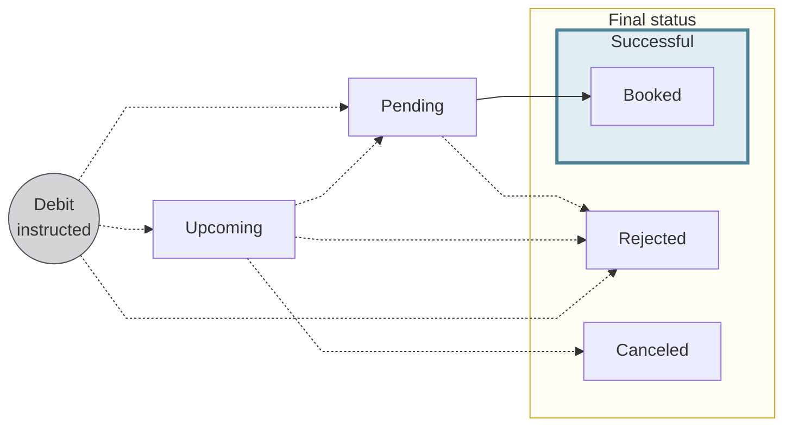
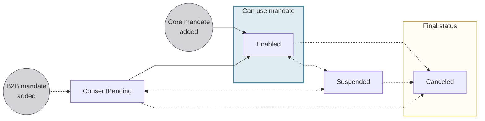

# Direct debit

## Overview {#overview}

Direct debit is initiated by a creditor to debit the account of a debtor.
Common creditors who use direct debit include untility companies and real estate rental agencies.

Swan supports several types of direct debit:

- SEPA Direct Debit: Core and B2B (Business-to-Business)
- Swan Internal Direct Debit: Standard and B2B (Business-to-Business)

:::tip Accepting payments
Swan also supports **accepting online payments** with direct debit.
Refer to the [merchants section about supported payment methods](../../merchants/index.mdx#methods) for more information.
:::

### SEPA Direct Debit {#sdd}

Companies can issue SEPA Direct Debits in euros between accounts in the [Single Euro Payments Area (SEPA)](../index.mdx#sepa).
There are two types of SEPA Direct Debit: Core and B2B (Business-to-Business).

import SddCoreB2bSchemeTable from '../../partials/_sdd-scheme-table.mdx';

<SddCoreB2bSchemeTable creditorType="Creditor" />

### Swan Internal Direct Debit {#idd}

Some use cases require that direct debit transactions occur between two Swan accounts in the same project.
For example, perhaps you want to receive fees directly from your user's Swan account.

Swan Internal Direct Debit is available for both individual and company accounts.

- **Standard**: debit **individual** and **company** accounts (natural or legal persons)
- **B2B**: debit only **company** accounts (legal persons)

For Internal Direct Debit, Swan is the creditor bank, the Clearing and Settlement Mechanism (CSM), *and* the debtor bank.
Internal Direct Debit doesn't pass through the SEPA network.
Instead, these transactions must follow the rules defined by France's *Code Monétaire et Financier*.

### Direct debit statuses {#statuses}

:::info Account balances
There's a **close link** between **transaction statuses** and **account balances**.
Refer to explanations of types of account balances in the [accounts section](../../accounts/index.mdx#balances).
:::

<mark>Please confirm</mark>  

| Transaction status | Explanation |
|---|---|
| `Upcoming` | Debit instruction is initiated and consent was granted, but the debit isn't executed yet. Often, this is because the debit was planned for a future date using the `requestedExecutionAt` input. `Upcoming` debits don't impact the account balance. |
| `Pending` | Debits are initiated, consent was granted, and the debit is set to happen within a few days. The debits aren't debited from the account yet, but they impact the account's `Pending` balance.  Sometimes, debits might stay `Pending` for longer than expected. This could be for a few reasons, including the possibility that the transaction required a manual review from Swan, or a SEPA Direct Debit was initiated on a [TARGET closing day](../index.mdx#sepa-availability). |
| `Booked` | Completed debits that are displayed on the official account statement. These debits have been debited from the account, and they impact the account's `Booked` balance. |
| `Canceled` | An `Upcoming` transaction is canceled by someone with the right to do so, such as the [account holder](../../../glossary.mdx#account-holder), an [account member](../../../glossary.mdx#account-membership), or a [merchant](../../../glossary.mdx#merchants). Only debits with the status `Upcoming` can be `Canceled`, and `Canceled` debits don't impact the account balance. |
| `Rejected` | Declined or refused debits. For example, the beneficiary account might be closed, or the account's `Available` balance isn't sufficient to complete the debit without resulting in a negative balance. |

## Received direct debit instruction {#recieved-instruction}

## Payment mandates {#mandates}

Prior to issuing SEPA direct debit instructions, the creditor must obtain a formal authorization from the debtor to take money from the debtor's account.
This formal authorization is a **direct debit payment mandate**.

Payment mandates are created by creditors and signed or approved by debtors.
Creating and signing mandates happens off of the SEPA network, and the mandates must be declared to the SEPA network with two unique identifiers.

1. Unique Mandate Reference (UMR): Each SEPA Direct Debit payment mandate has a unique reference number.
1. SEPA Creditor Identifier (SCI): Each creditor is identified on the SEPA network with their unique identifier.

The SEPA Creditor Identifier and Unique Mandate Reference *combination* must be unique across the SEPA network, meaning one payment mandate per pair of creditors and debtors.

Mandate information is embedded in every SEPA direct debit instruction sent by the creditor bank to the debtor bank.

### Payment mandate statuses {#mandates-statuses}

| Payment mandate status | Explanation |
| --- |---|
| `ConsentPending` | B2B payment mandate was added while [setting up a direct debit] with the `mutation` mutation  **Next steps**: <ul><li>If the debtor consents to the mandate, the status moves to `Enabled`</li><li>If the <mark>something</mark>, the status moves to `Suspended`</li><li>If the debtor doesn't consent to the mandate, the status moves to `Canceled`</li></ul> |
| `Enabled` | Payment mandate is valid and direct debit instructions can be issued |
| `Suspended` | Payment mandate was suspended  |
| `Canceled` | Payment mandate is canceled and no longer available for use |

## R-transactions {#r-transactions}

After direct debits are instructed, other transactions, such as R-transactions, can be linked to the direct debit transaction.

### Rejected {#rejected}

If you need to request that an `Upcoming` SEPA Direct Debit (Core or B2B) instruction be `Rejected`, a qualified account member can contact Swan directly.
Qualified account members are those with the `CanInitiatePayments` membership permission.

If your request to reject the transaction is accepted, the status changes from `Upcoming` to `Rejected`.
`Rejected` transactions don't impact the account balance.

### Refunded {#refunded}

If you need to request a refund for a `Booked` SEPA Direct Debit Core transaction, a qualified account member can contact Swan directly.
Qualified account members are those with the `CanInitiatePayments` membership permission.
Confirm you're within the [time window allowed](#sdd).

If the refund is approved, a new `SepaDirectDebitOutReturn` transaction is created with the status `Booked`.

### Reversed {#reversed}

Creditors can reverse `Booked` SEPA Direct Debit transactions within a specific [time window](#sdd).
In the case of a reversal, a new `SepaDirectDebitOutReversal` transaction is created with the status `Booked`.

### Canceled {#canceled}

Creditors can cancel `Upcoming` SEPA Direct Debit transactions.

If a creditor cancels an `Upcoming` transaction, the status automatically changes to `Canceled`.
`Canceled` transactions don't impact the account balance.

## Guides {#guides}

- Payment mandates
    - [Add a payment mandate](./guide-add-mandate.mdx)
    - [Update a payment mandate](./guide-update-mandate.mdx)
    - [Suspend a payment mandate](./guide-suspend-mandate.mdx)
    - [Enable a payment mandate](./guide-enable-mandate.mdx)
    - [Cancel a payment mandate](./guide-cancel-mandate.mdx)