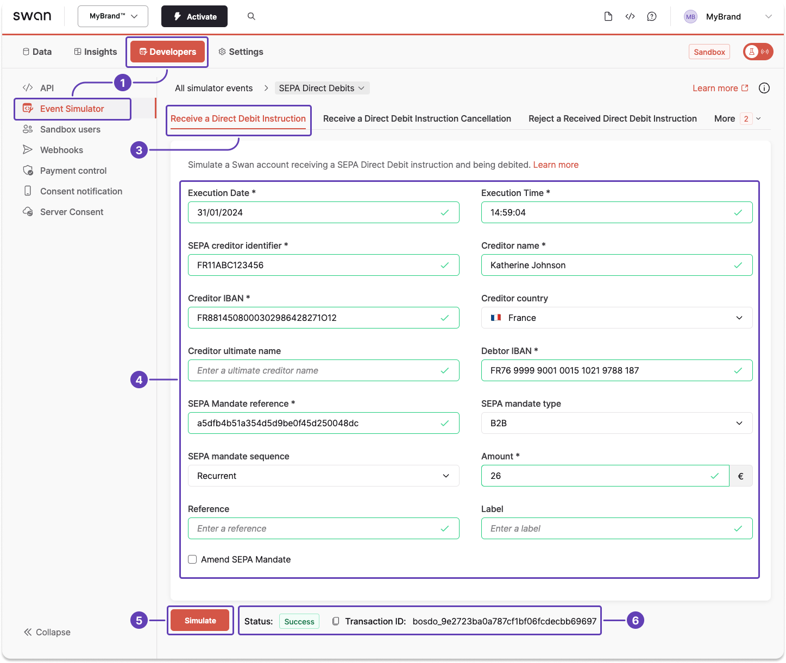

# Sandbox for SEPA Direct Debit

When testing your integration, you might need to simulate certain events with the [Testing API](../../../developers/tools/testing-api.mdx) and the [Event Simulator](../../../developers/tools/event-simulator.mdx).

## Simulate receiving a SEPA Direct Debit instruction {#simulate-sct-in}

Simulating receiving a SEPA Direct Debit creates a new payment as well as a `SepaDirectDebitOut` transaction, which are both instantly visible on Swan's interfaces.

1. Go to **Dashboard** > **Developers** > **Event Simulator**.
1. Go to **SEPA Direct Debits** (not shown).
1. Go to the tab to **receive a direct debit instruction**.
1. Enter required testing data, marked with an asterisk [*]. The Event Simulator already supplies some placeholder data that works for the simulation, but you can change it if needed. Optionally, add a reference and label to see how these elements are displayed within Swan.
1. Click **Simulate**.
1. After clicking **Simulate**, notice the status change to `Success`, meaning you received your simulated direct debit instruction successfully.

:::tip 
Use the Event Simulator to **test other events** related to SEPA Direct Debit, such as canceling an incoming instruction, rejecting a received instruction, and more.
:::