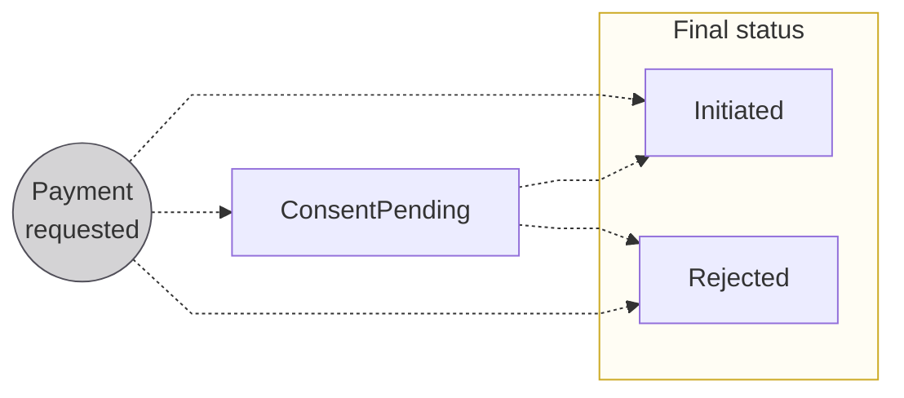

# Payments overview

import PaymentsDefinition from "../definitions/_payments.mdx";
import TransactionsDefinition from "../definitions/_transactions.mdx";

Swan uses of a combination of **payments** and **transactions** to accomplish all financial operations.

## Payments {#payments}

The core of Swan's offer is facilitating the sending and receiving of payments.
A payment is:

> <PaymentsDefinition />

### Types of payments {#payments-types}

Swan executes several types of payments:

- [Credit transfers](./credit-transfers/index.mdx)
- [Direct debit](./direct-debit/index.mdx)
- [Card payments](./cards/index.mdx)
- [French check payments](../merchants/checks/index.mdx) _(merchant offer only)_

### Payment ID {#payments-id}

Each payment has a **unique payment ID**.
You can retrieve a payment ID (and other information about the payment) on your Dashboard or by running an API query.

### Payment statuses {#payments-statuses}

| Status           | Explanation                                                                                                                                                                                                                          |
| ---------------- | ------------------------------------------------------------------------------------------------------------------------------------------------------------------------------------------------------------------------------------ |
| `ConsentPending` | Status only occurs when consent is required for the payment  **Next step**: Transaction flow blocked while waiting for consent; when consent is received, transaction flow resumes and payment status changes to `Initiated` |
| `Initiated`      | Payment successfully requested; enters the [transaction flow](#transactions-statuses)                                                                                                                                                |
| `Rejected`       | Payment rejected, either directly after payment initiation or from the `Initiated` status                                                                                                                                            |

### Push and pull payments {#payments-push-pull}

The key difference between push and pull payments lies in **who initiates the payment**.

**Push payments**, such as credit transfers, refer to transactions where the **debtor initiates the payment**.
The debtor authorizes the sending of funds from their account to the creditor's account.
In other words, the **debtor pushes the funds to the creditor**.

**Pull payments**, such as direct debits and card payments, refer to transactions where the **creditor initiates collecting funds** from the debtor's account.
The creditor requests a payment, and the debtor provides the necessary authorization for the transaction.
In other words, the **creditor pulls the funds from the debtor**.

### Payments and risk {#payments-risk}

Push payments pose a **lower risk** for creditors and banks because debtors initiate these payments.
The chance of insufficient funds is reduced, and debtors can only dispute push payments if they're the victim of theft or hacking.

Pull payments pose a **higher risk** for creditors and banks.
Regulations allow varying periods of time after a pull transaction during which the debtor can dispute.
Additionally, since pull payments are initiated by the creditor and not the debtor, there is a higher risk of insufficient funds in the account.

## Transactions {#transactions}

> <TransactionsDefinition />

A single payment is a group of **one** or **several transactions**.
All transactions go through a **scoring service** to determine if the transaction is compliant and if the [account's `Available` balance](../accounts/index.mdx#balances) is sufficient to cover the transaction.

Transactions are created asynchronously after a payment is initiated.
In the API, you'll work **primarily with transactions** when seeking information about payments.

For example, two _transactions_ are required if you try to send a single SEPA Credit Transfer (SCT) _payment_ to an IBAN that doesn't exist.

- Transaction #1: Funds sent with an outgoing SCT to the SEPA network.
- Transaction #2: Funds returned with a separate transaction from the target bank.

### Transaction ID {#transactions-id}

Each transaction has a **unique transaction ID**.

You can filter your Dashboard transactions list with a full transaction ID to locate an exact transaction.
Retrieve a transaction ID along with other transaction information by querying the API or directly on your Dashboard.

### Transaction statuses {#transactions-statuses}

There are six possible statuses for Swan transactions: `Upcoming`, `Pending`, `Booked`, `Released`, `Canceled`, and `Rejected`.
Transactions directly impact [account balances](../accounts/index.mdx#balances).

**Each payment method** uses a **different combination of these statuses** with specific flows.
Refer to the schemas for [credit transfers](./credit-transfers/index.mdx#statuses), [direct debits](./direct-debit/index.mdx#statuses), and [cards](./cards/index.mdx#statuses) for more information about statuses for that payment method.
Not all statuses are used for all transaction types.

import TransactionStatuses from "../partials/_transaction-statuses.mdx";

<TransactionStatuses />

### Sharing transaction information {#transactions-sharing-info}

The European Union's [revised Payment Services Directive (PSD2)](https://eur-lex.europa.eu/legal-content/EN/LSU/?uri=celex:32015L2366) regulates how banking interfaces can display transactions.
In order to **display or share a user's sensitive information**, there must be a **recent consent** from that user.

At the user level, you might need to act on behalf of a user with a **user access token** to access an account's online payment transactions.
The **user must consent** to this action by performing a [Strong Customer Authentication (SCA)](../users/consent/index.mdx).
Each SCA is valid for 180 days, so if the user's most recent SCA is older than 180 days, they'll need to consent again.

At the project level, when acting on your own behalf, you can view a list of your project's transactions anytime with a **project access token**.
However, if you need to share information with a user, that **user must consent**.
Again, if they haven't consented within 180 days, they'll need to perform a new SCA.

:::caution Swan frontend
Swan's frontend complies with PSD2 requirements.
If you choose to use a custom API integration or to modify [Swan's open source code](https://swan-io.github.io/swan-partner-frontend/specs/banking/history), you are responsible for respecting PSD2 requirements.
Swan will verify that your offer is compliant.
:::

## About SEPA {#sepa}

The [Single Euro Payments Area (SEPA)](https://www.europeanpaymentscouncil.eu/about-sepa) is a payment network used to **transfer funds in euros in 36 countries**.
One of SEPA's primary goals is to **harmozine payments** across these countries, making it **easy to use cashless payment methods** anywhere you are in and around Europe.
SEPA is regulated by the European Payments Council (EPC).

Swan uses the SEPA Credit Transfer, SEPA Instant Credit Transfer, SEPA Direct Debit payment methods for all transactions not executed internally between Swan accounts.

### SEPA countries and territories {#sepa-locations}

SEPA countries and territories include both European Union (EU) and non-EU members.

- **EU members**: Austria, Belgium, Bulgaria, Cyprus, Croatia, Czech Republic, Denmark, Estonia, Finland (including the Aland Islands), France (including French Guiana, Guadeloupe, Martinique, Mayotte, Saint Barthelemy, French Saint Martin, Reunion, and Saint Pierre and Miquelon), Germany, Greece, Hungary, Republic of Ireland, Italy, Latvia, Lithuania, Luxembourg, Malta, Netherlands, Poland, Portugal (including Madeira and Azores), Romania, Slovenia, Slovakia, Spain (including Ceuta, Melilla, and the Canary Islands), and Sweden.
- **Non-EU members**: Andorra, Iceland, Liechtenstein, Monaco, Norway, San Marino, Switzerland, United Kingdom (including Gibraltar), and Vatican City State/Holy See.

:::note SEPA official list
SEPA's scope with all of these countries and territories depends on licensing and local regulations.
Refer to the [EPC's official list](https://www.europeanpaymentscouncil.eu/document-library/other/epc-list-sepa-scheme-countries) for more information.
:::

### SEPA availability {#sepa-availability}

SEPA follows the Governing Council of the European Central Bank's _Trans-European Automated Real-time Gross settlement Express Transfer_ (TARGET) system.
TARGET closing days were [established in the year 2000](https://www.ecb.europa.eu/press/pr/date/2000/html/pr001214_4.en.html), so this system is long-standing and predictable.

The SEPA network is unavailable on TARGET closing days:

- Saturdays and Sundays
- New Year's Day
- Good Friday
- Easter Monday
- 1 May (Labor Day)
- Christmas Day
- 26 December

Transactions sent on TARGET closing days are processed the next open day.
The only exceptions are **Instant SEPA Credit Transfers**, which are always exchanged immediately (24 hours a day, 7 days a week, 365 days a year).

Refer to the European Central Bank's [operational status page](https://www.ecb.europa.eu/paym/target/html/index.en.html) for in-the-moment availability, or their [working hours page](https://www.ecb.europa.eu/services/contacts/working-hours/html/index.en.html) for the precise dates of upcoming TARGET closing days.

## Guides {#guides}

- [Get payment information](./overview/guide-get-payment-info.mdx)
- [Get a payment ID](./overview/guide-get-payment-id.mdx)
- [Get transaction information](./overview/guide-get-transaction-info.mdx)
- [Get a transaction ID](./overview/guide-get-transaction-id.mdx)
- [Get a list of transactions](./overview/guide-get-transaction-list.mdx)
