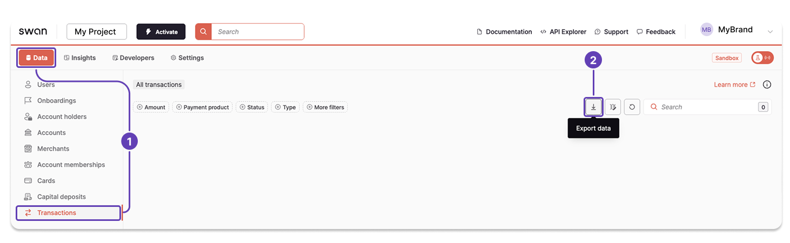

# Export transaction data

You can export the transaction data available on the Dashboard, either from your Dashboard or with the API.

## Dashboard {#dashboard}

1. On your Dashboard, go to **Data** > **Transactions**.
1. Click the **download icon** to trigger a `.csv` export.
1. A modal appears. Click **Export data** to finalize the request.



## API {#api}

1. Call the `exportTransactionData` mutation.
1. Add your `email`. A link to download the `.csv` export is sent to the email address you provide.
1. Add the success payload and rejections.

### Mutation {#api-mutation}

<a href="https://explorer.swan.io?query=bXV0YXRpb24gRXhwb3J0VHJhbnNhY3Rpb24gewogIGV4cG9ydFRyYW5zYWN0aW9uRGF0YSgKICAgIGlucHV0OiB7CiAgICAgIGVtYWlsOiAiJFlPVVJfRU1BSUxfQUREUkVTUyIKICAgICAgZmlsdGVyczogewogICAgICAgIHN0YXR1czogQm9va2VkCiAgICAgICAgZGF0ZVJhbmdlOiB7IGFmdGVyOiAiMjAyNS0wMS0wMVQwMDowMDowMC4wMDBaIiwgYmVmb3JlOiAiMjAyNS0wOC0xNFQyMzo1OTo1OS45OTlaIiB9CiAgICAgIH0KICAgIH0KICApIHsKICAgIC4uLiBvbiBFeHBvcnREYXRhU3VjY2Vzc1BheWxvYWQgewogICAgICBfX3R5cGVuYW1lCiAgICAgIGV4cG9ydElkCiAgICB9CiAgICAuLi4gb24gTWF4aW11bVNpbXVsdGFuZW91c0V4cG9ydHNSZWplY3Rpb24gewogICAgICBfX3R5cGVuYW1lCiAgICAgIG1lc3NhZ2UKICAgIH0KICAgIC4uLiBvbiBNYXhpbXVtRGFpbHlFeHBvcnRzUmVhY2hlZFJlamVjdGlvbiB7CiAgICAgIF9fdHlwZW5hbWUKICAgICAgbWVzc2FnZQogICAgfQogIH0KfQo%3D&tab=api" className="explorer-badge">Open in API Explorer</a>

```graphql {3,11} showLineNumbers
mutation ExportTransaction {
  exportTransactionData(
    input: {
      email: "$YOUR_EMAIL_ADDRESS"
      filters: {
        status: Booked
        dateRange: { after: "2025-01-01T00:00:00.000Z", before: "2025-08-14T23:59:59.999Z" }
      }
    }
  ) {
    ... on ExportDataSuccessPayload {
      __typename
      exportId
    }
    ... on MaximumSimultaneousExportsRejection {
      __typename
      message
    }
    ... on MaximumDailyExportsReachedRejection {
      __typename
      message
    }
  }
}
```

### Payload {#api-payload}

The payload returns the export ID.

```json {5} showLineNumbers
{
  "data": {
    "exportTransactionData": {
      "__typename": "ExportDataSuccessPayload",
      "exportId": "$EXPORT_ID"
    }
  }
}
```

## Next steps {#next}

import ExportNextSteps from '../../partials/_export-next-steps.mdx';

<ExportNextSteps />